# 运行 Spring Boot 应用程序的 Spring Boot Eclipse 和 CLI 设置

> 原文：<https://medium.com/edureka/spring-boot-eclipse-200ecab56953?source=collection_archive---------6----------------------->

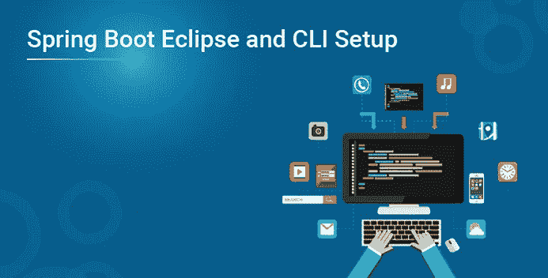

可以通过多种方式创建 Spring Boot 项目。这是微服务认证所需的一个重要概念，也是其课程中不可或缺的一部分。在这篇 Spring Boot 的 Eclipse 和 CLI 设置博客中，我将探索用 Eclipse & Maven 创建 Spring Boot 项目的两种不同选择。它们如下:

*   在 Eclipse 中安装 Spring 工具套件(STS)
*   Spring Boot CLI 设置
*   Spring Boot Hello World 示例

在博客的最后，我还将展示一个使用 **Spring Boot** 的 **Hello World 示例**。

在博客的最后，我还将展示一个使用 Spring Boot 的 Hello World 示例。

现在让我们探讨第一种选择。

# 在 Eclipse 中安装 Spring 工具套件(STS)

**第一步:**要在 Windows 上使用 Eclipse，需要先安装 **Java 开发工具包(JDK)** 。你可以从甲骨文网站下载 JAVA。

**第二步**:接受**许可协议**，选择操作系统的可执行文件。在这里，我将下载 64 位的 Windows。请参考下面的快照。

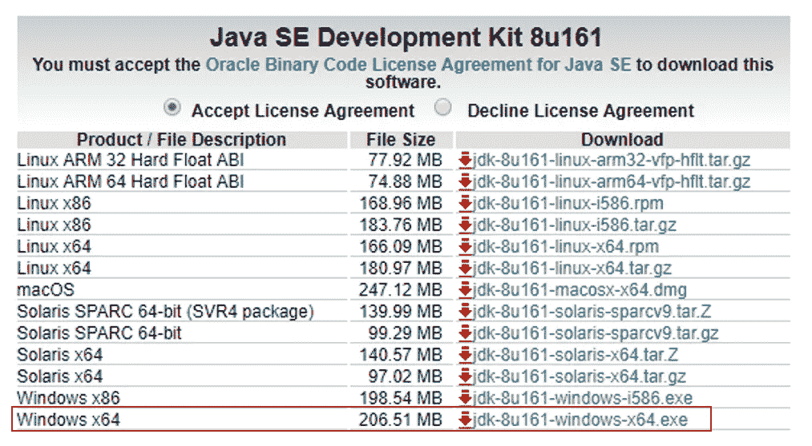

**步骤 3:** 下载完成后，**运行 exe 安装 JDK** 。然后点击**下一步**。请参考下面的快照。

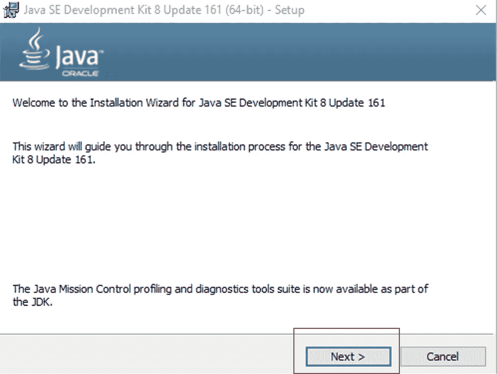

**第四步:**安装完成后点击**关闭**。

**第五步:**现在，在 Java 中设置环境变量。

**步骤 5.1:** 右键点击**我的电脑/这台 PC**->-**更多**->-**属性。**

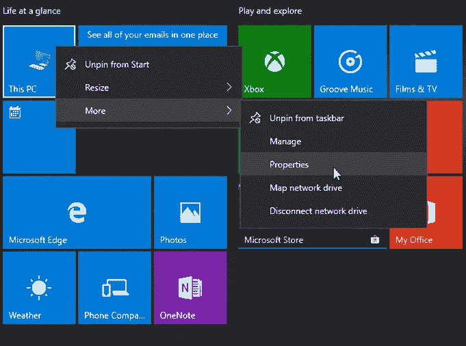

**步骤 5.2:** 进入**高级系统设置**->-**环境变量。**

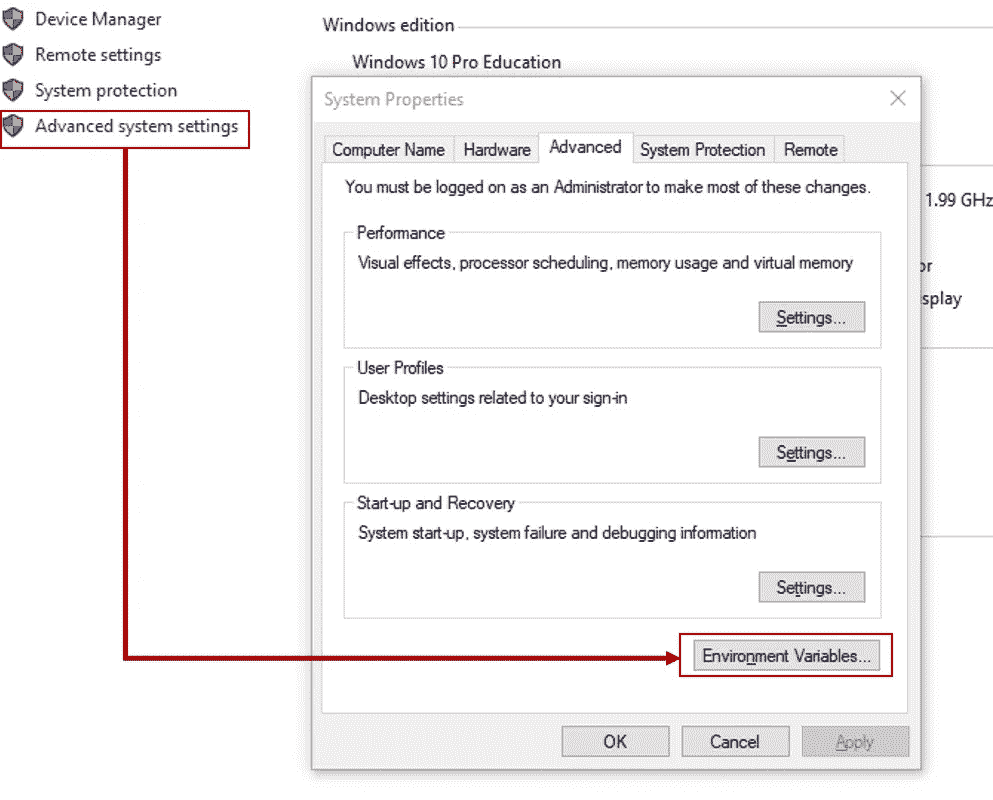

**步骤 5.3:** 在 Windows 环境下添加**JAVA _ HOME**变量，并指向你的 Java JDK 文件夹。请参考下面的快照。

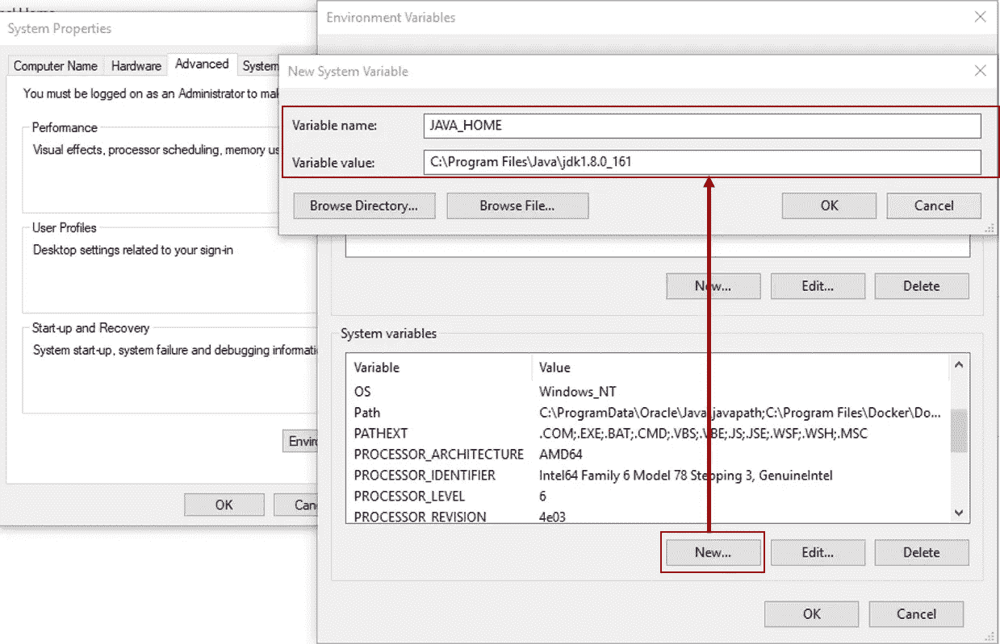

**步骤 5.4:** 更新 **PATH** 变量，追加 Java bin 文件夹。请参考下面的快照。

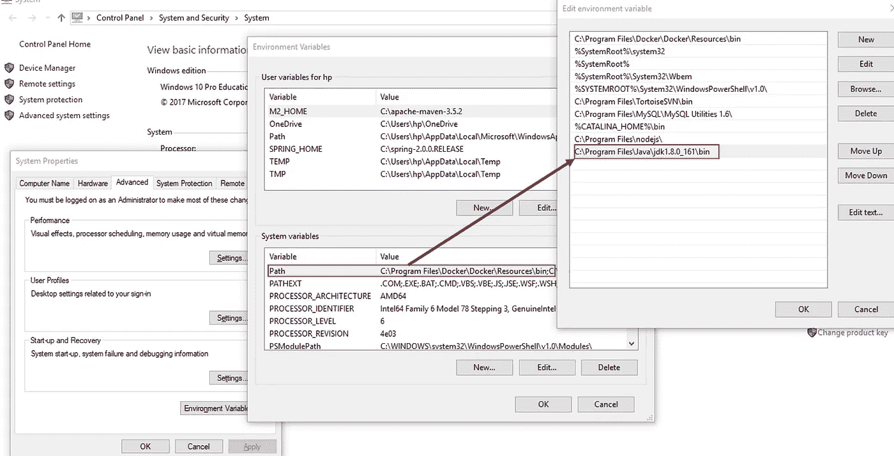

**步骤 5.6:** 要验证是否安装了 Java，请在命令提示符下键入 **java -version** 。

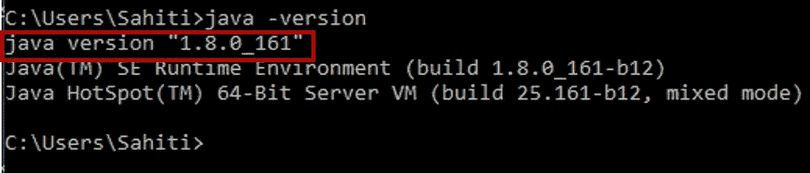

**第六步:**在你的 PC 上配置好 JAVA 之后，你就可以下载 [**Eclipse IDE for JAVA JEE 开发者**](https://www.eclipse.org/downloads/) 并将这些文件解压到特定的文件夹中。

**步骤 7:** 一旦你在你的 PC 上安装完 Eclipse，进入**帮助**->-**Eclipse market place**。将打开一个对话框，列出所有可用的软件。搜索**弹簧工具套件**并**安装**它。

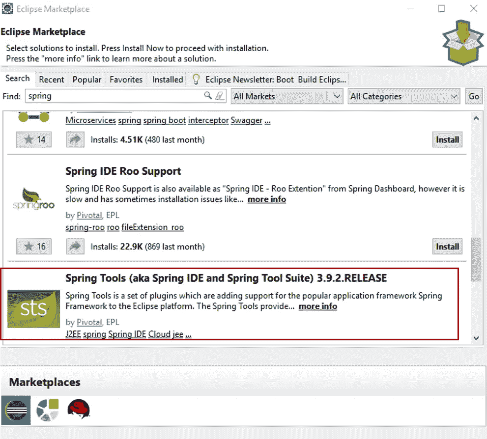

**第 8 步:**工具安装完成后，点击**文件**->-**新建**->-**其他**。将打开一个对话框。在此，选择 Spring Boot 选项下的 **Spring Boot 启动项目**，点击**下一个**。

**步骤 9:** 在打开的下一个屏幕中，为您的项目选择以下内容:

*   小组 id
*   工件 ID
*   根包
*   版本
*   描述
*   Java 版本
*   语言
*   包装

在这里，确保选择 **Maven** 作为 **Type** 并点击 **Next** 。请参考下面的快照。

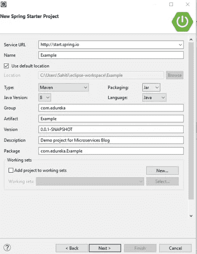

**步骤 10:** 在出现的下一个对话框中，选择您想要添加到您的 Spring Boot Eclipse 项目中的**依赖项**，并点击**完成**。参考下面的快照。

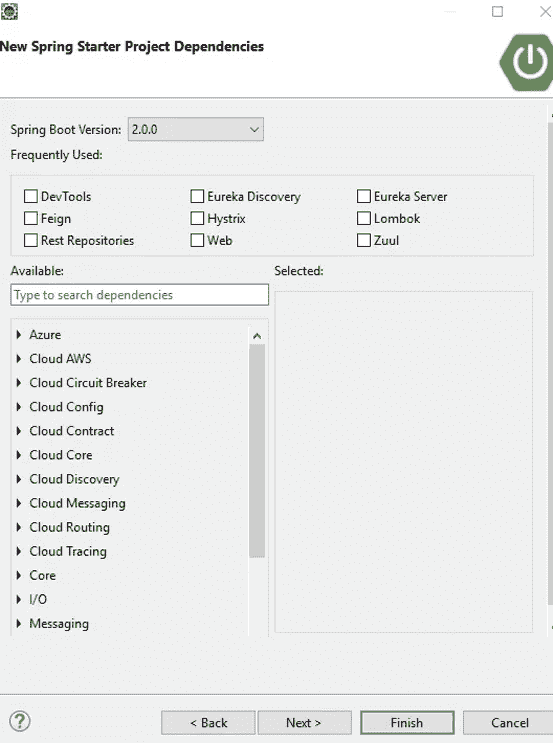

**步骤 11:** 现在，您将会看到您的 SpringBoot Eclipse 项目已经在 Eclipse IDE 的左侧创建好了。

**第 12 步:**项目创建后，根据需要为应用程序配置类。

**步骤 13:** 要运行这个新创建的 Spring Boot Eclipse 项目，右键单击该项目，选择**运行方式** → **Spring Boot App** 。在内部，这个方法在默认端口 8080 创建一个嵌入式 Tomcat 服务器的实例，并在其中运行应用程序。请参考下面的快照。

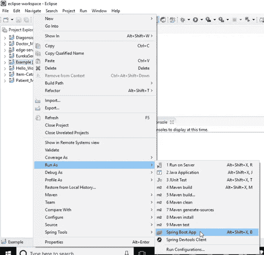

现在，让我们探讨第二种选择。

**Spring Boot CLI 设置**

**步骤 1:** 创建 Spring Boot Eclipse 项目首先从各自的官方网站下载 **Apache Maven** 和 **Spring Boot CLI** 。

**第二步:** **下载 Apache Maven**

**步骤 2.1:** 访问 Maven 官网，下载 [Maven zip](http://www-eu.apache.org/dist/maven/maven-3/3.5.2/binaries/) 文件，例如**Apache-Maven-3 . 5 . 2-bin . zip**。

**步骤 2.2:** 解压到你要安装 Maven 的文件夹。

假设您解压到这个目录 C:apache-maven-3.5.2。

**步骤 2.3:** 在 Windows 环境下添加 **M2_HOME** 和 **MAVEN_HOME** 变量，并指向你的 MAVEN 文件夹。

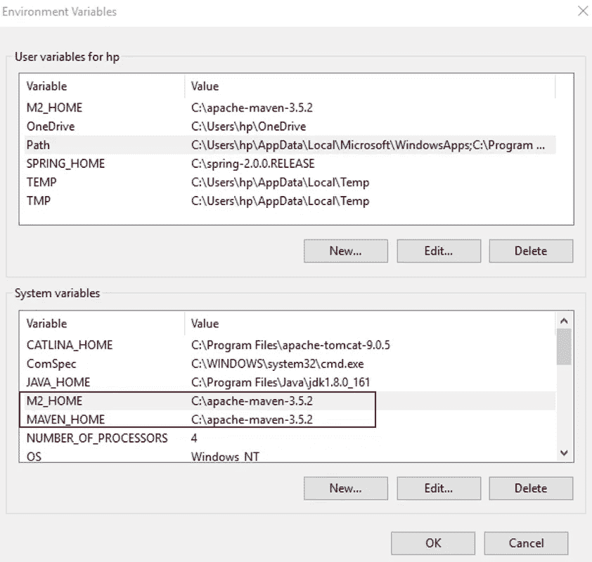

**步骤 2.4:** 更新 **PATH** 变量，追加 Maven bin 文件夹–C:Apache-Maven-3 . 5 . 2 in，参考下面的快照。

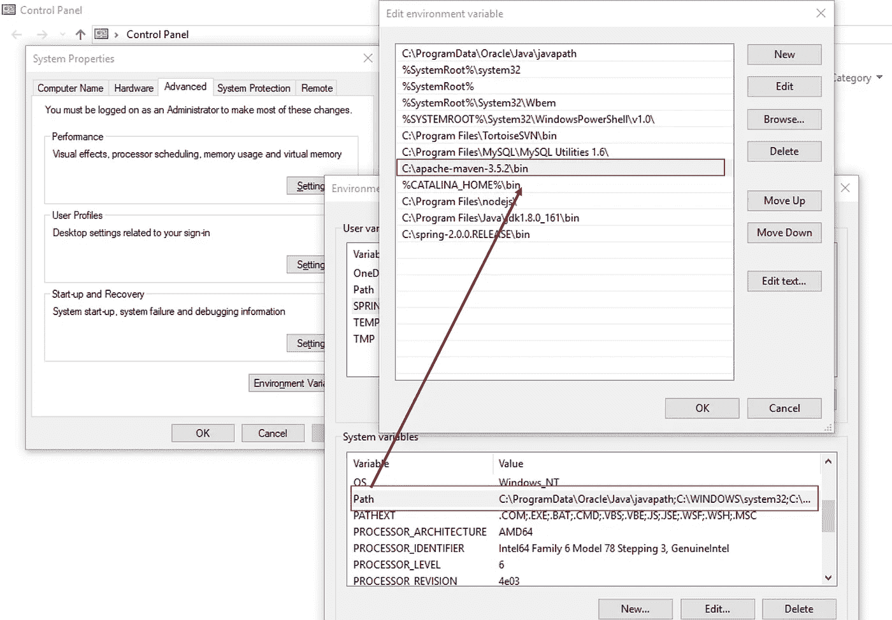

**步骤 2.5:** 在命令提示符下用 **mvn -version** 命令验证是否安装了 maven。

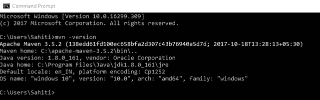

**第三步:下载 Spring Boot CLI 工具**

**步骤 3.1:** 从官网下载 [Spring Boot CLI](https://repo.spring.io/release/org/springframework/boot/spring-boot-cli/) 。

步骤 3.2: 将下载的文件解压到你想要安装 Spring CLI 的文件夹。

假设您将它解压缩到这个目录 C:spring-2.0.0.RELEASE。

**步骤 3.3:** 在 Windows 环境下添加 **SPRING_HOME** 变量，并指向你的 SPRING 文件夹。请参考下面的快照。

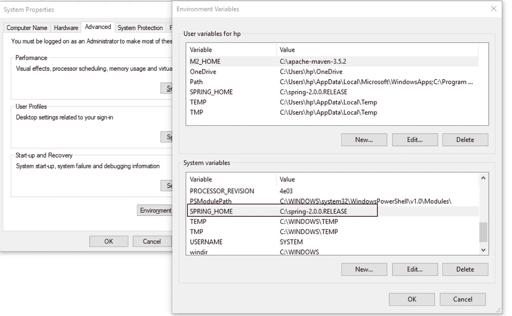

**第 3.4 步:**更新 **PATH** 变量，追加 Spring bin 文件夹— C:spring-2.0.0.RELEASEin，参见下图快照。

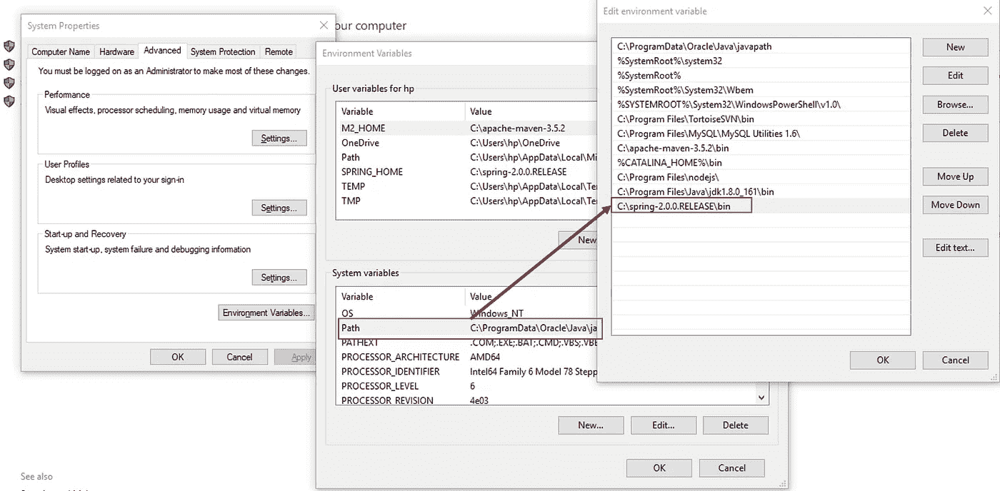

**步骤 3.5:** 在命令提示符下用**Spring-version**命令验证 Spring 是否安装。

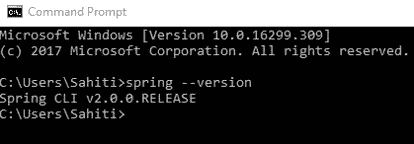

**步骤 4:** 现在转到您创建 Spring 项目的项目目录，并复制路径。

**步骤 5:** 在命令提示符下使用命令 **cd** 将工作目录更改为项目路径。这里假设路径是 C:usershatidesktopexample。

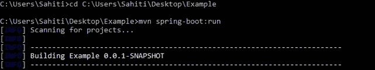

**步骤 6:** 使用命令 **mvn spring-boot:run** 运行项目

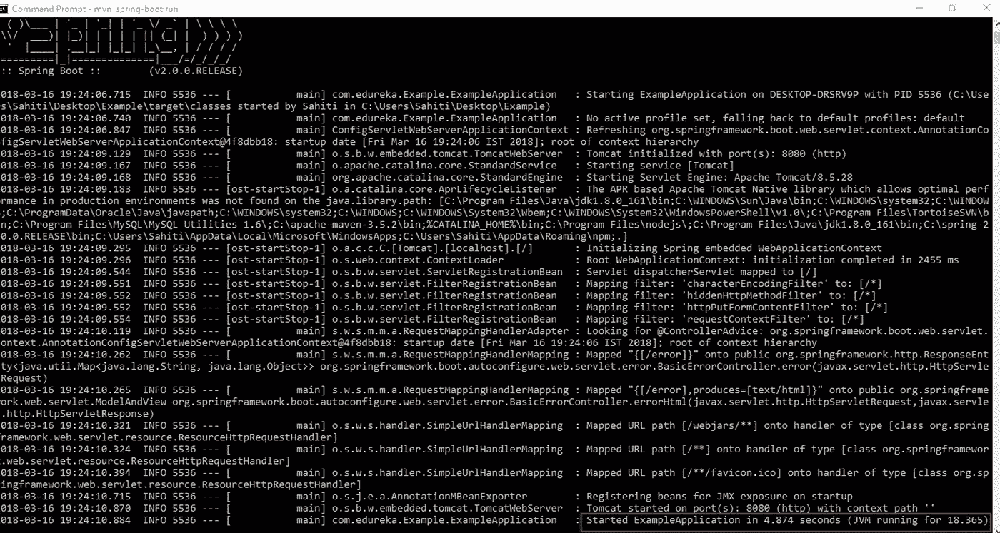

现在让我们用两种方式创建一个 Hello World 应用程序。

# Spring Boot Hello World 示例

最初，让我们通过从 **Eclipse IDE** 的文件菜单中选择 **Spring Starter 项目**向导来创建一个 **maven 项目**，并选择所需的依赖项。

这个应用程序有一个自动创建的 Java 文件。这个 Java 文件充当应用程序的入口点。它导入类并使用注释。请参考下面的快照。

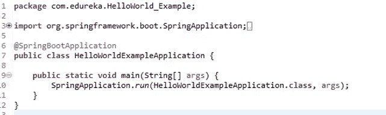

尽管这个应用程序已经可以作为一个独立的应用程序运行，我们仍然会向它添加一个**配置文件**。这将帮助我们处理 HTTP 请求。请参考下面的快照。

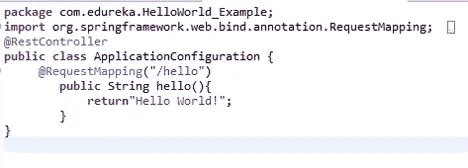

现在，将应用程序作为 Spring Boot 应用程序运行。您观察到应用程序已经启动，并在控制台上产生以下输出。

这个应用程序在 8080 上运行。因此，如果我们将 **/hello** 请求传递给下面的端口号，那么它会生成从配置文件中的请求方法返回的消息。请参考下面的快照。

如果要使用 Spring Boot CLI 运行该项目，请打开命令提示符，将工作目录更改为项目路径。

现在输入 **mvn spring-boot: run** 来运行这个项目。这将为您提供以下输出，表明应用程序是否已经启动。

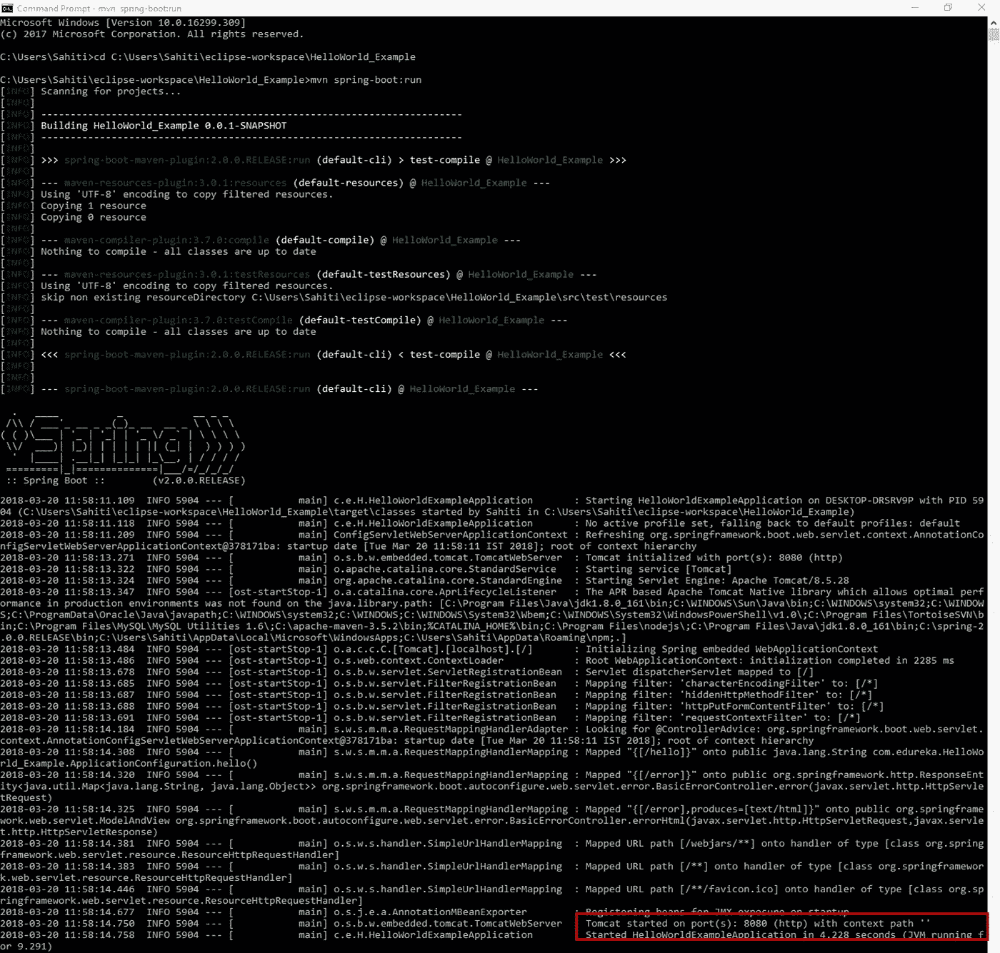

现在，您可以在浏览器上运行它，这将产生与前面相同的输出。

如果你想查看更多关于人工智能、DevOps、道德黑客等市场最热门技术的文章，那么你可以参考 [Edureka 的官方网站。](https://www.edureka.co/blog?utm_source=medium&utm_medium=content-link&utm_campaign=spring-boot-setup-helloworld-microservices-example)

请留意本系列中的其他文章，它们将解释微服务的各个方面。

> *1。* [*什么是微服务？*](/edureka/what-is-microservices-86144b17b836)
> 
> *2。**[*微服务架构*](/edureka/microservice-architecture-5e7f056b90f1)*
> 
> **3。* [*微服务 vs SOA*](/edureka/microservices-vs-soa-4d71c5590fc6)*
> 
> **4。* [*微服务教程*](/edureka/microservices-tutorial-with-example-a230413dfa13)*
> 
> **5。* [*微服务设计模式*](/edureka/microservices-design-patterns-50640c7bf4a9)*
> 
> **6。* [*微服务安全*](/edureka/microservices-security-b01b8f2a9215)*

**原载于 2018 年 5 月 10 日*[*https://www.edureka.co*](https://www.edureka.co/blog/spring-boot-setup-helloworld-microservices-example/)*。**