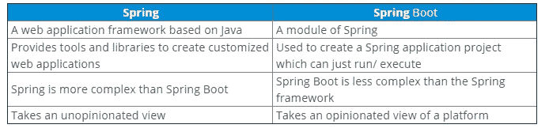
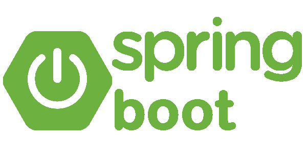
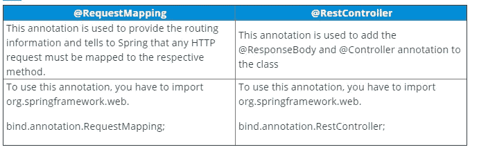
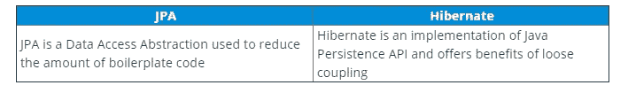
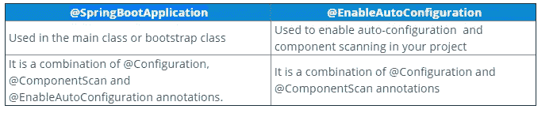
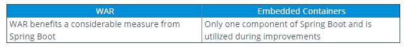

# 必备的 50 个 Spring Boot 面试问题

> 原文：<https://medium.com/edureka/spring-boot-interview-questions-f8267eb341c0?source=collection_archive---------0----------------------->


Spring Boot 不断推出新的方法来简化构建应用程序的过程。今天，它是用 Java 创建 web 应用程序最常用的技术之一。在这篇关于 Spring Boot 面试问题的文章中，我讨论了 50 个带有适当解释和例子的问题。这些问题是在咨询专家后收集的，一定会帮助你在面试中胜出。

所以，让我们开始吧！

# Spring Boot 面试问题

*   春天 vs Spring Boot
*   什么是 Spring Boot 并提及它的必要性？
*   提及 Spring Boot 的优势
*   提及 Spring Boot 的一些特色。
*   解释如何使用 Maven 创建 Spring Boot 应用程序。
*   提及外部配置的可能来源。
*   你能解释一下当一个 Spring Boot 应用程序“作为 Java 应用程序运行”时，在后台会发生什么吗？
*   什么是 Spring Boot 首发，什么是可用的首发？
*   解释弹簧执行器及其优点。
*   什么是 Spring Boot 相关性管理？

## Q1。春天 vs Spring Boot



## Q2。什么是 Spring Boot 并提及它的必要性？

Spring Boot 是一个 Spring 模块，旨在简化 Java 开发中 Spring 框架的使用。它用于创建可以运行的独立的基于 Spring 的应用程序。因此，它基本上消除了许多配置和依赖性。针对快速应用程序开发，Spring Boot 框架提供了自动依赖性解析、嵌入式 HTTP 服务器、自动配置、管理端点和 Spring Boot CLI。

因此，如果你问我为什么有人应该使用 Spring Boot，那么我会说，Spring Boot 不仅提高了生产力，而且还提供了许多方便来编写自己的业务逻辑。

## Q3。提及 Spring Boot 的优势

Spring Boot 的优势如下:

*   提供自动配置来加载一组默认配置，以便快速启动应用程序
*   创建具有一系列非功能特性的独立应用程序，这些特性在大型项目中很常见
*   它带有嵌入式 tomcat、servlet 容器 jetty，以避免使用 WAR 文件
*   Spring Boot 提供了一种自以为是的观点，以减少开发人员的工作量并简化 maven 配置
*   提供 CLI 工具来开发和测试应用程序
*   附带 Spring Boot 启动器，以确保依赖性管理，并提供各种安全指标
*   由用于监控和管理开发和生产中的应用程序的各种 API 组成。
*   通过避免样板代码，轻松集成 Spring 生态系统，如 Spring JDBC、Spring ORM、Spring 数据、Spring 安全。

## Q4。提及 Spring Boot 的一些特色。

Spring Boot 的几个重要特征如下:

1.  Spring CLI——Spring Boot CLI 允许您使用 Groovy 编写 Spring Boot 应用程序，并避免样板代码。
2.  起始依赖——在这个特性的帮助下，Spring Boot 将常见的依赖聚合在一起，最终提高了生产率
3.  自动配置——Spring Boot 的自动配置功能有助于根据您正在处理的项目加载默认配置。这样，您可以避免任何不必要的 WAR 文件。
4.  spring Initializer——这基本上是一个 web 应用程序，它可以为您创建一个内部项目结构。因此，您不必手动设置项目的结构，相反，您可以使用此功能。
5.  弹簧致动器—此功能在运行 Spring Boot 应用程序时提供帮助。
6.  日志记录和安全——Spring Boot 的日志记录和安全功能，确保所有使用 Spring Boot 的应用程序都得到妥善保护，没有任何麻烦。

## Q5。解释如何使用 Maven 创建 Spring Boot 应用程序。

嗯，使用 maven 创建 Spring Boot 应用程序有多种方法，但是如果我必须列举一些的话，那么下面是使用 maven 创建 Spring Boot 项目/应用程序的方法:

*   Spring Boot CLI
*   Spring Starter 项目向导
*   弹簧初始化 r
*   Spring Maven 项目

## Q6。提及外部配置的可能来源。

毫无疑问，Spring Boot 允许开发者在不同的环境下运行相同的应用程序。这是通过它对外部配置的支持来实现的。它使用环境变量、属性文件、命令行参数、YAML 文件和系统属性来表示所需的配置属性。此外,@value 注释用于访问属性。因此，外部配置最可能的来源如下:

*   **应用程序属性** —默认情况下，Spring Boot 在当前目录、类路径根目录或配置目录中搜索应用程序属性文件或其 YAML 文件，以加载属性。
*   **命令行属性** — Spring Boot 提供命令行参数并将这些参数转换为属性。然后将它们添加到环境属性集中。
*   **特定于配置文件的属性** —这些属性从应用程序加载-{profile}。属性文件或其 YAML 文件。此文件与非特定属性文件位于同一位置，并且{profile}占位符引用了一个活动的配置文件。

## Q7。你能解释一下当一个 Spring Boot 应用程序“作为 Java 应用程序运行”时，在后台会发生什么吗？

当一个 Spring Boot 应用程序以“作为 Java 应用程序运行”的方式执行时，一旦它发现您正在开发一个 web 应用程序，它就会自动启动 tomcat 服务器。

## Q8。什么是 Spring Boot 首发，有什么可供首发？

Spring Boot 启动器是一组方便的依赖项管理提供程序，可以在应用程序中使用它们来启用依赖项。这些启动器使开发变得简单而快速。所有可用的首发都在 org 下。spring 框架。开机组。以下是一些受欢迎的入门产品:

*   spring-boot-starter: —这是核心启动器，包括日志记录、自动配置支持和 YAML。
*   spring-boot-starter-jdbc —这个启动器用于与 jdbc 的 HikariCP 连接池
*   Spring-boot-starter-web——这是使用 Spring MVC 构建 web 应用程序(包括 RESTful 应用程序)的起点
*   Spring-boot-starter-Data-JPA——是在 Hibernate 中使用 Spring Data JPA 的启动器
*   spring-boot-starter-security —启动器是否用于 spring 安全
*   spring-boot-starter-aop:这个启动器用于 AspectJ 和 Spring AOP 的面向方面编程
*   是测试 Spring Boot 应用程序的启动器

## Q9。解释弹簧执行器及其优点。

Spring Actuator 是 Spring Boot 的一个很酷的特性，借助它你可以看到一个正在运行的应用程序内部发生了什么。所以，每当你想调试你的应用程序，并需要分析日志，你需要了解应用程序中发生了什么，对不对？在这种情况下，Spring Actuator 提供了对诸如识别 beans、CPU 使用等特性的简单访问。Spring Actuator 提供了一种非常简单的方法来访问生产就绪的 REST 点，并从 web 上获取各种信息。使用 Spring Security 的内容协商策略来保护这些点。

## Q10。什么是 Spring Boot 相关性管理？

Spring Boot 依赖关系管理基本上用于自动管理依赖关系和配置，而无需您为任何依赖关系指定版本。

## Q11。提及弹簧靴系统的最低要求。



Spring Boot 2.1.7 版本要求

*   Java 8 +
*   Spring 框架 5.1.9 +

**显式构建支持**

*   Maven 3.3+版本
*   Gradle 4.4 以上

**Servlet 容器支持**

*   Tomcat 9.0 — Servlet 版本 4.0
*   Jetty 9.4 — Servlet 版本 3.1
*   under flow 2.0—Servlet 版本 4.0

## Q12。解释什么是百里香叶，如何使用百里香叶？

Thymeleaf 是一个用于 web 应用程序的服务器端 Java 模板引擎。它旨在为您的 web 应用程序带来一个自然的模板，并且可以与 Spring Framework 和 HTML5 Java web 应用程序很好地集成。要使用百里香，您需要在 pom.xml 文件中添加以下代码:

```
<dependency>
<groupId>org.springframework.boot</groupId>
<artifactId>spring-boot-starter-thymeleaf</artifactId>
</dependency>
```

## Q13。我们可以在 Spring boot 中更改嵌入式 Tomcat 服务器的端口吗？

是的，我们可以通过使用应用程序属性文件来更改嵌入式 tomcat 服务器的端口。在这个文件中，您必须添加一个属性“server.port ”,并将其分配给任何您想要的端口。比如你要把它赋给 8081，那么就不得不提 server.port=8081。一旦您提到端口号，应用程序属性文件将由 Spring Boot 自动加载，所需的配置将应用于应用程序。

## Q14。Spring Boot 开发工具的需求是什么？

Spring Boot 开发工具是一套精心设计的工具，旨在简化应用程序的开发过程。如果应用程序在生产环境中运行，则此模块会自动禁用，默认情况下也不会重新打包归档文件。因此，Spring Boot 开发者工具将属性应用于各自的开发环境。要包含 DevTools，只需将以下依赖项添加到 pom.xml 文件中:

```
<dependency>
<groupId>org.springframework.boot</groupId>
<artifactId>spring-boot-devtools</artifactId>
</dependency>
```

## Q15。提及使用 Spring Initializer 创建 Spring Boot 项目的步骤。

Spring Initializr 是 Spring 提供的一个 web 工具。在这个工具的帮助下，你可以通过提供项目细节来创建 Spring Boot 项目。使用 Spring Initializer 创建 Spring Boot 项目需要遵循以下步骤:

*   选择 maven 项目和所需的依赖项。然后，填写其他需要的细节，比如组、工件，然后点击 Generate Project。
*   下载完项目后，将项目解压缩到您的系统中
*   接下来，您必须使用 Spring Tool Suite IDE 上的 import 选项导入这个项目
*   在导入项目时，请记住您必须选择项目类型为 Maven，并且源项目应该包含 pom.xml 文件。

一旦完成了上述所有步骤，您将会看到 Spring Boot 项目已经创建完毕，并且包含了所有必需的依赖项。

# Spring Boot 面试问题

## Q16。提及使用 JDBC 将 Spring Boot 应用程序连接到数据库的步骤。

Spring Boot 启动项目提供了将应用程序与 JDBC 连接起来所需的库。例如，如果您只需创建一个应用程序并将其与 MySQL 数据库连接，您可以遵循以下步骤:

**第一步:**在 MySQL 中创建一个数据库

`CREATE DATABASE example;`

**第二步:**然后你必须在这个数据库中创建一个表。

```
CREATE TABLE customers(customerid INT PRIMARY KEY NOT NULL AUTO_INCREMENT, customername VARCHAR(255));
```

**步骤 3:** 现在，创建一个 Spring Boot 项目，并提供所需的细节

**步骤 4:** 添加 JDBC、MySQL 和 web 依赖项。

**步骤 5:** 一旦创建了项目，您必须将数据库配置到应用程序属性中

```
spring.datasource.url=jdbc:mysql://localhost:3306/example
spring.datasource.username=root
spring.datasource.password=edureka
spring.jpa.hibernate.ddl-auto=create-drop
```

**步骤 6:** 主 application.java 类应该具有以下代码:

```
package com.edureka;
import org.springframework.boot.SpringApplication;
import org.springframework.boot.autoconfigure.SpringBootApplication;
[@SpringBootApplicatio](http://twitter.com/SpringBootApplicatio)n
public class SampleApplication {
public static void main(String[] args) {
SpringApplication.run(SampleApplication.class, args);
}
}
```

**第 7 步:**接下来，您必须创建一个控制器来处理 HTTP 请求，方法是使用下面的代码:

```
package com.edureka;
import org.springframework.web.bind.annotation.RequestMapping;
import org.springframework.beans.factory.annotation.Autowired;
import org.springframework.jdbc.core.JdbcTemplate;
import org.springframework.web.bind.annotation.RestController;
[@RestController](http://twitter.com/RestController)
public class JdbcController {
[@Autowired](http://twitter.com/Autowired)
JdbcTemplate jdbc;
[@RequestMapping](http://twitter.com/RequestMapping)("/insert")
public String index(){
jdbc.execute("insert into customers(name)values('Aryya')");
return "Data Entry Successful";
}
}
```

**第八步:**最后，将这个项目作为 Java 应用程序执行。
**第九步:**接下来打开 URL (localhost:8080/insert)，会看到输出为数据录入成功。您还可以继续检查数据是否输入到表中。

## Q17。如何在 Spring Boot 启用 HTTP/2 支持？

您可以通过`server.http2.enabled=true`在 Spring Boot 启用 HTTP/2 支持

## Q18。Spring Boot 中的@RequestMapping 和@RestController 注释是用来做什么的？



**示例:**假设您有一个方法 Example()，它应该使用/example URL 进行映射。

```
package com.edureka; 
import org.springframework.web.bind.annotation.RequestMapping; 
import org.springframework.web.bind.annotation.RestController; 
[@RestController](http://twitter.com/RestController) 
public class SampleController { 
[@RequestMapping](http://twitter.com/RequestMapping)("/example") 
public String example(){ 
return"Welcome To Edureka"; 
} 
}
```

## Q19。什么是 Spring Boot CLI，如何使用 Boot CLI 执行 Spring Boot 项目？

Spring Boot CLI 是官方 Spring 框架支持的工具。执行 Spring Boot 项目的步骤如下:

*   从官方网站下载 CLI 工具并解压缩 zip 文件。Spring 设置中的 bin 文件夹用于执行 Spring Boot 应用程序。
*   由于 Spring Boot CLI 执行 groovy 文件，您需要为 Spring Boot 应用程序创建一个 groovy 文件。为此，请打开终端，将当前目录更改为 bin 文件夹。现在，打开一个 groovy 文件(例如 Sample。groovy)
*   在该文件中，创建一个控制器，如下所示:

```
@RestController   public class Sample {   
 @RequestMapping("/example")   
 String index(){   
<h1>"Welcome To Edureka"</h1>;  
}   }
```

*   然后通过提及以下内容来执行 groovy 文件:

`./spring run Sample.groovy;`

一旦项目被执行，转到 URL(localhost:8080:/example ),您将看到输出为 **Welcome To Edureka**

如果你正面临这些 Spring Boot 面试问题的挑战，请在下面的评论区评论你的问题。

## 问题 20。提到 JPA 和 Hibernate 的区别。



## 问题 21。如何在 Spring Boot 执行器中创建自定义端点？

要在 Spring Boot 2.x 中创建自定义端点，可以使用@Endpoint 注释。Spring Boot 还在 Spring MVC、Jersey 等的帮助下，使用@WebEndpointor、@WebEndpointExtension over HTTP 来公开端点。

## 问题 22。解释春季数据。

Spring Data 旨在让开发人员能够轻松使用关系和非关系数据库、基于云的数据服务和其他数据访问技术。因此，基本上，它使数据访问变得容易，并且仍然保留底层数据。

## 问题 23。你对 Spring Boot 的自动配置有什么理解，以及如何禁用自动配置？

自动配置用于自动配置应用程序所需的配置。例如，如果在应用程序的类路径中有一个数据源 bean，那么它会自动配置 JDBC 模板。在自动配置的帮助下，您可以以一种简单的方式创建一个 Java 应用程序，因为它会自动配置所需的 beans、控制器等。

要禁用自动配置属性，您必须在不希望应用@EnableAutoConfiguration 属性的情况下排除该属性。

`@EnableAutoConfiguration(exclude={DataSourceAutoConfiguration.class})`

如果类不在类路径上，那么要排除自动配置，您必须提到以下代码:

`@EnableAutoConfiguration(excludeName={Sample.class})`

除此之外，Spring Boot 还提供了通过使用`spring.autoconfigure.exclude`属性来排除自动配置类列表的功能。您可以将它添加到应用程序中。属性或添加多个用逗号分隔的类。

## 问题 24。@SpringBootApplication 和@EnableAutoConfiguration 批注有什么区别？



Q25\. What are the steps to deploy Spring Boot web applications as JAR and WAR files?

要部署 Spring Boot web 应用程序，只需在 pom.xml 文件中添加以下插件:

```
<plugin>
<groupId>org.springframework.boot</groupId>
<artifactId>spring-boot-maven-plugin</artifactId>
</plugin>
```

通过使用上面的插件，您将得到一个执行包阶段的 JAR。这个 JAR 将包含所有必需的库和所需的依赖项。它还将包含一个嵌入式服务器。因此，您基本上可以像运行普通的 JAR 文件一样运行应用程序。
**注意:**POM . XML 文件中的 packaging 元素必须设置为 **jar** 才能构建如下 jar 文件:

`<packaging>jar</packaging>`

同样，如果你想建立一个 WAR 文件，那么你会提到

`<packaging>war</packaging>`

## 问题 26:你能举一个 ReadOnly 在交易管理中为真的例子吗？

事务管理中 ReadOnly 为真的示例如下:

考虑一个场景，您必须从数据库中读取数据。例如，假设您有一个客户数据库，您想读取客户和客户名称等客户详细信息。为此，您将在事务上设置**为只读，因为我们不想检查实体中的更改。**

## Q27。你能解释一下如何用 Spring Boot 部署到不同的服务器上吗？

要使用 Spring Boot 部署不同的服务器，请执行以下步骤:

*   从项目中生成 WAR
*   然后，将 WAR 文件部署到您喜欢的服务器上

注意:在服务器上部署 WAR 文件的步骤取决于您选择的服务器。

## 问题 28:使用 Spring Boot 公开自定义应用程序配置的最佳方式是什么？

在 Spring Boot 中公开定制应用程序[配置的一种方法是使用 **@Value 注释**。但是，这个注释的唯一问题是所有的配置值将分布在整个应用程序中。相反，您可以使用集中的方法。](https://www.edureka.co/blog/spring-tutorial/)

对于集中式方法，我的意思是您可以使用@ConfigurationProperties 定义一个配置组件，如下所示:

```
[@Component](http://twitter.com/Component)
[@ConfigurationPropert](http://twitter.com/ConfigurationPropert)ies("example")
public class SampleConfiguration {
private int number;
private boolean value;
private String message;
```

根据上面的代码片段，应用程序中配置的值。属性将如下所示:

```
example.number: 100
example.value: true
example.message: Dynamic Message
```

## 问题 29。我们能在 Spring Boot 创建一个非 web 应用程序吗？

是的，我们可以通过从类路径中删除 web 依赖项并改变 Spring Boot 创建应用程序上下文的方式来创建非 web 应用程序。

## Q 30。连接 MySQL 或 Oracle 之类的外部数据库有哪些步骤？

要连接外部数据库，您必须遵循以下步骤:

*   首先将 MySQL 连接器的依赖项添加到 pom.xml 中
*   然后从 pom.xml 中删除 H2 依赖项
*   现在，设置您的 [MySQL 数据库](https://www.edureka.co/blog/mysql-tutorial/)并配置您到 MySQL 数据库的连接
*   重新启动您的项目

# Spring Boot 面试问题

## Q31。提及 YAML 文件相对于属性文件的优势，以及在 Spring boot 中加载 YAML 文件的不同方式。

与属性文件相比，YAML 文件的优势在于数据以分层格式存储。因此，如果出现问题，开发人员很容易进行调试。每当您在类路径上使用 SnakeYAML 库时，SpringApplication 类都支持 YAML 文件作为属性的替代。在 Spring Boot 加载 YAML 文件的不同方法如下:

*   使用 YamlMapFactoryBean 将 YAML 作为地图加载
*   使用 YamlPropertiesFactoryBean 将 YAML 作为属性加载

## Q32。在没有任何配置的情况下，如何选择 Hibernate 作为 JPA 的默认实现？

当我们使用 Spring Boot 自动配置时，spring**-boot-starter-data-JPA**依赖项会自动添加到 pom.xml 文件中。现在，因为这个依赖项对 JPA 和 Hibernate 有一个可传递的依赖，所以每当 Spring Boot 在类路径中看到 Hibernate 时，它会自动将 Hibernate 配置为 JPA 的默认实现。

## Q33。你所理解的 Spring Data REST 是什么？

Spring Data REST 用于公开 Spring 数据存储库周围的 RESTful 资源。考虑下面的例子:

```
[@RepositoryRestResour](http://twitter.com/RepositoryRestResour)ce(collectionResourceRel = "sample", path = "sample")
public interface SampleRepository
extends CustomerRepository<sample, Long> {
```

现在，要公开 REST 服务，您可以通过以下方式使用 POST 方法:

```
{
"customername": "Rohit"
}
```

响应内容

```
{
"customername": "Rohit"
"_links": {
"self": {
"href": "<a href="[http://localhost:8080/sample/1](http://localhost:8080/sample/1)">[http://localhost:8080/sample/1](http://localhost:8080/sample/1)</a>"
},
"sample": {
"href": "<a href="[http://localhost:8080/sample/1](http://localhost:8080/sample/1)">[http://localhost:8080/sample/1](http://localhost:8080/sample/1)</a>"
}
}
```

注意，响应内容包含新创建的资源的 href。

## Q34。RequestMapping 和 GetMapping 有什么区别？

@GetMapping 是一个复合注释，充当@ request mapping(method = request method)的快捷方式。获取)。这两种方法都支持消费者。消费者选项包括:

consumes = " text/plain "
consumes = { " text/plain "，" application/*"}

## Q35。事务的边界应该从哪一层开始？

事务的边界应该从服务层开始，因为业务事务的逻辑存在于该层本身。

## Q36。path=" sample "，collectionResourceRel=" sample "如何与 Spring Data Rest 一起工作？

```
[@RepositoryRestResour](http://twitter.com/RepositoryRestResour)ce(collectionResourceRel = "sample", path = "sample")
public interface SampleRepository extends
PagingAndSortingRepository<Sample, Long>
```

*   路径—此部分用于说明要导出资源的段。
*   collectionResourceRel —该值用于生成指向集合资源的链接。

## Q37。解释如何注册自定义自动配置。

为了注册一个自动配置类，您必须在@EnableAutoConfiguration 键 META-INF/spring 下提到完全限定的名称。工厂文件。同样，如果我们用 maven 构建，那么这个文件应该放在 resources/META-INT 目录中。

## Q38。如何配置 Log4j 进行日志记录？

因为 Spring Boot 支持 Log4j2 来记录配置，所以您必须排除 Logback 并包括 Log4j2 来记录。只有当您使用 starters 项目时才能做到这一点。

## Q39。提及 WAR 和嵌入式容器之间的区别



## Q40。你认为简介的需求是什么？

概要文件用于提供一种方法来隔离应用程序配置的不同部分，并使其可用于各种环境。因此，基本上，任何@组件或@配置都可以用@Profile 标记，以便在加载时加以限制。考虑到您有多个环境，

*   偏差
*   质量保证
*   阶段
*   生产

现在，假设您想要在每个环境中拥有不同的应用程序配置，您可以使用配置文件为不同的环境拥有不同的应用程序配置。所以，基本上，Spring 和 Spring Boot 提供了一些特性，通过它们你可以指定:

*   特定环境的活动配置文件
*   为各种配置文件配置各种环境。

## Q41。用 Spring Boot 添加自定义 JS 代码的步骤是什么？

使用 Spring Boot 添加自定义 JS 代码的步骤如下:

*   现在，在 resources 文件夹下创建一个文件夹，并将其命名为 **static**
*   在这个文件夹中，您可以将静态内容放在那个文件夹中

**注意:**以防浏览器抛出未经授权的错误，你要么禁用安全性，要么在日志文件中搜索密码，最终在请求头中传递。

## Q42。当 bean 存在时，如何指示自动配置退出？

要指示自动配置类在 bean 存在时后退，必须使用@ ConditionalOnMissingBean 注释。此注释的属性如下:

*   **值:**该属性存储要检查的 beans 的类型
*   **name:** 该属性存储要检查的 beans 的名称

## Q43。为什么 Spring Data REST 在现实应用中不被推荐？

在现实世界的应用程序中不推荐使用 Spring Data REST，因为您将数据库实体直接公开为 REST 服务。在设计 RESTful 服务时，我们考虑的两件最重要的事情是领域模型和消费者。但是，在使用 Spring Data REST 时，这些参数都没有被考虑。实体是直接公开的。所以，我只想说，你可以使用 Spring Data REST，用于项目的初始演进。

## Q44。如果 H2 不在类路径中，您看到的错误是什么？

如果 H2 不在类路径中，您会看到以下错误:

`Cannot determine embedded database driver class for database type NONE`

要解决此错误，请将 H2 添加到 pom.xml 文件中，并重新启动服务器。
可以添加以下代码片段来添加依赖项:

```
<dependency>
    <groupId>com.h2database</groupId>
    <artifactId>h2</artifactId>
    <scope>runtime</scope>
</dependency>
```

# Q45。通过 Spring Boot 使用配置文件来配置特定于环境的配置的方法是什么？

众所周知，配置文件只不过是标识环境的一个键，因此让我们考虑示例中的以下两个配置文件:

*   偏差
*   刺针
*   考虑应用程序属性文件中存在的以下属性:

```
example.number: 100
example.value: true
example.message: Dynamic Message
```

现在，假设您想要为 dev 概要文件定制 application.properties，那么您需要创建一个名为 application-dev.properties 的文件，并覆盖您想要定制的属性。你可以提一下下面的代码:

```
example.message: Dynamic Message in Dev
```

类似地，如果您想要为 prod 概要文件定制 application.properties，那么您可以提到下面的代码片段:

```
example.message: Dynamic Message in Prod
```

一旦您完成了特定于概要文件的配置，您就必须在环境中设置活动的概要文件。为此，你可以

*   在参数中使用`-Dspring.profiles.active=prod`
*   在 application.properties 文件中使用`spring.profiles.active=prod`

## Q46。提到启动 JPA 应用程序和连接内存数据库 H2 与 Spring Boot 所需的依赖关系？

启动 JPA 应用程序并通过 Spring Boot 连接内存中的数据库 H2 需要这些依赖项

*   web starter
*   氘
*   数据 JPA 启动程序
*   要包含依赖项，请参考以下代码:

```
<dependency>
    <groupId>org.springframework.boot</groupId>
    <artifactId>spring-boot-starter-web</artifactId>
</dependency>
<dependency>
    <groupId>com.h2database</groupId>
    <artifactId>h2</artifactId>
    <scope>runtime</scope>
</dependency>
<dependency>
    <groupId>org.springframework.boot</groupId>
    <artifactId>spring-boot-starter-data-jpa</artifactId>
</dependency>
```

## Q47。你对 Spring Boot 支持宽松约束的理解是什么？

宽松绑定是一种不需要属性名与环境属性的键相匹配的方式。在 Spring Boot 中，宽松绑定适用于配置属性的类型安全绑定。例如，如果带有@ConfigurationPropertie 批注的 bean 类中的属性被用于 sampleProp，则它可以绑定到以下任何环境属性:

*   样品道具
*   样品支架
*   样本 _ 道具
*   样本 _ 道具

## Q48。数据库连接信息在哪里指定，它如何自动连接到 H2？

嗯，这个问题的答案很简单。正是由于 Spring Boot 自动配置，才配置了应用程序的依赖关系。因此，数据库连接信息以及将数据库自动连接到 H2 是由自动配置属性完成的。

## Q49。Spring Boot 配置的默认 H2 数据库的名称是什么？

默认的 H2 数据库的名称是 **testdb。参考下文:**

```
spring.datasource.name=testdb # Name of the datasource.
```

**注意:**以防万一，如果你使用的是 H2 内存数据库，那么这就是用来建立你的 H2 数据库的 Spring Boot 的名字。

# Spring Boot 面试问题

## Q50。你觉得，在 spring-boot-starter-web 中可以用 jetty 代替 tomcat 吗？

是的，我们可以在 spring-boot-starter-web 中使用 jetty 来代替 tomcat，方法是移除现有的依赖项并包含以下内容:

```
<dependency>
    <groupId>org.springframework.boot</groupId>
    <artifactId>spring-boot-starter-web</artifactId>
    <exclusions>
        <exclusion>
            <groupId>org.springframework.boot</groupId>
            <artifactId>spring-boot-starter-tomcat</artifactId>
        </exclusion>
    </exclusions>
</dependency>
<dependency>
    <groupId>org.springframework.boot</groupId>
    <artifactId>spring-boot-starter-jetty</artifactId>
</dependency>
```

就这样，我们结束了这篇关于 Spring Boot 面试问题的文章。我希望这一套 Spring Boot 面试问答能帮助你准备面试。万事如意！如果你想查看更多关于人工智能、DevOps、道德黑客等市场最热门技术的文章，你可以参考 Edureka 的官方网站。

请留意本系列中的其他文章，它们将解释微服务的各个方面。

> *1。* [*什么是微服务？*](/edureka/what-is-microservices-86144b17b836)
> 
> *2。*[](https://www.edureka.co/blog/object-oriented-programming/?utm_source=medium&utm_medium=content-link&utm_campaign=java-exception-handling)*[*微服务架构*](/edureka/microservice-architecture-5e7f056b90f1)*
> 
> **3。* [*微服务 vs SOA*](/edureka/microservices-vs-soa-4d71c5590fc6)*
> 
> **4。* [*微服务教程*](/edureka/microservices-tutorial-with-example-a230413dfa13)*
> 
> **5。* [*微服务设计模式*](/edureka/microservices-design-patterns-50640c7bf4a9)*
> 
> **6。* [*微服务安全*](/edureka/microservices-security-b01b8f2a9215)*

*【https://www.edureka.co】最初发表于[](https://www.edureka.co/blog/interview-questions/spring-boot-interview-questions/)**。***