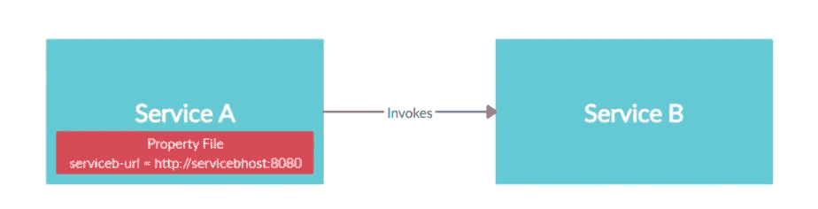
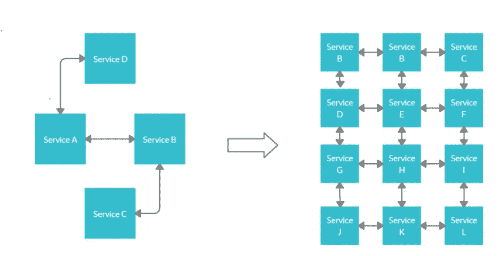
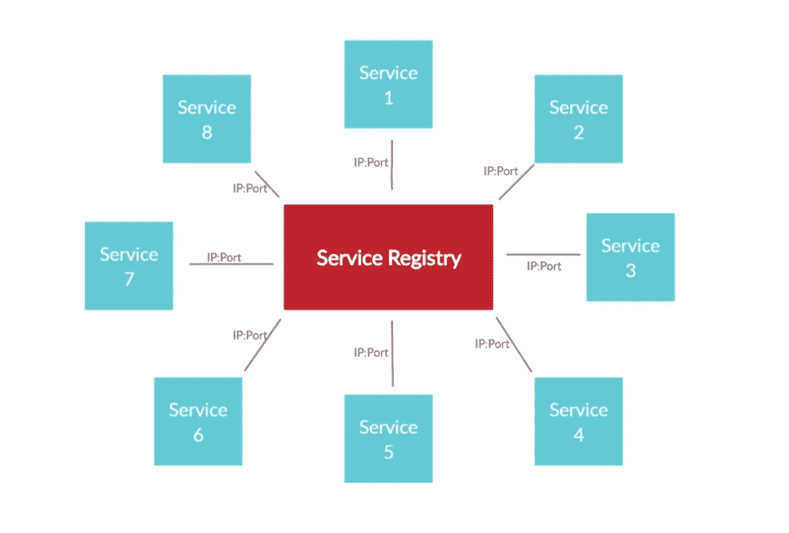
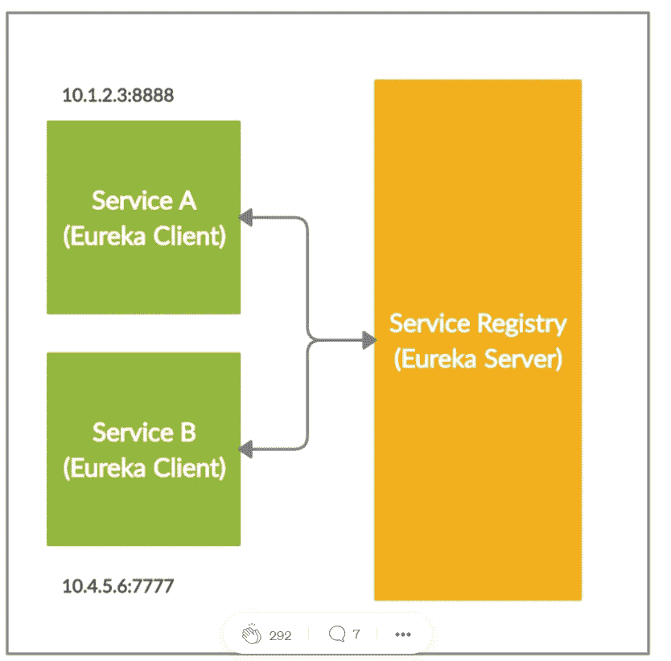

# 春云网飞

> 原文：<https://medium.com/globant/spring-cloud-netflix-d7db3b3c13e6?source=collection_archive---------0----------------------->

Spring Cloud 网飞通过自动配置和绑定到 Spring 环境和其他 Spring 编程模型习惯用法，为 Spring Boot 应用程序提供网飞 OSS 集成。通过一些简单的注释，您可以快速启用和配置应用程序中的通用模式，并使用久经考验的网飞组件构建大型分布式系统。提供的模式包括服务发现(Eureka)。

# 什么是服务发现？

分布式系统通常包括大量相互通信以执行特定操作的服务。服务发现是一个服务动态发现另一个服务的网络位置(IP 地址和端口)并与之通信的过程。

想象一个场景，其中一个 REST 服务(服务 A)试图调用另一个 REST 服务(服务 B)。为了发出请求，服务 A 需要知道服务 b 的网络位置(IP 地址和端口)。在传统的 SOA(面向服务的架构)生态系统中，服务的网络位置几乎不会改变，因为它们部署在本地数据中心。因此，您可以在配置文件中维护服务的网络位置，这些文件很少更新。例如，服务 A 可以在配置文件中维护服务 B 的 IP 地址和端口，并在发出请求时使用这些值。下图说明了这一流程。



然而，这种方法在基于云的微服务架构中几乎是不可能的，原因如下。

**服务数量的增加:**正如您所熟知的，微服务架构就是将一个个整体分解成细粒度的服务。这导致形成复杂通信网的服务数量增加。因此，一个服务很难在属性文件中维护它必须与之通信的所有其他服务的网络位置。



**动态分配网络位置:**微服务一般部署在云端。云中的服务器实例具有动态分配的网络位置。此外，由于其自动扩展等基本功能，服务器在云中来去自如。每次在新实例中启动服务时，其网络位置都会发生变化。因此，很难在属性文件中维护特定微服务的目标 IP 地址和端口号，因为这些值往往会非常频繁地变化。

这些复杂性使得微服务需要更复杂的机制来动态发现其他微服务的网络位置以进行通信。结果引入了服务发现的概念。服务发现机制使用中央注册表来维护所有微服务的网络位置。如果由于某种原因，特定微服务的 IP 地址和端口号发生变化，新值将立即在注册表中重新注册。



# 什么是春云尤里卡

Eureka 是一个基于 REST 的服务，主要用于获取您想要与之通信的服务的信息。这个 REST 服务也被称为**尤里卡服务器**。在尤里卡服务器中注册以获取彼此信息的服务被称为**尤里卡客户端**。下图说明了 Eureka 客户端和服务器是如何结合在一起的。



# 特征

春云网飞特色:

*   可以注册 Eureka 实例，客户机可以使用 Spring 管理的 beans 发现这些实例。

**网飞尤里卡**
尤里卡主要由主要部件组成，我们来看看都有哪些:
**1 .Eureka Server:** 它是一个包含所有客户端服务应用程序信息的应用程序。每个微服务都向 Eureka 服务器注册，Eureka 知道每个端口和 IP 地址上运行的所有客户端应用程序。尤里卡服务器也被称为发现服务器。
**2。Eureka Client:** 这是实际的微服务，它向 Eureka 服务器注册，所以如果任何其他微服务想要 Eureka 客户端的地址，它们就会联系 Eureka 服务器。Eureka 客户端的所有操作可能需要一段时间才能反映到 Eureka 服务器上，然后反映到其他 Eureka 客户端上

**尤里卡服务器**

为服务注册实现一个 Eureka 服务器如下:

1.  将 spring-cloud-starter-网飞-尤里卡-服务器添加到依赖项中
2.  在@ spring boot 应用程序中启用 Eureka 服务器，方法是用@EnableEurekaServer 对其进行注释
3.  配置一些属性

让我们一步一步来。

首先，我们将创建一个新的 Maven 项目，并将依赖项放入其中。注意，我们正在将 spring-cloud-starter-parent 导入到本教程中描述的所有项目中。

```
<dependencies>
 <dependency>     
  <groupId>org.springframework.cloud</groupId>     
  <artifactId>spring-cloud-starter-netflix-eureka-  server</artifactId> 
 </dependency> <dependencies>
<dependencyManagement>     
 <dependencies>         
<dependency>             <groupId>org.springframework.cloud</groupId>             <artifactId>spring-cloud-starter-parent</artifactId>             <version>Greenwich.RELEASE</version>             
<type>pom</type>             
<scope>import</scope>         
</dependency>     
</dependencies>  
</dependencyManagement>
```

然后我们将创建主应用程序类:

```
@SpringBootApplication 
@EnableEurekaServer 
public class **EurekaServerApplication** 
{     
  public static void main(String[] args) {         SpringApplication.run(EurekaServerApplication.class, args);     
  } 
}
```

最后，我们将配置 *YAML* 格式的属性，因此 *application.yml* 将是我们的配置文件:

```
server:   
 port: 8761 
eureka:   
 client:     
  registerWithEureka: false     
  fetchRegistry: false
```

**这里我们配置一个应用程序端口；尤里卡服务器的默认版本是 *8761* 。我们告诉内置的 *Eureka 客户端*不要向自己注册，因为我们的应用程序应该充当服务器。**

现在我们将浏览器指向 [http://localhost:8761](http://localhost:8761/) 来查看 *Eureka* 仪表板，稍后我们将在这里检查已注册的实例。

**尤里卡客户端**

为了让一个 *@SpringBootApplication* 能够感知发现，我们必须在我们的*类路径中包含一个 *Spring 发现客户端*(例如，[*Spring-cloud-starter-网飞-尤里卡-客户端*](https://search.maven.org/search?q=spring-cloud-starter-netflix-eureka-client) )。*

然后我们需要用 *@EnableDiscoveryClient* 或 *@EnableEurekaClient 注释一个 *@Configuration* 。*注意，如果我们在类路径上有*spring-cloud-starter-网飞-尤里卡-客户端*依赖，那么这个注释是可选的。

后者明确告诉 Spring Boot 使用 Spring 网飞尤里卡进行服务发现。为了给我们的客户端应用程序添加一些样本，我们还将在 *pom.xml* 中包含[*spring-boot-starter-web*](https://search.maven.org/classic/#search%7Cgav%7C1%7Cg%3A%22org.springframework.boot%22%20AND%20a%3A%22spring-boot-starter-web%22)包，并实现一个 *REST* 控制器。

但是首先，我们将添加依赖项。同样，我们可以让*spring-cloud-starter-parent*依赖关系来为我们计算工件版本:

```
<dependency>     
<groupId>org.springframework.cloud</groupId>     
<artifactId>spring-cloud-starter-netflix-eureka-starter</artifactId> </dependency> 
<dependency>     
<groupId>org.springframework.boot</groupId>     
<artifactId>spring-boot-starter-web</artifactId> 
</dependency>
```

这里我们将实现主要的应用程序类:

```
@SpringBootApplication 
@RestController 
public class **EurekaClientApplication**{      
@Autowired     
@Lazy     
private EurekaClient eurekaClient;      @Value("${spring.application.name}")     
private String appName;      
public static void **main**(String[] args) {          SpringApplication.run(EurekaClientApplication.class, args);     }      @Override     
public String **greeting**() {         
return String.format("Hello from '%s'!", eurekaClient.getApplication(appName).getName());
} } 
```

# 结论

这篇文章的主要目的是向您介绍使用 Eureka 进行服务发现。在现实场景中，一个微服务生态系统可能有数千个部署在世界不同地区的服务。在这种情况下，只有一个 Eureka 集群可能不切实际。相反，我们将不得不在不同的地区部署多个 Eureka 集群，以最小化延迟并提高可用性。下图对此进行了说明。