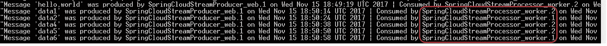

# 基于 Oracle Cloud 的 Spring Cloud Stream 和 Apache Kafka 微服务

> 原文：<https://medium.com/oracledevs/spring-cloud-stream-and-kafka-based-microservices-on-oracle-cloud-9889732149a?source=collection_archive---------0----------------------->

这篇博客展示了如何在 Oracle Cloud 上运行 Spring 云流应用程序

基于微服务的架构中的分布式应用之间的通信可以大致分为两类

*   **同步** — RPC 使用 HTTP(例如 REST)或任何其他协议(例如 avro、thrift 等)。)
*   **异步** —基于消息

本博客中的示例应用程序由生产者和消费者应用程序组成，它们以消息驱动(异步)的方式进行通信

*   建成使用 [Spring Boot](https://projects.spring.io/spring-boot/) ，[春云流](https://cloud.spring.io/spring-cloud-stream/)
*   他们使用 [Oracle Event Hub Cloud](https://cloud.oracle.com/en_US/event-hub) (托管 Apache Kafka)作为中间代理(消息中间件)
*   它们部署在 [Oracle 应用程序容器云](https://cloud.oracle.com/en_US/application-container-cloud)上——生产者应用程序是传统的面向互联网的 *web* 应用程序，消费者应用程序被建模为 [*工作者*服务](/oracledevs/worker-applications-on-oracle-application-container-cloud-f449eaa77c39)。它还利用了 Oracle 事件中心云的[服务绑定](https://docs.oracle.com/en/cloud/paas/app-container-cloud/csjse/exploring-application-deployments-page.html#GUID-BCD4C8AA-0E1C-490D-92E8-6BAE003F5F5C)功能

# 应用概述

> [代码可从 Github 上获得](https://github.com/abhirockzz/accs-spring-cloud-stream-kafka)

应用程序本身相对简单。为了设置背景，这里有一个正在发生的事情的总结

*   生产者应用程序公开一个 REST 端点来接收消息
*   一旦客户端发送了一条消息(使用 HTTP POST)，生产者应用程序就将它推送到 Kafka 主题(在 Oracle Event Hub Cloud 中)
*   消费者(或处理器)应用程序充当 Kafka 主题上的监听器，一旦它接收到消息(异步)，它就对其进行变异(添加关于哪个消费者节点处理了它的信息)，并将其传递给另一个 Kafka 主题(您可以将其视为*接收器*)


Architecture overview

## 生产者应用程序详细信息

*   这是一个 Spring Boot 应用程序，它使用`@EnableBinding`和各自的配置来使用 Kafka 作为**绑定器**实现
*   使用`@RestController`和相关注释来设置 REST 端点

## 处理器应用

*   另一个 Spring Boot 应用程序，它使用`@StreamListener`从生产者应用程序填充的 Kafka 主题接收数据，并使用`@SendTo`将数据推送到另一个(接收器)Kafka 主题
*   它使用处理消息/数据的(ACCS)应用程序节点来丰富消息/数据，这将有助于理解负载平衡的概念

> 在这两种情况下，Kafka 主题都是由应用程序本身在幕后自动创建的——这种行为是可以改变的

# 设置 Oracle 事件中心(Kafka)

我们不会讨论全部细节，因为这是简单明了且有据可查的。您所需要做的就是创建一个 Kafka 集群(在这种情况下，我们有一个代理，与 Zookeeper 位于同一位置)——详情请见[文档](http://docs.oracle.com/en/cloud/paas/event-hub-cloud/ehcug/creating-cluster.html)


**创建自定义访问规则**

您需要在 Oracle Event Hub Cloud 上的 Kafka 服务器虚拟机上创建一个自定义的**访问规则**来打开端口 **2181，6667** 。这是为了让我们的处理应用程序能够与 Zookeeper 和 Kafka CLI 通信

> Kafka 集群的端口(在本例中为 6667)是 Kafka CLI 与 Oracle Event Hub 交互所必需的。Oracle Application Container Cloud 不需要打开此端口，因为安全连接由服务绑定负责

## 服务绑定

我们的消息处理应用程序将使用 Oracle 应用程序容器云中的[服务绑定特性](https://docs.oracle.com/en/cloud/paas/app-container-cloud/csjse/exploring-application-deployments-page.html#GUID-BCD4C8AA-0E1C-490D-92E8-6BAE003F5F5C)绑定到 Kafka 集群

# 构建和部署

## 构建生成器应用程序

*   `git clone [https://github.com/abhirockzz/accs-spring-cloud-stream-kafka](https://github.com/abhirockzz/accs-spring-cloud-stream-kafka).git`
*   `cd rest-producer`
*   `mvn clean install` —构建过程将在`target` 目录中创建`accs-spring-cloud-stream-kafka-producer-dist.zip`

## 构建消费者应用程序

*   `cd consumer`
*   `mvn clean install` —构建过程将在`target` 目录中创建`accs-spring-cloud-stream-kafka-consumer-dist.zip`

## 推至云

借助 Oracle Application Container Cloud，您在部署应用程序方面有多种选择。这个博客将利用 **PSM CLI** ，这是一个用于管理 Oracle 云服务的强大命令行界面

> *其他部署选项包括*[*REST API*](https://docs.oracle.com/en/cloud/paas/app-container-cloud/apcsr/index.html)*[*Oracle 开发者云*](https://docs.oracle.com/en/cloud/paas/developer-cloud/csdcs/deploying-application-oracle-developer-cloud-service.html#GUID-6FE6D850-65DC-471D-A249-F7CCA9CAB56F) *当然还有* [*控制台/UI*](https://docs.oracle.com/en/cloud/paas/app-container-cloud/csjse/creating-application.html)*

*   *在您的机器上下载并设置 PSM CLI(使用`psm setup` ) — [详细信息请点击](https://docs.oracle.com/en/cloud/paas/java-cloud/pscli/using-command-line-interface-1.html)*
*   *修改`deployment.json`，根据您的环境填写 Oracle Event Hub 实例名称(动作中*声明性* [*服务绑定能力*](https://docs.oracle.com/en/cloud/paas/app-container-cloud/csjse/exploring-application-deployments-page.html#GUID-BCD4C8AA-0E1C-490D-92E8-6BAE003F5F5C) *)。这里有一个例子**

```
*{
 “memory”: “1G”,
 “instances”: 2,
 “services”: [
 {
 **“name”: “kafka-on-cloud”,** 
 “type”: “OEHPCS”
 }
 ]
}*
```

*   *部署**制作方** app — `cd rest-producer`和`psm accs push -n SpringCloudStreamProducer -r java -s hourly -m manifest.json -d deployment.json -p target/accs-spring-cloud-stream-kafka-producer-dist.zip`*
*   *部署**处理器** app — `cd consumer`和`psm accs push -n SpringCloudStreamProcessor -r java -s hourly -m manifest.json -d deployment.json -p target/accs-spring-cloud-stream-kafka-consumer-dist.zip`*

> **一旦被执行，一个*异步*进程被启动，CLI 返回它的*任务 ID *供您跟踪应用程序创建**

## *检查您的应用程序*

*一旦部署成功，您应该会在控制台上看到应用程序*

**

*Apps deployed on Oracle Application Container Cloud*

***注意***

*   *“生产者”应用程序是一个面向互联网(网络)的应用程序*
*   *“处理器”应用程序是不公开的——它是一个[工人应用程序](/oracledevs/worker-applications-on-oracle-application-container-cloud-f449eaa77c39) ( *没有公开*)*
*   *有两个“处理器”(消费者)应用程序的实例来演示负载平衡消息消费*

# *试车*

*测试这个也很简单*

*   *使用 Kafka CLI 注册为`sink_topic`的消费者*

```
*kafka-console-consumer.sh -bootstrap-server <kakfa_broker>:6667 -topic sink_topic*
```

*   *`POST`使用 producer 应用程序的一些消息*

```
*curl -X POST -H “content-type: text/plain” [https://springcloudstreamproducer-<your_domain>.apaas.us2.oraclecloud.com](https://springcloudstreamproducer-ocloud109.apaas.us2.oraclecloud.com) -d hello,world* 
```

*   *CLI Kafka 使用者应该会收到类似以下内容的消息*

**

*Kafka CLI*

> **注意(以红色突出显示的消费者节点/实例名称)消费流程是如何实现负载平衡的——这要归功于* `*spring.cloud.stream.bindings.input.group*` *配置**

*现在，我们从`**producer** -> Kafka -> **processor** -> Kakfa`开始的整个周期已经完成。这篇博文到此为止！*

# *不要忘记…*

*   *查看 Oracle 应用容器云的教程[——每个运行时都有一些内容！](https://docs.oracle.com/en/cloud/paas/app-container-cloud/create-first-applications.html)*
*   *[应用容器云上的其他博客](http://bit.ly/2gR3nrV)*

*干杯！*

> *本文表达的观点是我个人的观点，不一定代表甲骨文的观点。*