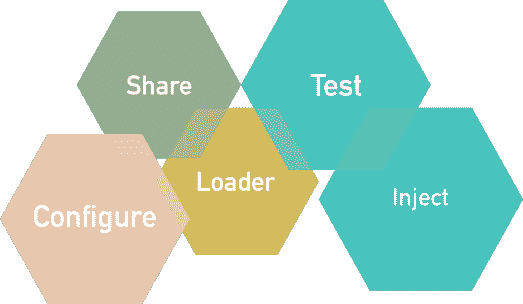

# Spring 框架—自动化的好处

> 原文：<https://medium.com/globant/spring-framework-benefits-in-automation-10c9ab770816?source=collection_archive---------5----------------------->

**简介**

Spring 框架是 Java 平台的一个应用框架和反转控制容器(【https://spring.io/】T2)。在测试自动化项目中使用 Spring 的主要思想是利用一些 Spring 策略，并通过解决不同的场景来应用它们。

下面这篇文章是为有 Java 和 Cucumber 经验的测试自动化工程师准备的。所涉及的主题是基于已经添加和配置了 Spring 依赖项的假设。以下依赖关系配置可能对初学者有用:

<parent></parent>

<groupid>org.springframework.boot</groupid>

<artifactid>弹簧-启动-起动器-父母</artifactid>

2.1.8 .释放

<relativepath></relativepath>

<groupid>org . spring framework . boot</groupid>

<artifactid>弹簧启动起动器</artifactid>

<groupid>org . spring framework . boot</groupid>

<artifactid>弹簧启动起动机测试</artifactid>

<groupid>io.cucumber</groupid>

<artifactid>黄瓜春</artifactid>

<version>${cucumber.version}</version>

我们将回顾一些我们通常必须在测试自动化中处理的场景:

*   基于环境的自动配置。
*   项目中的依赖注入。
*   特定功能的不同实现。

**解决方案**

**基于环境的自动配置**。

测试时，我们必须支持在不同的测试环境下运行我们的测试。有很多方法可以解决这个问题，但是在这个解释中，我们将结合 Spring 的两个优点:依赖注入和配置。

Spring 提供定制注释来创建、关联和注入不同种类的对象。

@配置

@PropertySource({

" class path:config/$ { environment } . db . properties "

})

公共类数据库管理器{

@Bean(destroyMethod = "close ")

public basic data source getDB(@ Value(" $ { url } ")字符串 URL，

@ Value(“$ { username }”)字符串用户名，

@Value("${password} ")字符串密码){

返回 getDataSourceBuilder(url，用户名，密码)；

}

}

在上面的例子中，我们应用了 *@Configuration* 和 *@PropertySource* 注释，这两个注释都将支持创建具有所需信息的特定对象，在本例中是一个 DB 控制器。

*@Configuration* 将允许我们在类内部声明 bean(*在 Spring 中，构成应用程序主干并由 Spring IoC 容器管理的对象被称为 bean*)。这些 Beans 被实例化并放置在 Sprint 容器级别，允许我们以后在代码的任何地方注入和使用。

*@PropertySource* 注释让我们定义属性在哪里。在这种情况下，我们在这个字段的部分路径中使用了一个环境变量。这意味着，我们可以声明多个属性文件，并在它们之间切换，以配置一个 DB 控制器来访问不同测试环境中的数据库。

此外，我们看到从属性文件收集的值被直接注入到 getDB 方法中，这使得理解和实现功能变得更加容易。在这种情况下，我们应该创建一个包含属性 url、用户名和密码的文件，这样才能工作。因为这个方法是一个 Bean，它可以被注入到任何地方，并且使用属性 ***destroyMethod*** ，这是 BasicDataSource 类特有的，我们确保在使用它之后终止连接。

根据上面的例子，我们可能有几个属性源文件，例如:

qa .数据库属性:

URL = JDBC:PostgreSQL://QA . db . com:5432/dbName

用户名= dbusr

password = passwordqa

stg.db .属性:

URL = JDBC:PostgreSQL://stg . db . com:5432/dbName

用户名= dbusr

password = passwordstg

在使用任何可用的环境:qa 或 stg 设置环境变量“environment”时，url、用户名和密码的值将被注入到 getDB Bean 中，数据库配置将使用相应的值来执行。

我们有一个实例，可以在项目的任何地方使用它来访问数据库并在环境之间切换。这对于处理不同的 URL、API 或 DB 前提条件等非常有用。

**跨项目依赖注入**

现在让我们看看依赖注入([相关信息](https://www.baeldung.com/spring-dependency-injection))如何帮助我们。很多时候，我们需要使用页面对象的同一个实例，或者在 Screenplay 中的任务之间共享一些东西，或者只是在某个地方使用一个助手库。

为了解释这一点，我们将创建一个页面对象，看看它是如何工作的。

@组件

公共类应用程序 Dash 扩展 BaseSection {

private By wrapperInfo = By。 *className* (“信息”)；

@步

public void navigateToInfo(InfoNavigationOption InfoNavigationOption){

//TBD

}

}

这里我们有另一个注释 *@Component* ，它使用类路径扫描自动检测和配置 bean。这样使用它，我们就可以在任何地方插入这个页面对象。

例如，在测试步骤定义中:

公共类 ApplicationInfoStepDef 扩展了 BaseStepDefinition {

@自动连线

ApplicationDash 应用程序 dash；

@Given("用户导航到信息{} ")

public void userNavigatesToInfo(InfoNavigationOption InfoNavigationOption){

application dash . navigatetoinfo(infoNavigationOption)；

}

}

如您所见，我们在步骤定义中注入了 applicationDash bean，但是步骤定义没有@Component 注释。这样做的原因是运行程序中使用的上下文配置如下:

@RunWith(Cucumber.class)

@ActiveProfiles(值= {Profiles。*第一个* })

@CucumberContextConfiguration

@CucumberOptions(

//TBD

)

公共类 TestRunner {

}

}

可以通过环境变量 spring.profiles.active 覆盖活动的概要文件，这将允许我们在执行时选择任何概要文件。不需要重新编译解决方案来应用被覆盖的概要文件。

@CucumberContextConfiguration 注释将负责将步骤定义初始化为 beans，这取决于应该在@CucumberOptions 部分中定义的属性 glue:

@CucumberOptions(

glue = { com . domain . steps . location }

)

另外，需要考虑的一件非常重要的事情是，Spring 需要一种方法来找到要初始化的组件。这些组件可能在任何地方，所以我们需要告诉 Spring 在哪里可以找到它们。为此，我们可以使用上述信息创建一个配置类:

@配置

@ components can(" com . components . location ")

公共类配置{

}

并将此配置添加到我们的跑步者:

@RunWith(Cucumber.class)

@ActiveProfiles(值= {Profiles。*第一* })

@CucumberContextConfiguration

@CucumberOptions(

//TBD

)

@ spring boot test(classes = config . class)

公共类 TestRunner {

}

}

只需使用 *@Autowired* 我们就可以注入 ApplicationDash 页面对象的一个实例。类似的事情也可能发生在一个助手中，在这里我们混合不同的页面对象来通过一个更复杂的流程。

@组件

公共类助手{

@自动连线

ApplicationDash 应用程序 dash；

@步

public void do something(InfoNavigationOption InfoNavigationOption){

application dash . navigatetoinfo(infoNavigationOption)

//TBD 其他一些步骤

}

}

我们可能希望在类助手中注入一些其他的依赖项，并在一个方法中组合许多页面对象或库的功能。然后我们可以在任何需要的地方注射辅助物。管理依赖关系很容易，只需定义和注入依赖关系，而无需在每次使用对象时创建新的实例和传递参数来配置对象。

**特定功能的不同实现**。

假设我们的应用程序根据用户角色、应用程序功能的切换等以不同的方式运行。

例如，我们可能需要经历一个在中间有一点点变化的流程，类似于选择一个日期。

对于我们的示例，我们有两种方法在流程中间选择日期，第一种方法是使用日历对象，第二种方法是以字符串形式输入日期。

但是功能是相同的。我需要输入日期。

好了，现在如果这适用于所有场景，我们需要测试两种方式，会发生什么呢？

这是活动配置文件发生的地方。

让我们为这样的功能创建一个接口:

公共接口 IDataManager {

void selectDate(字符串日期)；

}

现在我们需要实现选择日期的不同方法:

@组件

@个人资料({个人资料。*第一个* })

公共类 DateFirst 实现 IDataManager{

@自动连线

CalendarObject 日历对象；

@覆盖

public void selectDate(字符串日期){

calendarObject.selectDate(日期)；

}

}

@组件

@个人资料({个人资料。*第二* })

公共类 DateSecond 实现 IDataManager{

@自动连线

CalendarObject 日历对象；

@覆盖

public void selectDate(字符串日期){

calendarObject.enter(日期)；

}

}

搞定了。我们有几个 selectDate 功能的实现。现在我们只需要告诉 Spring 从决定的实现开始。

让我们解释一下在这个例子中如何使用黄瓜:

@RunWith(Cucumber.class)

@ActiveProfiles(值= {Profiles。*首* })

@CucumberContextConfiguration

@CucumberOptions(

//TBD

)

公共类 TestRunner {

}

}

*@ActiveProfiles* 注释允许我们选择一个或多个概要文件开始。在上面的例子中，我们使用了“第一个”概要文件，这意味着实现用@Profile({Profiles。 *First* })将在注入接口时使用，如下所示:

公共类 ApplicationInfoStepDef 扩展了 BaseStepDefinition {

@自动连线

IDataManager iDataManager

@Given("某个步骤")

public void someStep(字符串日期){

iDataManager.selectDate(日期)；

}

}

结论

Spring 只是一个工具，它可以帮助我们执行诸如依赖注入、环境管理或多重实现等任务，使事情变得更容易。根据您使用的技术，还有其他一些框架，比如 Django 或 Flask for Python，或者使用 NodeJS 中的内置功能，等等。Spring 有一些特性看起来使用注释更容易实现，但是同样的策略可以用不同的方式实现。考虑在您的项目中使用 Spring 并利用它的所有好处是多么必要。Spring 是一个具有多种特性的框架，比如作业调度、依赖注入、认证、事务，它最常用作 MVC 框架。如果您的场景没有利用它的大部分特性，有不同的方法可以用更少的资源和更多的代码来实现相同的方法，但是这取决于您根据您的项目做出最佳的决定。

测试愉快！！

***对初学者有用的信息:***

[https://www.baeldung.com/cucumber-spring-integration](https://www.baeldung.com/cucumber-spring-integration)

[https://thepractical developer . com/cucumber-tests-spring-boot-dependency-injection/](https://thepracticaldeveloper.com/cucumber-tests-spring-boot-dependency-injection/)

[https://medium . com/@ bcarunmail/set-up-and-run-cumber-tests-in-spring-boot-application-d0c 149d 26220](/@bcarunmail/set-up-and-run-cucumber-tests-in-spring-boot-application-d0c149d26220)