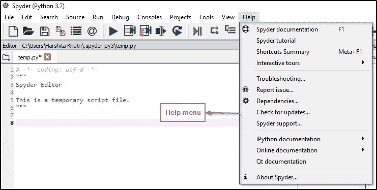

# Python Spyder IDE 是什么，怎么用？

> 原文：<https://medium.com/edureka/spyder-ide-2a91caac4e46?source=collection_archive---------0----------------------->

Python Spyder IDE — Edureka

创建软件应用程序总是需要交互式环境，当您在数据科学、工程和科学研究领域工作时，这一点变得非常重要。Python Spyder IDE 也是为了同样的目的而创建的。在本文中，您将学习如何安装和使用 Spyder 或科学 Python 和开发 IDE。

在继续之前，让我们看一下这里讨论的所有主题:

*   什么是 Python Spyder IDE？
*   Spyder 的特点
*   Python Spyder IDE 安装
*   创建文件/启动项目
*   编写代码
*   变量浏览器
*   文件浏览器
*   配置 Spyder
*   帮助

我们开始吧。

# 什么是 Python Spyder IDE？

Spyder 是一个开源的跨平台 IDE。Python Spyder IDE 完全是用 Python 写的。它由科学家设计，专供科学家、数据分析师和工程师使用。它也被称为科学 Python 开发 IDE，具有一系列显著的特性，这些特性将在下面讨论。

# Spyder 的特点

Spyder 的一些显著特点是:

*   可定制的语法突出显示
*   断点的可用性(调试和条件断点)
*   交互式执行，允许您运行行、文件、单元格等。
*   运行工作目录选择、命令行选项、当前/专用/外部控制台等的配置
*   可以自动清除变量(或进入调试)
*   通过大纲浏览器可以实现在单元格、函数、块等中的导航
*   它提供了实时代码自省(检查什么是函数、关键字和类，它们在做什么以及它们包含什么信息的能力)
*   在 if、while 等后面自动插入冒号
*   支持所有 IPython 魔术命令
*   使用 [Matplotlib](https://www.edureka.co/blog/python-matplotlib-tutorial/) 生成的图形的内联显示
*   还提供帮助、文件资源管理器、查找文件等功能

# Python Spyder IDE 安装(使用 Anaconda 安装—推荐)

Python Spyder IDE 是 Anaconda Python 发行版的默认实现。这不仅是推荐的方法，也是最简单的方法。按照下面给出的步骤安装 Python Spyder IDE:

*   使用以下链接进入 Anaconda 官方网站:【https://www.anaconda.com 
*   点击右上方的下载选项，如下所示:

*   选择适合您的操作系统的版本，然后单击下载。

*   安装程序下载完成后，您会看到一个安装对话框。完成设置，然后单击完成。
*   然后，在系统的搜索栏中搜索 Anaconda Navigator 并启动 Spyder。启动后，您将看到类似于下图的屏幕:

## 创建文件/启动项目:

*   要创建新文件，请按如下方式浏览:

*文件- >新文件*

*   要创建新项目:

*项目- >新项目*

## 编写代码:

借助 Spyder 的多语言代码编辑器和许多强大的工具，在 Spyder 中编写代码变得非常容易。如前所述，编辑器具有语法突出显示、代码实时分析、风格分析、按需完成等功能。当您编写代码时，您还会注意到它为方法提供了一个清晰的调用堆栈，提示了可以与该方法一起使用的所有参数。

看看下面的例子:

在上面的例子中，你可以注意到编辑器显示了 *print* 函数的完整语法。不仅仅是这样，如果你在任何一行中犯了错误，你会在行号前得到通知，并有一条消息描述这个问题是什么。请看下图:

要运行任何文件，您可以选择*运行*选项并点击运行。执行后，将在控制台上看到输出，如下图所示:

## 代码单元格:

您可以使用以下内容轻松定义代码单元格:

例如，当您使用标准单元格分隔符时，您会看到代码已被分隔如下:

## 变量浏览器:

变量资源管理器显示当前 IPython 控制台的所有全局对象引用，如模块、变量、方法等。不仅如此，您还可以使用各种基于 GUI 的编辑器与它们进行交互。

## 文件浏览器:

文件资源管理器基本上是一个文件系统和目录浏览器，允许您浏览、打开和执行文件和文件夹的其他管理任务。您可以利用上下文菜单功能来操作它们。

# 配置 Spyder:

使用首选项菜单中的选项可以方便地配置 Python Spyder IDE。您可以更改任何内容，如主题、语法颜色、字体大小等。为此，导航至*工具*菜单，然后选择 P *参考*选项。您将看到以下窗口，允许您根据自己的选择配置 Spyder:

## 帮助:

*帮助*窗格允许您查找和显示您想要的任何对象的文档。当您选择*帮助*选项时，您将能够看到以下选项:

如您所见，它有许多选项可以帮助您解决在使用 Python Spyder IDE 时遇到的任何问题。

希望你清楚本教程中与你分享的所有内容。这就把我们带到了关于 Python Sypder IDE 的文章的结尾。 ***一定要尽可能多的练习，还原经验。***

如果你想查看更多关于人工智能、DevOps、道德黑客等市场最热门技术的文章，你可以参考 Edureka 的官方网站。

请留意本系列中的其他文章，它们将解释 Python 和数据科学的各个方面。

> 1.[Python 中的机器学习分类器](/edureka/machine-learning-classifier-c02fbd8400c9)
> 
> 2.[Python Scikit-Learn Cheat Sheet](/edureka/python-scikit-learn-cheat-sheet-9786382be9f5)
> 
> 3.[机器学习工具](/edureka/python-libraries-for-data-science-and-machine-learning-1c502744f277)
> 
> 4.[用于数据科学和机器学习的 Python 库](/edureka/python-libraries-for-data-science-and-machine-learning-1c502744f277)
> 
> 5.[Python 中的聊天机器人](/edureka/how-to-make-a-chatbot-in-python-b68fd390b219)
> 
> 6. [Python 集合](/edureka/collections-in-python-d0bc0ed8d938)
> 
> 7. [Python 模块](/edureka/python-modules-abb0145a5963)
> 
> 8. [Python 开发者技能](/edureka/python-developer-skills-371583a69be1)
> 
> 9.[哎呀面试问答](/edureka/oops-interview-questions-621fc922cdf4)
> 
> 10.一个 Python 开发者的简历
> 
> 11.[Python 中的探索性数据分析](/edureka/exploratory-data-analysis-in-python-3ee69362a46e)
> 
> 12.[带 Python 的乌龟模块的贪吃蛇游戏](/edureka/python-turtle-module-361816449390)
> 
> 13. [Python 开发者工资](/edureka/python-developer-salary-ba2eff6a502e)
> 
> 14.[主成分分析](/edureka/principal-component-analysis-69d7a4babc96)
> 
> 15. [Python vs C++](/edureka/python-vs-cpp-c3ffbea01eec)
> 
> 16.[刺儿头教程](/edureka/scrapy-tutorial-5584517658fb)
> 
> 17. [Python SciPy](/edureka/scipy-tutorial-38723361ba4b)
> 
> 18.[最小二乘回归法](/edureka/least-square-regression-40b59cca8ea7)
> 
> 19. [Jupyter 笔记本小抄](/edureka/jupyter-notebook-cheat-sheet-88f60d1aca7)
> 
> 20. [Python 基础知识](/edureka/python-basics-f371d7fc0054)
> 
> 21. [Python 模式程序](/edureka/python-pattern-programs-75e1e764a42f)
> 
> 22.[Python 中的发电机](/edureka/generators-in-python-258f21e3d3ff)
> 
> 23. [Python 装饰师](/edureka/python-decorator-tutorial-bf7b21278564)
> 
> 24.[Python 中的套接字编程是什么](/edureka/socket-programming-python-bbac2d423bf9)
> 
> 25.[在 Python 中使用 Kivy 的移动应用](/edureka/kivy-tutorial-9a0f02fe53f5)
> 
> 26.[十大最佳学习书籍&练习 Python](/edureka/best-books-for-python-11137561beb7)
> 
> 27.[用 Python 实现的机器人框架](/edureka/robot-framework-tutorial-f8a75ab23cfd)
> 
> 28.[使用 PyGame 的 Python 中的贪吃蛇游戏](/edureka/snake-game-with-pygame-497f1683eeaa)
> 
> 29. [Django 面试问答](/edureka/django-interview-questions-a4df7bfeb7e8)
> 
> 30.[十大 Python 应用](/edureka/python-applications-18b780d64f3b)
> 
> 31.[Python 中的哈希表和哈希表](/edureka/hash-tables-and-hashmaps-in-python-3bd7fc1b00b4)
> 
> 32. [Python 3.8](/edureka/whats-new-python-3-8-7d52cda747b)
> 
> 33.[支持向量机](/edureka/support-vector-machine-in-python-539dca55c26a)
> 
> 34. [Python 教程](/edureka/python-tutorial-be1b3d015745)

*原载于 2019 年 9 月 11 日*[*https://www.edureka.co*](https://www.edureka.co/blog/spyder-ide/)*。*