# SQL Developer 帮助您迁移到 Oracle 自治数据库

> 原文：<https://medium.com/oracledevs/sql-developer-for-your-migration-to-the-oracle-autonomous-database-c809ad4005e8?source=collection_archive---------6----------------------->


越来越多的 DBA 被要求管理多种类型的数据库，并从非 Oracle 数据库迁移到 Oracle 自治数据库。

事实上，使用 Oracle Virtualbox 设置一个沙箱虚拟机来测试您的迁移策略非常容易。

许多软件供应商提供可用于沙坑的预建虚拟机设备。Bitnami 就是这样一个供应商。他们提供了许多设备，其中一个是用于 LAPP 技术栈的。

> Bitnami LAPP Stack 提供了一个完整的、完全集成的、随时可以运行的 LAPP 开发环境。除了 PHP、PostgreSQL 和 Apache，还包括 phpPgAdmin、openSSL、ModSecurity、PageSpeed、Varnish、SQLite、ImageMagick、xDebug、Xcache、OpenLDAP、Memcache、OAuth、PEAR、PECL、APC、GD、cURL 和 Composer。

LAPP 设备中有许多组件，但出于我们的目的，我们将对迁移到 Oracle 自治数据库的 PostgreSQL 数据库实例感兴趣。

除了设置 LAPP 技术堆栈的沙坑，我们还将设置 Oracle SQL Developer 来帮助迁移到 Oracle 自治数据库。

**下载并配置虚拟机设备**

您可以下载以下 Bitnami LAPP 堆栈的虚拟机设备(例如 Bitnami-lapstack-8 . 0 . 3–6-r02-Linux-debian-10-x86 _ 64-Nami . ova):

 [## 拉普兰人

### Bitnami 虚拟机包含一个安装并配置了 LAPP 的最小 Linux 操作系统。使用 Bitnami…

bitnami.com](https://bitnami.com/stack/lapp/virtual-machine) 

将最新的 LAPP 设备导入 Oracle Virtualbox。

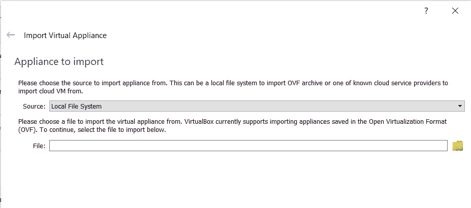

现在，LAPP 设备已经为一个虚拟机进行了预配置，该虚拟机将驻留在一个服务器上，私有网络上的许多用户都可以访问该服务器。

但是，要设置 LAPP 设备仅供个人使用(例如笔记本电脑)，并在访问或不访问网络的情况下工作，需要调整默认配置。

启动虚拟机之前，将 Virtualbox 网络从桥接更改为 NAT:

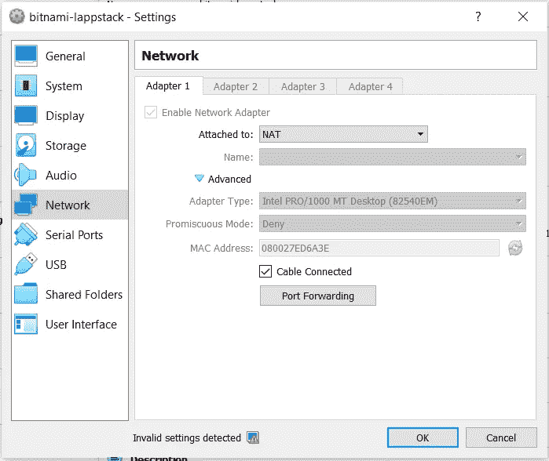

还将本地端口转发设置为:

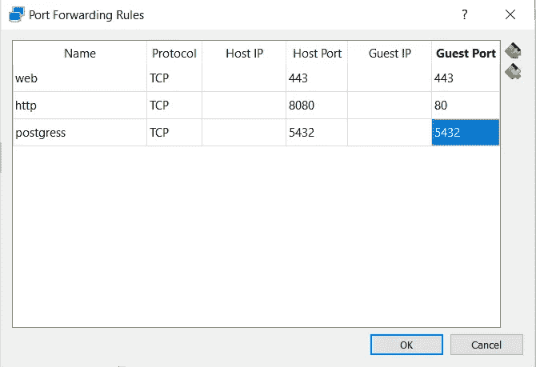

现在我们已经准备好启动设备了。

**启动并测试 LAPP 设备**

启动设备，使用用户名 bitnami 和密码 bitnami 登录。

还要快速验证网络地址:

```
$ sudo ifconfig -a
```

在我的实例中，我得到一个 IP 地址 10.0.2.15。

正在使用本地端口转发，因此要测试设备的启动页面，请在浏览器中使用 8080 端口:

```
[http://127.0.0.1:8080/](http://127.0.0.1:8080/)
```

您应该会看到以下启动页面:


创建以下文件*/opt/bitnami/Apache 2/htdocs/phptest . PHP*，内容为:

```
<?php phpinfo(); ?>
```

然后，您将能够显示 phptest 启动页面:

```
[http://127.0.0.1:8080/phptest.php](http://127.0.0.1:8080/phptest.php)
```

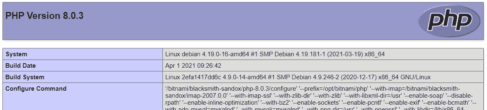

**启用对设备的远程访问**

要远程访问 PostgreSQL 数据库，需要打开防火墙端口。显示现有打开的端口，带有:

```
$ sudo ufw status numbered
```

您应该会得到类似如下的输出:

```
Status: active To             Action    From
     --             ------    ----
[ 1] 80/tcp         ALLOW     Anywhere
[ 2] 443/tcp        ALLOW     Anywhere
[ 3] 22/tcp         ALLOW     Anywhere
```

现在打开为 PostgreSQL 分配的端口:

```
$ sudo ufw allow 5432/tcp
```

您还需要配置 PostgreSQL 监听器以允许远程登录。

将它添加到/opt/bitnami/PostgreSQL/conf/PostgreSQL . conf 文件中:

```
listen_addresses = '*'
```

我们必须允许从虚拟机的主机远程登录。

将这一行添加到/opt/bitnami/PostgreSQL/conf/pg _ HBA . conf 文件中:

```
# TYPE   DATABASE   USER       ADDRESS          METHOD
host     postgres   postgres   10.0.2.0/24      password
```

10.0.2.0/24 网络基于之前的 ifconfig 命令返回的 IP 地址。

**从主机使用 pgAdmin 测试远程登录**

现在使用 pgAdmin 管理工具来测试来自主机的远程登录。

从以下位置获取数据库的密码:

```
$ sudo cat /home/bitnami/bitnami_credentials
```

凭据将是主机名为 127.0.0.1、端口为 5432 的用户 postgres。

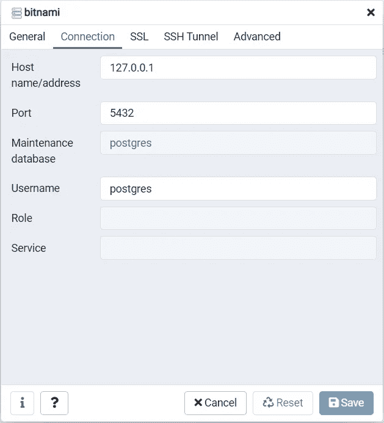

成功连接后，您应该会看到仪表板:

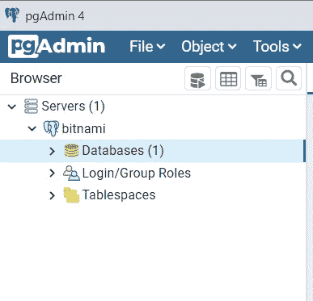

这证明我们可以从主机远程登录，并且从主机使用另一个工具也应该可以。

**使用 SQL Developer 从主机远程登录**

在尝试从 SQL Developer 连接到 PostgreSQL 之前，需要存在正确的 J 连接器(即 Java 文件)。

从以下位置下载 PostgreSQL 的 J 连接器:

【https://jdbc.postgresql.org/download.html 

适合您的环境的 jar 文件取决于您使用的 PostgreSQL 和 java 的版本，但是通常最新的版本就可以了。

下载正确的 J 连接器后，在 SQL Developer 中选择工具，然后选择首选项:

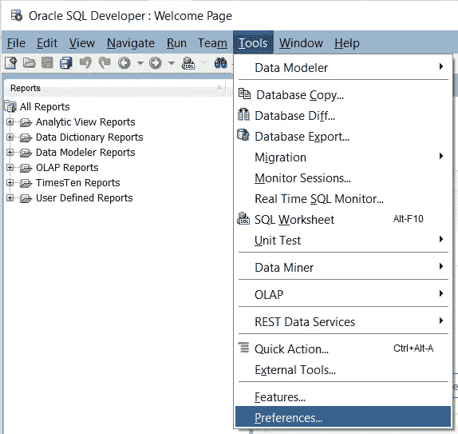

然后，在第三方 JDBC 驱动程序下，添加一个条目并选择您刚刚下载的 jar 文件。

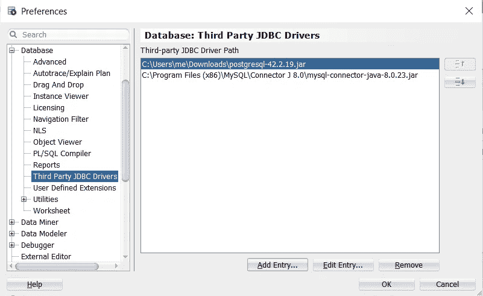

现在，您可以像以前一样使用相同的凭据登录—但这次是在 SQL Developer 中。

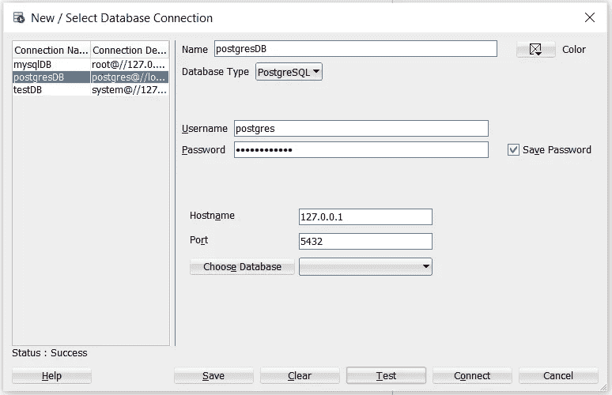

连接后，您将能够看到 PostgreSQL 数据库的仪表板:

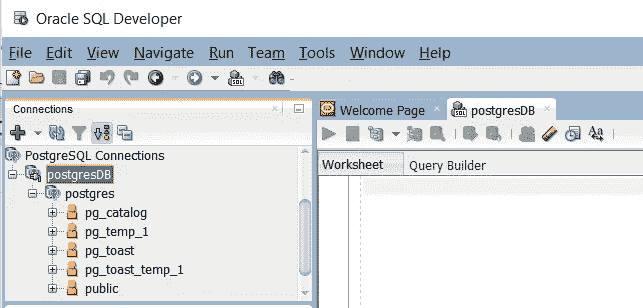

对于到 Oracle 云的迁移，我们需要建立到 Oracle 自治数据库的连接。

下载 Oracle 自治数据库实例的云钱包。

云钱包拥有所有基础设施连接的详细信息，因此我们将使用这个文件和 Oracle 自治数据库的管理员密码。

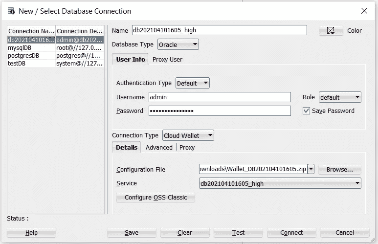

如果一切顺利，您将看到 Oracle 自治数据库的仪表板。

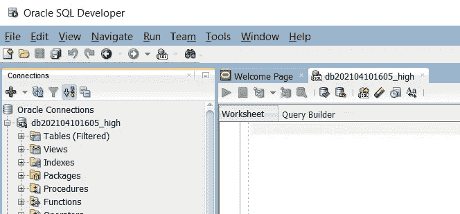

您还将看到 SQL Developer 能够同时管理到 PostgreSQL 和 Oracle 自治数据库的连接。

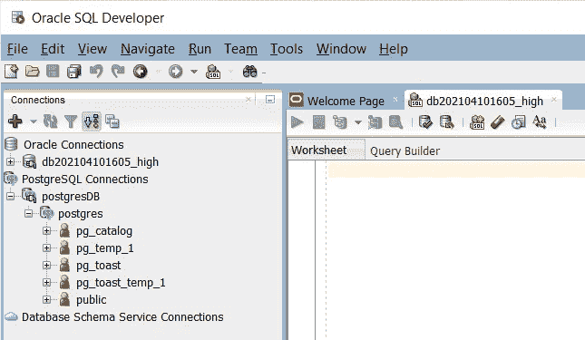

您可以选择 SQL Developer 来帮助您将第三方数据库迁移到 Oracle 自治数据库。

有问题吗？加入我们的公共休闲活动并提出问题！

Paul Guerin 是一名专注于 Oracle 数据库的国际顾问。Paul 在东南亚的全球交付中心工作，但他的客户来自澳大利亚、欧洲、亚洲和北美。此外，他还出席了一些世界领先的甲骨文会议，包括甲骨文 2013 年世界开放大会。自 2015 年以来，他的工作一直是 IOUG 最佳实践技巧小册子以及 AUSOUG、Oracle Technology Network、Quest 和 Oracle Developers (Medium)出版物的主题。2019 年，他被授予 My Oracle 支持社区最有价值贡献者。他是一名 DBA OCP，并将继续参与 Oracle ACE 计划。