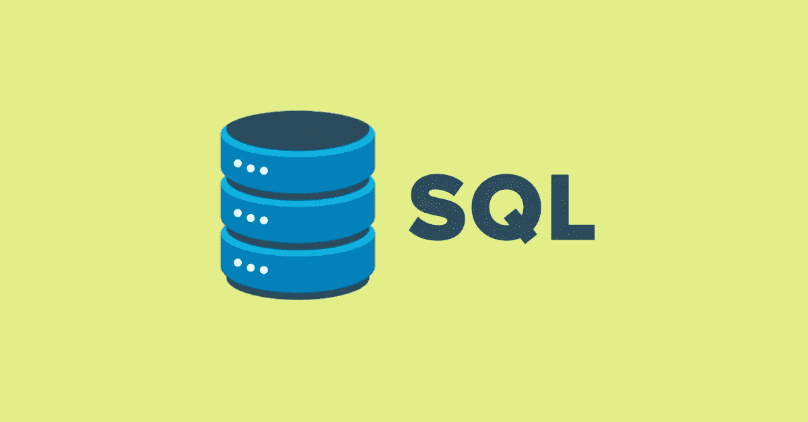

# SQL 开发—学习指南

> 原文：<https://medium.com/quick-code/sql-development-learning-guide-2788e69fd7a4?source=collection_archive---------0----------------------->

SQL 于 1974 年首次出现，是与 C、C++和 Java 齐名的另一种编程语言。它是由 Donald D. Chamberlin 和 Raymond F Boyce 为 IBM 的 RDBMS 或关系数据库管理系统开发的。尽管不同的公司，如 IBM、微软、甲骨文都有自己的 SQL 版本。几十年来，它已经被证明是使用最广泛、最灵活的语言之一。SQL 的统一采用非常受欢迎，即使在大数据和 NoSQL 数据库时代，中央命令和概念也是一样的。

## 工作机会

对于 SQL 这样的技能来说，这是一个悖论。虽然只把 SQL 作为一项技能的工作机会已经有点减少，但 SQL 是几乎任何编程和分析工作都需要的最常见的技能。一个看看我们不同的学习路径，或任何技术、数据科学和分析相关工作的工作要求；您会看到 SQL 是每个级别都列出的技能。

因此，你可能需要这条学习路径来为你可能瞄准的另一份工作规划你的 SQL 学习。不过，如果这是你真正感兴趣的东西，那么你可以专攻数据库管理和架构，目标是核心数据库和 SQL 相关的工作。

现在，让我们开始学习 SQL 开发

## SQL 开发中涉及的初学者主题[第 1-4 天]

1.  了解数据库，表
2.  理解关系数据库
3.  数据库中的实体关系逻辑，SQL 模式
4.  下载和安装数据库，配置您选择的数据库(Oracle、Microsft、IBM)
5.  数据类型，主键，外键，规范化
6.  SQL 语句基础，选择语句，列别名
7.  相异和串联运算符、算术运算、空值
8.  使用 Where 子句、比较运算符

 [## 95 折- SQL 初学者课程:使用 MySQL 数据库学习 SQL-Udemy 优惠券

### 使用 MySQL 数据库从头开始学习 SQL，这是一个针对初学者的完整 SQL 课程

www.quickcode.co](https://www.quickcode.co/free/course/learn/SQL-Course-For-Beginners--Learn-SQL-Using-MySQL-Database/3296?utm_source=mediumPub&utm_medium=social&utm_campaign=mediumPub&utm_term=LG_SQL_Pankaj) 

## 中级主题-我将在 SQL 中介绍[第 5-8 天]

1.  用方法处理 REACT 事件
2.  BETWEEN、IN、LIKE 是空运算符
3.  逻辑运算符和优先规则
4.  ORDER By 子句，ASC 和 DESC，先空后空
5.  单行函数、字符函数
6.  数字函数、嵌套函数、日期函数和运算
7.  转换函数(到字符、到日期、合并)
8.  条件函数

 [## SQL -初学者完整课程-免费在线课程|快速代码

### 在本课程中，我们将学习数据库管理基础知识和使用 MySQL RDBMS 的 SQL。

www.quickcode.co](https://www.quickcode.co/free/course/learn/SQL---Full-course-for-beginners/3137?utm_source=mediumPub&utm_medium=social&utm_campaign=mediumPub&utm_term=LG_SQL_Pankaj) 

## 中级主题-将在 SQL 中涵盖的 II[第 9-13 天]

1.  分组函数(平均值、计数、最大值、最小值、总和)
2.  数据分组(GroupBy、Having、嵌套分组)
3.  连接表-使用，ON 子句
4.  多重连接，受限连接
5.  连接-自身、外部、左侧外部、右侧外部、完全外部、交叉
6.  子查询-单行和多行
7.  集合运算符-并集、并集、交集、减集
8.  DML 语句-插入、更新、删除、提交、回滚
9.  DDL 语句-创建、更改、删除、截断表
10.  约束-唯一键、主键、外键、非空、检查

 [## 95 折- SQL 教程:用 MySQL 数据库学习 SQL-beginner 2 expert-Udemy 优惠券

### 学习 SQL 和数据库开发，以便在数据库管理系统中有效地工作，如 MySQL、SQL Server、Oracle、PostgreSQL、DB2 等。

www.quickcode.co](https://www.quickcode.co/free/course/learn/SQL-Tutorial--Learn-SQL-with-MySQL-Database--Beginner2Expert/3292?utm_source=mediumPub&utm_medium=social&utm_campaign=mediumPub&utm_term=LG_SQL_Pankaj) 

## SQL 中涵盖的高级主题或专业[第 14–20 天]

1.  SSRS- SQL Server 报告服务
2.  数据仓库和 SQL Server 分析服务- SSAS
3.  SQL 分析服务
4.  数据库体系结构

 [## skillshare 免费课程-带实时项目和安置服务的 SQL Server 培训

### 获得以下所有好处:SQL Server 培训 SQL DBA 培训 MSBI / SSIS 培训 MSBI / SSAS 培训…

www.quickcode.co](https://www.quickcode.co/free/course/learn/SQL-Server-Training-with-Real-time-Project---Placement-Services-/1862?utm_source=mediumPub&utm_medium=social&utm_campaign=mediumPub&utm_term=LG_SQL_Pankaj) 

## 互补技能

SQL 可能是使用最广泛的补充技能。因此，你可能会学习 SQL 来补充其他一些基本技能，从编程到分析再到大数据。然而，如果你真的想专攻 SQL，那么你可以专注于学习数据库管理和企业架构的复杂性。我们可以在这里列出一些，但是，它们是成熟的专业学习，不太像补充技能。如果我们有足够的兴趣，以后我们可能会找到一条学习数据库架构的道路。

## 具有 SQL 技能的热门职位

1.  SQL 开发人员
2.  商业智能开发人员
3.  商业智能分析师
4.  SQL 分析师
5.  Oracle 开发人员
6.  数据库管理员

**结论**

这就结束了 SQL 开发的学习之路。我们希望这条学习路径对您有所帮助。如果有任何进一步的问题或反馈，请在这里告诉我们，QuickCode 团队将在这里帮助您满足学习需求。

*原载于 2019 年 3 月 20 日*[*【www.quickcode.co*](https://www.quickcode.co/learning-guide/learn-sql-guide)*。*