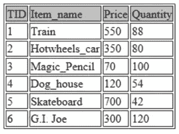

# 面向数据科学的 SQL 面向初学者的一站式解决方案

> 原文：<https://medium.com/edureka/sql-for-data-science-a8fe10fe2ef9?source=collection_archive---------3----------------------->


SQL For Data Science — Edureka

自从数据科学被评为这个时代最有前途的工作以来，我们都在努力加入学习数据科学的竞赛。这篇关于 SQL for Data Science 的博客文章将帮助您理解如何使用 SQL 来存储、访问和检索数据以执行数据分析。

以下是本博客将涵盖的主题列表:

1.  数据科学为什么需要 SQL？
2.  什么是 SQL？
3.  SQL 基础知识
4.  安装 MySQL
5.  亲自动手

# 数据科学为什么需要 SQL？

您知道我们每天生成超过 25 万亿字节的数据吗？这种数据生成的速度是数据科学、人工智能、机器学习等高端技术流行的原因。

从数据中获得有用的见解被称为数据科学。数据科学涉及提取、处理和分析大量数据。目前我们需要的是能够用来存储和管理这些海量数据的工具。


这就是 SQL 的用武之地。

SQL 可以用来存储、访问和提取海量数据，以便更顺利地进行整个数据科学过程。

# 什么是 SQL？

SQL 代表结构化查询语言，是一种旨在管理关系数据库的查询语言。

但是什么是关系数据库呢？

关系数据库是一组定义明确的表，从这些表中可以访问、编辑、更新数据等等，而不必改变数据库表。SQL 是关系数据库的标准(API)。

回到 SQL，SQL 编程可用于对数据执行多种操作，如查询、插入、更新、删除数据库记录。使用 SQL 的关系数据库的例子包括 MySQL 数据库、Oracle 等。

在开始演示 SQL 之前，让我们先熟悉一下基本的 SQL 命令。

# SQL 基础知识

SQL 提供了一组简单的命令来修改数据表，让我们来看看一些基本的 SQL 命令:

*   创建数据库— *创建一个新的数据库*
*   创建表格— *创建一个新表格*
*   插入到— *将新数据插入数据库*
*   选择— *从数据库中提取数据*
*   更新— *更新数据库中的数据*
*   删除— *从数据库中删除数据*
*   更改数据库— *修改数据库*
*   更改表格— *修改表格*
*   删除表格— *删除表格*
*   创建索引— *创建一个索引来搜索一个元素*
*   删除索引— *删除索引*

为了更好地理解 SQL，让我们安装 MySQL，看看如何处理数据。

# 安装 MySQL

安装 MySQL 是一项简单的任务。这里有一个[逐步指南](https://www.edureka.co/blog/install-mysql?utm_source=medium&utm_medium=content-link&utm_campaign=sql-for-data-science)，它将帮助你在你的系统上安装 MySQL。

一旦你完成了 MySQL 的安装，按照下面一节的简单演示，它将向你展示如何插入、操作和修改数据。

# **面向数据科学的 SQL—MySQL 演示**

在本演示中，我们将了解如何创建和处理数据库。这是一个初级演示，让您开始使用 SQL 进行数据分析。

所以让我们开始吧！

**第一步:创建一个 SQL 数据库**

SQL 数据库是一个存储仓库，数据可以以结构化格式存储在其中。现在让我们使用 MySQL 创建一个数据库:

```
CREATE DATABASE edureka; 
USE edureka;
```

在上面的代码中，有两个 SQL 命令:

**注** : SQL 命令用大写字母定义，分号用于终止 SQL 命令。

1.  **创建数据库:**该命令创建一个名为“edureka”的数据库
2.  **用途:**该命令用于激活数据库。在这里，我们正在激活“edureka”数据库。

## **第二步:创建一个包含所需数据特征的表格**

创建表就像创建数据库一样简单。您只需用各自的数据类型定义变量或表的特性。让我们来看看如何做到这一点:

```
CREATE TABLE toys (TID INTEGER NOT NULL PRIMARY KEY AUTO_INCREMENT, Item_name TEXT, Price INTEGER, Quantity INTEGER);
```

在上面的代码片段中，发生了以下事情:

1.  使用“创建表格”命令创建一个名为“玩具”的表格。
2.  玩具表包含 4 个特征，即 TID(交易 ID)、项目名称、价格和数量。
3.  每个变量都用各自的数据类型定义。
4.  TID 变量被声明为主键。主键基本上表示可以存储唯一值的变量。

您可以使用以下命令进一步检查已定义表的详细信息:

```
DESCRIBE toys;
```


## **第三步:将数据插入表格**

现在我们已经创建了一个表，让我们用一些值填充它。在这篇博客的前面，我提到了如何通过使用一个命令，即 INSERT INTO，将数据添加到一个表中。

让我们看看这是如何做到的:

```
INSERT INTO toys VALUES (NULL, "Train", 550, 88);
INSERT INTO toys VALUES (NULL, "Hotwheels_car", 350, 80);
INSERT INTO toys VALUES (NULL, "Magic_Pencil", 70, 100);
INSERT INTO toys VALUES (NULL, "Dog_house", 120, 54);
INSERT INTO toys VALUES (NULL, "Skateboard", 700, 42);
INSERT INTO toys VALUES (NULL, "G.I. Joe", 300, 120);
```

在上面的代码片段中，我们简单地使用 INSERT INTO 命令将 6 个观察值插入到“toys”表中。对于每个观察值，在括号中，我指定了创建表时定义的每个变量或特性的值。

TID 变量被设置为空，因为它从 1 开始自动递增。

现在让我们显示表中的所有数据。这可以通过使用以下命令来完成:

```
SELECT * FROM toys;
```



## **第四步:修改数据条目**

假设你决定提高特种部队的价格，因为它为你带来了很多顾客。如何更新数据库中变量的价格？

很简单，只需使用下面的命令:

```
UPDATE toys SET Price=350 WHERE TID=6;
```

UPDATE 命令允许您修改表中存储的任何值/变量。SET 参数允许您选择一个特定的特性，WHERE 参数用于标识您想要更改的变量/值。在上面的命令中，我已经更新了 TID 为 6 的数据条目的价格。

现在让我们来查看更新后的表格:

```
SELECT * FROM toys;
```


您还可以通过引用您想要查看的列来修改您想要显示的内容。例如，below 命令将只显示玩具的名称及其各自的价格:

```
SELECT Item_name, Price FROM toys;
```


## **第五步:检索数据**

所以在插入数据并对其进行修改之后，最后是根据业务需求提取和检索数据的时候了。这是可以为进一步的数据分析和数据建模检索数据的地方。

请注意，这是一个让您开始使用 SQL 的简单示例，但是，在真实的场景中，数据要复杂得多，而且规模也大得多。尽管如此，SQL 命令仍然保持不变，这就是 SQL 如此简单易懂的原因。它可以用一组简单的 SQL 命令处理复杂的数据集。

现在让我们通过一些修改来检索数据。参考下面的代码，在不看输出的情况下，试着理解它做了什么:

```
SELECT * FROM toys LIMIT 2;
```

你猜对了！它显示了我的表中出现的前两个观察结果。


让我们试试更有趣的东西。

```
SELECT * FROM toys ORDER BY Price ASC;
```


如图所示，这些值按照价格变量的升序排列。如果你想找三个最常买的物品，你会怎么做？

真的很简单！

```
SELECT * FROM toys ORDER BY Quantity DESC LIMIT 3;
```


让我们再试一次。

```
SELECT * FROM toys WHERE Price > 400 ORDER BY Price ASC;
```


这就是你使用 SQL 处理数据的方式。如果你想查看更多关于人工智能、DevOps、道德黑客等市场最热门技术的文章，那么你可以参考 [Edureka 的官方网站。](https://www.edureka.co/blog/?utm_source=medium&utm_medium=content-link&utm_campaign=sql-for-data-science)

请留意本系列中的其他文章，它们将解释 SQL 的各个方面。

> *1。*[*SQL 之间的差异& NoSQL 数据库*](/edureka/sql-vs-nosql-db-5d9b69ace6ac)
> 
> *2。* [*甲骨文面试前 50 题*](/edureka/oracle-interview-and-answers-d1a99534e2d0)
> 
> [*3。前 65 个 SQL 面试问题*](/edureka/sql-interview-questions-162f97f37ac2)

*原载于 2019 年 8 月 13 日*[*【https://www.edureka.co】*](https://www.edureka.co/blog/sql-for-data-science/)*。*