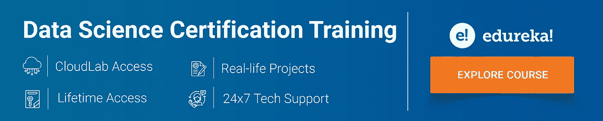
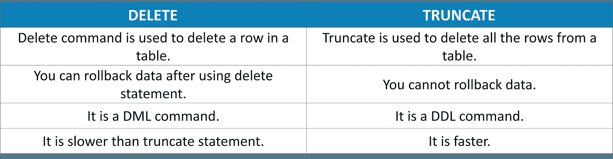
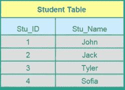
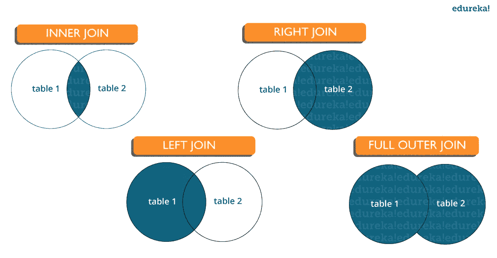

# 2021 年你必须准备的 65 个 SQL 面试问题

> 原文：<https://medium.com/edureka/sql-interview-questions-162f97f37ac2?source=collection_archive---------1----------------------->



RDBMS 是迄今为止最常用的数据库之一，因此 ***SQL 技能*** 在大多数工作角色中是不可或缺的。在这篇 SQL 面试问题文章中，我将向您介绍关于 SQL(结构化查询语言)的最常见问题。这个博客是你学习与 SQL、Oracle、MS SQL Server 和 MySQL 数据库相关的所有概念的完美指南。

我们的 SQL 面试问题博客是*一站式资源*，在这里你可以提高你的面试准备。它有一套**前 65 个问题**，面试官打算在面试过程中问这些问题。它从基本的 SQL 面试问题开始，然后根据您的讨论和回答继续深入提问。这些 SQL 面试问题将帮助不同专业水平的您从本文中获得最大收益。

我们开始吧！

# SQL 面试问题

## Q1。DELETE 和 TRUNCATE 语句有什么区别？



## Q2。SQL 有哪些不同的子集？

*   *DDL(数据定义语言)* —它允许您对数据库执行各种操作，如创建、更改和删除对象。
*   *DML(数据操作语言)* —它允许你访问和操作数据。它帮助你插入，更新，删除和检索数据库中的数据。
*   *DCL(数据控制语言)* —它允许您控制对数据库的访问。示例—授予、撤销访问权限。

## Q3。DBMS 是什么意思？它有哪些不同的类型？


数据库是数据的结构化集合。

**数据库管理系统** ( **DBMS** )是一个软件应用程序，它与用户、应用程序和数据库本身进行交互，以捕获和分析数据。

DBMS 允许用户与数据库交互。存储在数据库中的数据可以被修改、检索和删除，并且可以是任何类型，如字符串、数字、图像等。

有两种类型的 DBMS:

*   ***关系数据库管理系统* :** 数据存储在关系(表)中。例如 MySQL。
*   ***非关系型数据库管理系统* :** 没有关系、元组、属性的概念。示例— MongoDB

## Q4。SQL 中的表和字段是什么意思？

表格是指以行和列的形式有组织地收集数据。字段是指表中的列数。例如:

***表*** :学生信息
***字段*** :学生 Id，学生名称，学生标志

## Q5。什么是 SQL 中的连接？

JOIN 子句用于根据两个或多个表之间的相关列来组合它们中的行。它用于合并两个表或从中检索数据。SQL 中有 4 个连接，即:

*   内部连接
*   右连接
*   左连接
*   完全连接

## Q6。SQL 中 CHAR 和 VARCHAR2 数据类型有什么区别？

char 和 Varchar2 都用于字符数据类型，但 varchar2 用于可变长度的字符串，而 Char 用于固定长度的字符串。例如，char(10)只能存储 10 个字符，并且不能存储任何其他长度的字符串，而 varchar2(10)可以在此变量中存储任何长度，即 6，8，2。

## Q7。主键是什么？



*   主键是唯一标识表中每一行的一列(或列的集合)或一组列。
*   唯一标识表中的单个行
*   不允许空值

示例-在学生表中，Stu_ID 是主键。

## Q8。什么是约束？

约束用于指定表的数据类型的限制。它可以在创建或修改 table 语句时指定。约束的示例有:

*   不为空
*   支票
*   系统默认值
*   独一无二的
*   主关键字
*   外键

## Q9。SQL 和 MySQL 有什么区别？

SQL 是一种标准语言，代表基于英语的结构化查询语言，而 MySQL 是一种数据库管理系统。SQL 是关系数据库的核心，用于访问和管理数据库，MySQL 是 RDMS(关系数据库管理系统),如 SQL Server、Informix 等。

## Q10。什么是唯一键？

*   唯一标识表中的单个行。
*   每个表允许多个值。
*   允许空值。

## Q11。什么是外键？

*   外键通过强制两个表中的数据之间的链接来维护引用完整性。
*   子表中的外键引用父表中的主键。
*   外键约束防止会破坏子表和父表之间链接的操作。

## Q12。你说的数据完整性是什么意思？

数据完整性定义了存储在数据库中的数据的准确性和一致性。它还定义了完整性约束，以便在数据进入应用程序或数据库时对数据实施业务规则。

## Q13。SQL 中聚集索引和非聚集索引有什么区别？

SQL 中聚集索引和非聚集索引的区别在于:

1.  聚集索引用于方便地从数据库中检索数据，速度较快，而从非聚集索引中读取相对较慢。
2.  聚集索引改变了记录在数据库中的存储方式，因为它按设置为聚集索引的列对行进行排序，而在非聚集索引中，它不改变记录的存储方式，而是在表中创建一个单独的对象，该对象在搜索后指向原始表行。
3.  一个表只能有一个聚集索引，而它可以有许多非聚集索引。

## Q14。编写一个 SQL 查询来显示当前日期？

在 SQL 中，有一个名为 GetDate()的内置函数，它有助于返回当前时间戳/日期。

## Q15。列出不同类型的连接

有各种类型的联接用于检索表之间的数据。有四种类型的连接，即:



*   **内连接:**MySQL 中的内连接是最常见的连接类型。它用于返回满足连接条件的多个表中的所有行。
*   **左连接:**MySQL 中的左连接用于返回左表中的所有行，但只返回右表中满足连接条件的匹配行。
*   **右连接:**MySQL 中的右连接用于返回右表中的所有行，但只返回左表中满足连接条件的匹配行。
*   **完全连接:**当任何一个表中有匹配项时，完全连接将返回所有记录。因此，它返回左侧表中的所有行和右侧表中的所有行。

## Q16。你说的反规范化是什么意思？

反规范化指的是一种用于从数据库的较高形式到较低形式访问数据的技术。它帮助数据库管理员提高整个基础设施的性能，因为它在表中引入了冗余。它通过合并数据库查询将不同表中的数据合并到一个表中，从而将冗余数据添加到一个表中。

## Q17。什么是实体和关系？

**实体**:现实世界中的一个人、一个地方或一件事物，其数据可以存储在数据库中。表存储代表一种实体类型的数据。例如，银行数据库有一个客户表来存储客户信息。Customer 表将这些信息存储为每个客户的一组属性(表中的列)。

**关系**:相互有关系的实体之间的关系或联系。例如，客户名称与客户帐号和联系信息相关，它们可能在同一个表中。不同的表之间也可以有关系(例如，客户到帐户)。

## Q18。什么是指数？

索引是一种性能调优方法，允许更快地从表中检索记录。索引为每个值创建一个条目，因此检索数据会更快。

## Q19。解释不同类型的索引。

有三种类型的索引，即:

**唯一索引:**

如果列是唯一索引的，此索引不允许字段有重复值。如果定义了主键，可以自动应用唯一索引。

**聚集索引:**

该索引对表的物理顺序进行重新排序，并基于键值进行搜索。每个表只能有一个聚集索引。

**非聚集索引:**

非聚集索引不会改变表的物理顺序，而是保持数据的逻辑顺序。每个表可以有许多非聚集索引。

## 问题 20。什么是正常化，它的优点是什么？

标准化是组织数据以避免重复和冗余的过程。一些优点是:

*   更好的数据库组织
*   更多行更小的表格
*   高效的数据访问
*   更大的查询灵活性
*   快速查找信息
*   更容易实现安全性
*   允许轻松修改
*   减少冗余和重复数据
*   更紧凑的数据库
*   确保修改后数据一致

## 问题 21。DROP 和 TRUNCATE 命令有什么区别？

DROP 命令删除表，并且不能从数据库回滚，而 TRUNCATE 命令删除表中的所有行。

## 问题 22。解释不同类型的规范化。

标准化有许多连续的层次。这些被称为**范式**。每个连续的范式都依赖于前一个范式。前三种范式通常就足够了。

*   ***第一范式(1NF)*** —行内无重复组
*   ***第二范式(2NF)*** —每个非键(支持)列值都依赖于整个主键。
*   ***第三范式(3NF)*** —只依赖主键，不依赖其他非键(支持)列值。

## 问题 23。什么是数据库中的 ACID 属性？

酸代表原子性、一致性、隔离性和持久性。它用于确保在数据库系统中可靠地处理数据事务。

*   **原子性:**原子性指的是完全完成或失败的事务，其中事务指的是数据的单个逻辑操作。这意味着，如果任何事务的一部分失败，整个事务都会失败，并且数据库状态保持不变。
*   **一致性:**一致性确保数据必须符合所有的验证规则。简而言之，您可以说您的事务在没有完成其状态之前不会离开数据库。
*   隔离:隔离的主要目标是并发控制。
*   **持久性:**持久性意味着，如果事务已经提交，它将会发生任何可能出现的情况，比如断电、崩溃或任何种类的错误。

## 问题 24。SQL 中的“触发器”是什么意思？

SQL 中的触发器是一种特殊类型的存储过程，被定义为就地或在数据修改后自动执行。它允许您在对特定表执行插入、更新或任何其他查询时执行一批代码。

## 问题 25。SQL 中有哪些不同的运算符？

SQL 中有三个可用的运算符，即:

1.  算术运算符
2.  逻辑运算符
3.  比较运算符

## 问题 26。空值与零或空格的值相同吗？

空值与零或空格完全不同。空值表示不可用、未知、已分配或不适用的值，而零是数字，空格是字符。

## Q27。交叉连接和自然连接有什么区别？

交叉连接产生两个表的叉积或笛卡儿积，而自然连接基于两个表中具有相同名称和数据类型的所有列。

## 问题 28。SQL 中的子查询是什么？

子查询是另一个查询中的一个查询，其中的查询被定义为从数据库中检索数据或信息。在子查询中，外部查询称为主查询，而内部查询称为子查询。子查询总是首先执行，子查询的结果传递给主查询。它可以嵌套在 SELECT、UPDATE 或任何其他查询中。子查询还可以使用任何比较运算符，如>、< or =.

## Q29\. What are the different types of subquery?

There are two types of subquery namely, Correlated and Non-Correlated.

*   **相关子查询**:这些查询从外部查询中引用的表中选择数据。它不被视为独立查询，因为它引用另一个表并引用表中的列。
*   **非相关子查询**:该查询是一个独立查询，子查询的输出被主查询所替代。

## Q30。列出获取表中记录数的方法？

要计算表中的记录数，可以使用以下命令:

```
SELECT * FROM table1
SELECT COUNT(*) FROM table1
SELECT rows FROM sysindexes WHERE id = OBJECT_ID(table1) AND indid < 2
```

## Q31。编写一个 SQL 查询来查找以“A”开头的雇员姓名？

要显示以“A”开头的员工姓名，请键入以下命令:

```
SELECT * FROM Table_name WHERE EmpName like 'A%'
```

## Q32。写一个 SQL 查询从 employee_table 中获取一个员工的第三高工资？

```
SELECT TOP 1 salary
FROM(
SELECT TOP 3 salary
FROM employee_table
ORDER BY salary DESC) AS emp
ORDER BY salary ASC;
```

## **Q33。SQL 中需要什么组函数？**

组函数作用于行集，并为每个组返回一个结果。一些常用的组函数有 AVG、计数、最大值、最小值、总和、方差。

## Q34。什么是关系，它们是什么？

关系或链接是指彼此有关系的实体之间的关系。关系被定义为数据库中表之间的连接。有各种关系，即:

*   一对一的关系。
*   一对多关系。
*   多对一关系。
*   自我参照关系。

## Q35。在插入数据时，如何在列中插入空值？

可以通过以下方式插入空值:

*   从列列表中省略列。
*   通过在 VALUES 子句中指定 NULL 关键字来显式定义

## Q36。“between”和“in”条件运算符的主要区别是什么？

BETWEEN 运算符用于根据行中的值范围显示行，而 in 条件运算符用于检查特定值集中包含的值。

**BETWEEN:**的例子

```
SELECT * FROM Students where ROLL_NO BETWEEN 10 AND 50;
```

**IN 的例子:**

```
SELECT * FROM students where ROLL_NO IN (8,15,25);
```

## **Q37。为什么使用 SQL 函数？**

SQL 函数用于以下目的:

*   对数据进行一些计算
*   要修改单个数据项
*   来操纵输出
*   格式化日期和数字
*   转换数据类型

## Q38。MERGE 语句的需求是什么？

该语句允许在表中有条件地更新或插入数据。如果存在行，则执行更新；如果不存在行，则执行插入。

## Q39。递归存储过程是什么意思？

递归存储过程指的是在到达某个边界条件之前自己调用的存储过程。这个递归函数或过程帮助程序员使用同一组代码 n 次。

## Q40。SQL 中的子句是什么？

SQL 子句通过为查询提供条件来帮助限制结果集。子句有助于从整组记录中筛选出行。

比如— WHERE，HAVING 子句。

## Q41。HAVING 从句和 WHERE 从句有什么区别？

HAVING 子句只能与 SELECT 语句一起使用。它通常用在 GROUP BY 子句中，每当不使用 GROUP BY 时，HAVING 的行为类似于 WHERE 子句。Having 子句仅与查询中的 GROUP BY 函数一起使用，而 WHERE 子句在每行成为查询中 GROUP BY 函数的一部分之前应用于每行。

## Q42。列出动态 SQL 的执行方式？

以下是执行动态 SQL 的方法:

*   编写一个带参数的查询。
*   使用 EXEC。
*   使用 sp_executesql。

## Q43。各种级别的约束是什么？

约束是一个列的表示，用于加强数据实体和一致性。有两个级别的约束，即:

*   列级约束
*   表级约束

## Q44。如何从两个表中获取公共记录？

您可以使用 INTERSECT 从两个表中提取公共记录。例如:

```
Select studentID from student INTERSECT Select StudentID from ExaM
```

## Q45。列举一些 SQL 中的 case 操作函数？

SQL 中有三个大小写操作函数，即:

*   **LOWER:** 这个函数返回小写的字符串。它将一个字符串作为参数，并通过将其转换为小写来返回它。语法:

```
LOWER('string')
```

*   **UPPER:** 这个函数返回大写的字符串。它将一个字符串作为参数，并通过将其转换为大写形式来返回它。语法:

```
UPPER('string'
```

*   **INITCAP:** 这个函数返回第一个字母大写，其余字母小写的字符串。语法:

```
INITCAP(‘string’)
```

## Q46。SQL 中有哪些不同的集合运算符？

一些可用的集合运算符是并集、交集或减运算符。

## Q47。什么是别名命令？

任何表或列都可以有别名。可以在 WHERE 子句中引用此别名来标识特定的表或列。

比如说-

```
Select emp.empID, dept.Result from employee emp, department as dept where emp.empID=dept.empID
```

在上面的例子中，emp 指的是雇员表的别名，dept 指的是部门表的别名。

## Q48。什么是聚合函数和标量函数？

聚合函数用于评估数学计算并返回单个值。这些计算是根据表中的列进行的。例如- max()，count()是相对于数值计算的。

标量函数基于输入值返回单个值。例如— UCASE()、NOW()是根据字符串计算的。

## Q49。如何从表中获取备用记录？

您可以获取交替记录，即奇数和偶数行号。例如，要显示偶数，请使用以下命令:

Select student id from(Select rowno，studentId from student)其中 mod(rowno，2)=0

现在，要显示奇数:

```
Select studentId from (Select rowno, studentId from student) where mod(rowno,2)=1
```

## **Q50。请说出模式匹配查询中使用的运算符。**

LIKE 运算符用于模式匹配，它可以用作-。

1.  % —匹配零个或多个字符。

例如-select * from studentname 类似于“a%”的学生

_(下划线)—它只匹配一个字符。例如- select * from student，其中 studentname 类似于“abc_”

## Q51。如何从表中选择唯一的记录？

您可以使用 DISTINCT 关键字从表中选择唯一的记录。

```
Select DISTINCT studentID from Student
```

使用这个命令，它将从表 student 中打印出唯一的学生 id。

## Q52。如何获取字符串的前 5 个字符？

从字符串中获取字符有很多种方法。例如:

```
Select SUBSTRING(StudentName,1,5) as studentname from student
```

## Q53。SQL 和 PL/SQL 的主要区别是什么？

SQL 是一种查询语言，允许您发出单个查询或执行单个插入/更新/删除，而 PL/SQL 是 Oracle 的“过程语言”SQL，允许您编写完整的程序(循环、变量等)。)来完成多个操作，例如选择/插入/更新/删除。

## Q54。什么是视图？

视图是一个虚拟表，由表中包含的数据子集组成。因为视图不存在，所以它占用较少的存储空间。视图可以组合一个或多个表的数据，这取决于关系。

## Q55。视图是用来做什么的？

视图是指基于表或其他视图的逻辑快照。使用它的原因如下:

*   限制数据访问。
*   让复杂的查询变得简单。
*   确保数据独立性。
*   提供相同数据的不同视图。

## Q56。什么是存储过程？

存储过程是一个由许多 SQL 语句组成的函数，用于访问数据库系统。几个 SQL 语句被整合到一个存储过程中，并在需要时随时随地执行它们，这样可以节省时间并避免重复编写代码。

## Q57。列举存储过程的一些优点和缺点

**优点:**

存储过程可以用作模块化编程，这意味着创建一次，存储并在需要时调用多次。这支持更快的执行。它还减少了网络流量，并为数据提供了更好的安全性。

**缺点:**

存储过程的唯一缺点是它只能在数据库中执行，并且会占用数据库服务器中更多的内存。

## Q58。列出所有类型的用户自定义函数？

有三种类型的用户定义函数，即:

*   标量函数
*   内联表值函数
*   多语句值函数

标量返回单位，变量定义 return 子句。其他两种类型的已定义函数返回表。

## Q59。你说的整理是什么意思？

归类被定义为一组规则，这些规则决定了如何对数据进行排序和比较。使用定义正确字符序列的规则以及指定区分大小写、字符宽度等选项对字符数据进行排序。

## Q60。有哪些不同类型的排序规则敏感性？

以下是不同类型的排序规则敏感度:

*   区分大小写
*   假名敏感性
*   宽度敏感性
*   重音敏感性

## Q61。什么是局部变量和全局变量？

**局部变量:**

这些变量只能在函数内部使用或存在。这些变量不被任何其他函数使用或引用。

**全局变量:**

这些变量是可以在整个程序中访问的变量。无论何时调用该函数，都不能创建全局变量。

## Q62。什么是 SQL 中的自动增量？

Autoincrement 关键字允许用户创建一个唯一的数字，每当有新记录插入到表中时就会生成这个数字。每当使用主键时，通常都需要该关键字。

AUTOINCREMENT 关键字可用于 Oracle，IDENTITY 关键字可用于 SQL SERVER。

## Q63。什么是数据仓库？

数据仓库指的是数据的中央存储库，其中的数据是从多个信息源收集的。这些数据经过整合、转换，可用于挖掘和在线处理。仓库数据还有一个称为数据集市的数据子集。

## Q64。SQL Server 中有哪些不同的身份验证模式？怎么改？

Windows 模式和混合模式— SQL 和 Windows。您可以转到以下步骤来更改 SQL Server 中的身份验证模式:

*   单击开始>程序> Microsoft SQL Server，然后单击 SQL 企业管理器，从 Microsoft SQL Server 程序组运行 SQL 企业管理器。
*   然后从“工具”菜单中选择服务器。
*   选择“SQL Server 配置属性”,然后选择“安全”页。

## Q65。什么是填充和替换功能？

**填充功能**:该功能用于覆盖现有字符或将一个字符串插入另一个字符串。语法:

```
STUFF(string_expression,start, length, replacement_characters)
```

在哪里，

*   *string_expression* :需要替换字符的字符串
*   *开始:*这是开始的位置
*   *length* :字符串中被替换的字符数。
*   *replacement_string* :注入字符串的新字符。

**替换功能**:该功能用于替换所有出现的已有字符。语法:

```
REPLACE (string_expression, search_string, replacement_string)
```

这里，string_expression 中的每个 search_string 都将被替换为 replacement_string。

这就把我们带到了 SQL 面试问题文章的结尾。我希望这一套 SQL 面试问题能帮助你在求职面试中胜出。**祝你面试顺利！**如果你想查看更多关于人工智能、DevOps、道德黑客等市场最热门技术的文章，你可以参考 [Edureka 的官方网站。](https://www.edureka.co/blog/?utm_source=medium&utm_medium=content-link&utm_campaign=sql-interview-questions)

请留意本系列中的其他文章，它们将解释 SQL 的各个方面。

> *1。*[*SQL 的区别& NoSQL 数据库*](/edureka/sql-vs-nosql-db-5d9b69ace6ac)
> 
> *2。* [*甲骨文面试前 50 题*](/edureka/oracle-interview-and-answers-d1a99534e2d0)
> 
> *3。*[*SQL For Data Science*](/edureka/sql-for-data-science-a8fe10fe2ef9)

*原载于*[*https://www.edureka.co*](https://www.edureka.co/blog/interview-questions/sql-interview-questions)*。*