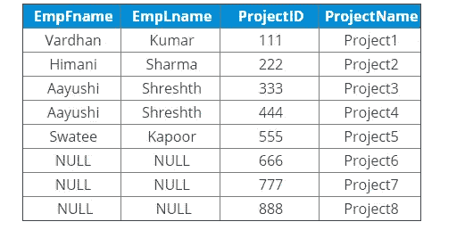

# 了解 SQL 连接—关于 SQL 连接您需要知道的一切

> 原文：<https://medium.com/edureka/sql-joins-db6e76effac1?source=collection_archive---------1----------------------->


结构化查询语言(也称为 SQL)是关系数据库的核心，在它的帮助下我们可以处理数据。它为我们提供了各种功能，如触发器、注入、托管和连接，这只是 SQL 中最重要的概念之一。在这篇关于 SQL 连接的文章中，我将讨论 SQL 中使用的各种类型的连接。

本文将涵盖以下主题:

1.  什么是联接？

2.SQL 中有多少种联接类型？

3.我如何知道在 SQL 中使用哪个连接

*   内部连接
*   完全连接
*   左连接
*   右连接

4.关于联接的最常见问题

# 什么是联接？

SQL 中的联接是用于根据两个或多个表之间的相关列来组合这些表中的行的命令。当用户试图从具有一对多或多对多关系的表中提取数据时，主要使用。

现在，您已经知道了联接的含义，接下来让我们学习不同类型的联接。

# SQL 中有多少种联接类型？

主要有四种类型的连接需要理解。它们是:

*   内部连接
*   完全连接
*   左连接
*   右连接

你可以参考下图。


# 我如何知道在 SQL 中使用哪个连接？

让我们逐一研究一下。为了让您更好地理解这个概念，我将考虑下面三个表，向您展示如何在这些表上执行连接操作。


# 内部连接

这种类型的联接返回那些在两个表中都有匹配值的记录。因此，如果您在 Employee 表和 Projects 表之间执行内部连接操作，那么在这两个表中具有匹配值的所有元组都将作为输出给出。

```
SELECT Table1.Column1,Table1.Column2,Table2.Column1,....
FROM Table1
INNER JOIN Table2
ON Table1.MatchingColumnName = Table2.MatchingColumnName;SELECT Employee.EmpID, Employee.EmpFname, Employee.EmpLname, Projects.ProjectID, Projects.ProjectName FROM Employee INNER JOIN Projects ON Employee.EmpID=Projects.EmpID;
```

示例:

`SELECT Employee.EmpID, Employee.EmpFname, Employee.EmpLname, Projects.ProjectID, Projects.ProjectName
FROM Employee
INNER JOIN Projects ON Employee.EmpID=Projects.EmpID;`


# 完全连接

完全联接或完全外联接返回在左表(表 1)或右表(表 2)中匹配的所有记录。

## 语法:

```
SELECT Table1.Column1,Table1.Column2,Table2.Column1,....
FROM Table1 FULL JOIN Table2 ON Table1.MatchingColumnName = Table2.MatchingColumnName;
```

## 示例:

```
SELECT Employee.EmpFname, Employee.EmpLname, Projects.ProjectID
FROM Employee
FULL JOIN Projects
ON Employee.EmpID = Projects.EmpID;
```


# 左连接

LEFT JOIN 或 LEFT OUTER JOIN 返回左表中的所有记录以及右表中满足条件的记录。此外，对于右表中没有匹配值的记录，输出或结果集将包含空值。

## 语法:

```
SELECT Table1.Column1,Table1.Column2,Table2.Column1,....
FROM Table1
LEFT JOIN Table2
ON Table1.MatchingColumnName = Table2.MatchingColumnName;
```

## 示例:

```
SELECT Employee.EmpFname, Employee.EmpLname, Projects.ProjectID, Projects.ProjectName FROM Employee LEFT JOIN ON Employee.EmpID = Projects.EmpID ;
```

## 输出:


# 右连接

右连接或右外连接返回右表中的所有记录，以及满足左表中某个条件的记录。此外，对于左侧表中没有匹配值的记录，输出或结果集将包含空值。

## 语法:

```
SELECT Table1.Column1,Table1.Column2,Table2.Column1,....
FROM Table1
RIGHT JOIN Table2
ON Table1.MatchingColumnName = Table2.MatchingColumnName;
```

## 示例:

```
SELECT Employee.EmpFname, Employee.EmpLname, Projects.ProjectID, Projects.ProjectName
FROM Employee
RIGHT JOIN
ON Employee.EmpID = Projects.EmpID;
```

## 输出:



现在，让我们继续本文的下一部分，即在您的访谈中关于 SQL 连接的最常见问题。

# 关于联接的最常见问题

## 问题 1:什么是自然连接，在什么情况下使用自然连接？

自然连接也是一种连接操作，用于根据两个表中的列提供输出，这种连接操作必须在两个表之间实现。为了理解使用自然联接的情况，您需要理解自然联接和内部联接之间的区别。

自然联接和内部联接的主要区别取决于返回的列数。例如，参见下文。


现在，如果对这两个表应用内部连接，您将看到如下输出:


如果在上面两个表上应用自然连接，输出将如下所示:


## 问题 2:如何使用连接映射多对多关系？

要使用连接映射多对多关系，您需要使用两个连接语句。

例如，如果我们有三个表(员工、项目和技术)，让我们假设每个员工都在一个项目上工作。因此，一个项目不能分配给一个以上的员工。所以，这基本上是一对多的关系。

现在，类似地，如果你考虑到，一个项目可以基于多种技术，任何技术都可以在多个项目中使用，那么这种关系就是多对多关系。

要对这种关系使用连接，您需要用两个外键来构建数据库。为此，您必须创建以下三个表:

*   项目
*   技术
*   项目到技术

project_to_technologies 表在每一行中都保存了项目技术的组合。此表将“项目”表中的项目映射到“技术”表中的项目，以便可以将多个项目分配给一项或多项技术。

一旦创建了表，就使用下面两个 JOIN 语句将上面所有的表链接在一起:

*   项目到技术到项目
*   项目对技术对技术

## 问题 3:什么是散列连接？

散列连接也是一种连接类型，用于连接大型表，或者在用户需要大部分连接的表行的情况下。

哈希连接算法是一个两步算法。请参考下面的步骤:

*   **构建阶段:**在左侧输入上创建一个内存中的散列索引
*   **探测阶段:**遍历右侧输入，每次遍历一行，使用上一步创建的索引找到匹配项。

## 问题 4:什么是 Self & Cross Join？

## 自连接

换句话说，自连接是一个表与自身的连接。这意味着表中的每一行都与其自身连接。

## 交叉连接

交叉联接是一种联接类型，其中一个联接子句应用于一个表的每一行和另一个表的每一行。此外，当使用 WHERE 条件时，这种类型的连接表现为内部连接，而当 WHERE 条件不存在时，它表现为笛卡尔乘积。

## 问题 5:可以用 SQL 连接 3 个表吗？

是的。要对 3 个表执行 JOIN 操作，需要使用 2 个 JOIN 语句。你可以参考第二个问题，通过一个例子来理解如何连接 3 个表。

至此，我们结束了对 SQL 和 NoSQL 的比较。我希望你们喜欢这篇文章，并理解所有的差异。如果你想查看更多关于人工智能、DevOps、道德黑客等市场最热门技术的文章，那么你可以参考 [Edureka 的官方网站。](https://www.edureka.co/blog/?utm_source=medium&utm_medium=content-link&utm_campaign=sql-joins-types)

请留意本系列中的其他文章，它们将解释 SQL 的各个方面。

> *1。*[*SQL 之间的差异& NoSQL 数据库*](/edureka/sql-vs-nosql-db-5d9b69ace6ac)
> 
> *2。*[*SQL For Data Science*](/edureka/sql-for-data-science-a8fe10fe2ef9)
> 
> [*3。前 65 名 SQL 面试问题*](/edureka/sql-interview-questions-162f97f37ac2) *s*

*原载于 2019 年 4 月 2 日*[*https://www.edureka.co*](https://www.edureka.co/blog/sql-joins-types)*。*