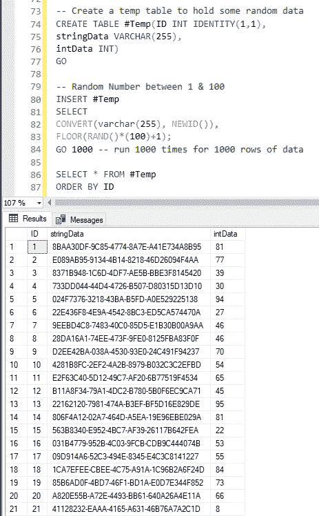

# SQL Server —如何创建随机数据表

> 原文：<https://medium.com/version-1/sql-server-create-a-table-of-random-data-aaa492887ff8?source=collection_archive---------0----------------------->

用 T-SQL 创建基本综合测试数据的简单脚本


Photo by [Mika Baumeister](https://unsplash.com/@mbaumi?utm_source=unsplash&utm_medium=referral&utm_content=creditCopyText) on [Unsplash](https://unsplash.com/s/photos/data?utm_source=unsplash&utm_medium=referral&utm_content=creditCopyText)

下面的代码创建了一个临时表，其中包含一个标识列、一个整数列和一个字符串列。

然后，我们使用 GO 1000 用一个随机字符串(GUID)创建 1000 行数据&一个介于 1 和 100 之间的随机数。

```
-- Create a temp table to hold some random dataCREATE TABLE #Temp(ID INT IDENTITY(1,1),stringData VARCHAR(255),intData INT)GO-- Add a GUID String & a Random Number between 1 & 100INSERT #TempSELECTCONVERT(varchar(255), NEWID()),FLOOR(RAND()*(100)+1);GO 1000 -- run 1000 times for 1000 rows of dataSELECT * FROM #TempORDER BY ID
```

在这里，您可以为 GO 语句添加任何您喜欢的数字，以创建更多\更少的数据。您还可以更改 RAND call 来创建不同范围的号码。

显然，下面是一个非常基本的例子。如果你有更复杂的需求，我会推荐一个工具，比如 Redgate 的 [SQL 生成器](https://www.red-gate.com/products/sql-development/sql-data-generator/)



Seems to work ok….


**关于作者:** Mike Knee 是 Azure Version 1 的高级数据开发人员。