# SQL Server Integration Services(SSIS)部署策略

> 原文：<https://medium.com/globant/sql-server-integration-services-ssis-deployment-strategies-847cf2377416?source=collection_archive---------0----------------------->

在开始部署策略之前，让我们快速解释一下“什么是 SSIS？”

根据微软的消息来源，SSIS(SQL Server Integration Services)是一个平台，用于根据您的需求构建企业级数据集成和数据转换解决方案。这些集成服务可以从各种不同的源(如 XML 数据文件、平面文件和关系数据源)中提取和转换数据，然后根据您的需要和逻辑将数据加载到一个或多个目的地。

*您可以使用 Visual Studio 创建 SSIS 包或项目，然后使用以下选项进行部署:*

> ***1。在本地 SQL 服务器*** 上部署 SSIS 包
> 
> **2 *。在 Azure 中部署并运行 SSIS 包***
> 
> SSIS 项目只能通过 Azure 云环境或带有 Windows 身份验证的您的 SQL server 部署。您不能在拥有用户名和密码的服务器上部署 SSIS 项目！！！

让我们假设我们已经准备好 SSIS 项目或包，并让我们了解如何部署 SSIS 项目或包来实现我们的数据迁移目标。

# ***在本地 SQL server 上部署 SSIS 包***

*开始之前您需要什么:*

1.  对于这个部署，您需要在您的**本地**中安装 SQL sever management studio。SQL 2016 及更高版本是 SSIS 的兼容版本。但如果你有 2015 年左右，微软也提供了向后兼容性。
2.  安装 SQL server 包时，您必须单击“ ***集成服务目录*”选项。**这将启用 SQL 中的 ***集成服务目录*** *和***选项，允许您创建 *SSISDB* 。**
3.  **您应该在计算机中启用 Windows 身份验证。**

***部署步骤如下:***

## **步骤 1:在 SQL Server 中执行下列操作**

**右键单击'*集成服务目录'*，然后单击*'创建目录'*选项(可以参考屏幕截图)*。* ***为目录创建加密密钥需要密码。请将此密码保存在安全的位置*** 。然后，它将为您创建 *SSISDB* ，在 *SSISDB* 中，我们可以创建一个文件夹，在其中导入我们的 SSIS 项目或包。**

**截图 3 显示了带有两个子文件夹的新文件夹“Demo”。' **Project'** '文件夹是部署 SSIS 项目包的地方。在过去，项目部署意味着目录中的每个包都要更新。自 SQL Server Integration Services 2016 以来，仅将更改后的包部署到目录中。在**环境**文件夹中，可以为我们的开发和生产系统定义参数。**

**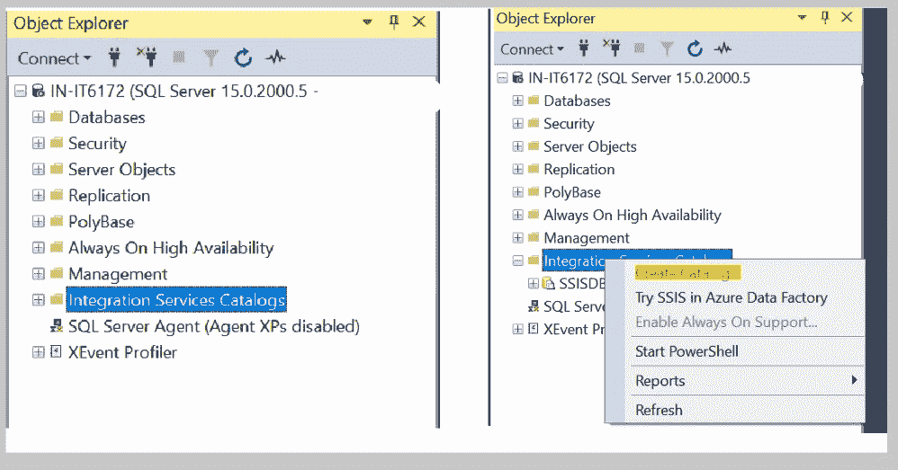**

**Integration Services folder**

**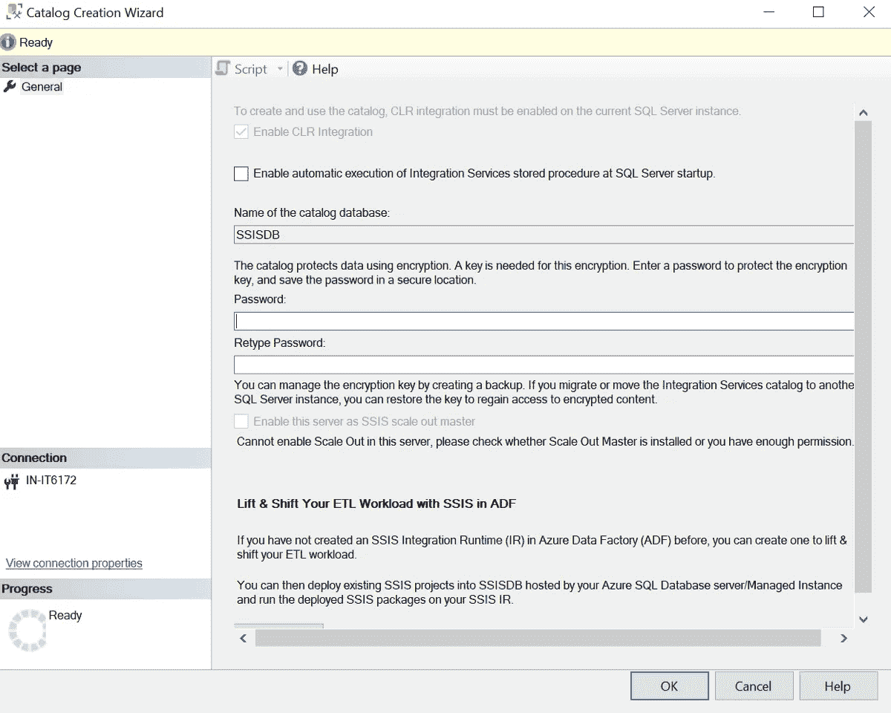**

**Create SSIS DB**

**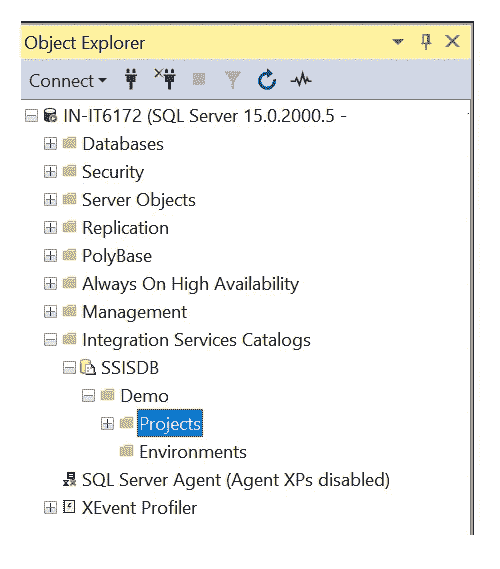**

**Folder has been created inside the SSISDB**

## **步骤 2:项目/包通过 VS 转移到 SQL**

**Visual Studio 2019 允许将包部署到应用程序中的目录。构建应用程序时，正在创建的 **ispac** 文件中的编译结果位于 bin 目录中。您可以右键单击您的项目，在那里您可以找到部署选项。单击此按钮后，您可以将项目部署到 SQL。请参考以下截图。**

**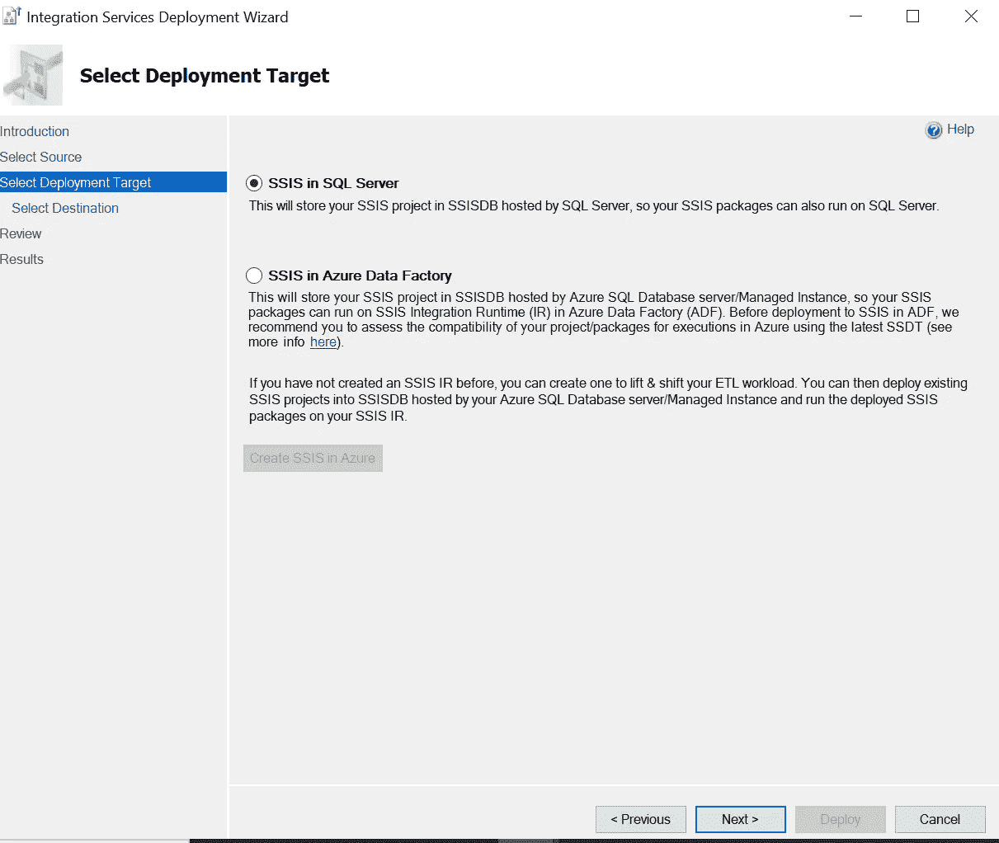**

**SQL Option for SSIS deployment**

**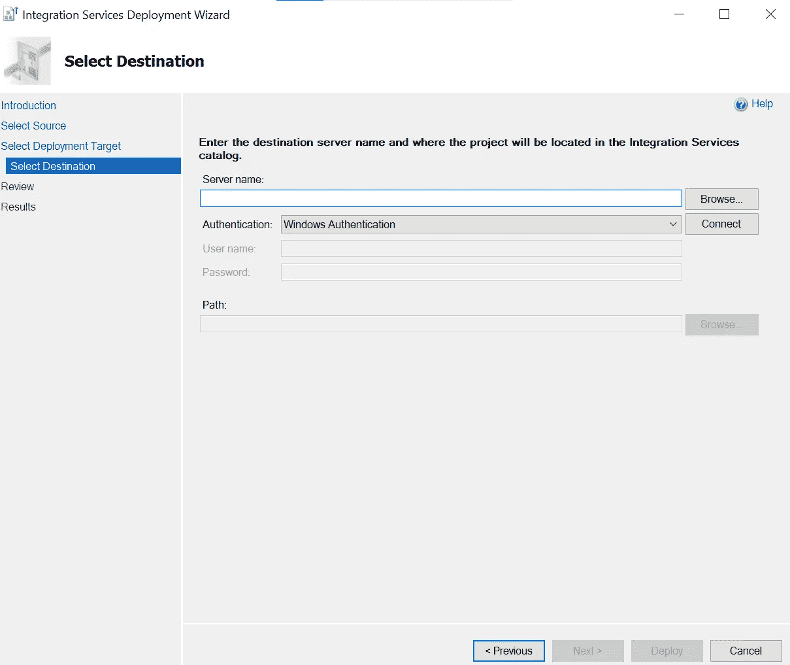**

**Enter Server in the text box.**

**输入所有必要的信息后，您可以按 deploy 按钮。它会将 SSIS 项目/包部署到您的本地 SQL server 中。**

## **步骤 3:最后用 SSIS 数据库部署项目/包**

**当您通过 VS 部署项目时，您可以在先前创建的 SQL SSISDB 中看到项目。在那里你可以选择你的环境，你的项目参数/全局参数。您可以使用用户名和密码为部署选择多种环境。**SSISDB 中的环境让我们能够配置 QA、生产等环境。****

**之后，您需要导入包并执行它们。为此，请参考下面的屏幕截图。**

**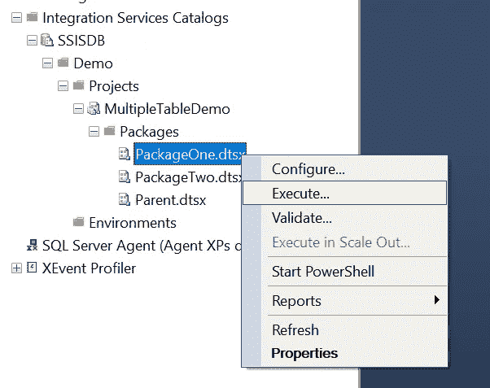**

**Project and packages you can see after the transfer step of VS**

**在这一步之后，你需要选择你的项目中的参数，如果有的话，然后点击 ok。**

**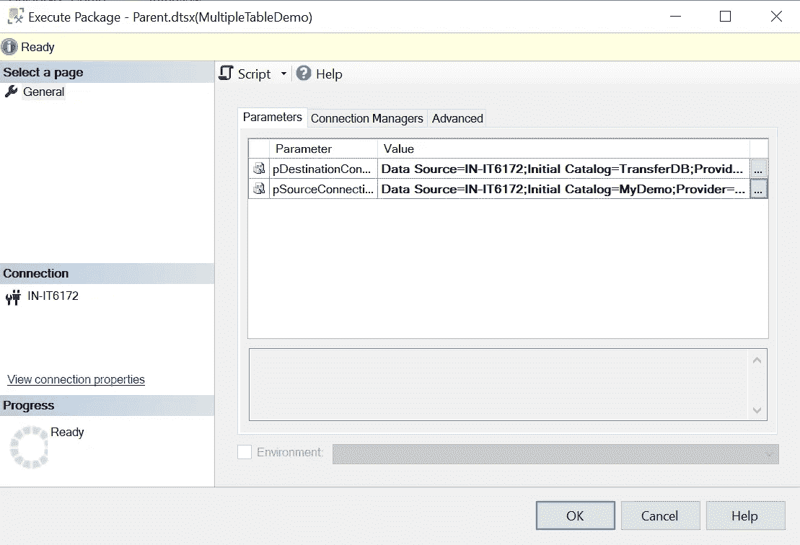**

**Project Level Parameters**

**当您按下“确定”时，将生成包含所有成功或错误消息的报告。**

**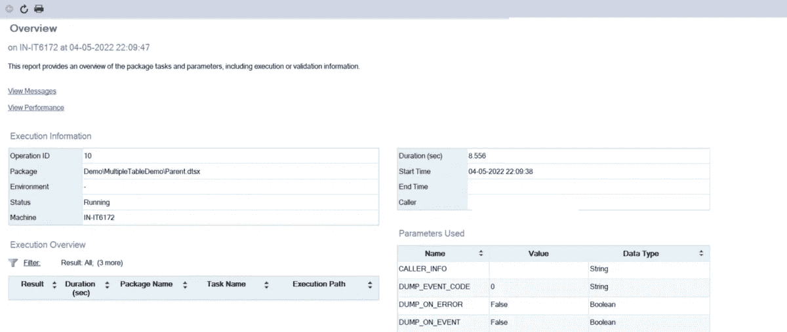**

**SQL Report after SSIS Deployment**

**这将使用 SSISDB 和 Windows 身份验证通过 SQL 完成您的 SSIS 部署。除此之外，SQL 还为我们提供了要配置的 SQL 作业，以便在时间间隔内运行该包。**

> **除了这个 Visual studio，您还可以使用 PowerShell 将您的 SSIS 项目部署到 SQL。但这将是一个有点复杂的过程。你可以在微软网站上获得相关的必要信息。**

# **在 Azure 中部署和运行 SSIS 包**

***开始之前您需要什么:***

1.  **Azure 云访问数据库创建或任何虚拟机，您可以在其中创建 SQL 数据库。**

## **Azure SSIS 集成运行时设置—**

**Azure SSIS IR 是 Azure 数据工厂完全托管的虚拟机集群，托管在 Azure 中，专用于在数据工厂中运行 SSIS 包，能够通过配置节点大小来纵向扩展 SSIS IR 节点，并通过配置虚拟机集群中的节点数量来横向扩展。**

**使用 Azure-SSIS IR，您可以轻松运行部署到 SSIS 目录数据库中的 SSIS 包，这些包使用项目部署模型托管在 Azure SQL 数据库服务器或 Azure SQL 数据库托管实例中，或者使用包部署模型运行部署到文件系统、Azure 文件或托管在 Azure SQL 数据库托管实例中的 SQL Server MSDB 数据库中的包。**

***部署步骤如下:***

## **步骤 1:配置 Azure SSIS IR**

**要配置 Azure SSIS IR，使用 Azure 门户打开 Azure 数据工厂，然后从概览页面选择**作者&监视器**选项。从入门窗口，您可以从管理选项卡- >集成运行时- >新 Azure SSIS IR 配置 Azure SSIS IR，或者直接从**配置 SSIS 集成**选项。**

**从集成运行时设置的“常规设置”窗口中，为 Azure SSIS IR 提供一个有意义的名称、将托管此 SSIS IR 的区域、集成运行时群集中的节点大小、将分配给集成运行时群集的节点数量、是将标准版还是企业版 SQL Server 用于集成运行时，以及您是否计划使用自己的 SQL Server 许可证来节省资金，如下所示:**

**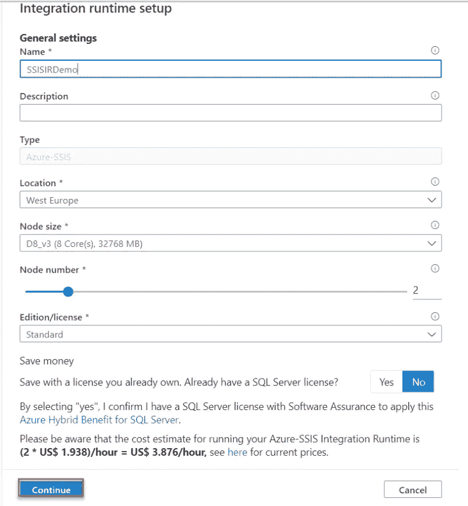**

**Azure Integration Runtime Setup — 1**

**从集成运行时设置的“部署设置”窗口中，您需要指定是否创建 SSISDB 并将您的包部署到其中，和/或使用 Azure-SSIS IR 包存储来部署 SSIS 包。**

**如果您选择创建 SSISDB，将要求您指定 Azure SQL Server 所在的 Azure **订阅**和**区域**，考虑到建议将 Azure SQL Server 和 Azure SSIS IR 放在同一区域。此外，您需要提供 Azure SQL 数据库服务器的端点(SSISDB 将在其中创建)、SQL 身份验证或 Azure AD 身份验证方法以及 Azure 数据工厂将用来连接到 Azure SQL 服务器和该 Azure SQL 数据库服务器的服务层的凭据。Azure SSIS IR 包存储选项使您能够管理部署到 MSDB、文件系统或 Azure 文件中的 SSIS 包。**

**对于选定的 Azure SQL 数据库服务器，请确保启用了**允许访问 Azure 服务**防火墙设置，并且该服务器尚未创建 SSISDB 实例，因为不支持使用现有的 SSISDB 实例，如下所示:**

**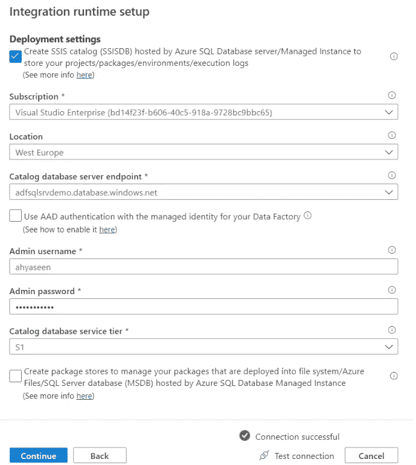**

**Azure Integration Runtime Setup — 2**

**在集成运行时设置的“高级设置”窗口上，将要求您提供集成运行时群集中每个节点并发运行的包的最大数量，是否在您的 Azure-SSIS IR 上添加标准/快速自定义设置，是否将 Azure SSIS IR 加入 VNET，以及是否将自承载 IR 配置为 Azure-SSIS IR 的代理。查看您在摘要页面中的所有选择，然后单击**创建**继续。**

## **步骤 2:运行 Azure SSIS IR，然后创建管道**

**成功创建后，确保 Azure SSIS IR 状态更改为“正在运行”,以便使用它来运行 SSIS 包。这可以从自动打开的管理页面进行检查，在那里您可以看到 Azure SSIS IR 状态为正在运行，能够从该窗口编辑、监控、启动、停止或删除 Azure SSIS IR，考虑到您需要在执行任何更改之前停止它。此外，您可以创建一个带有执行 SSIS 包活动的管道，或者从同一个页面查看 Azure-SSIS IR 的 JSON 代码，如下所示:**

**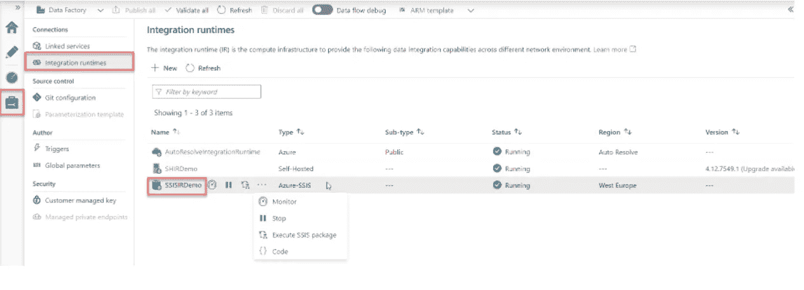**

**Running Azure SSIS IR**

**另一方面，您可以通过浏览托管在指定 Azure SQL 数据库服务器下的数据库来验证 SSISDB 实例是否已创建。**

## **步骤 3:部署 SSIS 软件包**

**现在，Azure-SSIS IR 已经准备就绪，可以使用了。下一步是将 SSIS 包部署到 SSISDB，以便在 Azure 数据工厂下运行它。**

**这里使用 SSDT 集成服务部署向导，可以通过右键单击 SSIS 项目名，然后选择**部署**选项来运行该向导。**

**在集成服务部署向导的**选择部署目标**窗口中，指定是否将 SSIS 包部署到位于本地 SQL Server 或 Azure SQL 数据库中的 SSISDB 实例，然后由 Azure SSIS IR 在 Azure 数据工厂下执行，如下所示:**

**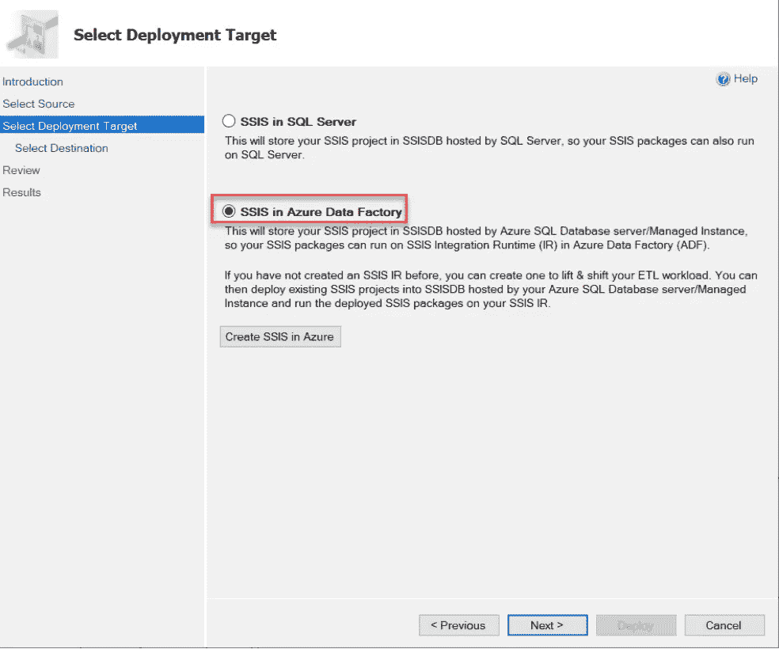**

**VS support to deploy the SSIS to Azure cloud db**

**在集成服务部署向导的**选择目标**窗口上，提供托管 SSISDB 的 Azure SQL 数据库服务器的名称、将用于连接到该服务器的凭据以及 SSISDB 内 SSIS 包的部署路径。之后，在部署 SSIS 项目以在 Azure 数据工厂中执行之前，将对其进行主要执行错误的验证。如果验证测试顺利，单击**下一步**继续或修复任何面临的问题，以部署 SSIS 软件包。监控部署步骤并确保部署过程成功完成，没有任何问题，考虑到您应该在尝试再次部署之前修复部署过程中出现的任何错误，然后单击**关闭。****

## **步骤 4:运行 SSIS 包**

**在将包部署到连接到 Azure SSIS IR 的 SSISDB 实例后，您需要创建一个新管道来使用执行 SSIS 包活动运行 SSIS 包。要实现这一点，您可以轻松浏览 Azure Data Factory 的管理页面，单击集成运行时，然后单击 Azure SSIS IR 旁边的三个点，并选择**执行 SSIS 包**选项，如下所示:**

**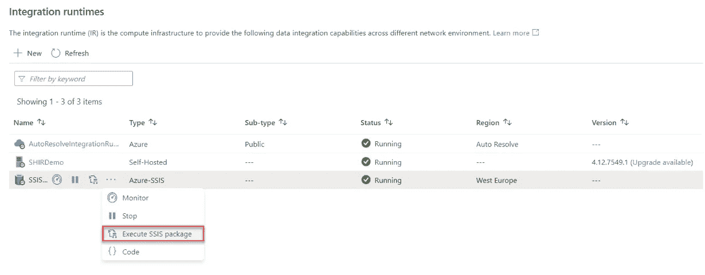**

**Execute SSIS Packages**

**“执行 SSIS 包”选项将自动创建一个带有“执行 SSIS 包”活动的新管道。在“执行 SSIS 包活动设置”的“常规”页面中，为活动提供一个唯一的名称，如下所示。从“执行 SSIS 包活动设置”的“设置”页面中，选择将用于在 Azure 数据工厂下执行 SSIS 包的 Azure SSIS IR、SSIS 包的位置、指定位置下 SSIS 包的路径以及要执行的包的名称。**

**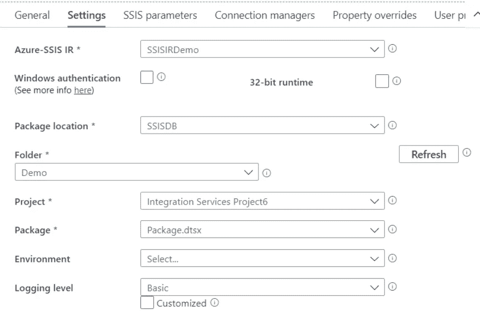**

**Information to be filed for SSIS DB**

**提供所有必需的信息后，验证管道设置，然后单击**调试**按钮，启用管道执行的调试模式，并监控管道内的 SSIS 包执行，确保 SSIS 包在 Azure 数据工厂内成功执行，没有任何错误。**

**现在，您可以轻松地将管道发布到生产 Azure 数据工厂环境，并创建一个触发器来调度 SSIS 包的执行。**

# **使用的软件/工具**

1.  **SQL Server management studio 2021 版本-18.1**
2.  **Visual studio 2019**

# ****结论****

**Microsoft SQL Server Integration Services(SSIS)是一个用于构建高性能数据集成解决方案的平台，包括用于数据仓库的提取、转换和加载(ETL)包。SSIS 包括用于构建和调试包的图形工具和向导；用于执行工作流功能(如 FTP 操作、执行 SQL 语句和发送电子邮件)的任务；用于提取和加载数据的数据源和目的地；用于清理、聚集、合并和复制数据的转换；用于管理包执行和存储的管理数据库 SSISDB 以及用于对集成服务对象模型进行编程的应用编程接口(API)。**

**这是我们可以为数据库引擎(SQL windows 身份验证)、Azure SQL 数据库、Azure 托管实例的部署本地安装创建 SSISDB 的三种方式。**