# SQL 和 NoSQL 数据库的区别——MySQL 和 MongoDB 的比较

> 原文：<https://medium.com/edureka/sql-vs-nosql-db-5d9b69ace6ac?source=collection_archive---------0----------------------->

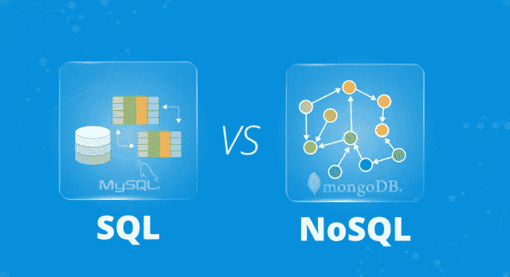

SQL vs NoSQL — Edureka

面对当今世界的数据量，没有合适的数据库来管理数据几乎是不可能的。在今天的市场上，有不同种类的数据库，决定最适合您的业务的数据库是一项艰巨的任务。因此，在这篇关于 SQL 与 NoSQL 的文章中，我将比较这两种类型的数据库，以帮助您选择哪种类型的数据库可以帮助您和您的组织。

本文将涵盖以下主题:

*   什么是 SQL？
*   什么是 NoSQL？
*   SQL 与 NoSQL
*   SQL 和 NoSQL 的例子
*   什么是 MySQL？
*   什么是 MongoDB？
*   MySQL vs MongoDB
*   演示:在表和集合中插入值

所以，让我们开始吧，伙计们！！

# 什么是 SQL？

SQL 即结构化查询语言是关系数据库的核心，用于访问和管理数据库。这种语言用于以表格的形式从结构化数据格式中操作和检索数据，并保存这些表格之间的关系。关系可能如下:


*   一对一关系是指表 A 中的一行与表 b 中的一行相关。
*   一对多关系是指表 A 中的一行与表 b 中的多行相关。
*   多对多关系是指表 A 中的许多行可以与表 b 中的许多行相关联。
*   自引用关系是指表 A 中的记录与同一个表本身相关。

现在，接下来在这篇文章中让我们了解什么是 NoSQL？

# 什么是 NoSQL？

NoSQL，或最常见的称为不仅 SQL 数据库，提供了一种存储和检索非结构化数据的机制。这种类型的数据库可以处理海量数据，并具有动态模式。因此，NoSQL 数据库没有特定的查询语言，没有或只有很少的关系，但是数据以集合和文档的格式存储。

因此，一个数据库可以有‘n’个集合，每个集合可以有‘m**’**个文档。考虑下面的例子。

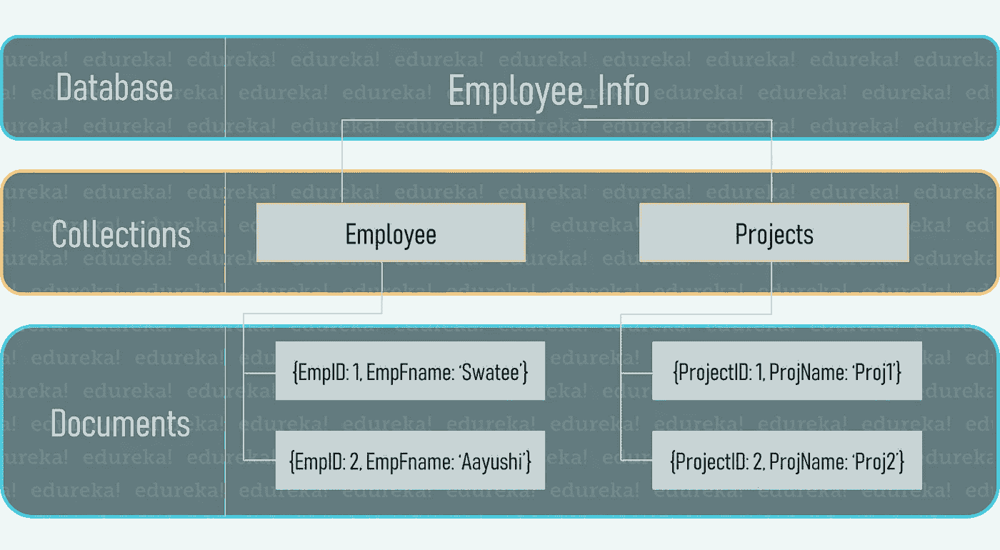

从上图可以看出，有一个雇员数据库，它有两个集合，即雇员和项目集合。现在，这些集合中的每一个都有文档，这些文档基本上都是数据值。因此，您可以假设*集合是您的表，文档是您在表*中的字段。

好了，现在你知道了什么是 SQL & NoSQL，让我们来看看，这些数据库是如何相互对抗的。

# SQL 与 NoSQL

因此，在这次交锋中，我将基于以下理由对这两个数据库进行比较:

1.  数据库的类型
2.  (计划或理论的)纲要
3.  数据库类别
4.  复杂的查询
5.  分级数据存储
6.  可量测性
7.  语言
8.  在线处理
9.  基本属性
10.  外部支持

## 数据库的类型

SQL 被称为 ***关系数据库*** ，因为它将结构化数据组织成定义的行和列，每个表都与数据库中的其他表相关。

另一方面，NoSQL 被称为非关系数据库*。这是因为数据是以集合的形式存储的，它们之间没有或很少有关系。*

## *(计划或理论的)纲要*

*SQL 需要一个用于结构化数据的 ***预定义模式*** 。因此，在开始使用 SQL 提取和操作数据之前，您需要确保您的数据结构是以表的形式预定义的。*

*但是，NoSQL 有一个针对非结构化数据的*动态模式。因此，如果您使用的是 NoSQL 数据库，那么就不存在预定义的模式，数据的完整模式完全取决于您希望如何存储数据。即您希望在文档和集合中存储哪些字段。**

## **数据库类别**

**SQL 数据库是。因此，你可以有“n”个相互关联的表格，每个表格都有行和列，在表格的每个单元格中存储数据。**

**现在，如果我们谈论 NoSQL 数据库，那么 NoSQL 数据库有以下几类数据库:**

*   *****文档数据库***–它将每个键与一个称为文档的复杂数据结构配对。它可以包含许多不同的键值对，或者键数组对，甚至嵌套文档**
*   *****键值存储***——它们是最简单的 NoSQL 数据库。数据库中的每一项都存储为属性名或键及其值。**
*   *****图形存储***——它们用来存储关于网络的信息，比如社会关系。图形库包括 Neo4J 和 HyperGraphDB。**
*   *****宽列存储***–Cassandra 和 HBase 等宽列存储针对大型数据集的查询进行了优化，将数据的列存储在一起，而不是行。**

**因此，SQL 数据库以表的形式存储数据，而 NoSQL 数据库以键值对、文档、图形数据库或宽列存储的形式存储数据。**

## **复杂的查询**

**与 NoSQL 相比，SQL 更适合复杂的查询环境，因为 SQL 数据库中的模式是结构化的，数据以表格形式存储。因此，即使您希望在外部查询中应用带有许多子查询的嵌套查询，也可以通过使用适当的表名和列名来轻松实现。**

**现在， ***NoSQL 数据库不适合复杂查询*** 的原因是因为 NoSQL 数据库不是用 SQL 这样的标准语言查询的。**

## **分级数据存储**

**嗯，当我们在这个因素上比较数据库时，与 SQL 数据库相比， ***NoSQL 更适合分层存储*** 。**

**这是因为随着表数量的增加，维护它们之间关系的复杂性也在不断增加。因此，在这种情况下，您无法将大量包含许多列的表相互关联起来。但是，当您考虑 NoSQL 数据库时，这种数据库更适合分层数据存储，因为它遵循类似于 JSON 数据的键-值对存储数据的方式。**

## **可量测性**

**SQL 数据库是*垂直可伸缩的。您可以通过优化硬件(如增加 CPU、RAM、SSD 等)来平衡数据服务器的负载。***

***另一方面，NoSQL 的数据库是 ***水平可伸缩的*** 。您可以通过向群集中添加更多服务器来处理大量流量，从而执行负载平衡。***

## **语言**

*****SQL 数据库有一种特定的语言*** ，它不会因数据库而异。这种数据库使用 SQL(结构化查询语言)来检索和操作数据。**

*****NoSQL 数据库没有用于查询的特定语言*** ，并且因数据库而异。在 NoSQL 数据库中，查询主要集中在文档集合上，语言被称为 UnQL(非结构化查询语言)。**

## **在线处理**

**比较 SQL 和 NoSQL，基于这个因素，SQL 数据库用于 ***重型事务型应用。*** 嗯，这是因为 SQL 提供了数据的原子性、完整性和稳定性。此外，您可以将 NoSQL 用于事务目的，但是，对于高负载和复杂的事务性应用程序，它仍然不够稳定。所以，你可以理解 SQL 主要用于 OLTP(在线事务处理)，NoSQL 主要用于 OLAP(在线分析处理)。**

## **基本属性**

**SQL 数据库基于 ***ACID 属性*** (原子性、一致性、隔离性和持久性)，而 NoSQL 数据库基于 ***Brewers CAP 定理*** (一致性、可用性和分区容差)。**

**让我先给你解释一下酸的性质:**

*   ****原子性**:原子性指的是完全完成或失败的事务，其中事务指的是数据的单个逻辑操作。这意味着，如果任何事务的一部分失败，整个事务都会失败，并且数据库状态保持不变。**
*   ****一致性**:一致性保证数据必须符合所有的验证规则。简而言之，您可以说您的事务在没有完成其状态之前不会离开数据库。**
*   ****隔离**:隔离的主要目标是并发控制。**
*   ****持久性**:持久性是指如果一个事务已经提交，它将会发生任何可能发生的事情，比如断电、崩溃或任何种类的错误。**

**说到 CAP 定理，**

**Brewers CAP 定理指出，数据库最多只能实现三种保证中的两种:一致性、可用性和分区容差。这里**

*   ****一致性:**所有节点同时看到相同的数据。**
*   ****可用性:**保证每一个请求成功或失败。**
*   ****分区容错:**保证系统在消息丢失或部分系统故障的情况下仍能继续运行。**

**NoSQL 无法同时提供一致性和高可用性。**

## **外部支持**

**自从 SQL 问世 40 多年以来，所有的 SQL 供应商都提供了出色的支持。然而，对于一些 NoSQL 数据库，只有有限的专家可用，您仍然需要依靠社区支持来部署您的大规模 NoSQL 部署。这是因为 NoSQL 在 2000 年代后期才出现，人们还没有对它进行太多的探索。**

**因此，如果我必须在这篇关于 SQL 与 NoSQL 的文章中总结 SQL 和 NoSQL 的区别，您可以参考下表。**

**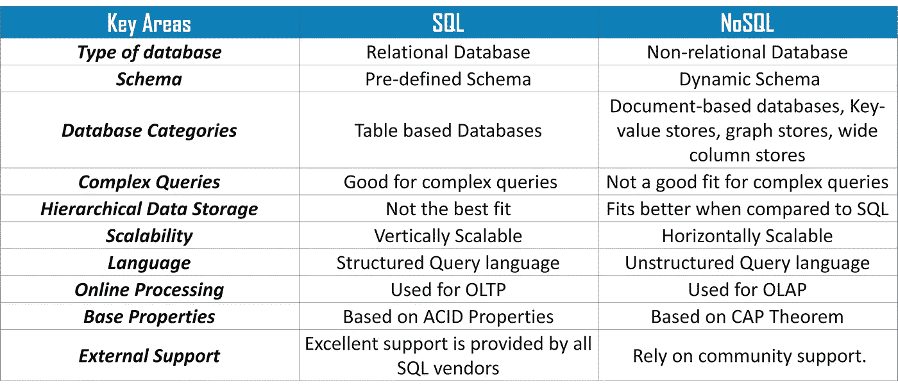**

**所以，伙计们，我们结束了 SQL 和 NoSQL 之间的对抗。现在，我们已经讨论了这么多关于 SQL 和 NoSQL，让我给你看一些相同的例子。**

# **SQL 和 NoSQL 的例子**

**SQL 和 NoSQL 的示例如下:**

**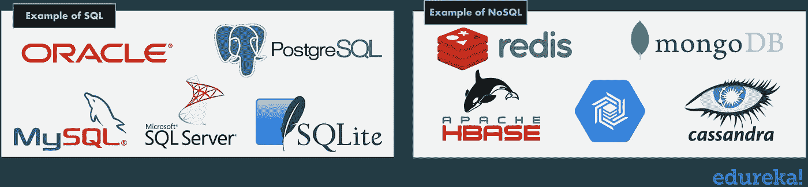**

**现在，来自 SQL 和 NoSQL 最流行的数据库是 ***MySQL*** 和 ***MongoDB*** 。**

**因此，在这篇关于 SQL 与 NoSQL 的文章中，我们将比较 MySQL 和 MongoDB。**

# **什么是 MySQL？**

****

**MySQL 是一个开源的关系数据库管理系统，可以在许多平台上运行。它提供多用户访问以支持许多存储引擎，并由 Oracle 提供支持。因此，您可以从 Oracle 购买商业许可版本，以获得高级支持服务。**

**以下是 MySQL 的特性:**

**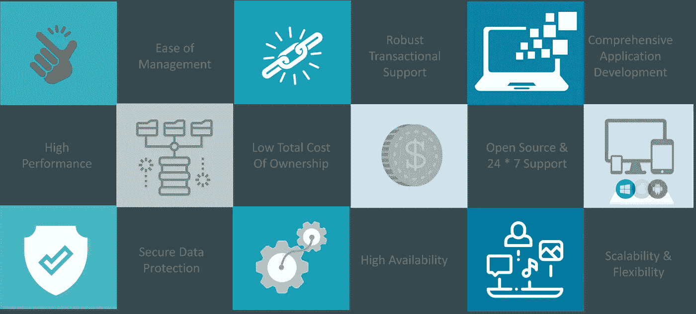**

*   *****易于管理*** —该软件非常容易下载，并且使用事件调度程序来自动安排任务。**
*   *****健壮的事务支持*** —拥有 ACID(原子性、一致性、隔离性、持久性)属性，也允许分布式多版本支持。**
*   *****综合应用开发*** — MySQL 有插件库，可以将数据库嵌入到任何应用中。它还支持应用程序开发的存储过程、触发器、函数、视图等等。**
*   *****高性能*** —通过独特的内存缓存和表索引分区提供快速加载实用程序。**
*   *****总拥有成本低*** —这降低了许可成本和硬件支出。**
*   *****开源& 24 * 7 支持*** —这种 RDBMS 可以在任何平台上使用，并提供对开源和企业版的 24 * 7 支持。**
*   *****安全数据保护*** — MySQL 支持强大的机制，确保只有授权用户才能访问数据库。**
*   *****高可用性*** — MySQL 可以运行高速主/从复制配置，并提供集群服务器。**
*   *****可扩展性&灵活性***——使用 MySQL 你可以运行深度嵌入的应用程序，并创建容纳海量数据的数据仓库。**

**接下来，在这篇文章中让我们了解一下什么是 MongoDB？**

# **什么是 MongoDB？**

****

**MongoDB 是一个非关系数据库，它将数据存储在文档中。这种类型的数据库将相关信息存储在一起，以便快速查询处理。**

**MongoDB 的特性如下:**

*   ****索引:**创建 It 索引是为了提高搜索性能。**
*   ****复制:** MongoDB 将数据分布在不同的机器上。**
*   ****特别查询:**它通过使用独特的查询语言索引 BSON 文档&来支持特别查询。**
*   **它非常灵活，因为它的无模式数据库是用 C++编写的。**
*   ****分片:** MongoDB 使用分片来支持具有非常大的数据集和高吞吐量操作的部署。**

**好了，现在你知道了什么是 MySQL 和 MongoDB，让我们看看，这些数据库是如何相互对抗的。**

# **MySQL vs MongoDB**

**因此，在这次交锋中，我将基于以下理由对这两个数据库进行比较:**

1.  **查询语言**
2.  **图式的灵活性**
3.  **关系**
4.  **安全性**
5.  **表演**
6.  **支持**
7.  **关键特征**
8.  **分身术**
9.  **使用**
10.  **活跃社区**

# **查询语言**

**MongoDB 则不同， ***MySQL 使用的是结构化查询语言(SQL)*** 。这种语言很简单，主要由 DDL、DML、DCL 和 TCL 命令组成，用于检索和操作数据。另一方面，MongoDB***使用非结构化查询语言*** 。所以，查询语言基本上是 MongoDB 查询语言。参考下图。**

**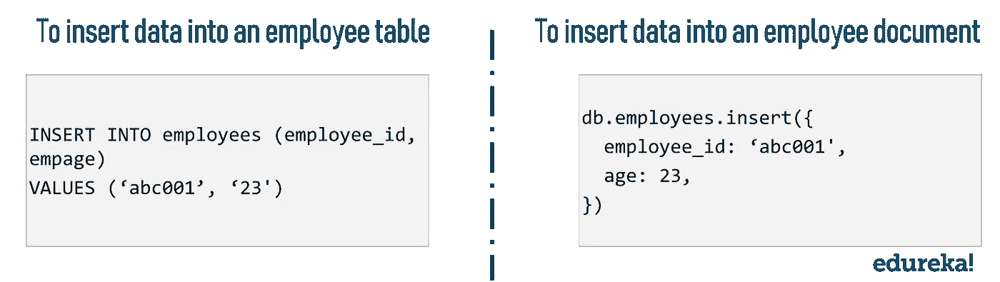**

## **图式的灵活性**

*****MySQL 对于结构化数据有很好的模式灵活性*** 只需要明确定义表和列。现在， ***对模式设计*** 没有限制。您可以直接提到集合中的几个文档，而这些文档之间没有任何关系。但是，MongoDB 的唯一问题是，您需要根据您希望如何访问数据来优化您的模式。**

## **关系**

**基于这个因素对比 MySQL 和 MongoDB， ***MySQL 借助 JOIN 语句*** 支持关系，而 ***MongoDB 不支持 JOIN 语句*** 。但是，它支持将一个文档放在另一个文档中(也称为文档嵌入)和多维数据类型，如数组。**

## **安全性**

**MySQL 基本上使用了一个 ***基于权限的安全模型*** 。这种安全模型对用户进行身份验证，并方便用户在特定数据库上的特权。**

**另一方面，MongoDB 使用基于角色的访问控制*，提供一组灵活的特权，提供安全特性，比如授权和认证。***

## ***表演***

***在这个参数上比较 MySQL 和 MongoDB，让我告诉你，当考虑大型数据库时， ***MySQL 与 MongoDB*** 相比相当慢。这主要是因为 MySQL 不能用于大量的非结构化数据。***

**但是，MongoDB 具有处理大型非结构化数据的能力。因此，它比 MySQL 更快，因为它允许用户以降低服务器负载的方式进行查询。**

> ****注意:**对于您的数据来说，MongoDB 始终会更快，这并没有硬性规定，它完全取决于您的数据和基础架构。**

## **支持**

**嗯， ***它们都为安全修复、维护版本、错误修复、补丁和更新提供了 24*7*** 的出色支持。因此，基于这个参数，两者之间没有区别。**

## **关键特征**

**关于 MySQL 和 MongoDB 的关键特性，可以参考下图:**

**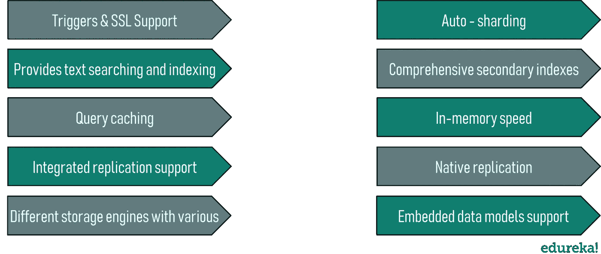**

## **分身术**

*****MySQL 支持主从复制*** 和主从复制。另一方面，***MongoDB 支持内置复制、分片和自动选举。*** 因此，借助 MongoDB 中的自动选举，您可以设置另一个或辅助数据库，以便在主数据库出现故障时自动接管。**

## **使用**

**可以参考下图，了解在哪里使用 MySQL 和 MongoDB:**

**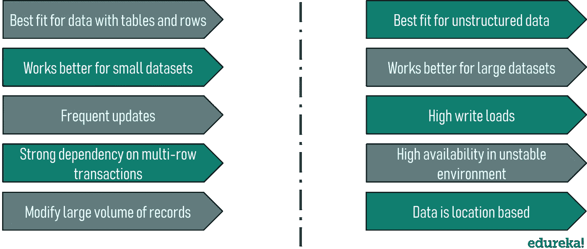**

## **活跃社区**

**基于这一因素比较 MySQL 和 MongoDB， ***MySQL 数据库提供了一个比 MongoDB*** 更好的社区，因为它由 Oracle 公司拥有和维护。**

**所以，如果要我总结 MySQL 和 MongoDB 的区别，可以参考下表。**

**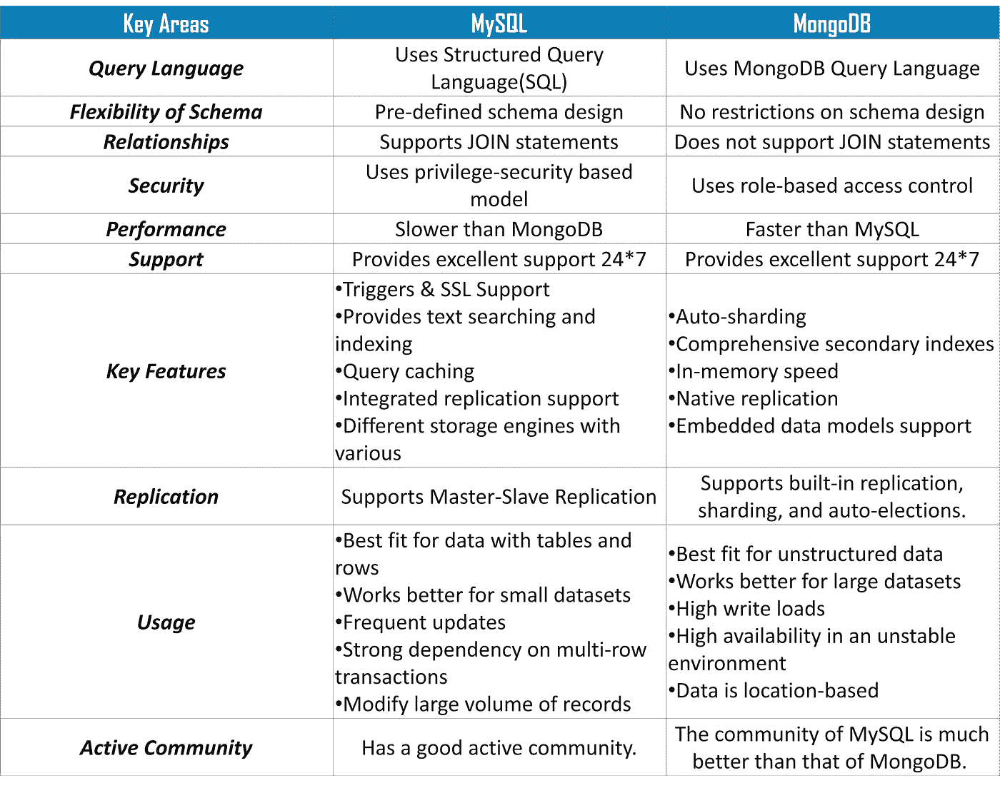**

**所以，朋友们，我们结束了 MySQL 和 MongoDB 之间的对抗。现在，了解了这么多关于 MySQL 和 MongoDB 的知识，你可能会想到一个问题，即 ***企业应该选择 MySQL 还是 MongoDB？*****

**嗯，他们两个之间没有明显的赢家。数据库的选择完全取决于数据库的模式以及您希望如何访问它。然而，当你有一个固定的模式，高事务，低维护，有限预算的数据安全和 MongoDB 时，你可以使用 MySQL，而当你有一个不稳定的模式，高可用性，云计算，内置分片。**

**因此，不会有任何最终的裁决，其中哪一个是最好的，因为每一个都基于你的要求。**

**现在，您已经知道了 MySQL 和 MongoDB 之间的区别，接下来在这篇关于 SQL 与 NoSQL 的文章中，我将向您展示如何分别在 MySQL Workbench 和 MongoDB Compass 中将数据插入到表和集合中。**

# **演示:将数据插入表和集合**

**让我们从使用 MySQL Workbench 向表中插入数据开始。**

## **使用 MySQL Workbench 将数据插入表中**

**要使用 MySQL Workbench 将数据插入表中，您可以遵循以下步骤:**

****第一步:**打开 MySQL Workbench，创建连接。**

****步骤 2:** 现在，一旦您的连接被创建，打开您的连接，然后您将被重定向到以下仪表板。**

**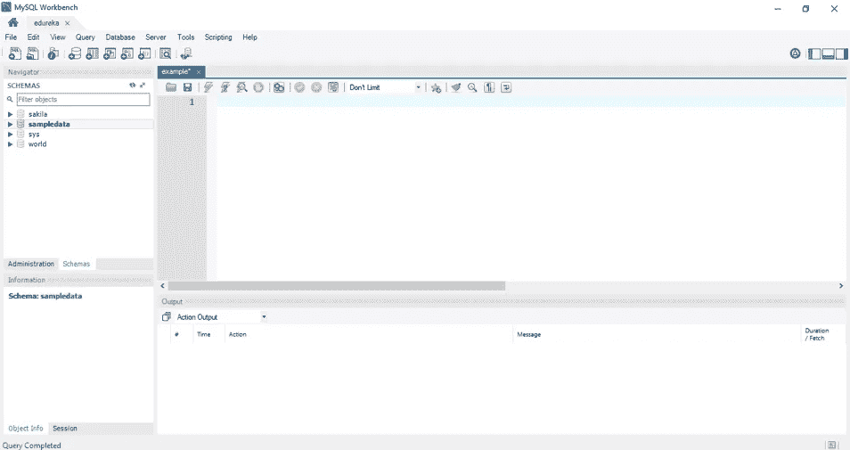**

****步骤 3:** 现在创建一个数据库和一个表，按照下面的查询:**

```
**//Create Database
CREATE DATABASE Employee_Info;
//Use Database
USE Employee_Info;
//Create Table
CREATE TABLE Employee
(EmpID int,
EmpFname varchar(255),
EmpLname varchar(255),
Age int,
EmailID varchar(255),
PhoneNo int8,
Address varchar(255));**
```

****步骤 4:** 现在，一旦创建了表，要将值插入表中，请使用如下的 INSERT INTO 语法:**

```
**//Insert Data into a Table
INSERT INTO Employee(EmpID, EmpFname, EmpLname,Age, EmailID, PhoneNo, Address)
VALUES ('1', 'Vardhan','Kumar', '22', '[vardy@abc.com](mailto:vardy@abc.com)', '9876543210', 'Delhi');**
```

****步骤 5:** 当你查看你的表时，你会得到如下的输出。**

****

**现在，在这篇关于 SQL 与 NoSQL 的文章中，让我们看看如何在 MongoDB Compass 中创建数据库和集合。**

## **使用 MongoDB Compass 将数据插入到集合中**

**要使用 MongoDB Compass 将数据插入到表中，可以遵循以下步骤:**

****第一步:**打开 **MongoDB 罗盘**和**创建主机**。创建好主机后，点击**连接。**参考下文。**

**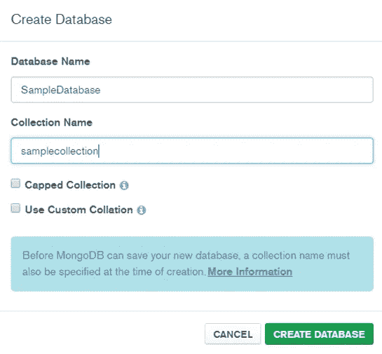**

****步骤 2:** 现在，一旦您的主机被连接，要创建一个数据库，点击**创建数据库**选项并提及**数据库和集合名称。****

****第三步:**现在，打开你的数据库，选择收藏。这里我选择了样本集合。要将文件添加到集合中，选择**插入文件**选项和**提及参数**。这里我提到了 EmpID 和 EmpName。**

**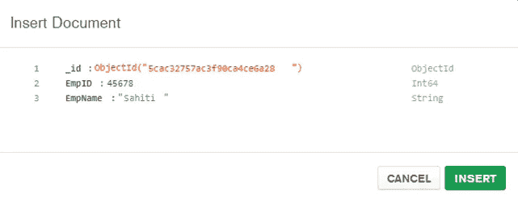**

**至此，我们结束了对 SQL 和 NoSQL 的比较。我希望你们喜欢这篇文章，并理解所有的差异。如果你想查看更多关于人工智能、DevOps、道德黑客等市场最热门技术的文章，那么你可以参考 [Edureka 的官方网站。](https://www.edureka.co/blog/?utm_source=medium&utm_medium=content-link&utm_campaign=sql-vs-nosql-db)**

**请留意本系列中的其他文章，它们将解释 SQL 的各个方面。**

> ***1。*[*SQL For Data Science*](/edureka/sql-for-data-science-a8fe10fe2ef9)**
> 
> ***2。* [*甲骨文面试前 50 题*](/edureka/oracle-interview-and-answers-d1a99534e2d0)**
> 
> **[*3。前 65 名 SQL 面试问题*](/edureka/sql-interview-questions-162f97f37ac2)**

***原载于 2019 年 4 月 16 日*[*https://www.edureka.co*](https://www.edureka.co/blog/sql-vs-nosql-db/)*。***