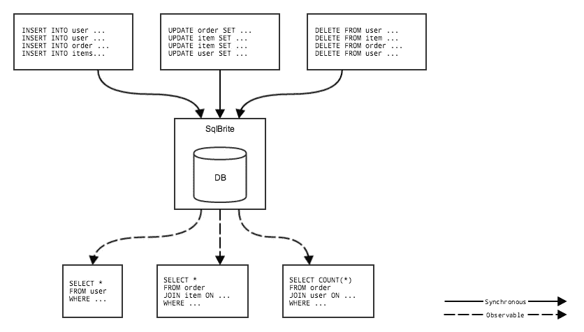

# SQLBrite:一个反应式数据库基础

> 原文：<https://medium.com/square-corner-blog/sqlbrite-a-reactive-database-foundation-40e3a617866d?source=collection_archive---------0----------------------->

## 基于 RxJava 的 Android SQLite 包装器。

*由* [*杰克·沃顿*](https://medium.com/u/8ddd94878165?source=post_page-----40e3a617866d--------------------------------) *撰写。*

> 注意，我们已经行动了！如果您想继续了解 Square 的最新技术内容，请访问我们的新家[https://developer.squareup.com/blog](https://developer.squareup.com/blog)

自平台诞生以来，在 Android 上存储、访问和修改持久化数据一直是一个不断变化的领域。去年，在根据一系列严格的要求评估了 16 个库之后，我们确定不存在满足我们所有目标的库，而是选择开始编写我们自己的解决方案。

SQLite 是持久化和查询复杂数据的明显选择。在过去的一年里，我们设计、讨论并原型化了一个完整的解决方案来简化应用程序的 SQLite 交互。这包括自动表创建和迁移、行的对象映射、类型安全查询以及数据更改时的通知等功能。

当需要与 [Square Cash](https://square.com/cash) 集成时，我们知道我们有很多很棒的概念，但是实现却遭受了沉重的打击。所以几周前，我们决定从零开始逐步重写这个库，以保留想法和概念——但要有合适的架构。

[SQL write](https://github.com/square/sqlbrite)是这项工作的第一个版本，它将作为未来添加的基础。代替单次执行，您可以使用 [RxJava observables](https://github.com/ReactiveX/RxJava/) 来订阅查询:

```
Observable**<**Query**>** users **=** db**.**createQuery**(**"user"**,** "SELECT * FROM user"**);**
users**.**subscribe**(new** Action1**<**Query**>()** **{**
  @Override **public** **void** **call(**Query query**)** **{**
    Cursor cursor **=** query**.**run**();**
    *// TODO parse data...*
  **}**
**});**
```

没有试图隐藏 SQL、游标或 SQLiteOpenHelper(Android 的 SQLite 包装器)的语义。相反，这三个概念被赋予了一种超能力:数据变更通知。

每当通过 insert、update 或 delete 操作更新表中的数据时(无论是在事务中还是一次性的)，该数据的订阅者都会被更新。

```
**final** AtomicInteger count **=** **new** **AtomicInteger();**
users**.**subscribe**(new** Action1**<**Query**>()** **{**
  @Override **public** **void** **call(**Query query**)** **{**
    count**.**getAndIncrement**();**
  **}**
**});**
System**.**out**.**println**(**"Queries: " **+** count**.**get**());** *// Prints 1*db**.**insert**(**"user"**,** createUser**(**"jw"**,** "Jake Wharton"**));**
db**.**insert**(**"user"**,** createUser**(**"mattp"**,** "Matt Precious"**));**
db**.**insert**(**"user"**,** createUser**(**"strong"**,** "Alec Strong"**));**System**.**out**.**println**(**"Queries: " **+** count**.**get**());** *// Prints 4*
```

当多个查询不断刷新数据时，UI 会实时更新，而不是停留在简单的静态页面上。



作为第一步，SQLBrite 在 github.com/square/sqlbrite 的 GitHub 上开源。随着时间的推移，在社区的帮助和支持下，特性集将变得更加全面。

[](/@jakewharton) [## 杰克·沃顿

### 别停下来。

medium.com](/@jakewharton)