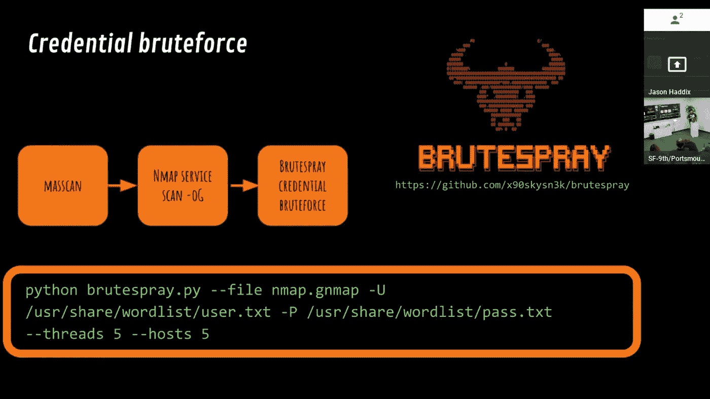

# SqR00t 攻击性安全技术讲座

> 原文：<https://medium.com/square-corner-blog/sqr00t-offensive-security-tech-talks-1353784216aa?source=collection_archive---------4----------------------->

> 注意，我们已经行动了！如果您想继续了解 Square 的最新技术内容，请访问我们的新家[https://developer.squareup.com/blog](https://developer.squareup.com/blog)

Square 的信息安全团队每季度举办一次安全会议 Square R00t，其中包括几次与安全和数据隐私相关的闪电谈话。

最近，Jason Haddix、Chris Rohlf、Jake Heath 和迈克尔·罗伯茨在 Square 旧金山办公室的“Square SqR00t —攻击性安全”活动中发表了关于信息安全的演讲。(感谢所有出席的人！)其中两次演讲被录制下来，现在可以在我们的[广场工程 YouTube 频道](https://www.youtube.com/user/SquareEngineering)上看到。尽情享受吧！

# 通过 JS 追踪用户输入是工具——杰克·希斯和迈克尔·罗伯茨

Jake 和 Michael 展示了他们编写的一个工具，用于在渗透测试中自动查找跨站脚本。

# 紧急侦察——杰森·哈德克斯

Jason 提出了他的方法来寻找他需要攻击的公司的目标。

**如果你有兴趣看更多这样的讲座(或者做一个讲座！)，一定要参加我们接下来的 Square R00t 活动！我们计划在 2018 年第四季度举办两场活动:**

*   2018 年 11 月 14 日，我们在纽约的第一个广场 R00t。
*   我们在旧金山的下一次活动将于 12 月 12 日举行。

一旦我们更进一步，我们将在 SquareEng Twitter 账户上分享更多细节。

不要忘记订阅 [YouTube 频道](https://youtube.com/channel/UCNpr4Uyoxie4Dxa_RAgpriA)以获取更多精彩内容！