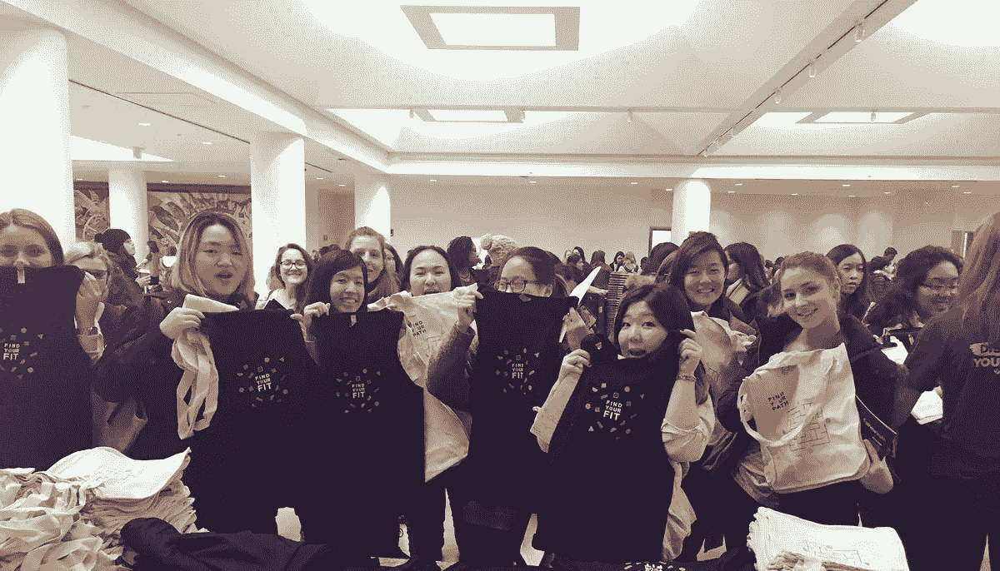
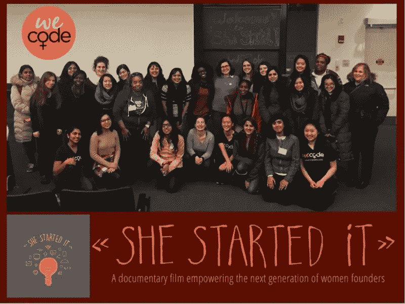

# WeCode 哈佛广场

> 原文：<https://medium.com/square-corner-blog/square-at-wecode-harvard-97485545c5ed?source=collection_archive---------6----------------------->

## “东北格蕾丝·赫柏”的授权、热情和灵感。

> 注意，我们已经行动了！如果您想继续了解 Square 的最新技术内容，请访问我们在 https://developer.squareup.com/blog[的新家](https://developer.squareup.com/blog)

*由* [*萨琪梅塔*](https://twitter.com/callmesaqi)

本月早些时候，我有幸再次参加了哈佛大学的[**WeCode Harvard**](http://www.wecodeharvard.com/)。每年，该会议——代表女工程师代码——汇集了来自世界各地的 500 名对技术和创业充满热情的女性。这个周末充满了令人难以置信的活动，所有这些都强调了一个事实，即女性工程师群体非常强大、支持、参与，并且发展迅速。

被认为是“东北的格蕾丝·赫柏”，WeCode 是小组讨论、炉边聊天、开发会议、主题演讲、网络活动和职业展览会的结合。最令人印象深刻的是，这个会议完全是学生办的。作为一个以策划和运营活动为生的人，这是一项艰巨的任务。

一走进 WeCode，你就能感受到它的能量。在 WeCode 的过程中，我们清楚地看到，虽然科技行业的女性是一个极其多样化的群体，但每个人都有一个共同的目标:解决世界上的核心问题，让世界变得更美好。

周六，Square 工程师 [Marie Chatfield](https://fairygodboss.com/articles/fairygodboss-of-the-week-marie-chatfield) ，我们 WomEng 社区的成员，主持了一场关于构建&部署应用&服务器的[售罄会议](https://twitter.com/callmesaqi/status/827911586257965057)。我们还有幸听到了著名技术专家 Latanya Sweeney 教授的主题演讲，她是第一位获得麻省理工学院计算机科学博士学位的黑人女性。我们还传播了即将到来的 [Square 代码营](https://squareup.com/code-camp)的消息，这是 Square 为考虑或追求工程职业的年轻女性提供的沉浸式项目，将于今年夏天首次在亚特兰大举行。

那天晚些时候，我在一个关于在课堂和工作场所促进包容性的小组讨论会上发言。这是一个我非常想加入的小组，因为在技术领域招聘更多女性只是等式的一半:我们需要确保公司提供工具和资源来创造一个积极、包容的环境，并留住多样化的人才。在 Square，我们致力于通过多样化的努力和广泛的策略来发展一个强大的社区。例如，我们在 Square 和女性工程社区都有领导团队、会议和赞助活动。除此之外，我们还有许多额外的员工资源小组，如 LatinX、Black Squares Association 和 Squeers。对 GraceHopper 等活动的支持始于高层，包括 CEO 和高管的参与和支持。

会议的亮点是 Square 放映了[她开创了它](http://www.shestarteditfilm.com/)，这是一部关于赋予下一代女性创业者权力的纪录片。我们很荣幸地邀请到了这部电影的导演诺拉·波吉，并促成了一次互动问答，她分享了制作这部电影的意图、她学到了什么，以及她是如何驾驭风险投资世界的。

周日，我参加了一个关于[的炉边谈话，充分利用你的实习机会。](https://twitter.com/callmesaqi/status/828297041298198530)我谈到了如何选择一家公司，做决定时要考虑哪些因素，如何明智地利用时间，并产生影响。会议以招聘会结束，如你所见，我们的桌子上挤满了想在 Square 工作的女性！

虽然科技和计算机科学有许多形式(一个称为 CS+x 的术语)，但每个行业/垂直领域都需要更多女性来担任科技角色。参加一个充满女性赋权和热情的周末真是太棒了，这些女性正处于职业生涯的早期阶段，并受到鼓励留在 CS-事实上，如此受鼓舞，以至于#WeCode2017 成为 Twitter 上的趋势！有许多女性导师和男性盟友非常愿意在学校和职业建议方面提供帮助，克服冒名顶替综合症，并成为彼此的啦啦队员——这只是一个伸出援手的问题。

在会议期间，我问了一些在场的了不起的女性，为什么她们选择参加，为什么她们认为 WeCode 如此重要:

“WeCode 大会可能是我在春季学期最喜欢的事情之一，因为我喜欢来这里看到各种各样的女性(偶尔也有男性)。与老朋友重新联系，结识新朋友，并有机会与公司面对面交流，总是非常有趣。我认为这 100%支持科技行业的女性，因为它为我们所有人提供了一个机会，让我们互相帮助，感受到被赋予的权力、被爱和被支持。”——[*塔伦·库比亚里*](https://www.linkedin.com/in/tarlon-khoubyari-901343100) *，UNC 格林斯博罗*

“我学到的很多东西并不局限于如何获得有价值的教育经验或如何在工作中突破界限，而是如何过上真正充实的生活。我们应该努力创造每一个教育环境，从教室到会议室，一个心理安全的实验空间，即使失败也称之为成功。其次，将技术与另一个领域结合起来是一种令人难以置信的大开眼界的体验。在尊重另一个研究领域的同时，找到一种融入技术的方法，就是在一个充满新挑战的新领域进行探索。”——[*莎伦罗伊，*](https://www.linkedin.com/in/sharonroy13) *佐治亚大学*

我确信 WeCode 将继续成为东北地区的首要会议之一，并很高兴成为这样一个支持社区的一部分，一个像 Square 这样的公司继续投入时间和资源培养的社区。

Saqi Mehta 是一名职业顾问，他领导着 Square 的大学招聘团队。她对教育充满热情，尤其是科技领域的女性，并且是统治集团**的共同创始人。Saqi 是国家技术多样性杂志和 500 英里的董事会成员。在* [*推特*](https://twitter.com/callmesaqi) *上向她问好！**