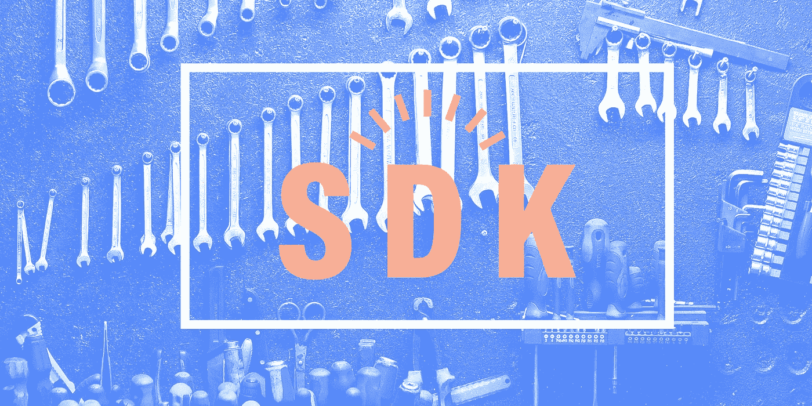

# 方形连接 2 . 8 . 0 SDK

> 原文：<https://medium.com/square-corner-blog/square-connect-2-8-0-sdks-f843b31ced65?source=collection_archive---------3----------------------->



> 注意，我们已经行动了！如果您想继续了解 Square 的最新技术内容，请访问我们的新家[https://developer.squareup.com/blog](https://developer.squareup.com/blog)

我们的 SDK 的最新版本提供了一些新的有用的特性。如果您还没有实现，那么您很幸运；如果您已经实现了，那么请继续阅读，了解您可以通过升级获得的很酷的新功能。

## 这个版本中有什么

*   我们向 Connect v2 客户 API 添加了排序功能
*   更新了 Connect v1 付款 API，以包括有关附加费的信息
*   对项目数据类型进行了改进。

## 新功能:列表客户排序(Connect v2)

[ListCustomers](https://docs.connect.squareup.com/api/connect/v2#endpoint-listcustomers) 端点现在提供了使用`sort_field`和`sort_order`参数按照客户的创建日期对客户进行排序的能力。以前， [ListCustomers](https://docs.connect.squareup.com/api/connect/v2#endpoint-listcustomers) 返回按姓氏字母顺序排序的客户，并将他们的名字作为第二排序关键字。您现在可以使用`sort_field`参数来指定`CREATED_AT`(按客户创建的日期和时间排序)或`DEFAULT`(按姓名的字母顺序排序)。此外，还可以指定`sort_order` ( `ASC`表示升序，`DESC`表示降序)。

一些 PHP 示例代码按照创建日期降序列出客户:

示例输出:

```
>>Karlson, Carl created at 2018–06–11T03:44:22.323Z>>Victoria, Erin created at 2018–06–11T03:43:44.775Z>>Buckingham, Bill created at 2018–06–11T03:43:12.57Z>>Addison, Adrian created at 2018–06–11T03:42:51.657Z>>Thomson, Tim created at 2018–02–20T21:36:07.207Z>>Thomson, Frances created at 2018–02–19T04:02:19.612Z
```

## 新功能:付款中的附加费明细(连接 v1)

[支付 API](https://docs.connect.squareup.com/api/connect/v1#payments) 现在返回关于应用于支付的[附加费](https://docs.connect.squareup.com/api/connect/v1#datatype-paymentsurcharge)的信息。在 API 发布之前，附加费是总销售额的一部分，但并没有单独列出。现在，你可以明确地阅读一个应用附加费放在一个付款和做所需的计算。

新功能引入了以下新数据类型:

*   `SurchargeMoney`数据类型:应用于付款的所有附加费的总额。
*   数据类型:与付款相关的所有附加费的列表。
*   数据类型:应用于付款的附加费。附加费的一个例子是自动约满酬金，这是一种适用于每笔付款的固定费率附加费，通常基于聚会的规模。

当您调用 ListPayments 和 RetrievePayment APIs 时，它们将返回包含附加费信息的支付对象。

## 改进:项目(连接 v1)

项目现在将提供两个新属性:

*   `category_id`:表示物品的类别(如果有)
*   `available_for_pickup`:表示商品是否可以添加到商家在线商店的提货订单中。

# 这些新的 SDK 何时何地可用？

现在还有 GitHub。

## 在 GitHub 上找到最新的 SDK 及其文档:

> PHP:[https://github.com/square/connect-php-sdk](https://github.com/square/connect-php-sdk)
> 
> C#/。净:[https://github.com/square/connect-csharp-sdk](https://github.com/square/connect-csharp-sdk)
> 
> 露比:[https://github.com/square/connect-ruby-sdk](https://github.com/square/connect-ruby-sdk)
> 
> python:[https://github.com/square/connect-python-sdk](https://github.com/square/connect-python-sdk)
> 
> JavaScript(节点):[https://github.com/square/connect-javascript-sdk](https://github.com/square/connect-javascript-sdk)
> 
> Java:[https://github.com/square/connect-java-sdk](https://github.com/square/connect-java-sdk)

*想要更多？* [*报名*](https://www.workwithsquare.com/developer-newsletter.html?channel=Online%20Social&sqmethod=Blog) *参加我们每月一期的开发者简讯或来广场打招呼 dev* [*松弛频道*](https://squ.re/slack) *！*