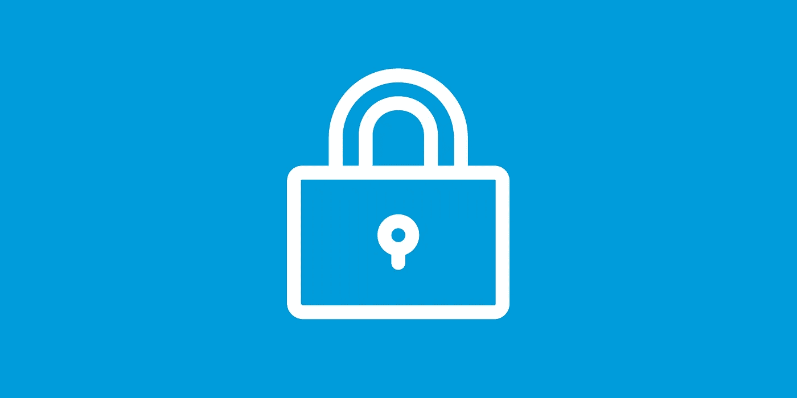

# Square 第三次当选支付卡行业安全标准委员会顾问委员会成员

> 原文：<https://medium.com/square-corner-blog/square-elected-to-a-third-term-on-the-payment-card-industry-security-standards-councils-board-of-ec105431e2ea?source=collection_archive---------4----------------------->

> 注意，我们已经行动了！如果您想继续了解 Square 的最新技术内容，请访问我们的新家[https://developer.squareup.com/blog](https://developer.squareup.com/blog)

我们很高兴地宣布，Square 第三次当选支付卡行业安全标准委员会顾问委员会成员。

支付卡行业安全标准委员会(PCI SSC)通过提供行业驱动的、灵活有效的数据安全标准和计划，帮助企业检测、缓解和防止网络攻击和违规，从而引领全球跨行业提高支付安全性的努力。顾问委员会代表 PCI SSC 全球参与组织，以确保全球行业参与 PCI 安全标准和计划的制定。

Square 的 Todd Aument 和 Shane Hamilton 将与 29 名董事会成员一起加入 PCI 安全标准委员会，努力保护全球支付数据的安全。作为战略合作伙伴，他们将为 PCI SSC 计划和项目带来 Square 独特的行业、地理和技术洞察力。

PCI SSC 执行董事 Lance J. Johnson 说:“顾问委员会提供行业专业知识和观点，影响和塑造 PCI 安全标准和计划的发展。我们期待与 Square 合作，努力帮助组织在全球范围内保护支付数据。”

PCI SSC 国际总监 Jeremy King 表示:“我们需要来自垂直行业、国家和地区的声音，以帮助确保我们提供最佳标准和最佳保护来应对当今的现代网络犯罪。我们很高兴有 Square 的 PCI SSC 顾问委员会提供重要的见解，并帮助我们在已经做出的巨大努力的基础上提高全球支付安全性。”