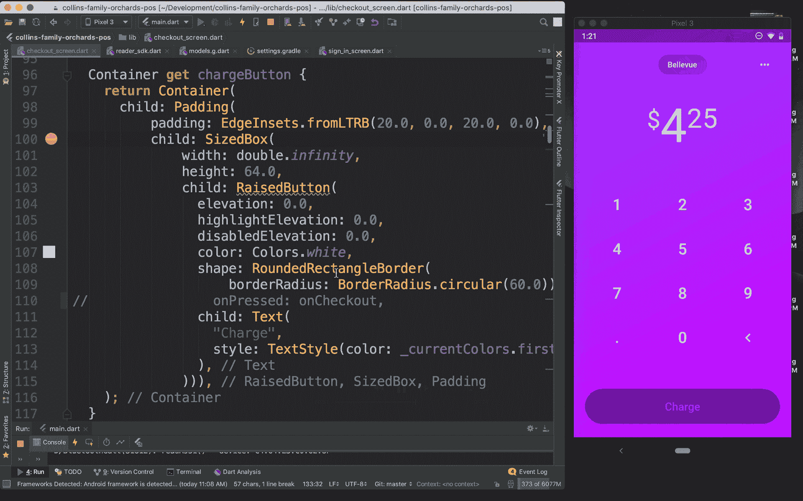
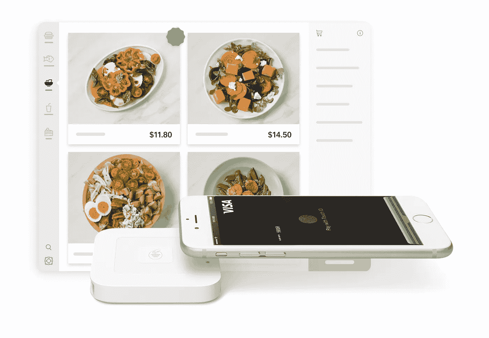
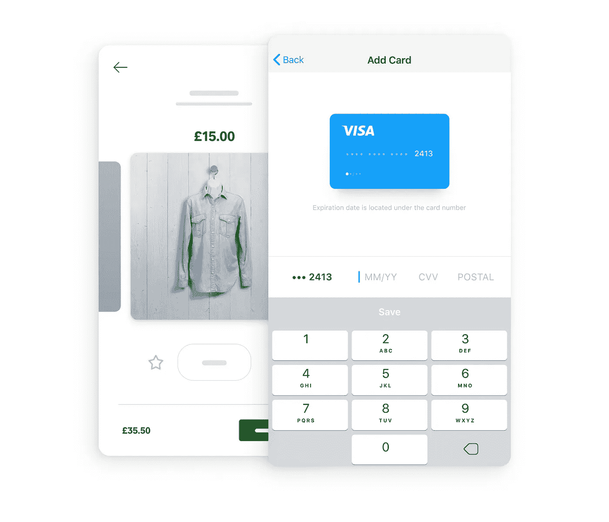

# Square + Flutter:漂亮、快速的移动支付应用

> 原文：<https://medium.com/square-corner-blog/square-flutter-beautiful-fast-mobile-payment-apps-539995d2e23a?source=collection_archive---------0----------------------->

## 使用 Square Flutter 插件进行应用内和个人支付

> 注意，我们已经行动了！如果您想继续了解 Square 的最新技术内容，请访问我们在 https://developer.squareup.com/blog[的新家](https://developer.squareup.com/blog)

[Flutter](https://flutter.io/) 是谷歌的新框架，用于从单一代码库在 iOS 和 Android 上构建漂亮的原生应用。今天，我们很高兴地宣布，Square 和 Flutter 已经合作[创建插件](https://squareup.com/flutter)，从 Flutter 应用程序中获取应用程序内和个人支付！

> 我们很高兴看到 Square 为 Flutter 应用提供一流的支付服务。Flutter 开发者现在有了一个很好的方法，只需要几行代码就可以从他们的应用程序中获得支付。Square 是一个很好的合作伙伴:他们非常了解客户的需求，并且已经建立了一个我们认为对许多开发者来说很有吸引力的解决方案。
> 
> — *Tim Sneath，谷歌*Flutter&Dart 集团产品经理

## 亲自付款

今年早些时候，我们推出了用于当面支付的 [Square Reader SDK](https://squareup.com/us/en/developers/reader-sdk) 。借助 Reader SDK，您可以在自己的 iOS 或 Android 应用程序中使用 Square 硬件快速轻松地进行支付。今天我们宣布了 Reader SDK 的[方形颤动插件。](https://squareup.com/flutter)

通过向你的 Flutter 应用程序添加几行代码，你现在可以使用 Square 阅读器设备进行支付。只需向插件提供金额和货币，你的应用程序将能够通过刷卡、蘸取或轻触来进行卡上支付。

下面是一个示例`onCheckout()`函数，它使用提供的参数启动插件检查流程:

Find all of the available checkout parameters over [on the GitHub repo](https://github.com/square/reader-sdk-flutter-plugin/blob/master/doc/reference.md).

我们现在可以启用之前禁用的“充电”按钮，带有一个`onPressed: onCheckout`和一个颤动热重装:

Hot reloading Reader SDK Flutter plug-in on Android simulator.

在 [Flutter 现场活动](https://www.youtube.com/watch?v=NQ5HVyqg1Qc&t=142m53s)上，我们展示了 [Collins Family Orchards](https://www.collinsfamilyorchards.com/) 定制的 Flutter 应用程序，该程序使用 Square 进行当面支付。柯林斯家庭是第四代有机家庭农场，多年来一直在 Square 的多个地点销售农产品。他们喜欢使用 Square，但是由于供应商在几个农贸市场之间移动，他们面临着跟踪销售地点的挑战。

为了跟踪每个地点销售的产品，他们创建了一个定制的品牌销售点应用程序，该应用程序使用 Square Reader SDK 的 [Flutter 插件。使用这个位置感知应用程序，他们可以看到何时何地完成了销售。借助 Flutter，Collins Family 很快创建了一个与 Square 硬件集成的漂亮应用程序，以简化他们的支付。](https://squareup.com/flutter)

## 应用内支付

今天，我们还宣布了我们的应用内支付 Flutter 插件。除了客户的移动设备之外，此功能不需要任何硬件。有了 Flutter，你只需要为 iOS 和 Android 编写一次这段代码。Square + Flutter 消除了构建支付应用的所有痛苦和复杂性。

在你的应用程序中，客户可以输入他们的卡号或使用数字钱包进行支付。将应用内支付插件添加到您的 Flutter 应用中，定制外观和感觉，并将支付复杂性留给我们。

我们的应用内支付 Flutter 插件支持流行的钱包，包括 Google Pay 和 Apple Pay(仅限美国早期使用)。我们还支持卡存档，这使您能够在售后安全地存储卡，以简化未来购买的体验。总之，这个插件使你的客户从你的 Flutter 应用程序中购买更多东西变得无摩擦和无缝，从而增加转化率和销售额。

您可以[在此](https://www.workwithsquare.com/in-app-sdk.html)注册，以便提前使用您的手机应用程序使用 Square 进行支付。

## 全渠道支付

借助 Square Flutter 插件，您的在线、应用内和个人定制应用支付都可以报告到一个地方。作为 Square 卖家，您还将获得专门的争议管理团队和我们由机器学习驱动的欺诈检测的优势。无论您在哪里付款，您现在都可以享受 Square 的好处。

> 我们已经关注 Flutter 有一段时间了，很快就爱上了它快速的开发体验和漂亮的输出。我们的许多客户一直要求我们生产 Flutter 插件，看到 Flutter 的快速发展，我们知道我们必须优先支持它。
> 
> *— Carl Perry，Square 开发者平台总经理*

[今天试试 Square Flutter 插件](https://squareup.com/flutter)。我们非常期待看到你将会建造什么！

*在*[*@ Square dev*](https://twitter.com/@SquareDev)*发微博给我们，加入我们的* [*Square devs Slack 社区*](https://squ.re/slack) *，报名参加我们的* [*简讯*](https://www.workwithsquare.com/developer-newsletter.html?channel=Online%20Social&sqmethod=Blog) *。也欢迎投稿到我们的* [*开源 GitHub repos*](http://square.github.io) *。*

