# 用 Laravel 实现正方形

> 原文：<https://medium.com/square-corner-blog/square-implementation-with-laravel-22a4ad3fe1ec?source=collection_archive---------1----------------------->

## 我们的朋友 Nikola Gavri 为 Square 撰写的客座文章

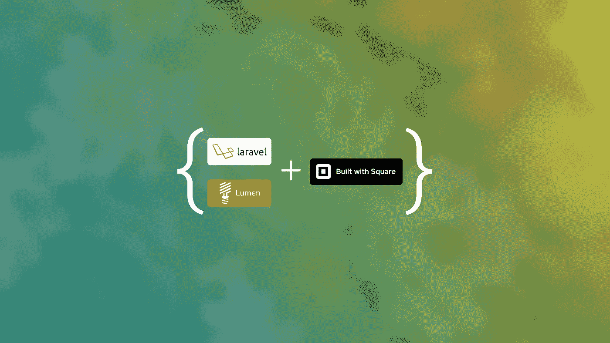

> 注意，我们已经行动了！如果您想继续了解 Square 的最新技术内容，请访问我们的新家[https://developer.squareup.com/blog](https://developer.squareup.com/blog)

# *背景及介绍*

你好！我是 Nikola Gavri，塞尔维亚尼什的一名软件工程师。我在几个项目中使用了 [Square](https://squareup.com/developers) ，在搜索并找到了一个用于 [Laravel 框架](https://laravel.com/)的库之后(基本上没有 Square 与 Laravel 的集成)，我决定创建自己的库。在收到开发人员要求各种功能的电子邮件后，我决定让 Laravel Square 对开发人员友好、易于使用，并且设置起来不费力。

# 什么是拉勒维尔广场？

[Laravel Square](https://github.com/NikolaGavric94/laravel-square) 是 Laravel/Lumen 的一个包，它增加了基本的支付功能，并支持在有折扣和税的交易中为订单添加客户和明细。包装取决于 [Laravel](https://laravel.com/) 或 [Lumen](https://lumen.laravel.com/) ≥ 5.5。

# 如何在我的应用程序中设置 Laravel Square？

本教程不包括设置你的支付表单——你可以在 Square 的官方文档[中查看。](https://docs.connect.squareup.com/payments/sqpaymentform/sqpaymentform-setup)

```
laravel new square-test// orcomposer create-porject laravel/laravel square-test
```

设置好项目后，安装库并根据需要进行配置。

```
composer require nikolag/laravel-square
```

眼下，目前的版本是`2.1.2`。

现在我们已经安装了这个库，我们需要配置它来与我们的应用程序一起工作。首先要做的是使用以下命令生成一个基本配置文件:

```
php artisan vendor:publish --tag=nikolag_config
```

一旦您发布了配置文件，有几个关键概念将帮助您进行后续步骤:`default`和`connections`。`default` 选项代表默认的支付实现，将在利用合同而不是门面方法时使用。`connections`选项描述了所有可能的连接及其设置，其设计思想是核心包可用于创建其他支付实现，因此需要一系列连接及其配置。

在库安装和配置之后，我们需要为我们的项目设置一些环境变量。

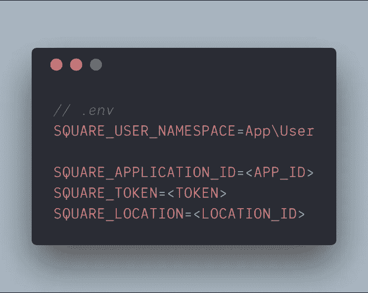

Environment configuration

# 拉勒维尔广场图书馆是做什么用的？

使用案例包括:

*   一次性付款(单笔交易)
*   与客户的付款
*   订单付款
*   订单和客户付款

# 我如何使用拉勒维尔广场图书馆？

为了向客户收费，我们需要向我们的用户类( **merchant** )添加一个特征，然后运行`php artisan migrate`来生成库工作所需的表。

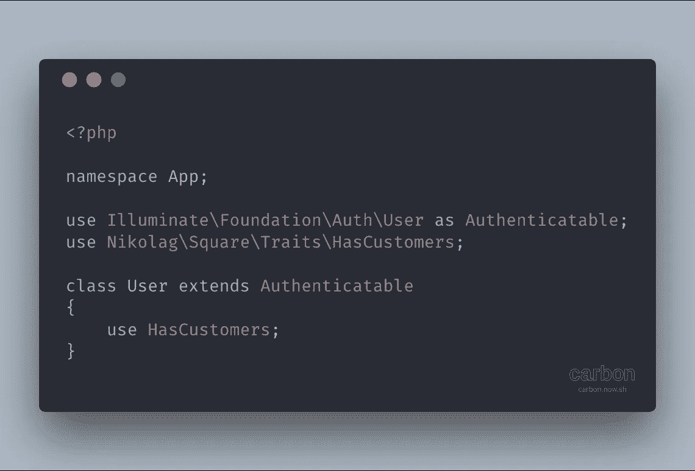

User class (merchant) with a trait

现在您已经设置好了一切，您可以开始使用一次性收费并向您的客户收费。下一步是创建触发我们收费的路线。让我们在`routes/web.php`内的网络路线中注册这些新路线:

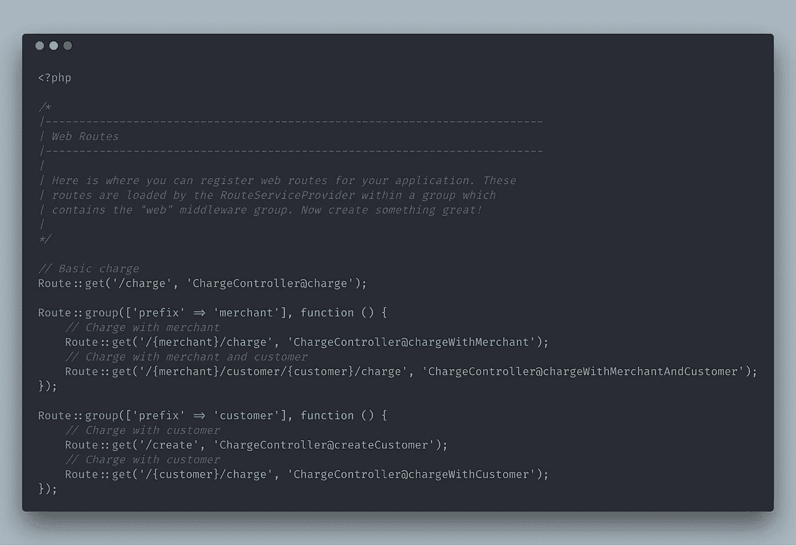

Web routes

设置好路由后，让我们使用以下命令创建一个控制器来处理我们的呼叫:

```
php artisan make:controller ChargeController
```

然后我们需要创建并实现我们的收费方法，如下所示:

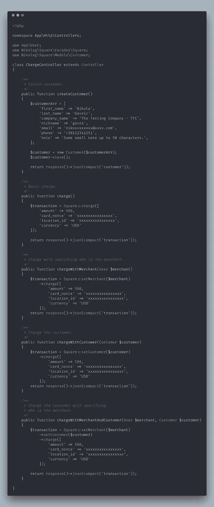

Charge controller and its methods

您会注意到一个熟悉的模式，即如何链接方法并构建您的费用。如果你想了解更多关于我们方法的信息，请查看[维基页面](https://github.com/NikolaGavric94/laravel-square/wiki)获取清晰的描述。现在我们已经配置了控制器，实现了方法，我们可以通过实际触发这些已定义的路由来测试我们的调用，并查看我们得到了什么响应。 ***我强烈建议您在测试时使用您的沙盒凭证。***

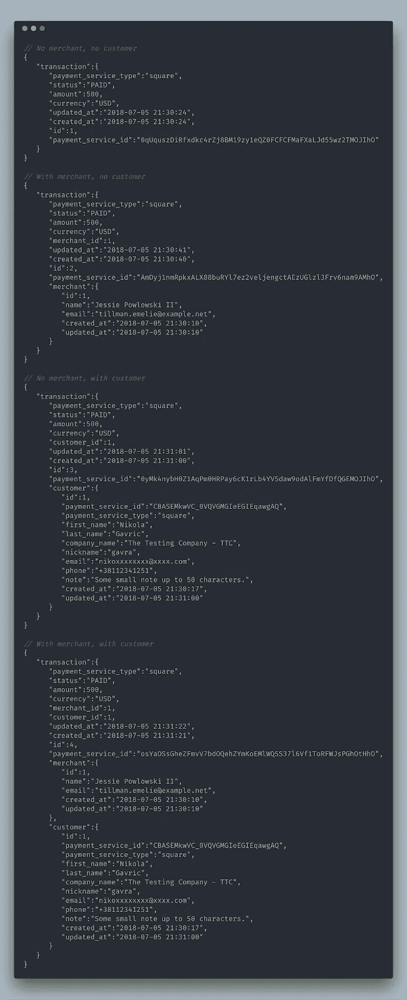

Endpoint responses

在上面的例子中，我们可以看到，随着我们向它提供更多的信息，我们的事务是如何建立起来的。我们还可以看到，我们的交易和我们的客户都有`payment_service_type` 和`payment_service_id.`，这是因为我们实际上是将这些实体/模型/对象保存在支付库(在本例中是 Square Vault)中。

好吧，但是如果我的客户下订单，使用一次性折扣，然后我必须申请税收呢？

这就是我们订购系统的收费流程派上用场的地方。

通过订单向客户收费很简单。您所要做的就是定义您的订单模型，使用我们提供的`HasProducts`特性，并更新您的环境文件。

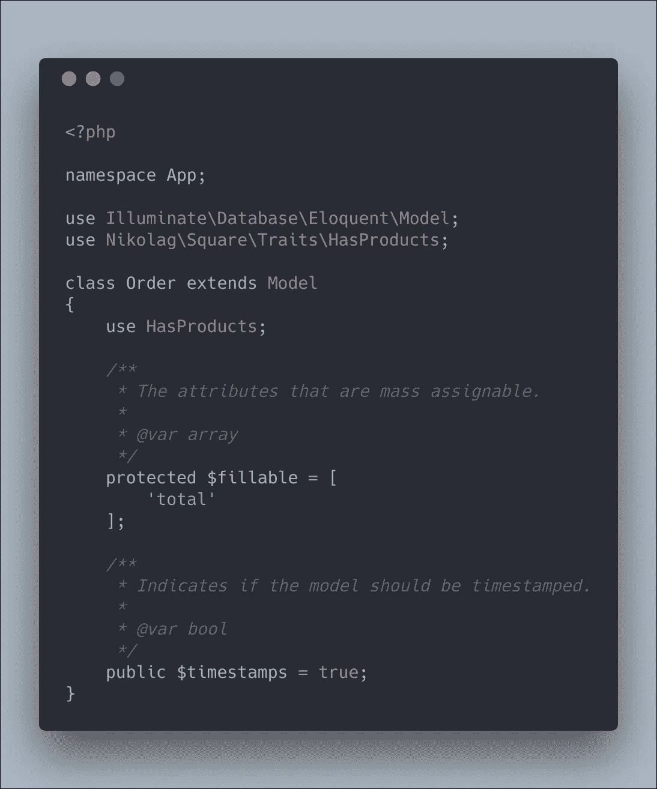

Order class and HasProducts trait

定义订单类后，您可以向其中添加任意数量的附加字段。您可以创建自己的迁移文件，以您想要的任何方式定制您自己的顺序，并且您可以相应地更新您的环境文件，只要您使用我们的 trait `HasProducts`。

接下来，我们应该看看迁移:

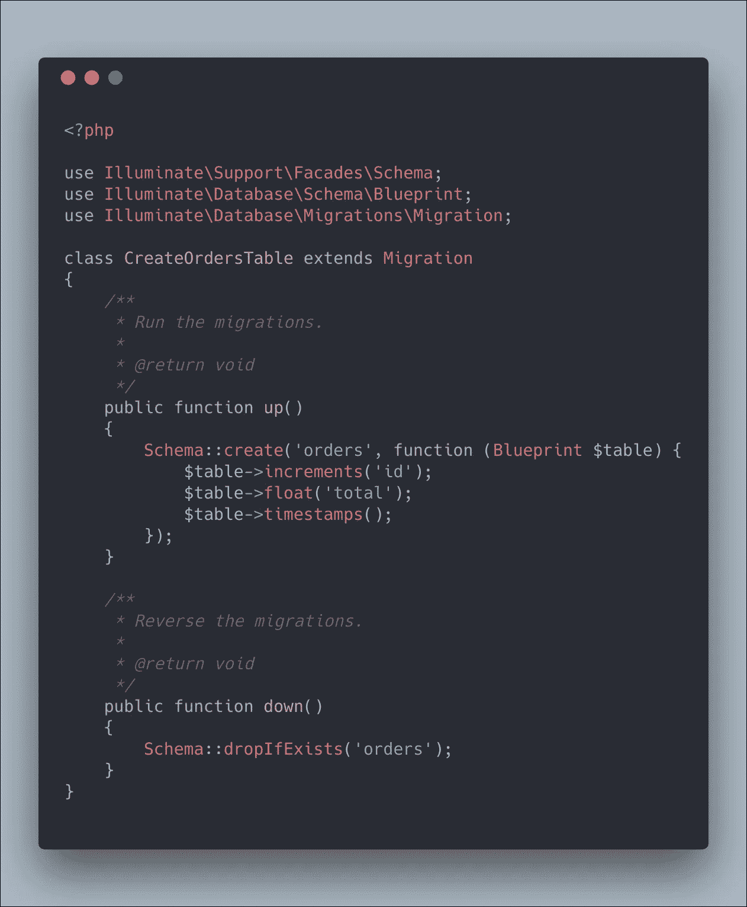

Order migration file

我们添加了一个名为“Total”的新列来存储订单的总值，因此我们不必每次都重新计算。同样:您可以向 Order 类中添加任意多的列/属性，但是出于本教程的目的，我们将添加 Total。

在完成迁移和模型本身之后，是时候更新我们的环境并告诉我们的应用程序我们将对订单系统使用哪个模型了。

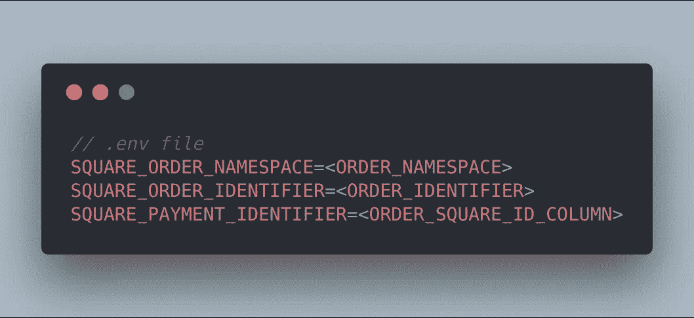

Environment configuration for Order system

前两个环境变量很清楚:第一个是完全限定的类名(名称空间)，第二个是订单模型的主键。这两个变量默认设置为`App\Order`和`id`。如果您没有任何组合键作为您的主键或字符串，并且您的名称空间分组在`App`下，您可以跳过这一步。第三个变量`SQUARE_PAYMENT_IDENTIFIER`表示我们将存储 Square service 中保存的订单 ID 的列名。`SQUARE_PAYMENT_IDENTIFIER`变量也有一个默认值，但是如果由于某种原因它已经被使用，你可以定义你自己的名字。**要查看我们正在使用的所有变量，可以看一下** `**config/nikolag.php**`。

我们的下一步是通过简单地创建一个新的控制器来实现我们之前在 web routes 中创建的端点。让我们运行这个命令:

```
php artisan make:controller OrderController
```

现在是时候实现我们的方法了(如下所示):

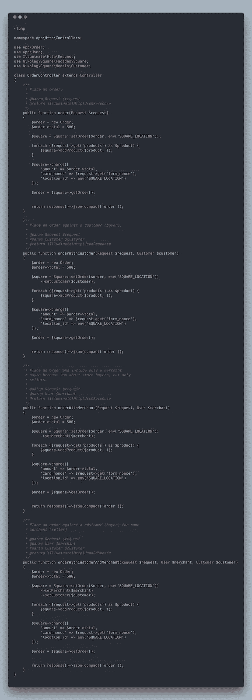

Order controller with implemented methods

看起来要分析一大块代码！不，不完全是——如果你只看方法名，就很清楚我们要做什么。如果您在`Square` facade 上看到我们链接的方法，那就更容易了，我们可以按照我们想要的任何顺序链接这些方法。

**我们不会在本操作指南中讨论税收和折扣，您可以参考我们的** [**wiki 页面**](https://github.com/NikolaGavric94/laravel-square/wiki/Order-Examples#create-and-save-an-order) **，查看每个场景的具体示例。**

您现在一定会问自己，他从请求本身获得的这些产品是什么？

# 什么是产品？

产品可以是一个关联数组，也可以是雄辩模型的集合。为什么？因为我们不想总是重新创建我们现有的产品，我们希望将它们存储并记住在某个地方，只在我们需要的时候再使用它们。在这种情况下，我们将使用雄辩的模型；另一方面，如果我们只是创建一个新的项目或产品的定制版本，我们总是可以创建一个独特的产品本身。

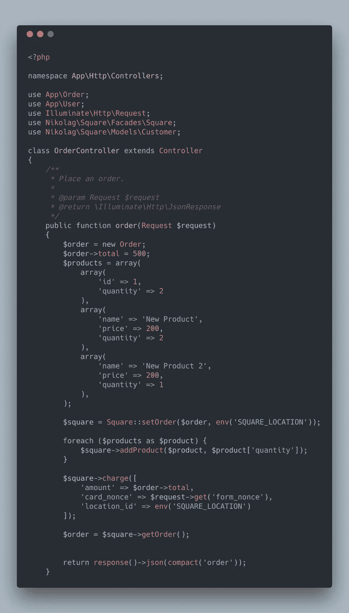

Products as an associative array

上面我们可以看到一个产品作为一个关联数组的极简示例。所有这些产品将为我们创建和存储，并在交易中使用。如果我们想的话，我们可以在以后检索这些相同的产品并重复使用它们。

现在，我们将检索并重新使用已经保存的产品。

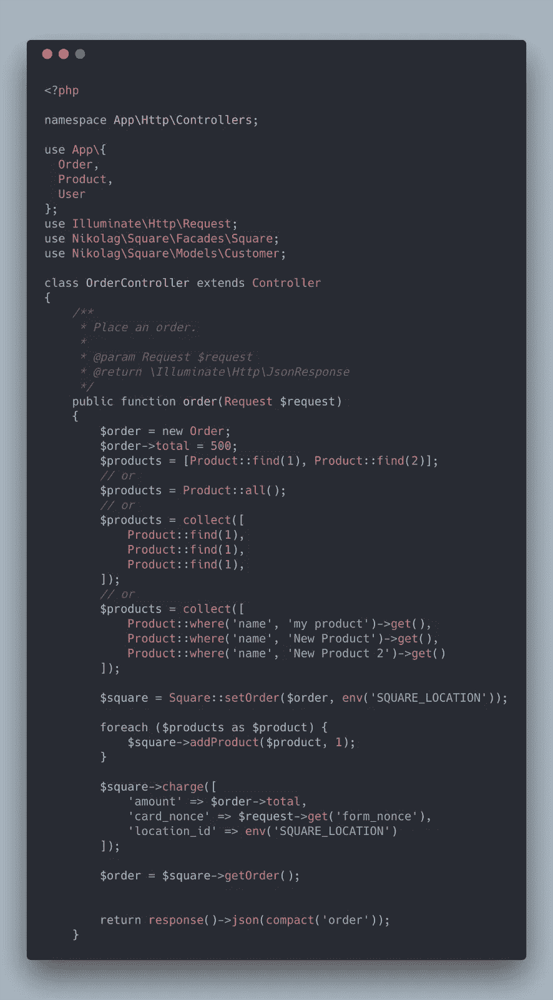

Products as Eloquent models

如您所见，我们将它们作为普通的雄辩模型进行检索，并相应地对它们进行查询。

一句话:作为一名开发人员，这个库可以为您提供尽可能多的灵活性。它为您节省了时间和资源，您可以将这些投入到自己的实现中。较少担心遵从性、集成、异常处理等等。

# 结论

终于！大量的时间、知识和努力投入到构建这个看似很小的库，使它变得灵活、有益、快速、可靠和对开发人员友好。我的目标是创建一个与支付网关无关的可靠包。

如果你想克隆这个项目，你可以去这个 [github 链接](https://github.com/NikolaGavric94/laravel-square-integration)下载 zip 格式或者克隆并开始编码。你也可以在 github 的 [NikolaGavric94](https://github.com/NikolaGavric94) 上找到我。

感谢您阅读本教程，学习如何使用`laravel-square`库轻松向您的客户收费。只需实现库，即可享受。

*如果你有自己的故事，告诉我们吧！发微博给我们*[*@ square dev*](https://twitter.com/@SquareDev)*，加入我们的* [*Slack 社区*](https://squ.re/slack) *，和/或* [*订阅我们的简讯*](https://www.workwithsquare.com/developer-newsletter.html?channel=Online%20Social&sqmethod=Blog) *让我们知道！*