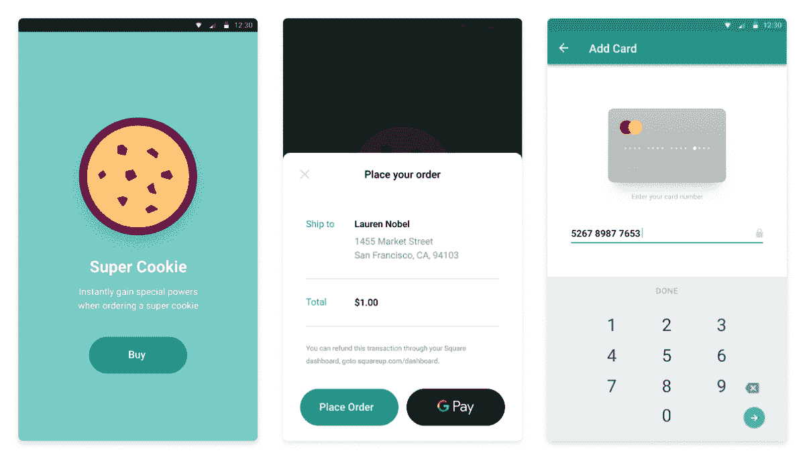

# React Native 的 Square 应用内支付 SDK

> 原文：<https://medium.com/square-corner-blog/square-in-app-payments-sdk-for-react-native-499520539d9a?source=collection_archive---------1----------------------->

## Square 应用内支付 SDK 的 React 原生插件

> 注意，我们已经行动了！如果您想继续了解 Square 的最新技术内容，请访问我们的新家[https://developer.squareup.com/blog](https://developer.squareup.com/blog)

自从我们的应用内支付 SDK 发布以来，我们已经收到了很多关于 React Native 何时可用的请求。它正式在这里！你可以简单地在 React 原生项目中`npm install — save react-native-square-in-app-payments`并遵循[这里](https://github.com/square/in-app-payments-react-native-plugin/blob/master/docs/get-started.md)的设置指南，开始在 React 原生应用中接受付款。

如果你还不熟悉[应用内支付 SDK](/square-corner-blog/introducing-square-in-app-payments-sdk-1fc93b32814c) ，它使开发者能够在他们自己的移动应用内接受 Square-powered 支付。

现在，说只安装 SDK 并继续前进太容易了，所以我们将深入研究我构建的 React 本机应用程序，以展示这是如何工作的。

*Our Order Ahead React Native App for buying Square Legos and demoed at ShopTalk.*

# 获取您的开发人员环境设置

先决条件:

*   [Android Studio](https://developer.android.com/studio) (点击链接下载安装)
*   [Xcode](https://developer.apple.com/xcode/) (可以通过 macOS 上的 App Store 安装)
*   [广场账户](https://squareup.com/us/en/developers)(此处报名)
*   [React Native CLI](https://facebook.github.io/react-native/docs/getting-started) (遵循“使用本机代码构建项目”指南)

需要明确的是，如果你计划让你的应用程序在各自的平台上运行，并希望使用它们的模拟器进行开发，你只需要 Android Studio 或 Xcode。

# 步骤 1:安装和设置 React 本机 CLI

`npm install -g react-native-cli`

确保遵循 [React Native](https://facebook.github.io/react-native/docs/getting-started) 安装指南中的*“使用本机代码构建项目”*。使用`react-native-square-in-app-payments`插件需要应用内支付 SDK，这是 iOS 和 Android 的原生代码。此外，遵循该指南的一部分要求您安装 React Native CLI(上面的命令),这有助于在开发时方便链接库和运行模拟器。

# 第二步:在你的项目中添加应用内支付反应插件

在你设置好 React Native 之后，你会想要按照 Square [指南将应用内支付添加到你的 React Native 项目](https://github.com/square/in-app-payments-react-native-plugin/blob/master/docs/get-started.md)中。如果你是从零开始，你可能想看一看[快速入门示例应用](https://github.com/square/in-app-payments-react-native-plugin/tree/master/react-native-in-app-payments-quickstart)，它展示了一个允许用户购买 cookie 的示例应用。您也可以下载示例应用程序，然后在那里进行修改。

*Quick-start App for React Native In-App Payments Plugin.*

# 使用应用内支付 SDK 进行 React 本地开发需要了解的事项

# React 应用内支付 SDK 的本机接口

**SQIPCore** —用于在 React 本地应用中初始化应用内支付 SDK。

**SQIPCardEntry** —处理标准信用卡表单捕获。值得注意的是，如果你想为你的用户在文件中存储一张[卡，那么你只需要使用这个接口，因为你不能使用数字钱包存储卡的详细信息。](https://docs.connect.squareup.com/payments/transactions/cookbook/save-cards-on-file)

**SQIPApplePay** —虽然名字相当简单，但是这个接口是用来处理 ApplePay 流程的。

**SQIPGooglePay** —与 Apply Pay 接口相同，但用于处理 GooglePay。

每个接口都有一些方法来启动流、处理错误或用户关闭表单，以及完成授权以获得一个 nonce(一次性使用的令牌)。您仍然需要有一个后端实现来使用 nonce，用于在客户档案中存储卡或处理交易。您可以在上的 [Square 文档](https://docs.connect.squareup.com/payments/in-app-payments-sdk/how-it-works)中找到更多关于该流程如何工作的信息。

# 路线/导航

尽管这可能会因您使用的库而异，但还是有必要解释一下我们在示例中使用的库。 [React 导航](https://reactnavigation.org/)是 React 原生应用中路由和导航的常用库。

您可以通过运行以下命令来添加它:

`npm install — save react-navigation react-native-gesture-handler`

`react-native link react-native-gesture-handler`

导航库的基本前提是在 React 本机应用程序的根目录下创建一个中心枢纽，可以控制在任何给定时间应该显示哪个“屏幕”。这个库有几种不同类型的导航，但是我们坚持使用[堆栈导航器](https://reactnavigation.org/docs/en/hello-react-navigation.html)。它的工作方式就像一个堆栈数据结构，让每个屏幕“继续”到堆栈，当用户返回时，它只是将它们弹出堆栈。

# 订单提前示例应用程序

为了*(如此微不足道)*展示 React 原生应用内支付插件可以做什么，我们创建了一个应用程序，让人们在会议上挑选自己的方形乐高人，并演示新的[订单推送测试版](/p/orders-push-public-beta-25bda7c31521)如何将其推入方形销售点(POS)。

在我们应用的基础上，我们使用来自 [React 导航](https://reactnavigation.org/)的`createAppContainer`和`createStackNavigator`来包装我们的 React 应用，并处理我们所有的路由和导航。这也是我们将使用`componentDidMount()`生命周期方法中的`SQIPCore`初始化应用内支付 SDK 的地方。

The root of the Order Ahead application.

我们通过只有两个屏幕来保持简单。主屏幕显示我们所有的产品(在这种情况下，乐高人)，另一个屏幕是我们的结帐。

应用程序中的许多代码都致力于设计组件的样式，这可能是它自己的博客文章。从这里可以学到的关键部分是如何与应用内支付 SDK 进行交互。

接下来，我们将深入我们的 Checkout screen，并查看 CheckoutScreen 组件的`componentWillMount()`方法。这是我们设置 iOS 卡入口主题的地方。

componentWillMount() method of our CheckoutScreen component.

然后，在启动信用卡表单流之后，我们必须创建一些生命周期方法来处理事件，并获取我们的 nonce 来处理卡的详细信息。

为了分解这一点，我们开始卡流的基本方法是`onStartCardEntry()`方法。然后我们有`onCardNonceRequestSuccess`、`onCardEntryCancel`和`onCardEntryComplete`来处理流程中的不同事件。

`onCardNonceRequestSuccess` —当我们使用应用内支付 SDK 成功请求 nonce 时进行处理，以便我们可以将其发送到我们的后端进行进一步处理。

`onCardEntryCancel` —应该用于处理用户在填写卡条目表单并触发卡随机数响应之前是否关闭该表单。

`onCardEntryComplete` —用于关闭表单，但也可用于处理应用程序的任何状态更新。

The React Native Order Ahead App in action.

现在，就我们的前端而言(在我们的 React 本机应用程序中)，这就是我们处理支付所需的全部内容。该应用程序应该只关心使用应用内支付 SDK 来安全地捕获那些卡的细节，获得随机数，将其传递到后端进行进一步处理，然后*对处理的结果做出* -ing *(再次，如此双关)*。

此外，需要明确的是，这只是在 React 本地应用中实现[应用内支付 SDK 插件](https://github.com/square/in-app-payments-react-native-plugin)的*一种*方式。你当然也可以添加对 Google Pay 和/或 Apple Pay 的数字钱包支持，这只是集中在演示卡流。

我们其余的创建订单和将订单推送到 Square POS、[收取交易费用](https://docs.connect.squareup.com/payments/transactions/overview)(接受付款)和/或[存储客户卡详细信息](https://docs.connect.squareup.com/payments/transactions/cookbook/save-cards-on-file)的功能将发生在您的后端。如果你有兴趣建立自己的应用程序，你可以点击链接了解更多关于我们的[订单推送测试版](/p/orders-push-public-beta-25bda7c31521)和我们的[文件交易卡](https://docs.connect.squareup.com/payments/transactions/cookbook)，或者[加入我们的 Slack 社区](http://squ.re/slack)寻求帮助。

如果你计划使用我们的 React 原生应用内支付插件在 Square 上开发一些东西，并想写点什么*(或任何与 Square 相关的东西)*，请加入我们的 [Slack 社区](http://squ.re/slack)并让我们知道*(你也可以加入进来打个招呼)*，我们总是很乐意谈论你正在开发的任何东西。

如果您想了解我们的最新内容，请务必关注这个[博客](https://medium.com/square-corner-blog) &我们的 [Twitter](https://twitter.com/SquareDev) 账户，并注册我们的[开发者简讯](https://www.workwithsquare.com/developer-newsletter.html?channel=Online%20Social&sqmethod=Blog)！我们还有一个 Slack 社区，用于与其他实现 Square APIs 的开发者联系和交流。