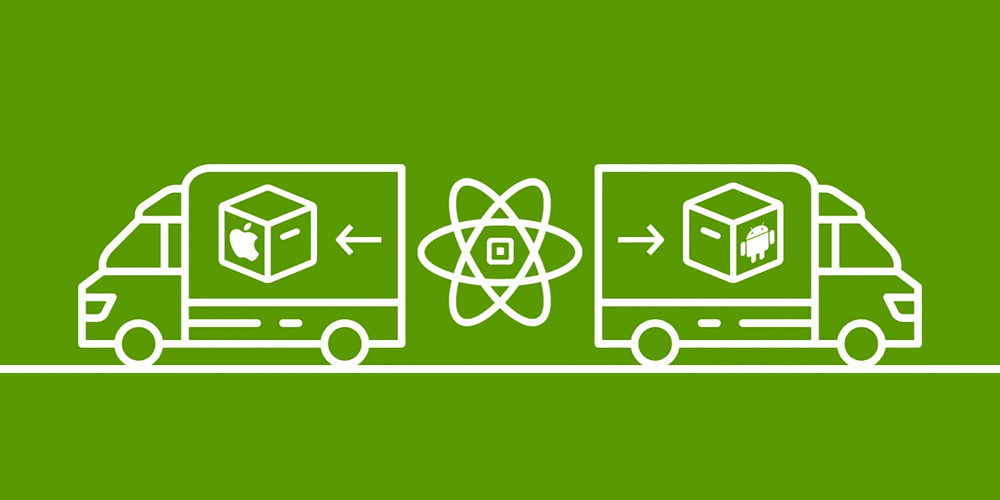
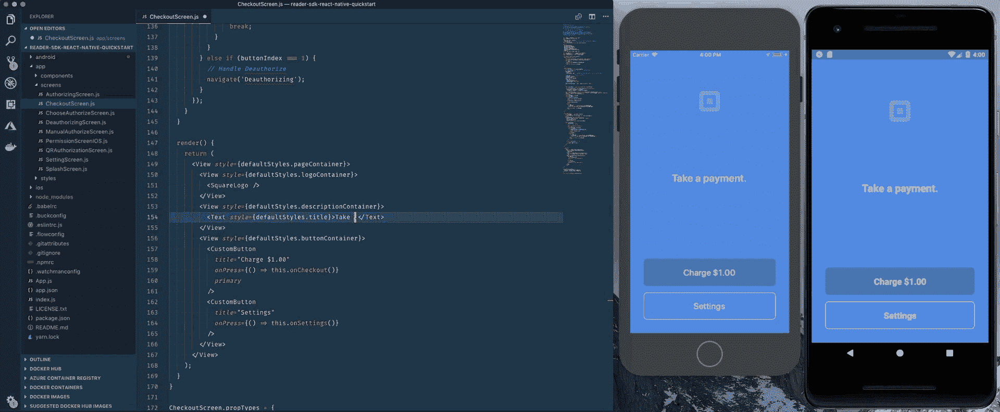
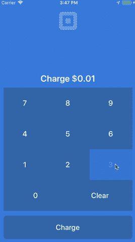

# React Native 的 Square Reader SDK

> 原文：<https://medium.com/square-corner-blog/square-reader-sdk-for-react-native-a1b6fc19c5c2?source=collection_archive---------2----------------------->

> 注意，我们已经行动了！如果您想继续了解 Square 的最新技术内容，请访问我们的新家[https://developer.squareup.com/blog](https://developer.squareup.com/blog)

八月初，我们宣布发布 iOS 和 Android 版的[阅读器 SDK](https://squareup.com/developers/reader-sdk) ,允许开发者构建他们自己的定制亲自支付体验。

现在，我们已经取得了突破性的 SDK，并将其包装在 React Native 插件中，您可以在自己的 React Native 项目中使用该插件。因此，无论你是一个希望创造终极面对面支付体验的跨平台专家，还是一个希望尝试新事物的 React 黑客，你现在都可以在你的项目*中`npm install react-native-square-reader-sdk`(一定要阅读我们的* [*快速入门指南*](https://github.com/square/react-native-square-reader-sdk/tree/master/reader-sdk-react-native-quickstart) *中关于安装原生依赖项的内容)*。

我们为我们的 Reader SDK 发布了一个 React 原生插件，以允许开发人员更容易、更快速地创建新的当面支付应用程序。我们知道 iOS 和 Android 开发者可以很容易地使用原生 SDK，但是在这里我们可以接触到任何 JavaScript 开发者。我们甚至有一个[快速启动](https://github.com/square/react-native-square-reader-sdk/tree/master/reader-sdk-react-native-quickstart)应用程序，可以为您提供一个创建自己的销售点、信息亭或定制亲自支付体验的起点。这很简单，只需调整一些 JSX，或者创建自己的组件，然后将它们连接到我们提供的接口。

**五分钟之内就可以在本地安装并运行一个应用程序。我甚至能够在一个小时内获得一个自定义键盘，输入任意值(当然，我在尝试时对我的 React Native 有点生疏)。我也不是一个移动开发人员，同时在 iPhone 和 Android 模拟器上运行应用程序对于开发时有一个响应反馈循环来说是非常强大的。您可以在每个设备上启用实时重新加载，并在保存时立即反映您的所有更改。**

Live reloading a React Native Square Reader app in iOS and Android simultaneously!

比方说，你带着我们的快速启动应用出去兜了一圈，想尝试制作自己的销售点应用。

你可以打开`[reader-sdk-react-native-quickstart/app/screens/CheckoutScreen.js](https://github.com/square/react-native-square-reader-sdk/blob/master/reader-sdk-react-native-quickstart/app/screens/CheckoutScreen.js)`并开始修改一些按钮来调整你的收费金额。

然后添加一些附加按钮，如下所示:

See the full examples of these modified files here: [https://gist.github.com/mootrichard/6d34a09f965d203a7eb4813b73d9bcbd](https://gist.github.com/mootrichard/6d34a09f965d203a7eb4813b73d9bcbd)

上面只是所提供的`[CustomButton](https://github.com/square/react-native-square-reader-sdk/blob/master/reader-sdk-react-native-quickstart/app/components/CustomButton.js)`组件的修改版本，看起来有点不同。然后我们添加我们自己的函数来添加一个值:

See the full examples of these modified files here: [https://gist.github.com/mootrichard/6d34a09f965d203a7eb4813b73d9bcbd](https://gist.github.com/mootrichard/6d34a09f965d203a7eb4813b73d9bcbd)

并将一个`currentValue`数组添加到我们的`CheckoutScreen`组件的状态中:

See the full examples of these modified files here: [https://gist.github.com/mootrichard/6d34a09f965d203a7eb4813b73d9bcbd](https://gist.github.com/mootrichard/6d34a09f965d203a7eb4813b73d9bcbd)

您现在有了自己的键盘来输入要收费的金额。

在这里你可以看到最终的自定义键盘是什么样子。我们有每个数字的按钮，我们可以清除值，我们只是在主`CheckoutScreen`组件中存储我们想要收取的当前值。如果我们放弃指控，这种状态甚至会持续下去。

**修改这些界面太容易了！您可以更改文本，添加一些额外的状态，或者创建自定义函数来定制您需要的应用程序。这里的主要好处是，您可以使用相同的核心组件将其部署到 iOS 和 Android。**

**这只是触及表面**，因为这些只是对[快速启动应用](https://github.com/square/react-native-square-reader-sdk/tree/master/reader-sdk-react-native-quickstart)的简单修改。我们期待看到 React 本地社区用这个新插件创造了什么。无论您是想制作下一个自助订购亭，为您最喜爱的行业创建一个全新的销售点，还是想率先使用它构建一个 React 原生应用程序，我们都想知道！

在 [@SquareDev](https://twitter.com/@SquareDev) 发微博给我们，或者在[https://squ.re/slack](https://squ.re/slack)加入我们的 slack 社区。

还有，如果你只是想为 GitHub 上的[开源项目做点贡献，可以随便给它一个叉，提交一个 PR 给我们！](https://github.com/square/react-native-square-reader-sdk/)