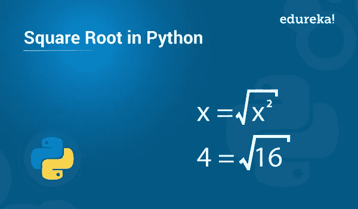

# 如何在 Python 中求平方根？

> 原文：<https://medium.com/edureka/square-root-in-python-f3f07c0b3f25?source=collection_archive---------0----------------------->



我们都遇到过数学中的平方根。不可否认，它是最重要的基础之一，因此需要嵌入到各种应用中。Python 方便地服务于这个目的，它使得在我们的程序中集成平方根变得非常简单。在本文中，您将学习如何在 Python 中求平方根。

在继续之前，让我们看一下这里涉及的主题:

*   什么是平方根？
*   如何在 Python 中计算平方根:
*   使用 sqrt()函数
*   使用 pow()函数
*   Python 中平方根的一个工作示例

# 什么是平方根？

平方根是任意一个 y 数。数学上表示为 **x = √y** 。Python 提供了计算平方根的内置方法。

既然我们对什么是数的平方根以及如何表示它有了基本的概念，那么让我们继续前进，看看如何用 Python 来得到数的平方根。

# Python 中如何计算平方根？

要在中计算平方根，您需要导入**数学**模块。这个模块由内置方法组成，即 **sqrt()** 和 **pow()** ，使用它们可以计算平方根。您可以简单地使用 **import** 关键字导入它，如下所示:

```
import math
```

一旦导入了这个模块，您就可以使用其中的任何函数。

## 使用 sqrt()函数

sqrt()函数基本上接受一个参数并返回它的平方根。该函数的语法是:

**语法:**

*sqrt(x)* # x 是需要计算平方根的数字。

现在，让我们来看看这个函数的一个例子:

**例如:**

```
from math import sqrt #absolute importing print(sqrt(25))
```

**输出:** 5.0

如您所见，25 的平方根，即 5，已经返回。

**注意:**在上面的例子中，已经使用 absolute 方法导入了 sqrt()函数。但是，如果导入完整的数学模块，则可以执行如下操作:

**例如:**

```
import math print(math.sqrt(25))
```

**输出:** 5.0

## 使用 pow()函数

另一种计算任意数字平方根的方法是使用 pow()函数。这个函数基本上接受两个参数，并将它们相乘来计算结果。这样做是为了数学等式，

该函数的语法如下:

*pow(x，y)* #其中 y 是 x 或 x**y 的幂

现在让我们来看看这个函数的一个例子:

**例如:**

```
from math import pow print(pow(25,.5))
```

**输出:** 5.0

这些函数可以用来解决许多数学问题。现在让我们来看看这些函数的一个这样的应用的工作例子。

# Python 中平方根的一个工作示例

让我们尝试使用这些函数来实现非常著名的**毕达哥拉斯定理**。

接受三角形两条边的值，并计算其斜边的值。

## 解决方案:

毕达哥拉斯定理指出，在直角三角形中，与直角相对的一条边称为斜边，其测量值为其他两条边的测量值的平方和的平方根，这意味着

以下是 Python 中的解决方案:

```
**from** math **import** sqrt  #Imported the square root function from math module
**from** math **import** pow     #Imported the power function from math module
a**=**int(input("Enter the measure of one side of a right angled triangle:"))
b**=**int(input("Enter the measure of another side of a right angled triangle:"))
#input function is used to take input from user and is stored as string
# which is then typecasted into an integer using the int() function.
c**=**sqrt(pow(a,2)**+**pow(b,2))       #we have implemented the formula c=√(a2+b2)
print(f"The measure of the hypotenuse is: {c} based on the measures of the other two sides {a} & {b}")
```

**输出:**

输入直角三角形一边的尺寸:3 输入直角三角形另一边的尺寸:4

斜边的测量值是:基于另外两条边 3 和 4 的测量值为 5.0

这就把我们带到了这篇关于 Python 中平方根的文章的结尾。我希望你已经明白了一切。

如果你想查看更多关于人工智能、DevOps、道德黑客等市场最热门技术的文章，你可以参考 Edureka 的官方网站[。](https://www.edureka.co/blog/?utm_source=medium&utm_medium=content-link&utm_campaign=isquare-root-in-python)

请留意本系列中的其他文章，它们将解释 Python 和数据科学的各个方面。

> *1。*[*Python 中的机器学习分类器*](/edureka/machine-learning-classifier-c02fbd8400c9)
> 
> *2。*[*Python Scikit-Learn Cheat Sheet*](/edureka/python-scikit-learn-cheat-sheet-9786382be9f5)
> 
> *3。* [*机器学习工具*](/edureka/python-libraries-for-data-science-and-machine-learning-1c502744f277)
> 
> *4。* [*用于数据科学和机器学习的 Python 库*](/edureka/python-libraries-for-data-science-and-machine-learning-1c502744f277)
> 
> *5。*[*Python 中的聊天机器人*](/edureka/how-to-make-a-chatbot-in-python-b68fd390b219)
> 
> *6。* [*Python 集合*](/edureka/collections-in-python-d0bc0ed8d938)
> 
> *7。* [*Python 模块*](/edureka/python-modules-abb0145a5963)
> 
> *8。* [*Python 开发者技能*](/edureka/python-developer-skills-371583a69be1)
> 
> *9。* [*哎呀面试问答*](/edureka/oops-interview-questions-621fc922cdf4)
> 
> *10。* [*一个 Python 开发者的简历*](/edureka/python-developer-resume-ded7799b4389)
> 
> *11。*[*Python 中的探索性数据分析*](/edureka/exploratory-data-analysis-in-python-3ee69362a46e)
> 
> 12。 [*蛇与 Python 的游戏*](/edureka/python-turtle-module-361816449390)
> 
> *13。* [*Python 开发者工资*](/edureka/python-developer-salary-ba2eff6a502e)
> 
> *14。* [*主成分分析*](/edureka/principal-component-analysis-69d7a4babc96)
> 
> 15。[*Python vs c++*](/edureka/python-vs-cpp-c3ffbea01eec)
> 
> 16。 [*刺儿头教程*](/edureka/scrapy-tutorial-5584517658fb)
> 
> 17。[*Python SciPy*](/edureka/scipy-tutorial-38723361ba4b)
> 
> *18。* [*最小二乘回归法*](/edureka/least-square-regression-40b59cca8ea7)
> 
> *19。* [*Jupyter 笔记本小抄*](/edureka/jupyter-notebook-cheat-sheet-88f60d1aca7)
> 
> 20。 [*Python 基础知识*](/edureka/python-basics-f371d7fc0054)
> 
> *21。* [*Python 模式程序*](/edureka/python-pattern-programs-75e1e764a42f)
> 
> *22。* [*网页抓取用 Python*](/edureka/web-scraping-with-python-d9e6506007bf)
> 
> *23。* [*Python 装饰器*](/edureka/python-decorator-tutorial-bf7b21278564)
> 
> *24。*[*Python Spyder IDE*](/edureka/spyder-ide-2a91caac4e46)
> 
> *25。*[*Python 中使用 Kivy 的移动应用*](/edureka/kivy-tutorial-9a0f02fe53f5)
> 
> *26。* [*十大最佳学习书籍&练习 Python*](/edureka/best-books-for-python-11137561beb7)
> 
> *27。* [*机器人框架用 Python*](/edureka/robot-framework-tutorial-f8a75ab23cfd)
> 
> *28。*[*Python 中的贪吃蛇游戏*](/edureka/snake-game-with-pygame-497f1683eeaa)
> 
> *29。* [*Django 面试问答*](/edureka/django-interview-questions-a4df7bfeb7e8)
> 
> 三十岁。 [*十大 Python 应用*](/edureka/python-applications-18b780d64f3b)
> 
> 31。[*Python 中的哈希表和哈希表*](/edureka/hash-tables-and-hashmaps-in-python-3bd7fc1b00b4)
> 
> *32。*[*Python 3.8*](/edureka/whats-new-python-3-8-7d52cda747b)
> 
> *33。* [*支持向量机*](/edureka/support-vector-machine-in-python-539dca55c26a)
> 
> 34。 [*Python 教程*](/edureka/python-tutorial-be1b3d015745)

*原载于 2019 年 7 月 23 日*[*https://www.edureka.co*](https://www.edureka.co/blog/square-root-in-python/)*。*