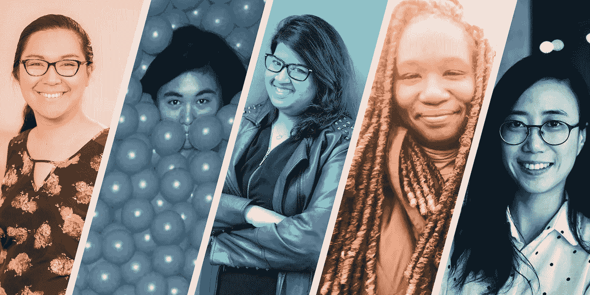
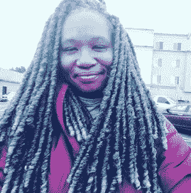
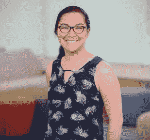
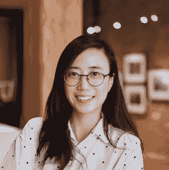

# 广场沃蒙 Hear + Now 2018:闪电对话

> 原文：<https://medium.com/square-corner-blog/square-womeng-hear-now-2018-lightning-talks-f11628b81960?source=collection_archive---------5----------------------->

> 注意，我们已经行动了！如果您想继续了解 Square 的最新技术内容，请访问我们的新家[https://developer.squareup.com/blog](https://developer.squareup.com/blog)

Hear + Now 是由 Square 的沃盟机构主办的科技闪电谈话系列。Hear + Now 的目的是放大科技行业中边缘群体的声音。

今年的主题是“斗争”，演讲者分享了他们的技术斗争，工作场所的斗争，等等。

在下面的视频中看看我们的演讲者非凡的演讲。但是首先，bios！

# **娜塔莉·帕特里斯·塔克:“老虎之眼:用 WCAG 2.1 移动网页可访问性的指针”**

*娜塔莉·帕特里斯·塔克(Natalie Patrice Tucker)致力于建设一个为所有人服务的网站，她白天(以及太多的夜晚和周末)都在担任网页可访问性领域的主题专家，并培训一大批开发人员和利益相关者来承担这一重任。*

# **Aashni Shah:“不是我，是你”**

*Aashni Shah 在肯尼亚长大，移居加拿大学习计算机科学，现在在 Square 担任软件工程师。Aashni 利用空闲时间追求她的四个人生目标:科技、慈善、旅游和摄影。*

# **任伟:“科技债务与新员工”**

*Jen Wei 是 Lever 的产品工程师，他们在 Lever 开发工具，帮助公司以合作和信任的方式招聘员工。工作之外，你可能会发现她在玩极限飞盘(这是一项真正的运动！)或寻找大优惠。*

# **詹娜·昆迪卡:“双极软件工程师”**

詹娜·昆迪卡是一名多种族女性，在夏威夷出生长大，整个职业生涯都在初创公司工作。詹娜是开源精神疾病(OSMI)和抑郁症和躁郁症支持联盟的志愿者。

# **Alice Ching:“如何使用闭源 API”**

Alice Ching 是独立游戏工作室 funo MENA Wattam 的首席工程师。十多年来，她一直致力于游戏引擎的开发，并对制作有创意、有趣的东西充满热情。