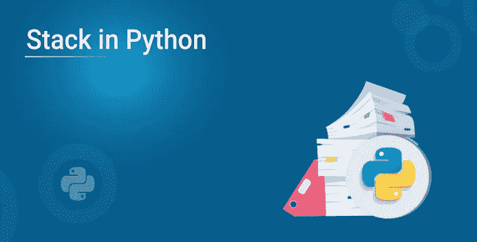
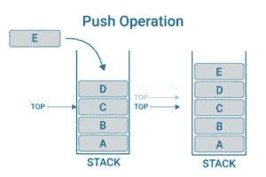
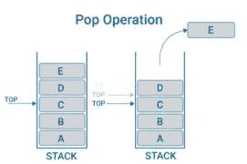

# Python 中的堆栈:如何、为什么和在哪里？

> 原文：<https://medium.com/edureka/stack-in-python-980826a64bc5?source=collection_archive---------1----------------------->



嘿，你可能在 Python 中搜索过 Stack，我们已经为你整理好了。在这篇博客中，我们将深入分析如何、为什么以及在哪里使用 Python 中的**栈。**

博客由以下主题组成:

*   什么是数据结构中的堆栈？
*   我们为什么以及何时使用堆栈？
*   如何用 Python 实现一个栈？
*   一个用 Python 演示堆栈的简单程序。
*   关于 Python 和相关程序中堆栈用法的更多信息
*   内置列表
*   collections.deque 类
*   排队。LifoQueue 类

# 什么是数据结构中的堆栈？

数据结构是组织计算机存储的关键，这样我们就可以有效地访问和编辑数据。是计算机科学中定义的最早的数据结构之一。简而言之，Stack 是项目的线性集合。它是和 CPU 架构的集合。类似于餐馆里的一堆盘子，一堆中的元素，按照“后进先出”的顺序。与支持快速后进先出(LIFO)插入和删除语义的对象列表不同。它是现代计算机编程中使用的函数调用和参数的数组或列表结构，从堆栈数组的顶部添加或删除，不允许对堆栈中包含的对象进行随机访问。

堆栈中有两种类型的操作-

*   **按**–将数据添加到堆栈中。
*   **弹出**–从堆栈中移除数据。

堆栈简单易学，易于实现，它们被广泛地集成到许多软件中，用于执行各种任务。它们可以用数组或链表来实现。这里我们将依赖于列表数据结构。

# **我们为什么以及何时使用堆栈？**

栈是简单的数据结构，允许我们顺序地存储和检索数据。

要理解底层的 Stack，想象一堆书。你把一本书放在书库的顶部，所以第一本被拿起的书将是最后一本被放入书库的书。

栈有许多真实的用例，理解它们可以让我们以一种简单有效的方式解决许多数据存储问题。

假设你是一名开发人员，正在开发一款全新的文字处理器。您需要创建一个撤销特性——允许用户回溯他们的操作，直到会话开始。堆栈非常适合这种情况。我们可以通过将用户的每一个动作推送到堆栈来记录它。当用户想要撤销一个动作时，他们可以从堆栈中弹出。

# 如何用 Python 实现一个栈？

在 python 中，我们可以通过以下方式实现 Python 堆栈:

1.  使用内置的列表数据结构。Python 内置的列表数据结构带有模拟 and 操作的方法。
2.  使用在一个对象中有效提供堆栈和队列操作的 deque 库。

如前所述，我们可以使用“PUSH”操作向堆栈添加项目，使用“POP”操作移除项目。

**推送操作**

Push 在堆栈顶部添加元素。请参考下图以获得更多了解:



**POP 操作**

Pop 从堆栈顶部删除元素。



# **这里有一个简单的程序来说明 Python 中的堆栈-**

```
**class** Stack
def_init_(self):
self.items**=**[]
**def** is_empty(self):
**return** self.items**==**[]
**def** push(self, data):
self.items.append(data)
**def** pop(self):
**return** self.items.pop()
s**=** Stack()
**while** True:
print(‘push<value>’)
print(‘pop’)
print(‘quit’)
do**=** input(‘What would you like to do?’).split()
operation**=** do[0].strip().lower()
**if** operation**==** ‘push’:
s.push(int(do[1]))
**elif** operation**==** ‘pop’:
**if** s.is_empty():
print(‘Stack **is** empty’)
**else**:
print(‘Popped value:’, s.pop())
**elif** operation**==**’quit’:
**break**
```

# 关于 Python 和相关程序中堆栈用法的更多信息

堆栈在算法中有广泛的用途，例如在语言解析和运行时内存管理(“调用堆栈”)中。使用堆栈的一个简短而有用的算法是对树或图数据结构的深度优先搜索(DFS)。Python 使用了几种堆栈实现，每种实现都有略微不同的特征。让我们简单看一下它们:

# 内置列表

尽管这使得它们的性能不如基于链表的实现所提供的稳定的插入和删除那样一致。另一方面，列表提供了对栈上元素的快速随机访问，这是一个额外的好处。

*使用列表作为堆栈时，这里有一个重要的性能警告:*

为了获得插入和删除的分摊性能，使用 append()方法将 new 添加到列表的末尾，并使用 pop()将其从末尾移除。基于 [Python](https://www.edureka.co/blog/python-programming-language) 列表的栈向右扩展，向左收缩。

#使用 Python 列表作为堆栈(LIFO):

```
s **=** []
s.append('eat')
s.append('sleep')
s.append('code')
>>> s
['eat', 'sleep', 'code']
>>> s.pop()
'code'
>>> s.pop()
'sleep'
>>> s.pop()
'eat'
>>> s.pop()
IndexError: "pop from empty list"
```

# collections.deque 类

因为 deques 同样支持从两端添加和删除元素，所以它们既可以用作队列，也可以用作堆栈。

如果您在 Python 的标准库中寻找具有链表实现的性能特征的堆栈数据结构，collections.deque 是一个不错的选择。

#使用 collections.deque 作为堆栈(LIFO):

```
**from** collections **import** deque
q **=** deque()
q.append('eat')
q.append('sleep')
q.append('code')
>>> q
deque(['eat', 'sleep', 'code'])
>>> q.pop()
'code'
>>> q.pop()
'sleep'
>>> q.pop()
'eat'
>>> q.pop()
IndexError: "pop from an empty deque"
```

Python 标准库中的这个堆栈实现是同步的，并提供锁定语义来支持多个并发的生产者和消费者。

queue 模块包含其他几个实现多生产者、多消费者队列的类，这对于并行计算非常有用。

根据您的用例，锁定语义可能是有帮助的，或者只是招致不必要的开销。在这种情况下，最好使用 list 或 deque 作为通用堆栈。

#使用队列。LifoQueue 作为堆栈:

```
**from** queue **import** LifoQueue
s **=** LifoQueue()
s.put('eat')
s.put('sleep')
s.put('code')
>>> s
<queue.LifoQueue object at 0x108298dd8>
>>> s.get()
'code'
>>> s.get()
'sleep'
>>> s.get()
'eat'
>>> s.get_nowait()
queue.Empty
>>> s.get()
# Blocks / waits forever...
```

如果你已经学了这么多，你现在一定能够使用 Python 中的栈了，我希望这篇博客能帮助你了解 Python 中栈的不同实现方法。

我们的“python 中的堆栈”文章到此结束。我希望你喜欢阅读这个博客，并发现它的信息量。到目前为止，您一定已经很好地理解了什么是 python 堆栈以及如何使用它。现在开始练习所有的例子。

伙计们，这就把我们带到了这篇关于如何在 Python 中输入 A-List 的文章的结尾？如果你想查看更多关于人工智能、DevOps、道德黑客等市场最热门技术的文章，你可以参考 Edureka 的官方网站。

请留意本系列中的其他文章，它们将解释 Python 和数据科学的各个方面。

> *1。*[*Python 中的机器学习分类器*](/edureka/machine-learning-classifier-c02fbd8400c9)
> 
> *2。*[*Python Scikit-Learn Cheat Sheet*](/edureka/python-scikit-learn-cheat-sheet-9786382be9f5)
> 
> *3。* [*机器学习工具*](/edureka/python-libraries-for-data-science-and-machine-learning-1c502744f277)
> 
> *4。* [*用于数据科学和机器学习的 Python 库*](/edureka/python-libraries-for-data-science-and-machine-learning-1c502744f277)
> 
> *5。*[*Python 中的聊天机器人*](/edureka/how-to-make-a-chatbot-in-python-b68fd390b219)
> 
> *6。* [*Python 集合*](/edureka/collections-in-python-d0bc0ed8d938)
> 
> *7。* [*Python 模块*](/edureka/python-modules-abb0145a5963)
> 
> *8。* [*Python 开发者技能*](/edureka/python-developer-skills-371583a69be1)
> 
> *9。* [*哎呀面试问答*](/edureka/oops-interview-questions-621fc922cdf4)
> 
> *10。*[*Python 开发者简历*](/edureka/python-developer-resume-ded7799b4389)
> 
> *11。*[*Python 中的探索性数据分析*](/edureka/exploratory-data-analysis-in-python-3ee69362a46e)
> 
> *12。* [*蛇与蟒蛇的游戏*](/edureka/python-turtle-module-361816449390)
> 
> *13。* [*Python 开发者工资*](/edureka/python-developer-salary-ba2eff6a502e)
> 
> *14。* [*主成分分析*](/edureka/principal-component-analysis-69d7a4babc96)
> 
> 15。 [*Python vs C++*](/edureka/python-vs-cpp-c3ffbea01eec)
> 
> 16。 [*刺儿头教程*](/edureka/scrapy-tutorial-5584517658fb)
> 
> *17。*[*Python SciPy*](/edureka/scipy-tutorial-38723361ba4b)
> 
> *18。* [*最小二乘回归法*](/edureka/least-square-regression-40b59cca8ea7)
> 
> 19。 [*Jupyter 笔记本小抄*](/edureka/jupyter-notebook-cheat-sheet-88f60d1aca7)
> 
> 20。 [*Python 基础知识*](/edureka/python-basics-f371d7fc0054)
> 
> *21。* [*Python 模式程序*](/edureka/python-pattern-programs-75e1e764a42f)
> 
> *22。*[*Python 中的*](/edureka/generators-in-python-258f21e3d3ff) 生成器
> 
> *23。* [*Python 装饰器*](/edureka/python-decorator-tutorial-bf7b21278564)
> 
> *24。*[](/edureka/spyder-ide-2a91caac4e46)*[*什么是 Python 中的套接字编程*](/edureka/socket-programming-python-bbac2d423bf9)*
> 
> **25。*[*Python 中使用 Kivy 的移动应用*](/edureka/kivy-tutorial-9a0f02fe53f5)*
> 
> **26。* [*十大最佳学习书籍&练习 Python*](/edureka/best-books-for-python-11137561beb7)*
> 
> **27。* [*机器人框架与 Python*](/edureka/robot-framework-tutorial-f8a75ab23cfd)*
> 
> **28。*[*Python 中的贪吃蛇游戏*](/edureka/snake-game-with-pygame-497f1683eeaa)*
> 
> **29。* [*Django 面试问答*](/edureka/django-interview-questions-a4df7bfeb7e8)*
> 
> **30。* [*十大 Python 应用*](/edureka/python-applications-18b780d64f3b)*
> 
> **31。*[*Python 中的哈希表和哈希表*](/edureka/hash-tables-and-hashmaps-in-python-3bd7fc1b00b4)*
> 
> **32。*[*Python 3.8*](/edureka/whats-new-python-3-8-7d52cda747b)*
> 
> *33。 [*支持向量机*](/edureka/support-vector-machine-in-python-539dca55c26a)*
> 
> *34。 [*Python 教程*](/edureka/python-tutorial-be1b3d015745)*
> 
> *35。[*Python Spyder*](/edureka/spyder-ide-2a91caac4e46)*

**原载于 2019 年 8 月 26 日 https://www.edureka.co**T21*[。](https://www.edureka.co/blog/stack-in-python/)*