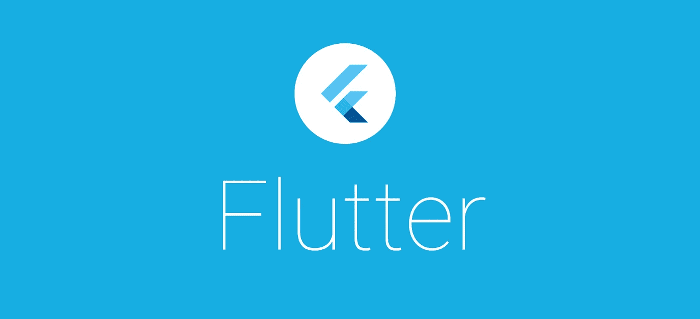
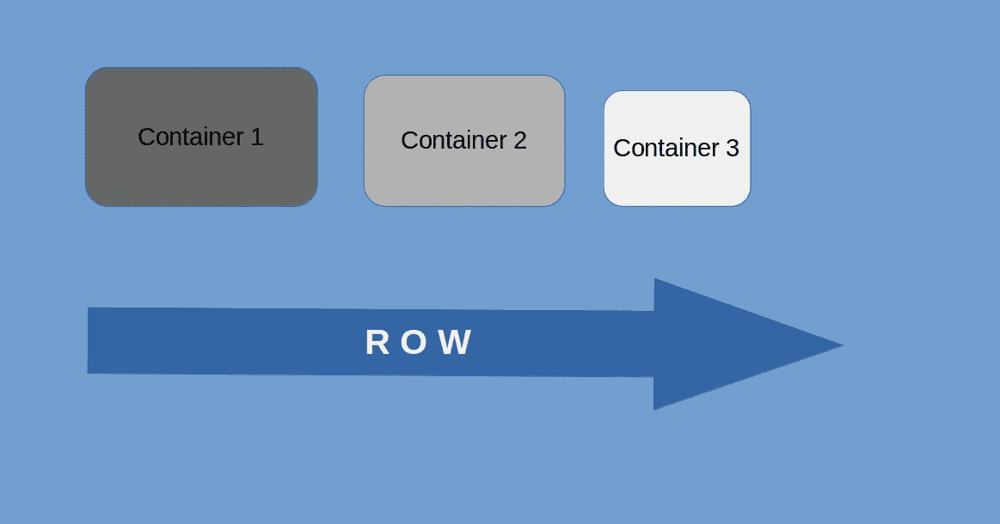
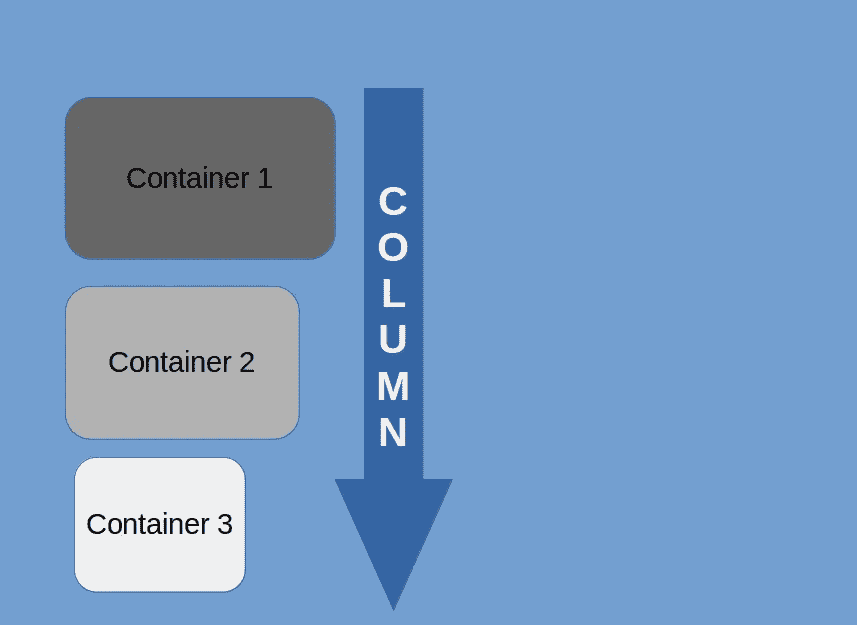
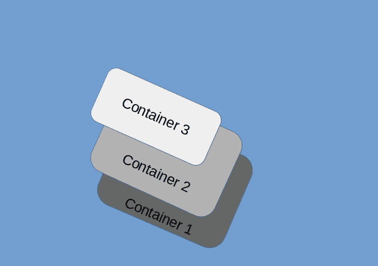
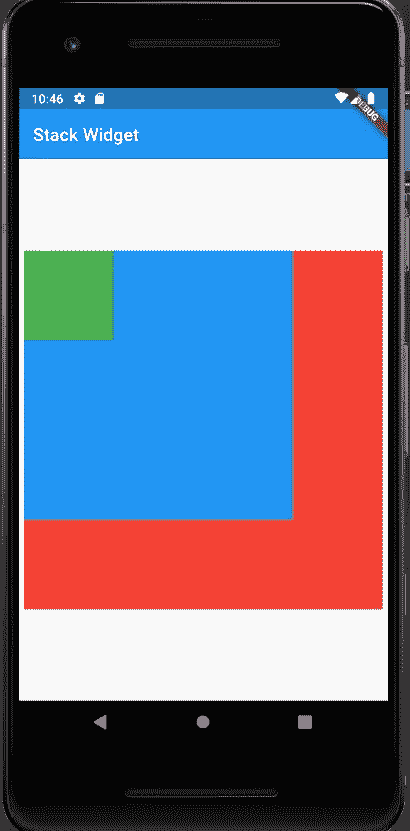
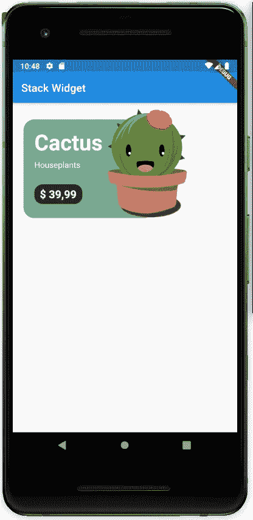
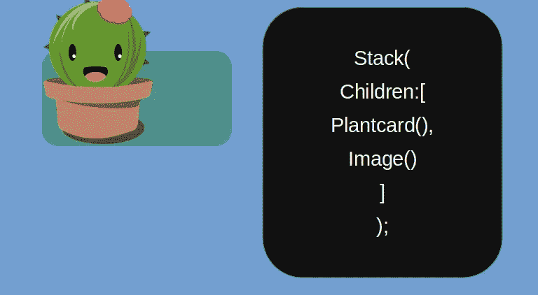
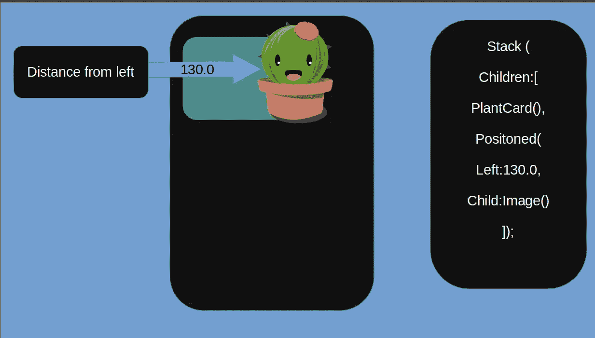

# Flutter 中的堆栈小部件

> 原文：<https://medium.com/quick-code/stack-widget-in-flutter-8263095236cb?source=collection_archive---------0----------------------->

Flutter 提供了一些简单的小部件来增强应用程序的用户界面。一个这样的小部件是 Stack。

**堆栈与行和列有什么不同？**

下面是三个容器，每个都有不同的高度和宽度。

1.  **集装箱排成一排**

**2。成列包装的容器**

**3。堆叠包装的容器**

如上图所示，堆栈小部件按照它们在堆栈小部件中的放置顺序来堆叠小部件。

> **堆栈小工具的高度和宽度**

如果堆栈小部件包含在一个定义了高度和宽度的父小部件中，那么堆栈小部件将采用父小部件的高度和宽度。

如果堆栈小部件没有被任何小部件包裹，那么它的大小取决于堆栈中最大的小部件

此外，默认情况下，堆栈的对齐方式是左上对齐，这可以通过设置 alignment 属性来更改

Output of the above code

> **示例**

下面的例子展示了如何实现堆栈小部件来构建用户界面。我们可以看到一张简单的卡片，上面有一株仙人掌，上面有它的价格、名称和类别。这种卡用于许多现代应用中。

Stack Widget example

**设计方法**

在编写实际代码之前，我们只是想从哪里开始，应该采用什么方法，如果你是一个敏锐的观察者，你会看到植物图片叠放在绿色容器上。因此，我们需要 2 个部件，一个卡片和一个图像部件。

**基本卡(植物卡)代码**

下面的代码将创建基础卡，现在我们需要它上面的仙人掌图像。

简单地用一个堆栈包装小部件，并用图像附加子列表也可以，但是它不会给出我们想要的输出，因为如上所述，**堆栈中的所有小部件都是左上方对齐的。**

*这里出现了图片中的* ***定位控件***

定位的小部件给了我们更多的控制来根据我们的需求在堆栈中定位小部件。

定位的小部件接受一些参数，如顶部、左侧、右侧、底部等。这些参数需要浮点值。

例如，如果右参数设置为 20.0，则小部件被放置在距离左侧 20.0 像素的位置。

因此，我们用一个左参数设置为 130 的定位小部件包装图像小部件。

**最终代码**

**探索此小工具更多详情请访问**[https://api.flutter.dev/flutter/widgets/Stack-class.html](https://api.flutter.dev/flutter/widgets/Stack-class.html)

**快乐编码！**😁