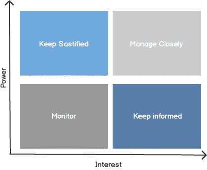

# Stakeholder Management

> 原文：<https://medium.easyread.co/stakeholder-management-d905545a9287?source=collection_archive---------2----------------------->

## Product Management

## Apa itu Stakeholder? Dan kenapa keberadaannya penting bagi seorang Product Manager?

Photo by [Mario Gogh](https://unsplash.com/@mariogogh?utm_source=medium&utm_medium=referral) on [Unsplash](https://unsplash.com?utm_source=medium&utm_medium=referral)

***Stakeholder*** adalah orang atau grup yang bisa memberikan dampak kepada kita dan orang atau grup tersebut. Mereka dapat membantu juga bisa menghalangi kita.

Bagi seorang *Product Manager* , sangat penting untuk mengetahui siapa saja *stakeholder.* Karena dengan mengenal dan mengetahui siapa saja *stakeholder* akan membantu dalam menciptakan produk yang sukses.

Lalu siapa saja *stakeholder* itu? berikut adalah beberapa contoh:

*   Customer
*   Instansi Pemerintahan
*   Kompetitor
*   Supplier
*   Partner
*   Komunitas
*   Karyawan
*   dll

Setiap harinya *Product Manager* pasti berinteraksi dengan banyak *stakeholder* . Sehingga dibutuhkan srategi yang tepat ketika berinteraksi serta menjaga hubungan dengan para *stakeholder* .

Untuk itu setelah mengetahui siapa saja *stakeholder,* maka selanjutnya adalah memetakan ( *mapping* ) para *stakeholder* . Tujuan memetakan ini adalah agar kita mendapatkan visualisasi semua orang yang dapat mempengaruhi produk kita dan juga dapat melihat bagaimana setiap *stakeholder* saling terkoneksi.

Stakeholder Mapping

***High power, highly interested people (Manage Closely).*** Grup *stakeholder* yang memiliki pengaruh tinggi dan juga pendukung penuh produk yang sedang dibangun. *Stakeholder* ini harus terus di update perkembangan dari produk, dan minta saran atau masukan dari mereka secara rutin.

***High power, less interested people (Keep Satisfied).*** Grup *stakeholder* ini bukan orang yang secara langsung berpengaruh terhadap produk, akan tetapi mereka tetap harus diberikan update terhadap perkembangan produk. Jika tidak *stakeholder* ini bisa membuat perubahan drastis terhadap produk anda dan bisa mengacaukan rencana anda.Karena *stakeholder* ini masih memiliki pengaruh yang cukup tinggi.

***Low power, highly interested people (Keep Informed).*** Grup *stakeholder* ini biasanya adalah pengguna yang menggunakan produk secara langsung. Pengaruh mereka kecil, tapi grup ini bisa memberikan masukan yang bagus untuk perkembangan produk kedepan nya.

***Low power, less interested people (Monitor).*** Orang dalam grup ini tidak terlalu peduli dengan produk anda dan memberikan pengaruh yang kecil. Grup ini tetap harus di pantau karena bisa jadi mereka nantinya dapat dipengaruhi dengan perubahan yang dilakukan di produk anda.

## **Benefit dari *stakeholder* mapping**

Setidaknya ada tiga keuntungan setelah melakukan *stakeholder* *mapping* , yaitu:

*   Setelah membuat *mapping* , *Product Manager* jadi mengetahui siapa saja orang yang memiliki power dan juga yang mendukung penuh dalam mengembangkan produk.
*   *Stakeholder mapping* dapat membantu *Product Manage* r untuk melihat siapa yang paling diuntungkan dari produk yang tengah dikembangkan, sehingga anda dapat fokus pada pemasaran terhadap orang tersebut.
*   Terakhir, dengan adanya *stakeholder mapping* dapat memberikan gambaran siapa saja yang harus dipuaskan ketika mengembangkan produk.

## **Strategi Komunikasi**

Selanjutnya setelah membuat mapping, hal berikutnya yang perlu disiapkan oleh *Product Manager* adalah membuat strategi komunikasi untuk setiap *stakeholder* . Sebenarnya untuk srategi komunikasi ini tidak ada cara khusus yang bisa dilakukan, akan tetapi ada beberapa best practice yang bisa digunakan oleh *Product Manager* :

*   Bangun kepercayaan terhadap *stakeholder* yang masuk kedalam kategori *high power, highly interested* dan juga *high power, less interested people* . Sebisa mungkin berkomunikasi dengan mereka secara *face to face* .
*   Berikan informasi kepada para *stakeholder* sesuai dengan kebutuhan. Karena ada *stakeholder* yang cukup dengan informasi yang sifatnya umum, ada juga *stakeholder* yang harus diberikan informasi secara mendalam.
*   Komunikasikan lebih awal, karena orang terkadang butuh waktu untuk berfikir sebelum mengambil sebuah keputusan.

# **Penutup**

*Stakeholder management* adalah salah satu kehalian yang harus dimiliki oleh *Product Manager.* Dengan mengenal siapa saja *stakeholder* dan bagaimana cara berkomunikasi yang tepat dengan masing-masing *stakeholder* akan sangat membantu *Product Manager* dalam mengembangkan produk.

## Jika anda menyukai artikel ini, berikut beberapa artikel lainnya yang dapat anda nikmati:

 [## 3 hal yang saya pelajari di dunia product selama satu tahun terakhir

### Apa yang didapat setelah satu tahun di dunia product management

medium.com](https://medium.com/easyread/3-hal-yang-saya-pelajari-di-dunia-product-selama-satu-tahun-terakhir-6bc8808b412e)  [## Project vs Product

### Penjelasan singkat tentang project dan product serta perbedaan antara keduanya

medium.com](https://medium.com/easyread/project-vs-product-b9c89a079fed)  [## Apakah anda harus kembali ke kantor?

### Tetap bekerja di rumah atau harus kembali ke kantor pasca pandemi

medium.com](https://medium.com/easyread/apakah-anda-harus-kembali-ke-kantor-47f243f62ffb)