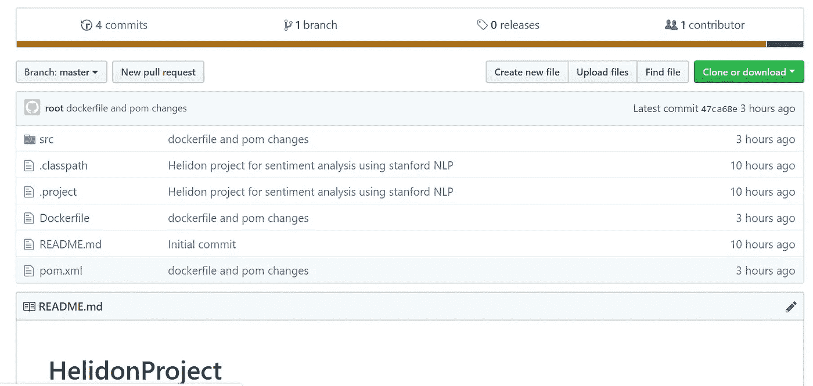
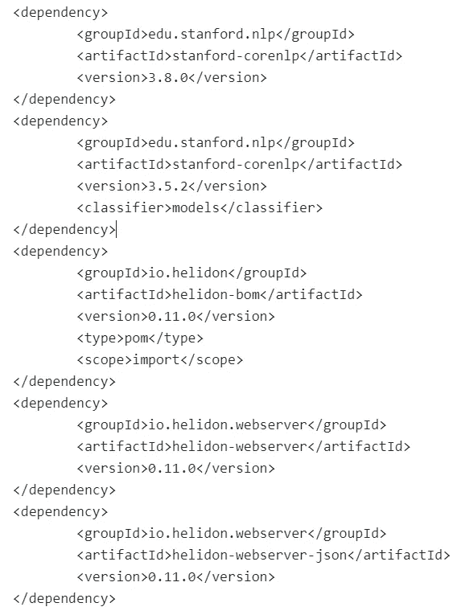
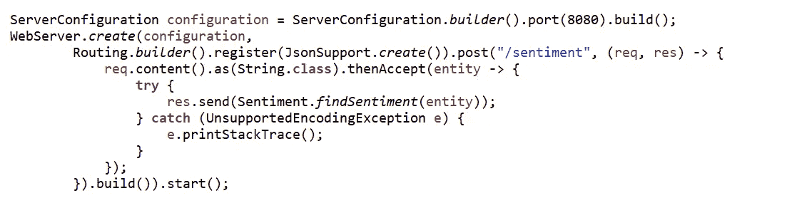
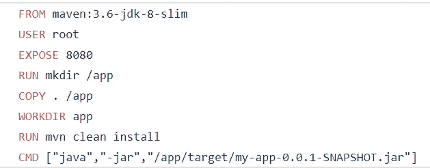
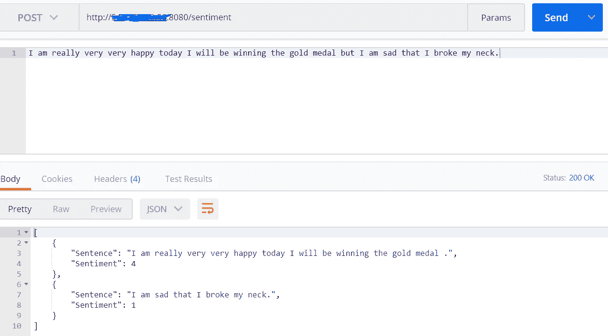

# 使用斯坦福 NLP 和 HELIDON 项目创建情感分析微服务

> 原文：<https://medium.com/oracledevs/stanford-nlp-sentiment-analysis-using-oracle-helidon-and-docker-8569b02a92d5?source=collection_archive---------0----------------------->

在我的[上一篇文章](/oracledevs/stanford-nlp-on-oracle-cloud-application-container-d1f53512b6af)中，我解释了如何使用斯坦福 NLP 执行情感分析算法并部署在 Oracle Cloud 上。在本文中，我将带您了解我们如何使用 Helidon 项目通过几个简单的步骤来转变微服务中的简单项目，并对微服务进行 dockerize，使其能够在任何容器基础架构上执行，甚至在 Kubernetes 上执行。

在开始构建微服务之前，让我给你解释一下斯坦福大学的自然语言处理和情感分析。斯坦福 NLP 是一个 JAVA 开源库，由斯坦福大学的一个团队开发。它有强大的语言支持，可以在各种环境中使用，但我们将重点放在它的情感分析部分。因此，我们将使用斯坦福大学的 NLP 库来获取句子(甚至是一个段落)的情感，并将其作为 JSON 对象输出。关于这方面的更多信息，你可以参考我的[以前的文章](/oracledevs/stanford-nlp-on-oracle-cloud-application-container-d1f53512b6af)。

为了利用斯坦福 NLP 库的能力，编写一个情感分析器作为微服务，可以用来预测一个句子或段落的情感，并作为 JSON 对象返回，我们选择了 Helidon 项目，这是一个开源项目。Helidon 是一个 Java 库的集合，用于编写运行在 Netty 支持的快速 web 核心上的微服务，Helidon 遵循 MicroProfile 规范，并组织起来帮助开发人员快速进入微服务世界。
关于 Helidon 项目的更多细节可以在 [https://helidon.io](https://helidon.io/) 中找到。

在执行运行情绪分析器的步骤之前，让我们克隆/派生 GitHub 库:[https://github.com/saiyam1814/HelidonProject](https://github.com/saiyam1814/HelidonProject)理解代码。

Github Repo

一旦您克隆了存储库，打开 **pom 文件**，pom 文件中包含的情感分析& Helidon 的依赖项是:

POM file

**helidon-webserver** 用于在情感类中使用 helidon 类。
**heli don-web server-json**是必需的，因为我们在代码中有 JSON 实现。
**情感-corenlp** 用于在情感类中使用斯坦福 nlp 类
**模型**用于获得语言支持。

让我们来理解一下**Main.java**文件中的代码，该文件用于通过 Helidon、配置和设置不容易找到的路线来公开 api，尽管([托马斯·兰格](https://twitter.com/langer_tomas))帮助我理解了这一部分:

Main.java

ServerConfiguration 接口用于在 Webserver.create 方法使用创建的配置和 Routing.builder 用于创建所需端点的端口之后配置 web 服务器。
最后，我们使用 response“RES . send”方法传递“情感类”,根据请求参数执行情感分析，在本例中，请求参数是 POST 请求的主体。
更多关于 Helidon 路由:[https://helidon.io/docs/latest/#/webserver/03_routing](https://helidon.io/docs/latest/#/webserver/03_routing)
我已经在我的 [**上一篇**](/oracledevs/stanford-nlp-on-oracle-cloud-application-container-d1f53512b6af) **中解释了**情感**类和**斯坦福 NLP** 库对于**情感分析**的使用。**

因为我已经将这个应用程序归档，所以我将解释一下**归档文件**:

Dockerfile

一个非常简单的 **Dockerfile** —我们获取 maven 映像，在克隆它之后，将 Dockerfile 所在位置的内容复制到容器内的 app 文件夹，然后我们运行 mvn 全新安装来创建 jar 文件，实际上我们将使用端口 8080 作为 api 运行该文件。理想情况下，构建应该发生，我们应该将 jar 文件推送到 artifactory，在另一个部分，我们应该拉然后运行它，但现在我已经在 dockerfile 本身中完成了 mvn 安装。

要执行的步骤:
**第一步:docker build-t helidonsensation。
第二步:docker 标签 Helidon 情操 saiyam 911/helidon 情操**
**第三步:docker run-d-p 8080:8080helidon 情操** 和所有 set you api 通过 Helidon webserver 作为 docker 容器公开。您可以在任何平台上运行它，如 oracle 云基础架构，甚至也可以在 Kubernetes 集群上运行。我将在另一篇文章中介绍 kubernetes 集群部署和监控。

下面你可以测试 API:http:{ { IP } }:8080/情操作为一个职位的网址和句子在身体下面是相同的样本。

output form JSON

提醒一下，这些数字代表可以相应使用的情绪:我们使用它们作为:
0:“非常消极”
1:“消极”；
2:“中性”；
3:“正”；
4:“非常肯定”；
(以上在我的[上一篇](/oracledevs/stanford-nlp-on-oracle-cloud-application-container-d1f53512b6af)中也有提及)。

这就是本教程的全部内容。希望你现在对如何使用 Helidon webServer 有所了解，并且觉得这个教程很有用。如果你有任何问题，请在评论中告诉我。谢谢，

赛亚姆·帕塔克
saiyam.pathak@oracle.com
https://www.linkedin.com/in/saiyam-pathak-97685a64/