# 通过这些认证，开始您在 Salesforce 的职业生涯

> 原文：<https://medium.com/edureka/start-your-career-in-salesforce-with-these-certifications-39195e7f2a44?source=collection_archive---------4----------------------->

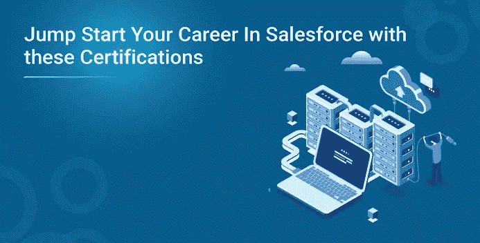

您是否正在考虑在 Salesforce 工作，但不确定走哪条职业发展道路？那么是时候考虑 ***销售人员培训*** *认证*了。在我之前的文章中，我们已经看到了什么是 Salesforce，为什么组织应该选择 Salesforce，以及 Salesforce 技术在哪里得到了成功的应用。现在，您可能想知道，Salesforce 如何对您的职业生涯有益。

在本文中，我将向您详细解释为什么您应该学习 Salesforce，并向您介绍众多 Salesforce 证书。然后，我们将了解经常参加的 Salesforce 认证及其在当今技术市场中的重要性。最后，我将向您详细介绍 Salesforce 中提供的职业机会。

**为什么要学习 Salesforce？**

在过去，你可能已经学习了不同的技术，但后来发现你自己或在行业中用不了多少。Salesforce 不像其他技术那样难学，更难体验。Salesforce 是一种你可以随时随地学习的技能，并得到全世界的认可。这是成千上万的公司用来使他们的业务成功的技能。

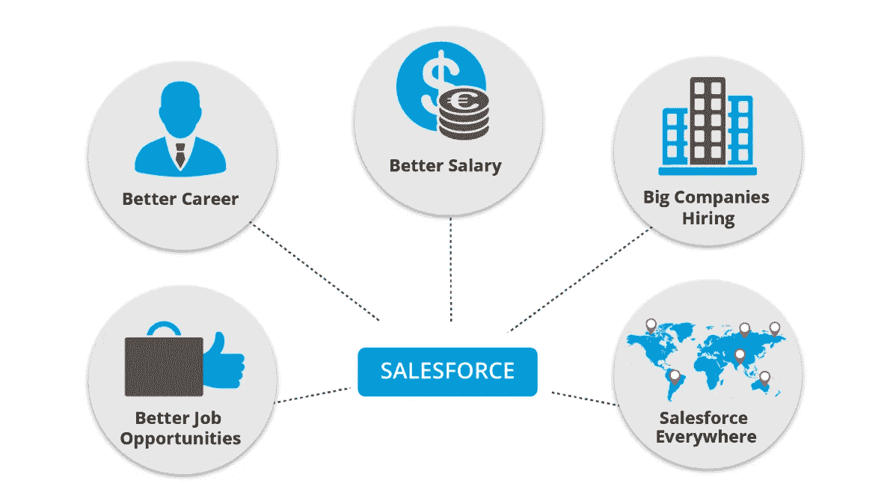

如上图所示，学习 Salesforce 是有利的，可以促进你的职业发展。如果您是寻求技术或职业改变的专业人士，那么您肯定应该考虑 Salesforce，原因如下:

*   Salesforce 拥有超过 150，000 家公司的客户群，包括需要 Salesforce 专业人员的大、中、小型企业。
*   脸书、谷歌、推特、通用电气、HCL 等大公司都使用 Salesforce。学习 Salesforce 可以帮助你获得认可，并在这样的顶级公司找到工作。
*   学习 Salesforce 可以帮你加薪。
*   Salesforce 技术正被世界各地的组织所使用，因此您可以在任何地方轻松找到机会。

# 为什么选择 Salesforce 认证？

正如我们所见，Salesforce 是最热门的技术之一。在简历中提到 Salesforce 绝对是加分项，让你脱颖而出。你可能想知道获得认证的意义是什么，获得认证你能得到什么。以下是您应该获得 Salesforce 认证的原因:

*   Salesforce 认证让您的 Salesforce 知识和专业技能更加可信。由于 Salesforce 认证的标准很高，您可以理所当然地认为获得认证的人是该领域的专家。
*   目前，对拥有 Salesforce 认证的人有很高的需求。如果你是 Salesforce 认证的专业人士，你将能够很容易地吸引雇主。
*   组织需要认证人员，因为他们吸引客户。客户通常更喜欢员工经过认证的公司，因为这给了他们质量方面的保证。
*   如果你是一个正在寻求角色转变或职业发展的人，那么获得认证将为你提供这样的机会。

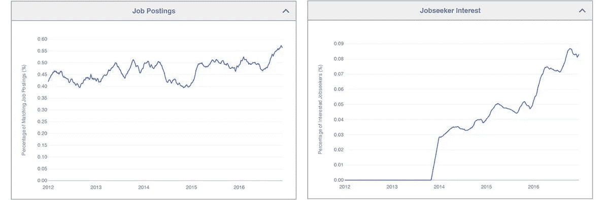

上面是两张来自 www.indeed.com 的图表，它们会给你当前就业市场的趋势。如左图所示，Salesforce 职位发布的数量在过去几年中显著增加。从右边的图表中，我们可以推断出，在过去的 3 年中，对销售人员感兴趣的公司急剧增加。来自 www.jobgraphs.com*的下图为您提供了不同国家销售人员的平均年薪信息。正如你所看到的，Salesforce 是一项押上你未来的好技术。*

# Salesforce 认证

您会惊讶地发现，全世界每年有数百万人申请 Salesforce 认证。由于人数众多，Salesforce 有一个名为 Salesforce 大学的独立实体来处理认证和发布考试。

现在，您已经了解了学习 Salesforce 的益处以及 Salesforce 认证的重要性，让我们看看 Salesforce 提供的所有认证以及与您相关的认证。

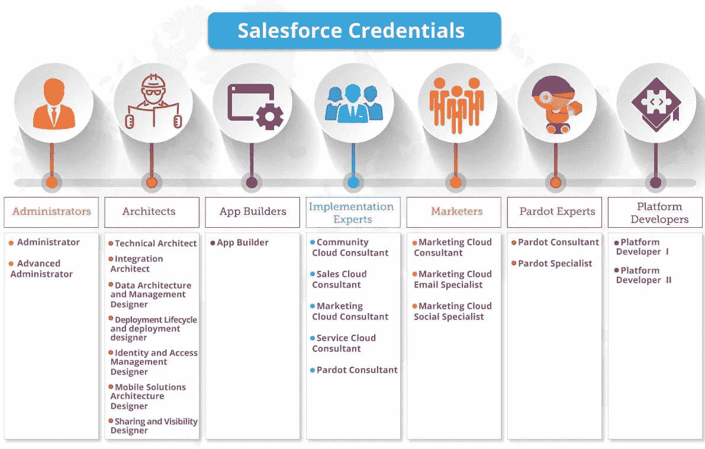

上图显示了所有 Salesforce 凭据。是的，你可以获得很多证书。但是，根据您想要追求的目标，我们可以将经常参加的认证分为两类:

1.  **管理员/实施跟踪**
2.  **开发者追踪**

下图让你更好地了解这些轨道的组成。我将详细讨论其中的每一个环节。

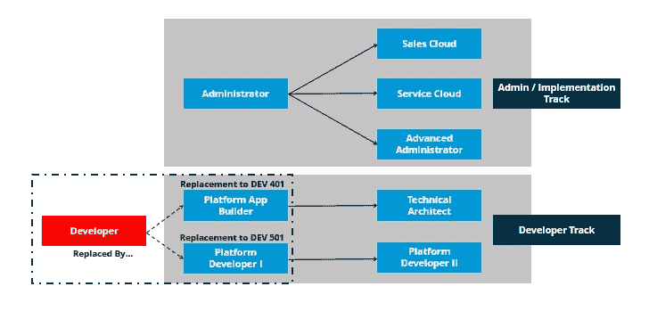

**管理员/实施跟踪**

在使用 Salesforce 产品的组织中，Salesforce 管理员扮演着重要的角色。它不像您的常规管理角色，如网络管理员或数据库管理员，他们的工作只是维护用户和更改密码。Salesforce 管理员责任重大，需要完全了解业务及其功能。如果您是 Salesforce 管理员或实施专家，您将是一名职能顾问，与您组织的客户一起工作并解决他们的问题。

让我们来看看人们在管理/实施阶段经常参加的认证:

**1。Salesforce 认证管理员–**如果您是一名大一新生，或者想从管理员或顾问做起，那么您应该考虑成为一名 Salesforce 认证管理员。要成为 Salesforce 管理员，您需要具备 Salesforce 功能的一般知识。拥有Salesforce Admin 201 认证证明:

*   您对 Salesforce 应用程序有广泛的了解。
*   您知道如何配置和管理销售和服务云应用程序。
*   你知道如何管理 Salesforce CRM，并具有良好的演示技巧。
*   您擅长管理用户、开发和定制等基本功能。

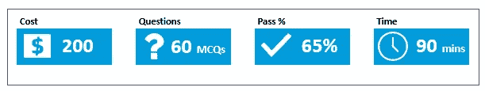

上图为您提供了有关 Salesforce 管理员考试的详细信息。以下是认证考试中提问主题的权重分布。

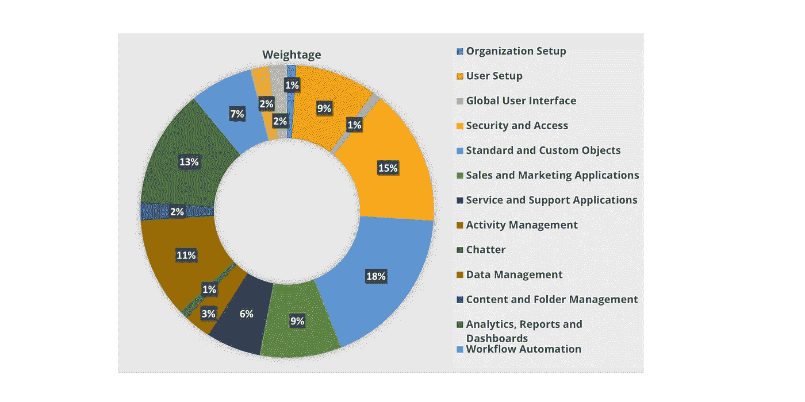

**2。Salesforce 认证高级管理员—** 要成为 Salesforce 认证高级管理员，您首先需要成为 Salesforce 认证管理员。除此之外，您还需要 2-5 年的 Salesforce 管理员经验，并且能够使用 Salesforce 的全套功能。拥有 Salesforce 高级管理员证书证明:

*   **你能自如地为客户设计健壮且可扩展的应用程序。**
*   你已经处理了相当一部分销售力量组织。

上图为您提供了有关 Salesforce 高级管理员考试的详细信息。以下是认证考试中提问主题的权重分布。

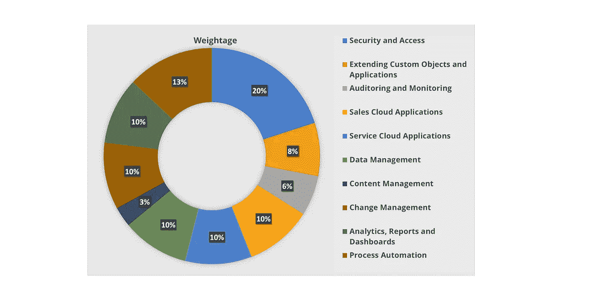

**3。Salesforce 销售云顾问—** 要成为 Salesforce 销售云顾问，您首先需要成为 Salesforce 认证管理员。除此之外，您还需要具备设计优化销售云功能的解决方案的经验，以及与销售和营销组织合作的经验。一般来说，参加销售云顾问认证的人都有 2-5 年的高级业务分析师经验。拥有 Salesforce 销售云证书证明:

*   你精通了解客户需求。
*   您可以根据客户的业务需求设计和维护销售云应用程序。

上图为您提供了有关 Salesforce 销售云顾问考试的详细信息。以下是认证考试中提问主题的权重分布。

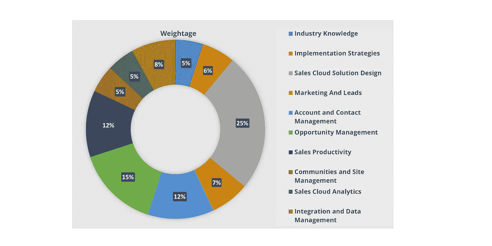

**4。Salesforce 服务云顾问—** 要成为 Salesforce 服务云顾问，您首先需要成为 Salesforce 认证管理员。除此之外，您还需要拥有使用服务云设计解决方案的经验。一般来说，参加 Salesforce 顾问认证的人拥有 2-5 年的高级业务分析师经验和 Salesforce 应用程序方面的行业专业知识。拥有 Salesforce Service Cloud 证书证明:

*   您是根据客户需求提供服务云解决方案的实施专家。

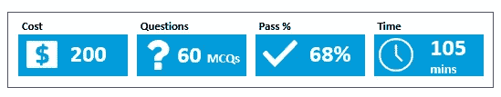

上图为您提供了有关 Salesforce 服务云顾问考试的详细信息。以下是认证考试中提问主题的权重分布。

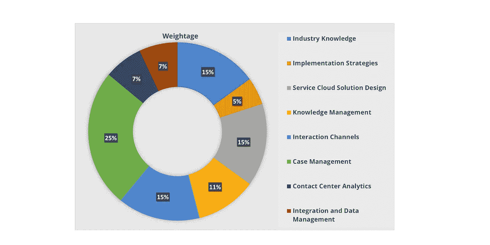

通常，人们选择首先成为 Salesforce 认证管理员，如果您正在寻找入门级角色，这将适合您。然后，他们将获得高级管理员或实施专家认证。

## 开发人员跟踪

一般来说，选择开发人员路线的专业人员是那些在用 JAVA、PHP、C++、C#、AngularJS 或其他编程语言开发应用程序方面有一些经验的人。如果您属于这一类别，那么 Salesforce 将为您提供广泛的机会来构建和推进您的职业生涯。

让我们来看看开发人员经常参加的认证:

**1。sales force Certified Platform App Builder—**该认证面向具有在 Force.com 平台上开发定制应用经验的人员。拥有 Salesforce Platform App Builder 证书证明:

*   您熟悉 Salesforce 的声明性部分。
*   你对 lightning experience 和 lightning app builder 很熟悉。

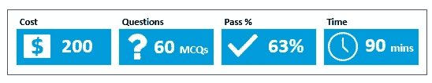

上图为您提供了有关 Salesforce Platform App Builder 考试的详细信息。以下是认证考试中提问主题的权重分布。

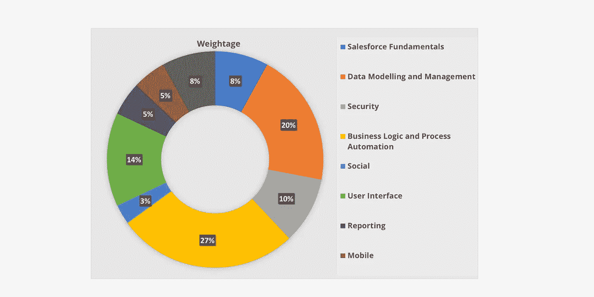

**2。sales force Certified Platform Developer I—**如果您有 6 个月到 1 年在任何平台上开发应用程序的经验，那么您应该考虑成为 sales force Certified Platform Developer I。您应该有至少 6 个月在 Force.com 平台上的经验。拥有 Salesforce 开发人员认证证明:

*   您精通在 Force.com 平台上构建定制应用程序。
*   你对 Apex 和 Visualforce 有基本的了解。

上图为您提供了有关 Salesforce 平台开发人员 I 考试的详细信息。以下是认证考试中提问主题的权重分布。

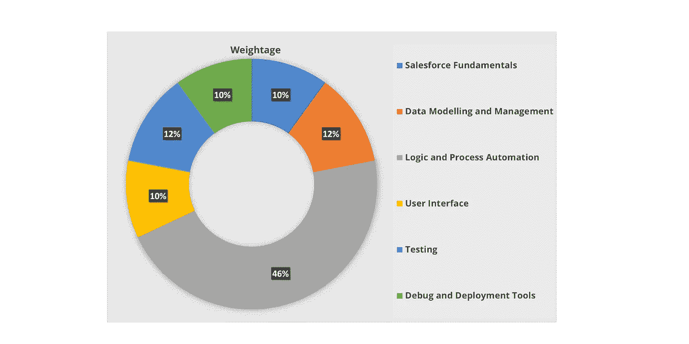

**3。sales force Certified Platform Developer II—**要成为 sales force Certified Platform Developer II，您首先需要成为 sales force Certified Platform Developer I。通常，参加该认证的人拥有 2-4 年的开发经验，并且至少有 1 年的 Force.com 平台经验。拥有 Salesforce Platform Developer II 证书证明:

*   你已经掌握了 Apex 和 Visualforce。
*   你对 SOAP、REST APIs、Heroku 和构建 Lightning 组件有很好的了解。

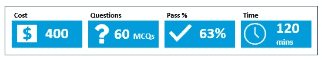

上图为您提供了 Salesforce Platform Developer II 考试的详细信息。以下是认证考试中提问主题的权重分布。

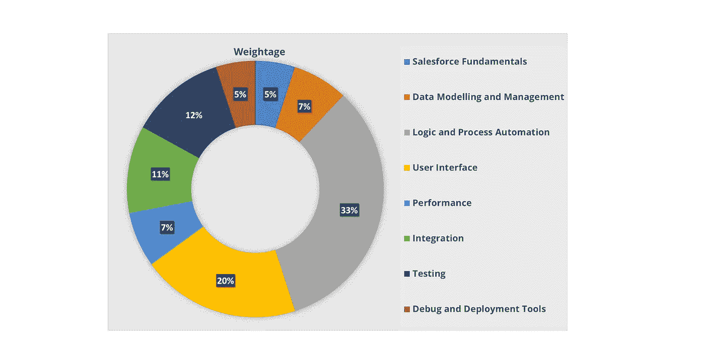

通常，希望以开发角色开始职业生涯的人，Salesforce App Builder 或 Salesforce Platform Developer I 将是正确的起点。如果您获得了 Salesforce App Builder 认证，那么您可以选择通过获得架构师认证来进一步发展您的职业生涯。如果您选择 Salesforce Platform Developer I，那么您可以通过成为 Salesforce Platform Developer II 来推进您的职业发展。这些是您在开发人员追踪中可以使用的选项。

## Salesforce 中的职业

Salesforce 是世界上排名第一的 CRM 公司，非常需要从事这项工作的专业人员。在过去十年中，Salesforce 一直在快速发展。在接下来的五年里，该领域预计将增长 25%或更多。根据 Glassdoor 的说法，Salesforce 是市场上十大技能之一，超过 4，000 个职位可供 Salesforce 专业人员使用。如果你是一个寻找技术职位的人，那么你会对管理员、工程师、开发人员、分析师、云专家、技术支持等职位感兴趣。下面这张来自 www.salesforce.com*的图片将让你了解销售人员的不同职位以及他们的平均年薪。*

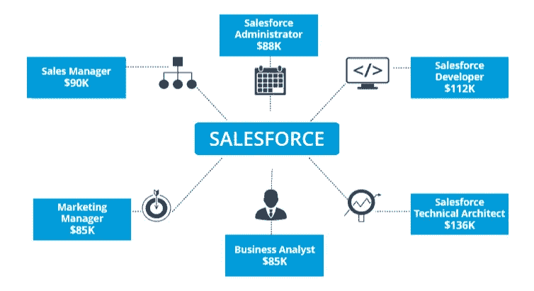

通过这篇文章，我希望您对市场上提供的不同 Salesforce 认证以及哪些认证/课程适合您并与您相关有了一个很好的了解。欢迎在下面的评论框中留下你的任何问题。您还可以查看下面的视频，了解关于 Salesforce 认证和职业轨迹的更详细的解释。

如果你想查看更多关于人工智能、DevOps、道德黑客等市场最热门技术的文章，那么你可以参考 [Edureka 的官方网站。](https://www.edureka.co/blog/?utm_source=medium&utm_medium=content-link&utm_campaign=salesforce-certifications)

请留意本系列中解释 Salesforce 各个方面的其他文章。

> *1。* [*什么是 Salesforce？*](/edureka/what-is-salesforce-5df4830aee98)
> 
> *2。* [*销售力量教程*](/edureka/salesforce-tutorial-5bac7659e0c5)
> 
> *3。* [*Salesforce 开发者教程*](/edureka/salesforce-developer-1051ba8ce733)
> 
> *4。* [*Salesforce 服务云*](/edureka/salesforce-service-cloud-b8b8dbdae9f9)

*原载于 2022 年 2 月 21 日 https://www.edureka.co***。**