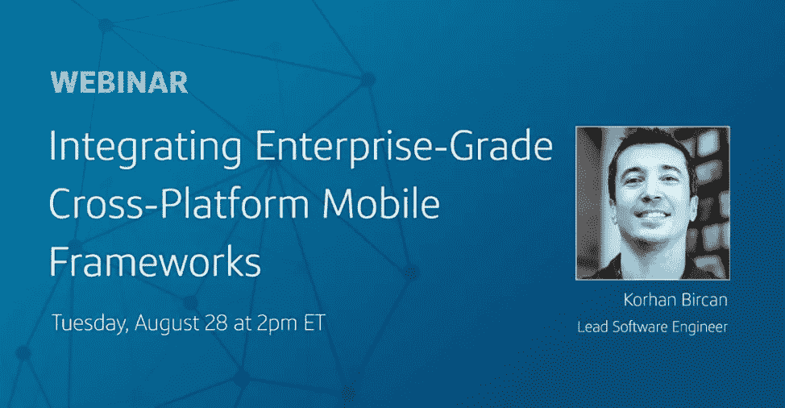
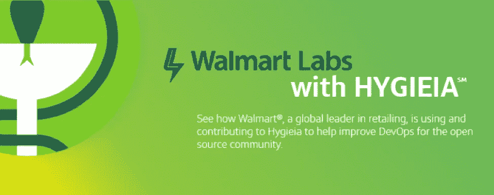

# 开始你的坠落吧

> 原文：<https://medium.com/capital-one-tech/start-your-fall-off-right-ccb50b04d2f6?source=collection_archive---------1----------------------->

随着树叶开始变色，夜晚开始变凉，这是舒适地阅读一本好书的最佳季节。对于那些更喜欢屏幕而不是纸张的人来说，我们已经为你准备了这些很棒的帖子。不需要翻页。

# 阅读

[**打破区块链**](/capital-one-developers/breaking-down-the-blockchain-f4b87422481b)——艾琳·莫里西在 OSCON 的演讲刚结束，她就打破了区块链现象背后的技术，没有诉诸流行词汇和过度宣传的行话。不，真的！

[**信任是你的开发者平台最重要的组成部分**](/capital-one-developers/trust-is-the-most-important-component-of-your-developer-platform-19453360021b) —平台公司如何与构成数字生态系统的用户、开发者、合作伙伴和监管者建立信任？Naveed Anwar，[Capital One de exchange](https://developer.capitalone.com/)的执行副总裁解释道。

[**揭秘 DevOps:自动化交付管道入门**](/capital-one-developers/demystifying-devops-getting-started-with-automated-delivery-pipelines-jenkins-30ccb84c284a) —你是 DevOps 新手吗？或者是 devo PS-好奇？我们记得刚开始时是什么样子，所以我们让软件工程师 Rachel Partridge 将她的所有专业知识整合到一个介绍指南中，与 Jenkins 一起构建自动化交付管道。

[**Python 3 类型提示——填充还是装饰？**](/capital-one-developers/python-3-type-hints-filling-or-garnish-b91bd760214a) —在 Python 3 中，类型提示有点像莳萝泡菜。它们是装饰品吗？它们可以单独作为三明治馅料吗？将它们包含在遗留代码中就像吃一周前做的不新鲜的三明治一样吗？

[**协程和 RxJava——异步比较(第七部分):MVI 项目**](/capital-one-developers/coroutines-and-rxjava-an-asynchronicity-comparison-part-7-mvi-project-f763fdd5070e) **—** 你看了曼努埃尔·维森特 Vivo 关于协程和 rx Java 的七篇系列文章的最后一篇了吗？如果没有，我们会保护你。

# 听

跨平台移动框架越来越受欢迎是有原因的。在本次网络研讨会中，Capital One mobile dev Korhan Bir can 探讨了一些流行的跨平台移动框架，以及您现有的应用程序是否可以利用这些技术。如果你错过了它最初的播放，[我们为你录制了一段](https://na-sj16.marketo.com/lp/284-ESC-480/Implementing-Enterprise-Grade-Cross-Platform-Mobile-Frameworks_Implementing-Enterprise-Grade-Cross-Platform-Mobile-Frameworks.html?utm_source=Twitter)供你欣赏。

*注意——虽然录音是免费的，但你需要在网站上注册才能观看。*

# **学**

沃尔玛是如何将开源 DevOps 仪表板工具 Hygieia 扩展到 5000 多个仪表板的？[本案例研究](/capital-one-developers/how-walmart-scaled-hygieia-the-open-source-devops-dashboard-tool-4fd65f0f589)分析了这家全球最大的零售商如何使用 Hygieia 来监控和改善他们的 CI/CD 渠道。

要了解更多关于 Hygieia 3 的信息以及如何为这个流行的开源项目的路线图做出贡献，请查看我们的[站点](https://developer.capitalone.com/opensource-projects/hygieia/)或在 [GitHub](https://github.com/capitalone/hygieia) 上找到 Hygieia。

***披露声明:以上观点为作者个人观点。除非本帖中另有说明，否则 Capital One 不属于所提及的任何公司，也不被其认可。使用或展示的所有商标和其他知识产权都是其各自所有者的所有权。本文为 2018 首都一。***