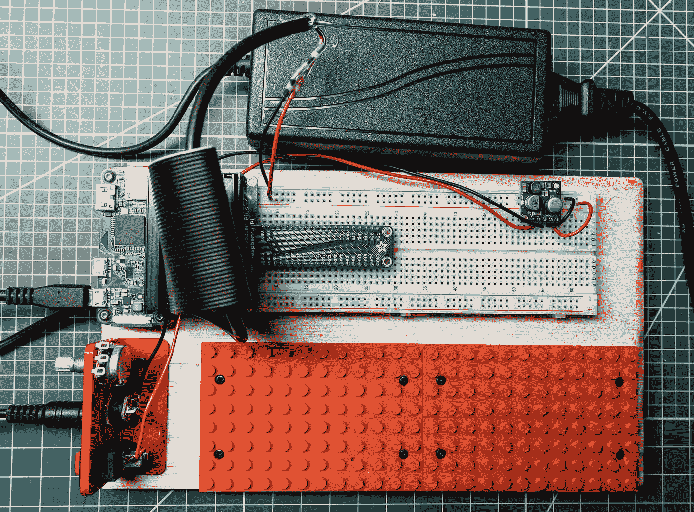
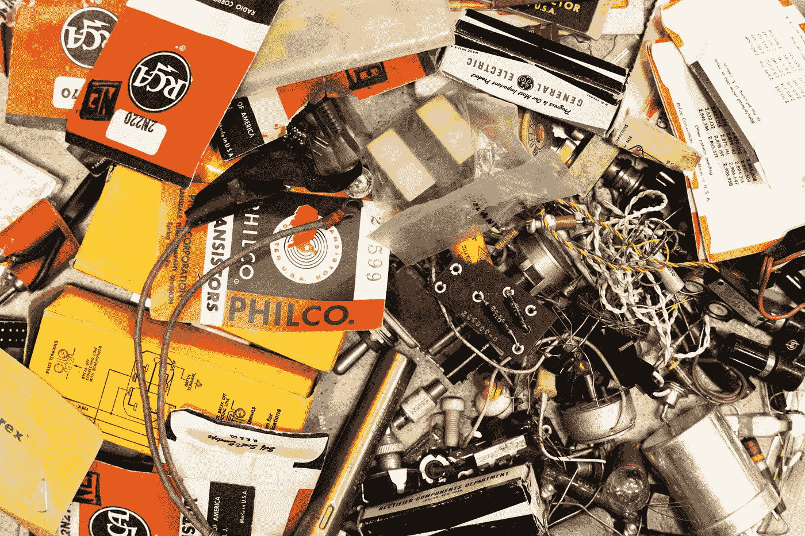
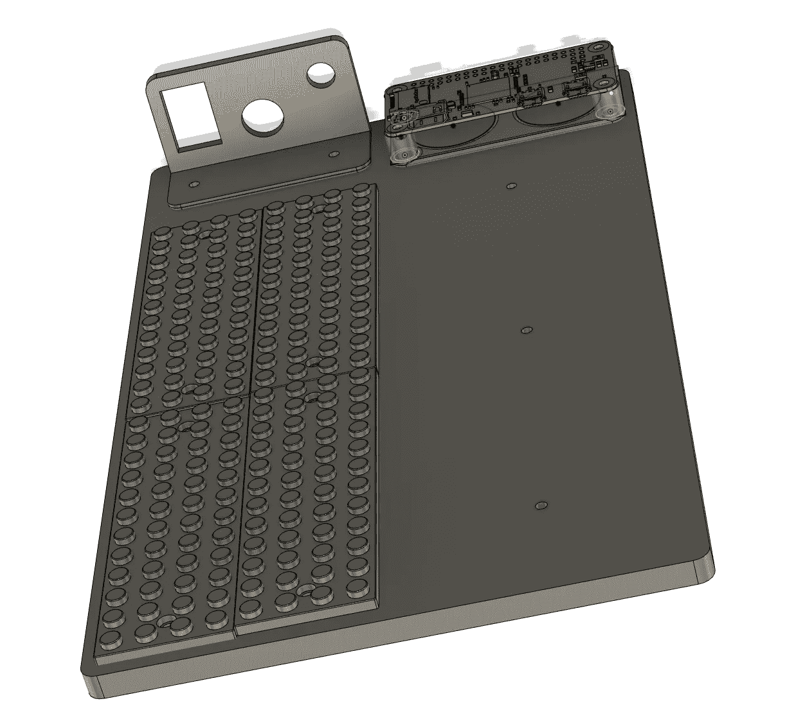

# 开始一个新项目——Pi Zero 定制试验板

> 原文：<https://medium.com/oracledevs/starting-a-new-project-pi-zero-custom-breadboard-834df6414ac6?source=collection_archive---------1----------------------->

克里斯·本森

Pi Zero Custom Breadboard

如果你愿意，你可以在 GitHub [这里](https://github.com/chrisbensen/chris-blogs/blob/main/π-racer/season1/episode1/new-project.md)阅读这篇博文。

每次我开始一个新项目，它都是不同的。不同的挑战、不同的工具、不同的基础架构和要求。完全不同的最终产品。

我通常在新项目中工作，制作没人做过的东西的原型。通常我们知道最终产品需要什么，但有时我们会在工作中发现这一点。我是 Kaizen 的忠实粉丝，Kaizen 是日语“持续改进”的意思。我喜欢从后退一步开始，看看需要什么，有了 80%的知识，根据经验做出直觉决定，然后直接投入。

当然，我按照我的[七步流程来制作一个令人惊叹的演示。](/oracledevs/the-seven-step-process-to-creating-an-amazing-demo-ed89efca0dcd)这与敏捷流程没有太大的不同，但它的结构化程度较低。几乎就像看板一样。我首先从最难的问题开始，但是如果我不知道从哪里开始，我就从我知道的开始。有时候，有成就感并有所表现比原地打转要好。但是我不喜欢浪费我的时间，把工作扔掉，所以这总是一种平衡。有时候扔掉工作正是我们所需要的，并不是真的扔掉工作；需要努力获得继续下去所需的知识。

Episode 1 — Custom Breadboard for Raspberry Pi Zero

“尽早快速失败”的咒语离我很近，但我不喜欢传统意义上的“黑客”。我的意思是更多地与决策有关。有些决定最好推迟，有些则应该尽快做出。知道什么时候做决定是一种技能，我认为这是可以教会的。每个人都会犯错误，所以任何团队的诀窍是建立一种不责备的文化，在这种文化中，人们可以接受自己的错误，承认错误，然后继续前进。根据我的经验，这些团队是最成功的，也是最有趣的团队。

我爷爷总是教我在工作中也要用右手。现在，他只是一个火箭科学家，他也造房子，对电子学略知一二，在我 10 岁的时候向我解释爱因斯坦的广义相对论，但根据我的经验，这同样适用于任何工作。一切都是相对的。如果你只有一项技能，比如使用锤子，那么所有东西看起来都像钉子。所以当我发现我需要一个工具时，我要么找到它，要么制造它。《实用程序员》是我经常参考的一本书。(免责声明，我只看了书的封皮但我觉得我抓住了概念的要点，强烈推荐这本书。)

上周我开始了一个新项目。这部分是边缘或物联网项目(看你怎么看)；Raspbery Pi Zero 将有一些传感器和电机，连接到 Oracle 云，数据将在网络浏览器中实时可视化。这就要涉及到一些乐高™。有很多事情已经被研究和了解，也有很多事情我们完全不知道它们将如何工作。老实说，这会很有趣，因为这太疯狂了。这是最好的项目。没有压力。

我们选择 GitHub 进行版本控制(原因现在看来很明显)。敬请关注。因为会有多个部分，所以编程语言将根据最适合工作的部分来确定。“超出满栈”是个东西吗？我可以说，性能是这里的关键。Java + GraalVM 将是首选，但也会有一些 Javascript 和 Python，可能还有一些 c++——但我可能会尝试 Go 或 Rust，或使用 GraalVM 本机映像。

第一步是试验板。每当我开始一个项目，原型阶段都是一团混乱。这使得在我房间里的电脑桌和车库里烙铁的工作台之间移动项目变得很困难。我决定为我的下一个项目解决这个问题，制作一个定制的原型板，并尽可能干净地构建它。那我就全部分享给你！因此，如果你有兴趣自己制作，去 Thingiverse 看看 [Pi Zero 定制试验板](https://www.thingiverse.com/thing:4868187)。顶部 CAD 渲染中的三个孔(从左到右)是电源开关、2.1 毫米电源和电位计。以下是所有零件的清单:

*   [电位器](https://amzn.to/2SCQurq)
*   [2.1 毫米插孔](https://amzn.to/3hZdOu8)(不过我更喜欢这些[2.1 毫米插孔](https://amzn.to/3yLGooK))
*   [电源](https://amzn.to/3c1uVYK)
*   [试验板](https://amzn.to/3fRCHFr)
*   [树莓派零度 W](https://www.sparkfun.com/products/15470)
*   [组装好的丁字鞋匠](https://www.adafruit.com/product/2028)
*   [Pololu 5v 2.5a 步降稳压器](https://www.pololu.com/product/2850)
*   [实芯 22 AWG 线](https://www.sparkfun.com/products/11367)
*   [闪迪 Micro SD 卡](https://amzn.to/3vuLDaC)
*   [柜门保险杠](https://amzn.to/3oYa1in)
*   [火箭开关](https://amzn.to/3yLGL2C)(我用了一个旧开关，但这个看起来规格相同)
*   (3) [M2.5 x 6mm 十字圆头螺钉](https://www.mcmaster.com/90380A338/)(这是我能找到的最近的了
*   (12) [M2.5 x 4mm 十字圆头螺钉](https://www.mcmaster.com/90380a337/)(这是我能找到的最接近的)
*   (4) [M2.5 x .45mm 热固塑料嵌件](https://www.mcmaster.com/94180A321/)
*   (4) [圆头六角头 M2.5 x .45mm 5mm 长 18–8 不锈钢螺钉](https://www.mcmaster.com/92095A457/)
*   (2) [密封热缩对接接头](https://amzn.to/34lLbzz)

我用激光从 1/4 英寸的杨木胶合板上切割出主板，但也包含了 3D 打印版本。这些可以合并成一个大的打印，但我喜欢分块打印，以解决模块化和打印失败的问题。我还用 0.25 毫米的打印头打印了乐高™零件，同时用 0.4 毫米的打印头打印了其余部分。我用的是标准的红色 Ultimaker PLA。总的来说，这大约是 3D 打印的一天。

现在我已经准备好以最有条理的方式开始原型制作了。我没有错觉，它仍然会变得混乱。请继续关注本系列的下一部分，我将在其中设置 Oracle 云服务和 Pi Zero。你不会想错过的。

Episode 1 — Extended Edition of Custom Breadboard for Raspberry Pi Zero