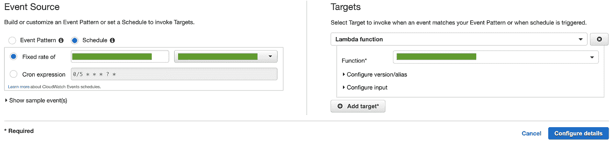

# 从 AWS 和 DevOps 开始—来自专家的 10 条建议

> 原文：<https://medium.com/capital-one-tech/starting-out-with-aws-devops-10-tips-from-an-expert-ac93980b235c?source=collection_archive---------2----------------------->

## 使用 my DevOps go-to 的 AWS Lambda、CloudFormation 和 CloudWatch 构建您的第一个应用程序的建议


起初，利用 DevOps 构建可扩展的云项目似乎令人望而生畏，尤其是在浏览 AWS 中 160 多个可用服务选项时。知道哪一组特定的 AWS 服务运行得快并支持可伸缩性需要耐心、毅力和学习意愿的平衡。通过 DevOps，可以轻松管理常用的云最佳实践，如服务器修补和定时无服务器操作。但是，知道使用哪些服务以及如何有效地使用它们，将最终使一个人的团队和她的职业生涯走向成功。

当开始云开发运维之旅时，首先需要了解如何规划、编码、构建和测试他们的应用，然后再关注新的运营版本/部署，并进行详细监控。目前，有三种 AWS 服务——[Lambda functions](https://aws.amazon.com/lambda/)、 [CloudFormation](https://aws.amazon.com/cloudformation/) 和[cloud watch](https://aws.amazon.com/cloudwatch/)——对于构建 DevOps 功能的运营方面非常有用，可以用于关注应用程序生命周期的发布和部署方面。我写这篇博客的目的是，通过对服务的高层次概述、对服务使用的深入探究以及对 DevOps 的运营(Ops)方面的关注，确保人们能够理解这些 AWS 服务之间的差异。这应该给人信心把这些知识带回他们的团队；从而，成为 DevOps 和云战士！

# DevOps 找到了我

在 Capital One 与 AWS 合作了几年后，我通过 AWS 控制台和[命令行界面](https://aws.amazon.com/cli/) (CLI)构建和销毁了许多应用程序，但我需要通过使用常见的 DevOps 原则来完全自动化这一过程，例如计划、编码、构建、测试、发布、部署、操作和监控，以将软件发布到快速和可重复的过程中。我负责我的职业生涯，并在接下来的六个月里致力于在我团队的 AWS 应用程序中巩固 DevOps 原则。将 DevOps 自动化构建到我的现有项目中，使我能够花更多时间关注新的高优先级应用程序。

从我开始 DevOps 之旅到现在已经三年多了，从那时起，我已经能够使用 Jenkins 部署全栈自动化，而无需人工干预。回过头来看，这段经历让我列出了每个使用 AWS 的 DevOps 工程师都应该知道的 10 条建议。

# 1.如何管理不断扩展以满足应用需求的云服务器？

与 AWS 一样，[公共云](https://aws.amazon.com/types-of-cloud-computing/)的一个好处是，它允许工程师从日常服务器管理中解脱出来，以便他们可以将时间集中在构建、测试和部署他们的应用程序上。*关于不同云计算部署模型的更多信息可以在 AWS 的* [*文档*](https://aws.amazon.com/types-of-cloud-computing/) *中找到。*

然而，人们仍然需要在公共云中的不可变服务器上打补丁，因为应用程序是使用负载平衡器和自动扩展组自动扩展和缩减的。有几种解决方案可以解决这种不便，但对我来说效果最好的解决方案是*补液*。再水化是指运行已安装最新补丁的新服务器，并淘汰/销毁未安装补丁的旧服务器的过程。可以在公共云中同时恢复数十、数百甚至数千台服务器。

# 2.DevOps 原理如何融入应用？

工程师可以使用 DevOps 原理同时扩展多种补液。DevOps 通过持续集成和非常短的代码部署等待时间缩短了开发周期。它还为常见的工程挑战提供了解决方案，例如保持生产环境中的正常运行时间，需要更好的工具来自动化基础架构维护，以及监控大量服务器。在 DevOps 带来的众多优势中，虚拟化环境、执行已配置的系统和执行持续监控都是重要的实践，这让我有更多的时间致力于构建新的应用。

# 3.有哪些 AWS 服务可以帮助有效地将 DevOps 实践添加到我的应用程序中？

有许多不同的服务，但我特别选择了三个服务:[](https://aws.amazon.com/lambda/)****，**[**cloud formation**](https://aws.amazon.com/cloudformation/)**和**[**cloud watch**](https://aws.amazon.com/cloudwatch/)。请注意，有几个 DevOps 工具和 AWS 服务可以提供完整的应用程序生命周期监管，例如 [AWS CodePipeline](https://aws.amazon.com/codepipeline/) ，它可以在代码更改期间自动执行版本的构建、测试和部署阶段。为了简单起见，我只关注我最常用的三个 AWS 服务。**

1.  ****Lambda** 允许工程师通过处理计算资源在没有服务器的情况下执行代码。这种服务通常被称为“无服务器计算平台”，许多公司使用它，因为只为代码使用的资源付费更具成本效益。**
2.  ****CloudFormation** 支持 AWS 基础设施的可重复部署。有了 CloudFormation，人们可以创建模板文件，称为[cloud formation Templates](https://aws.amazon.com/cloudformation/resources/templates/)(CFTs)，将资源集合作为一个单元(“堆栈”)来构建和销毁。**
3.  **CloudWatch 收集日志、指标和事件等运营数据，作为回报，它会发出警报、可视化日志并触发自动化操作。CloudWatch 还可以触发动作事件，比如 Lambda 函数的运行。**

# **4.第一次构建 AWS Lambda 函数有哪些不同的方法？**

**Lambdas 函数可以通过以下三种方式之一构建:**

1.  **从头开始创建代码:你可以使用 Lambda 支持的众多语言中的一种来创建自己的函数。NET、Go、Java、Node.js、Python、Ruby。**
2.  ****使用蓝图**:已经有 Lambda 函数的示例蓝图配置，有 set 语言可供选择。蓝图有助于提供通用的 Lambda 解决方案，可以通过运行时、语言或特定用例进行过滤。还有[空白函数示例](https://docs.aws.amazon.com/lambda/latest/dg/samples-blank.html)来从头开始配置 Lambda 函数，但是有一个新的额外好处，即使用向导来触发和部署代码。当我第一次开始的时候，当我对直接写 Lambda 代码感到紧张时，这很有帮助。**
3.  ****浏览无服务器应用库**:搜索和发现 Lambda 功能，这些功能可以从 AWS 的 Lambda 库中进行配置和部署。该存储库允许用户配置预设的 Lambda 函数值，并从 AWS 控制台无缝地部署和管理这些函数。**

# **5.给定一个示例应用程序的基础架构，如何在可伸缩的应用程序中高效地使用 DevOps？**

****场景:**一个基本应用程序包含一个负载平衡器，如 [ELB(弹性负载平衡器)](https://aws.amazon.com/elasticloadbalancing/)和一个附加的[服务器 EC2(弹性云计算)](https://aws.amazon.com/ec2/)实例，该实例包含一个根卷和一个辅助的、更大的附加卷。在本例中，辅助卷保存了应用程序的所有数据。随着 ec2 数量的增加和减少，负载平衡器和自动扩展组将处理旋转服务器的可伸缩性。**

## **Lambdas 如何在 DevOps 循环中发挥作用:**

**Lambda 脚本可以将当前应用程序的 EC2 复制/克隆到一个新的 EC2 实例上，方法是将构建分成五个简单的步骤。(请使用下图查看这些步骤的运行情况。)**

1.  **使用最新可用的 AMI (Amazon 机器映像)构建一个新的 EC2 实例，该 AMI 已经过质量保证(QA)的全面测试，并由贵组织的工程团队发布。**
2.  **创建辅助卷的快照。**
3.  **将快照转换为可用卷。**
4.  **将新创建的卷附加到新的 EC2 实例，然后使用 EC2 的 user_data 部分在本地挂载驱动器。**
5.  **删除旧的 EC2 实例:从 ELB 中删除 EC2；从 EC2 中移除/卸载二级卷；删除旧 EC2 及其关联的旧卷。**

****

## **使用 Lambdas 的补液方法:**

**应将单个 Lambdas 配置为按照计划的节奏创建快照，作为 CloudWatch 事件规则。在应用程序负载过多之前，需要配置负载平衡器，创建自动扩展组(ASG ),并将其与应用程序的 EC2 连接在一起。在再水合过程中，可以启动 Lambda 函数来完成上面列出的五个步骤。通过启用一个 CloudWatch 事件模式规则来触发一个 Lambda 函数，可以将补液设置为自动运行。**

## **使用 CFT 的补液方法:**

**在同样的场景中，在应用程序创建期间，可以将 CFT(云形成模板)ASG 和 ELB 构建到其堆栈中，通过设置系统的自动扩展限制来平衡应用程序的负载。CFT 构建充当单个堆栈，在再水化期间，用户可以手动删除单个 ec2(在单个服务器上测试新的应用构建)，通过选择“更新”堆栈按钮使用单个按钮更新整个堆栈，或者在每次再水化期间创建新的堆栈作为[蓝绿色部署](https://aws.amazon.com/quickstart/architecture/blue-green-deployment/#:~:text=When%20an%20application%20is%20developed,that%20normally%20handles%20live%20traffic.)，以在删除辅助旧资源之前设置新的主测试环境。**

***关于无服务器应用架构的信息可以在 AWS 的* [*Lambda 文档*](https://d1.awsstatic.com/whitepapers/serverless-architectures-with-aws-lambda.pdf) *中找到。***

# **6.首次使用这些 AWS DevOps 服务时会遇到哪些常见障碍？**

**根据我使用 AWS 和 DevOps 的经验，这里有一些对初次使用 Lambdas 和 CloudFormation 的用户有用的建议。**

## ****对于λ:****

*   **删除带有非根连接卷的 EC2 时，必须先从实例中卸载该卷，然后才能删除 EC2 实例。**

## ****对于云的形成:****

*   **当更新修改 IOPS、大小或卷类型的卷时，在另一个操作发生之前有一个“冷却期”。在此期间，流程将停留在“等待期”，然后才能在该时间窗口内进行另一次更改。**
*   **栈是 AWS 资源的单个单元；当一个栈被删除时，栈的所有相关资源被一起删除。**
*   **许多属性没有按要求列出，但许多属性是有条件的。一个例子是 security groupid，只有当选择指定虚拟专用云(VPC)安全组时才需要它。**

# **7.开始构建 Lambda 函数和 CFT 的最快方法是什么？**

**从头开始构建 Lambda 函数的最快方法是使用一个[蓝图空白函数](https://docs.aws.amazon.com/lambda/latest/dg/samples-blank.html)，构建一个随时可用的函数的最快方法是[浏览 Lambda 应用程序库。](https://github.com/search?q=org%3Aaws-samples+lambda&unscoped_q=lambda) CloudFormation 有许多针对[地区的模板](https://docs.aws.amazon.com/AWSCloudFormation/latest/UserGuide/cfn-sample-templates.html)样本，可从 AWS 资源网站下载。**

# **8.如何在控制台中部署 Lambda 函数？**

**在 AWS 控制台中，可以通过多种方式触发 Lambda 函数。触发函数的最常见方式之一是在选定的 Lambda 函数中配置测试事件，然后选择“测试”按钮。触发 Lambda 函数的第二种方法是使用事件模式，比如 CloudTrail 日志，或者作为 CloudWatch 事件的固定时间表。在控制台中，导航到 CloudWatch 服务并选择事件>规则。**

1.  **完成目标事件源部分。**
2.  **设定“Lambda 函数”为目标。**
3.  **选择给定的 Lambda 函数名。**
4.  **配置规则名称的详细信息。**
5.  **选择可用规则的状态。**

**用户可以随时查看、编辑、删除或禁用 CloudWatch 规则。**

****

**Screenshot of setting a Lambda function as a target in CloudWatch in the AWS Console as a scheduled job.**

# **9.当构建一个 Lambda 函数时，有没有可能结合通用的安全最佳实践？**

**为了避免函数中硬编码变量的陷阱，Lambda 提供了[环境变量](https://docs.aws.amazon.com/lambda/latest/dg/configuration-envvars.html)。环境变量通过在执行 Lambda 函数时引用的代码块之外创建变量集来避免硬编码变量。环境变量还允许代码保持不变，而诸如大小、名称、区域和安全组之类的变量被更新。更新环境变量比不断地为特定用例硬编码变量要容易得多。(下面的代码示例引用了使用 boto3 库在环境变量部分设置的特定区域。)**

```
import os 
import boto3 
activeRegion = os.environ['ActiveRegion'] 
my_example_ec2 = boto3.client('ec2', region_name=activeRegion)
```

****

**Screenshot of setting Lambda function environment variable key pairs in the AWS Console**

# **10.第一次使用 AWS 服务时，需要记住的最重要的一课是什么？解决问题的最佳方法是什么？**

**一个好的经验法则是，始终指定您正在使用的 AWS 区域。如果缺少 AWS 区域，将会出现问题，具体取决于您使用的 AWS 服务。有时，当没有指定区域时，构建会自动出错，例如 Lambda 函数。如果没有分配区域，其他时间区域将自动分配给 CFT。当这种情况发生时，它很有可能不在人们所希望的地区。当位置区域未知时，也很难在控制台中定位应用程序。**

**解决问题的最好方法是使用 [AWS 文档](https://docs.aws.amazon.com/)并在[栈溢出](https://stackoverflow.com/questions/tagged/amazon-web-services)中查找特定错误。博客和在线教程中也有很多不同的资源可以帮助你。我还建议在[博客](https://www.capitalone.com/tech/cloud/)和[媒体](https://medium.com/capital-one-tech/cloud/home)上查看 Capital One 的全部云内容。我们在这两个技术博客上分享了相当多的云计算专业知识。**

# **把所有的放在一起**

**踏上 DevOps 之旅需要时间、练习和耐心。在使用 DevOps 构建您的第一个应用程序时，决心也很重要。当您开始时，知道有几个模板示例、蓝图和应用程序存储库已经设计好并可供使用，您会感到很有信心。请记住，AWS 区域需要在代码中指定，Lambda 环境变量会删除任何硬编码的变量，并且 CFT 构建的堆栈会作为一个单元一起创建或销毁。**

**不要担心，一旦你成为 AWS DevOps 专家，CFT 的某些痛点——如冷静期——都将成为你日常工作的一部分。此外，请记住，虽然我们讨论的三个 AWS 服务— Lambda、CloudFormation 和 CloudWatch —都是我在 DevOps 中常用的服务，但是还有许多其他的 [AWS 服务](https://aws.amazon.com/products/)，并且有越来越多的服务变得可用。在尝试新服务时，不断学习新概念和保持开放的心态总是很重要的。**

***披露声明:2020 资本一。观点是作者个人的观点。除非本帖中另有说明，否则 Capital One 不隶属于所提及的任何公司，也不被这些公司认可。使用或展示的所有商标和其他知识产权是其各自所有者的财产。***

***最初发表于*[*【https://www.capitalone.com】*](https://www.capitalone.com/tech/cloud/aws-and-devops-tips-from-an-expert/)*。***