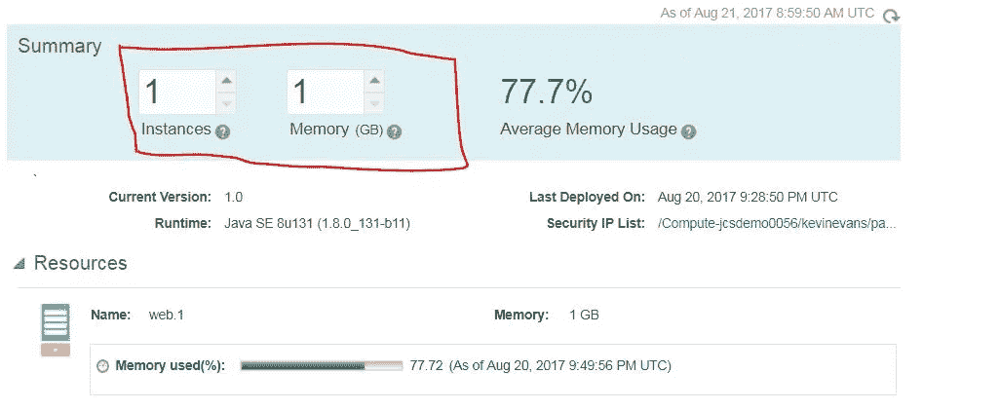

# 应用容器快速介绍— Oracle 云

> 原文：<https://medium.com/oracledevs/starting-with-oracle-application-container-cloud-ba258c572de1?source=collection_archive---------1----------------------->

甲骨文去年推出了应用容器云服务。ACCS 使您能够在几分钟内将 Java SE、Node.js、PHP、Python 或 Ruby 开发的应用程序部署到云中。这些应用作为 Docker 容器在内部部署，以便更快地启动和扩展。

ACC architecture

它为关键的编程语言和平台提供了预构建的运行时，并且有望在不久的将来支持其他的。对于可维护性，它提供了 Java SE 高级特性，如飞行记录器、任务控制、内存管理和安全更新。它有很好的基于 web 的 UI 控制台来管理和部署东西。您也可以使用 REST API。

ACCS archive upload to run-time container

# **你将得到什么**

## **多语言运行时**

*   内置与其他服务的集成，例如存储云、Java 云、数据库云、开发人员云等。

## **开放平台**

*   这是一个基于容器的运行时环境，但不需要事先了解 Docker 或其他容器生态系统。

## **接入监控**

*   使用服务控制台的信息。可以在 Oracle ACC 服务控制台中直接检索关于应用程序运行状况的指示。打开服务控制台后，必须访问每个应用程序实例的服务，以检查每个实例的平均内存使用情况。

Memory usage of application

## **内置日志**

*   通过 Oracle 存储云和管理任务管理日志的单一控制台。Recording 选项卡生成 Java 虚拟机(JVM)及其运行的应用程序的详细记录。记录的数据包括执行配置文件、垃圾收集统计数据、优化决策、对象分配、堆统计数据以及锁和 I/O 的延迟事件。[还可以集成 Oracle 管理云](https://cloud.oracle.com/management)。

Logging adminsitration

## **服务绑定**

*   使用此功能连接 Oracle 数据库云或 MySQL 云服务。您还可以在运行时添加环境变量。它还将显示部署历史。

Manage database for application via service binding

## **弹性环境**

*   可以通过开箱即用的负载平衡来管理多个实例。您可以根据需要在运行时增加实例。您可以增加实例运行时间。处理增加的实例需要时间，但现有实例将继续运行。在下图中，它显示了每个实例的内存。默认为每个实例 2 GB。

Performance indicator

只需点击几个按钮，您就可以启动、停止、重启和检查应用程序的健康状态。

Start, stop, restart and health check buttons

应用程序伸缩将决定您的实例是启动还是重启。

> *如果您正在向外扩展，将会启动新的实例。*
> 
> *如果您正在扩展，所有实例都将重新启动。*
> 
> 如果是纵向扩展，所有实例都将重新启动。
> 
> *如果缩小规模，所有实例都将重新启动。*

## **自动化操作**

*   通过 UI 控制台、命令行或 REST API 管理运营。
*   与[开发者云服务](http://cloud.oracle.com/developer_service)良好集成，实现自动化创建、部署等。它还连接到甲骨文云的生态系统。

# **总结**

应用容器云是多语言应用部署的巨大平台，可以方便地管理、扩展和审计。它可以让开发人员专注于业务代码，而不是考虑基础设施。总的来说，尝试这项服务以及其他 Oracle 云服务是值得的。