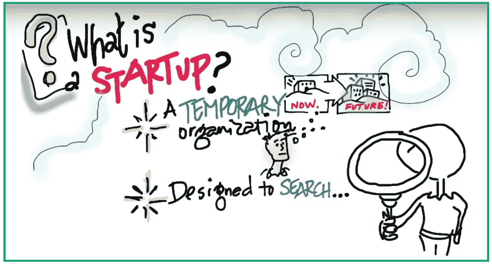

# Startup : Apa Itu?

> 原文：<https://medium.easyread.co/startup-apa-itu-c06c9fc10031?source=collection_archive---------0----------------------->

Beberapa lama yang lalu saya tak sengaja menonton sebuah video presentasi Steve Blank di youtube yang berjudul Steve Blank on Custmer Development : Second Decade ( [Link](https://m.youtube.com/watch?v=6t0t-CXPpyM) ). Video ini membuka sedikit pemikiranku tentang apa yang seharusnya kulakukan selama ini. Saya merasa yakin banyak orang di luar sana yang menyatakan dirinya startup, jika kita tanya “Apa itu startup?”, mereka akan menggunakan definisi sendiri “memulai usaha”, “awal untuk sukses”, “process belajar” atau yang lainnya. Tidak ada yang salah tentang itu, tetapi mungkin beberapa di antara mereka sama seperti saya memulai startup tanpa definisi yang jelas, bahkan tidak tertarik dengan definisi formal dengan alasan bahwa definisi hanya formalitas atau teori. Tetapi setelah pengalaman tersebut, saya nyatakan hal itu penting.

What Is Startup?, from steveblank.com

# **Apa itu Startup?**

Dalam video tersebut, Steve Blank mengatakan bahwa :

> *“Startup is a temporary organization formed to search repeatable and scalable business model”.*

Dari definisi tersebut, terdapat beberapa kata kunci yang menarik yaitu :

**1\. Temporary organization is formed to search** Startup adalah sebuah organisasi sementara. Mengapa dikatakan begitu? Karena startup dibentuk untuk mencari sesuatu yang disebut model bisnis (business model). Ketika startup tersebut telah menemukan model bisnis, maka dia tidak lagi disebut sebagai sebuah startup, tetapi company.

**2\. Repeatable and Scalable Business Model** Startup is formed to search repeatable and scalable bussiness model. Nah apa sebenarnya model bisnis :

> Business model describes how your company creates, delivers and captures value.

Jadi bisnis model adalah segala hal yang berhububan tentang membuat, menyampaikan, dan menangkap nilai (value) yang selanjutnya nilai tersebut yang akan dijual untuk menghasilkan keuntungan. Tapi tidak hanya sekadar memperoleh keuntungan, bisnis model tersebut harus dapat digunakan secara berulang-ulang ( *repeatable* ) dan dapat diperbesar untuk memperoleh keuntungan yang lebih besar ( *scalable* ). Hal tersebut penting karena ketika menjadi sebuah perusahaan, perusahaan tidak berdiri untuk 1, 2, 3 atau 5 tahun, tetapi selamanya dan sebuah Company tidak berdiri selamanya namun begitu-begitu saja tanpa berkembang atau berinovasi.

# **Startup vs Big Company**

Selanjutnya apa perbedaan antara startup dan sebuah perusahaan besar ( atau persuhaan saja). Steve Blank menejelaskan bahwa:

> Startup is **searching** business model dan Company is **executing** business model.

Seperti penjelasannya di atas, startup mencari bentuk bisnis model yang baik, dan setelah startup tersebut menemukan bisnis modelnya, maka dia akan beralih menjadi sebuah perusahaan yang mengeksekusi atau menjalankan bisnis model yang telah ditemukan tersebut.

# **Perjalanan Pencarian**

Dalam proses penemuan model bisnis yang *repeatbale* dan *scalable* merupakan sebuah perjalan yang tidak mudah, oleh karena itu, para founder dari startup tersebut memulai dari :

1.  Nilai tambah produk/jasa yang ingin dibuat (Value Proposition)
2.  Beberapa hipotesis yang ingin diuji seperti :
    - Siapa user dari produk/jasa tersebut?
    - Bagaimana cara mendistribusikan produk/jasa tesebut ke user?
    - Siapa partner yang diperlukan?
    - Bagaimana keuangan startup anda?

Hal-hal yang telah didefinisikan di atas disebut dengan hipotesis yang akan diuji. Dalam pengujiannya, Steve Blank memiliki moto “ **Out of Building”.** Pengujian dilakukan langsung kepada user yang telah didefinisikan dan tidak secara internal tim. Pengujian dilakukan dengan membuat *Minimum Viable Product (MPV)* yang berarti produk dengan fitur yang cukup untuk melakukan memperoleh data untuk menguji dan mem-validasi hipotesis yang dimiliki. Setelah pengujian tersebut, maka dapat dilakukan pilihan-pilihan tindakan selanjutnya mempertahankan hipotesis tersebut atau menolak hipotesis tersebut untuk diganti dengan hipotesis yang baru. Hal ini dapat berdampak pada penggantian produk ataupun metode pada startup tersebut. Proses perubahan-perubahan tersebut kerap dikenal dengan istilah ***Pivot.***

Demikian sekilas tentang startup, saya rasa teman-teman juga mulai terangsang untuk mendalami lebih dalam, jika baru mengerti ini. Sebagai penutup, saya akan berikan bonus quote :P.

> “Sebuah teori adalah curhat dari sebuah perjalanan yang panjang dari seorang amatir”