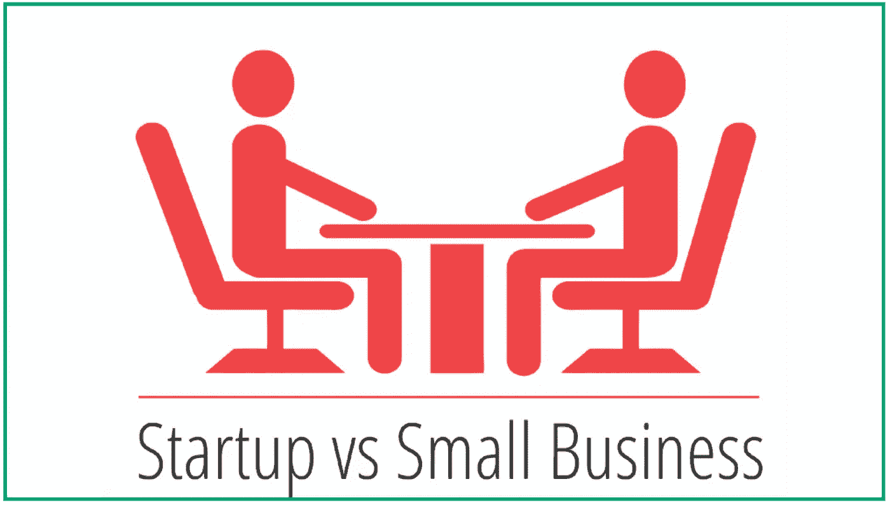

# Startup: Apakah Semua Sama?

> 原文：<https://medium.easyread.co/startup-apakah-semua-sama-bb9df98c3150?source=collection_archive---------1----------------------->

# Introduction

Beberapa waktu yang lalu, saya sempat mengalami pergumulan tentang bagaimana Startup saya, NED Studio, seharusnya bekerja, berjalan ataupun beroperasi. Bagaimana kami seharusnya mendefinisikan nilai jual (value) startup kami, bagaimana seharusnya mengembangkam nilai(value) startup kami, bersamaan dengan bertahan hidup. Dan beberapa pandangan yang sering membuat saya “galau” adalah ketika seseorang mengatakan “liat startup X, mereka begini” atau “contohlah startup X, dia bisa memperoleh uang”. Saya secara subjectif tidak ingin meniru mereka, tetapi saya tidak mampu menjelaskan dengan objektif. Dan akhirnya saya mencoba mempelajari beberapa startup dengan jalan yang mereka tempuh dan bagaimana hal tersebut relevan terhadap startup dan mimpi kami. Dan **salah satu hal utama** yang saya temukan adalah prinsip dasar tentang apa yang diinginkan founder terhadap startupnya sehingga ia membentuk sebuah startup yang dijelaskan Steve Blank dengan judul “Six Types of Startup”

Image from authorstream.com

# Jenis Startup

Steve Blank, dalam penjelasan di video youtube, [Customer Development: Second Decade](https://www.youtube.com/watch?v=6t0t-CXPpyM) , menjelaskan bahwa terdapat 6 jenis Startup yaitu:

## 1\. Lifestyle Startup

Lifestyle Startup adalah startup yang dibentuk untuk menghidupi atau menjiwai atau menikmati passion dari founder-nya. Kata kunci untuk jenis ini adalah “ ***live founders passion*** ”.

## 2\. Social Startup

Social Startup adalah startup yang dibentuk untuk mengubah dunia menjadi lebih baik. Kata kunci untuk jenis ini adalah “ ***make the world better*** ”.

## 3\. Small-Business Startup

Small-Business Startup adalah startup yang dibentuk untuk mencukupi kehidupan keluarga. Kata kunci untuk jenis ini adalah “ ***feed the familty*** ”.

## 4\. Buyable Startup

Buyable Startup adalah startup yang dibentuk untuk dijual kepada perusahaan yang lebih besar. Kata kunci untuk jenis ini adalah “ ***acquired by other company*** ”.

## 5\. Scalable Startup

Scalable Startup adalah startup yang dibentuk untuk benar-benar menjadi perusahaan besar atau raksasa. Kata kunci untuk jenis ini adalah “ ***born to be big*** ”.

# Real Impact

Dalam implementasi nyatanya, hal ini penting sebagai fondasi dasar untuk mengambilan keputusan. Hal tersebut adalah **level subjektif dari founder** tentang bagaimana menjalankan startupnya yang **selanjutnya berhubungan dengan kesiapan untuk menangung konsekuensinya** . Dan untuk memberi gambaran lebih jelas, saya berikan contoh berikut ini :

1.  Apakah lifestyle startup mau melakukan pekerjaan untuk membantu orang lain tetapi membatasi mereka untuk menikmati passionnya? Tentu tidak.
2.  Apakah Social Startup mau melakukan pekerjaan yang menghasilkan uang namun tidak memberi pengaruh pada orang lain? Tentu tidak.
3.  Apakah Small-bussiness mau melakukan pekerjaan yang beresiko yang membuat mereka mungkin tidak dapat uang setiap bulan? Tentu tidak.
4.  Apakah buyable startup mau melakukan pekerjaan yang menghasilkan uang kecil namun tidak meningkatkan brand startupnya dihadapan perusahaan lain? Tentu tidak.
5.  Apakah scalable startup tidak perlu mempelajari standard operasional sebagai perusahaan besar? Tentu tidak.

Saya rasa Anda mengerti tentang kata “Tentu tidak” yang saya maksud adalah secara prinsip. Hal tersebut saya katakan tanpa memperhatikan faktor-faktor lain karena faktor-faktor lain tersebut terlalu luas untuk dibahas dalam artikel ini. Hahaha :P

Hal di atas adalah contoh kecil dari bagaimana pengambilan keputusan itu sangat dipengaruhi oleh “ **Apa yang founder inginkan sehinga dia membangun startup** ” atau jika mengunakan bahasa formal adalah “ **Apa Visi dari Startup tersebut** ”.

Oleh karena itu, jika Anda sampai pada titik mengalami “ke-galau-an” seperti saya di atas, coba Anda mendalami lebih dalam tentang founder dan visi startup Anda. Hal ini untuk melihat **keinginan dan kesiapan founder** Anda.

> Jika kamu tahu apa perbedaanmu dengan orang lain, maka kamu akan tahu apa yang harus kamu tiru atau tidak dari orang lain.