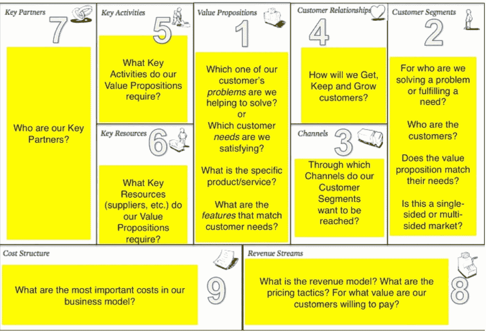

# Startup: Pertaruhan Tingkat Tinggi

> 原文：<https://medium.easyread.co/startup-pertaruhan-tingkat-tinggi-573b95f93ed7?source=collection_archive---------0----------------------->

# Introduction

Startup, sebuah tren yang sedang diumbar-umbarkan banyak orang. Tren dengan selogan “ **The Next Big One** ”, “ **The Next Solution** ”, “ **A Company Owner** ”, “ **Next Level Technology** ” atau lain-lain. Ya saya juga berpikir seperti itu. Dan hal itu juga yang membuat saya ingin mengambil jalur karir menjadi startup. Tetapi terkadang melihat begitu banyak orang yang ingin menjadi startup dan saya hubungkan dengan pengalaman dan pemahaman, terkadang saya berpikir, apakah setiap kita tahu apa yang sedang kita pertaruhkan dan apakah kita siap dengan resiko terburuk?. Oleh karena itu, saya coba membagikan pandangan saya tentang pertaruhan apa yang sedang kita taruhkan.

Image growmap.com

# Pertaruhan 1 : Waktu bertahun-tahun

Jika teman-teman sudah membaca artikel saya sebelumnya, [Startup: Apa Itu?](https://medium.com/@leopripos/startup-apa-itu-c06c9fc10031) , teman-teman akan mengerti bahwa startup adalah **proses belajar dan mencari** . Dalam proses itu banyak hal yang harus kita pelajari dan cari, yang meliputi aspek-aspek yang ada pada Bussiness Model Canvas.

Bussines Model Canvas, source : [https://www.theatlantic.com](https://www.theatlantic.com/business/archive/2012/02/a-great-way-to-kill-your-startup-listen-to-all-your-customers/253629/)

Dari hal tersebut kita dapat membayangkan bahwa untuk mempelajari dan mencari hal tersebut tidaklah perjalanan singkat, tidaklah perjalanan 1 sampai 2 tahun. Hal tersebut adalah pelajaran panjang, mungkin 3 tahun ke atas. Jika kita berhenti di pertengahan, entah karena tim, produk atau yang lainnya , maka itu sama seperti kita sudah kuliah 3 semester namun berhenti. Tetapi jika kita lanjutkan, maka itu sama seperti kuliah 8 semester, tetapi kita belum pasti lulus.

# Pertaruhan 2 : Hidup susah

Kita yang memulai startup, kita selalu dihadapkan dengan pertanyaan awal “ **dari mana modal?** ”. Sepanjang perjalananya munkin kita bisa menemukan solusi seperti mengerjakan pekerjaan yang lain. Tetapi saya yakin sesuai dengan pengalaman dan pemahaman saya, kita tidak akan hidup enak se-enak teman kita dulu di kampus, sampai startup teman-teman sukses (3 tahun ke atas). Ini juga beban yang cukup berat, kita akan sering merasa iri dengan teman kita. Mereka sudah beli motor, kita masih beli makan saja susah :(

# Pertaruhan 3: Skill Menurun

Mari kita bayangkan, selama kita mengembangkan startup kita, kita akan selalu membahas keseluruhan hal-hal yang penting bagi startup kita, mulai dari management, teknikal, bisnis, dan keuangan, yang secara tidak langsung mengarahkan kita ke arah skill yang lebih general ke banyak bidang. Nah akibatnya, kita akan mulai kehilangan kemampuan spesifik kita terhadap bidang tertentu secara perlahan.

Nah kembali bayangkan setelah beberapa tahun, kita gagal, apa yang akan terjadi pada kita? Apakah kita bisa mendapatkan pekerjaan dengan kemampuan yang general yang kita punya? Apakah kita harus mempelajari skill yang spesifik untuk bisa mendapat pekerjaan? Saya tidak katakan kita tidak bisa mendapat pekerjaan dengan skill yang general, atau tidak bisa kembali belajar skill yang spesifik terhadap bidang tertentu, tetapi apakah kita siap terhadap hal itu? :(

# Pertaruhan 4: Memulai Karir dari bawah

Setelah kita bisa mendapatkan pekerjaan, kita mungkin akan di tempatkan pada posisi karir paling bawah. Coba kita bayangkan teman-teman kita sudah jadi manager selama setelah 3 tahun kita berada di startup, tetapi kita masih …, ah sudahlah. :P

# Pertaruhan 5: Umur

Seperti yang saya katakan sebelumnya ini adalah perjalan bertahun-tahun. Saya asumsikan kita memulai startup setelah tamat kuliah dengan umur 23, dan kita gagal setelah 3 tahun dalam kehidupan startup, maka kita akan berumur 26 tahun saat itu. Berapa tahun waktu kita butuhkan untuk dapat pekerjaan dan menabung untuk berkeluarga. Terlebih wanita yang cenderung menikah lebih awal. :(

# Pertaruhan 6: Harga Diri

Mungkin selama 3 tahun kita selalu dihadapkan dengan 5 hal-hal di atas (5 pertaruhan di atas), dan kita akan membuat berbagai jawaban untuk membela diri. Dan ketika kita gagal, bagai mana harga diri kita dihadapan orang-orang yang mempertanyakan 5 hal di atas tersebut kepada kita? :(

Saya saat ini tidak sedang mendemotivasi teman-teman, supaya tidak menjadi startup, tetapi memberi tahu apa yang harus teman-teman pertimbangkan untuk menjadi startup. Jika teman-teman siap jika itu terjadi, mari bersama mengembangkan startup Indonesia. Welcome to the hell.

> Semua hal memiliki pertaruhannya masing-masih, sisanya adalah kesiapan setiap orang untuk mengambil pertaruhannya.