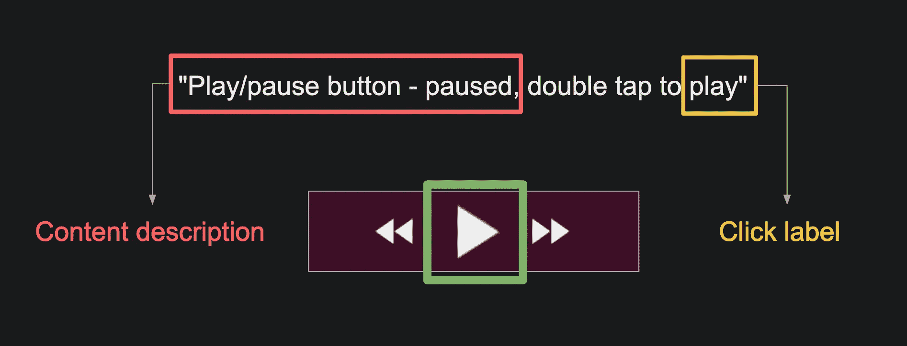
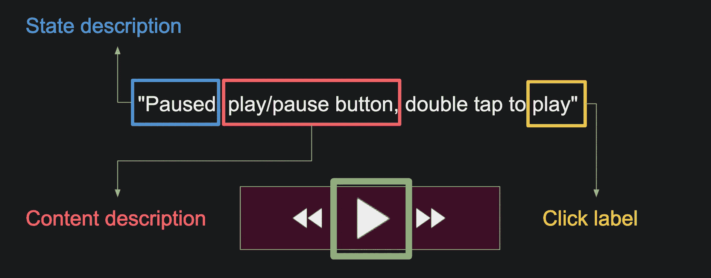
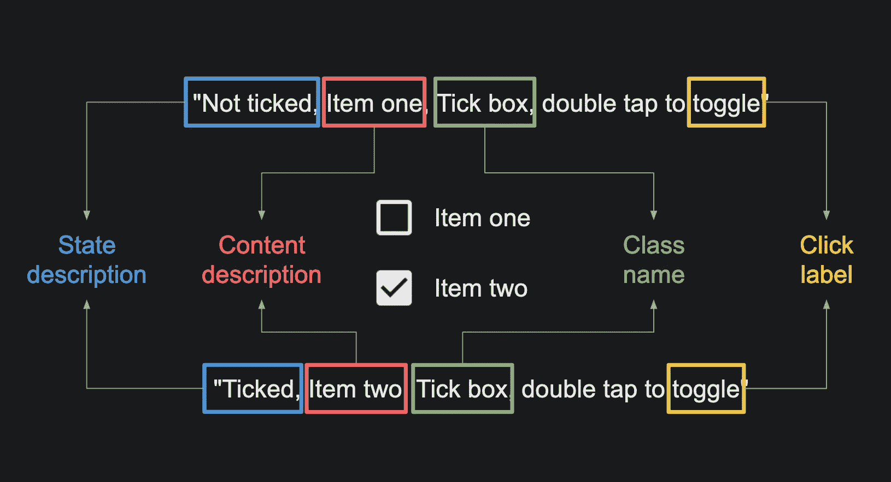
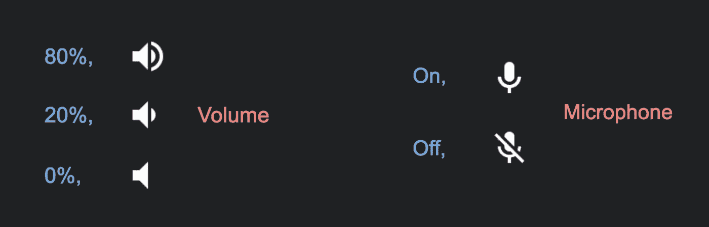
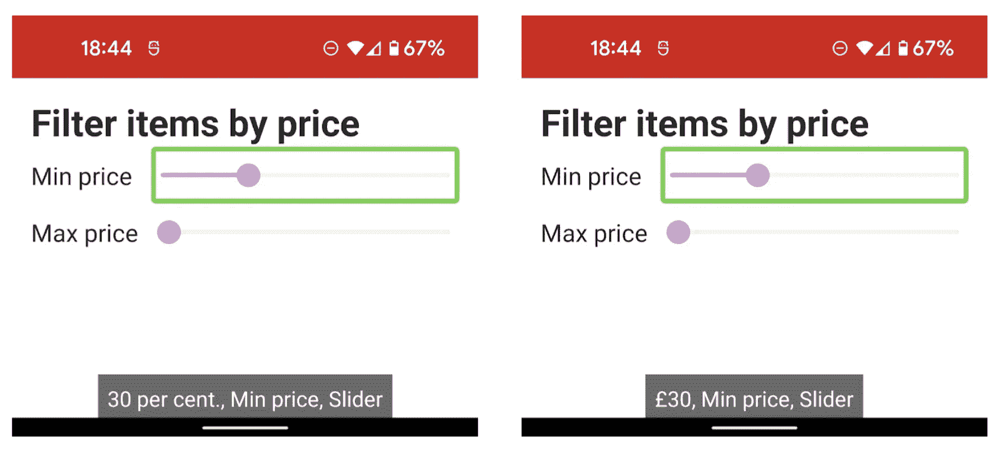

# Android 上的状态描述

> 原文：<https://medium.com/google-developer-experts/state-descriptions-on-android-b2029283871f?source=collection_archive---------0----------------------->

## 了解什么是状态描述，为什么它们对可访问性很重要，以及如何在旧版本的 Android 上使用它们。

状态描述是 Android 上可访问性工具箱的一个相对较新的补充，是在 Android 11 (API 30)中添加的。它是一个专用属性，用于描述 UI 组件的当前状态。

在这个 API 之前，我们必须重载内容描述来提供这些额外的信息:



现在，我们可以将状态描述分开:



在这篇文章中，我们将看看 state description 属性，以及如何在 Jetpack Compose UIs 和传统的基于视图的系统中使用它。

# 我什么时候需要状态描述？

当 UI 组件以可视方式改变来表达状态时，状态描述很有帮助。

像`CheckBox`、`RadioButton`和`Switch`这样的内置组件对于辅助功能服务来说都是众所周知的。该服务可以查询这些组件，并自动向用户显示它们的状态:



A not-ticked and ticked CheckBox

`RadioButton`和`Switch`享有相似的功能。Google TalkBack 将显示“已选择”/“未选择”和“开”/“关”作为各自的状态描述。

对于自定义的小部件、图标或徽章，没有这样的固有属性。辅助功能服务不知道我们的自定义音量指示器或麦克风标记，所以以前需要将状态信息放入内容描述中。



有了 state description 属性，我们可以保持内容描述的简短和集中。

# Jetpack 撰写 UI 中的状态描述

在这个例子中，我们使用`Slider`组件来表示最低/最高价格过滤器。如果我们用 TalkBack 检查，它使用默认的状态描述，这不是很有帮助；我们想让它显示价格。



Left: without a custom state description, right: with

可以使用`Modifier.semantics`在撰写 UI 中设置状态描述。这里，我们正在更新默认描述，以便它告诉我们当前选择的价格:

```
Slider(
    value = sliderPosition,
    onValueChange = { sliderPosition = it },
 **modifier = Modifier.semantics {**
 **val money = (sliderPosition * 100).toInt()
        stateDescription = "£$money"**
 **}**
)
```

这适用于最新版本的 Talkback (12.1)，甚至适用于旧版本的 Android(我在 Android 10 上测试过，在引入状态描述 API 之前)。Jetpack Compose UI 可以一直工作到 Android 5.1 (API 21)，所以这是一个好消息。

## 基于视图的用户界面系统中的状态描述

在基于视图的系统中，我们可以使用来自 [AppCompat](https://developer.android.com/reference/androidx/core/view/ViewCompat#setStateDescription(android.view.View,%20java.lang.CharSequence)) 的`ViewCompat` API。它使用视图标签将支持一直回溯到 Android 4.4 (API 19)！

```
val localizedDesc = "On" // TODO: localize it..!
**ViewCompat.setStateDescription(micView, localizedDesc)**
```

这让我们可以在任何视图上设置一个状态描述，这些视图是可访问性服务(比如对讲)应该使用的。

## 下一步是什么？

到目前为止，这个新属性已经在视图和编写 ui 中被反向移植了，这很酷。如果你还没有看过，我推荐你看一下 Shailen Tuli 的这个视频，它是关于“为可访问性传递状态”的:

seekbar 有一个地方没有像预期的那样奏效。[开始本期](https://issuetracker.google.com/issues/208178383)获取关于这个 bug 的更新！

[如果你有意见或问题，请告诉我](http://twitter.com/ataulm)！

*感谢*[*Jolanda*](https://twitter.com/Lojanda)*和*[*Caren*](https://twitter.com/calren24)*的评论和帮助整理 bug！*