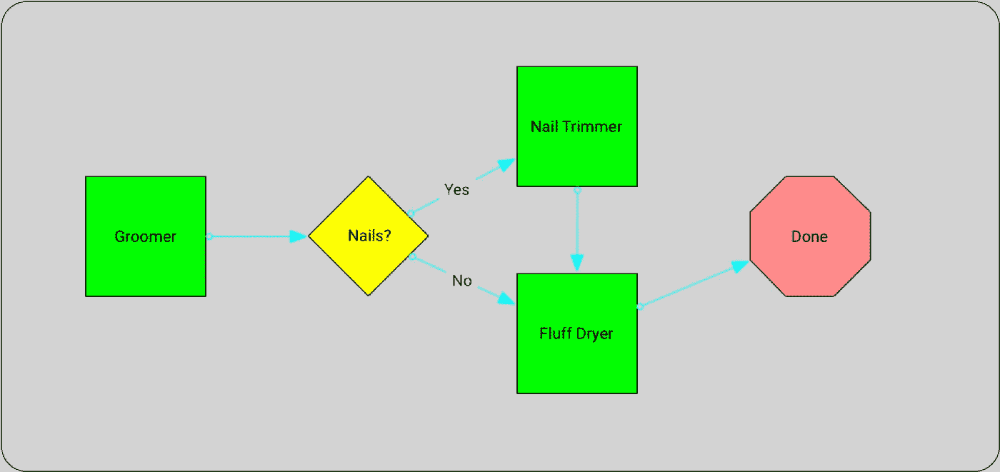
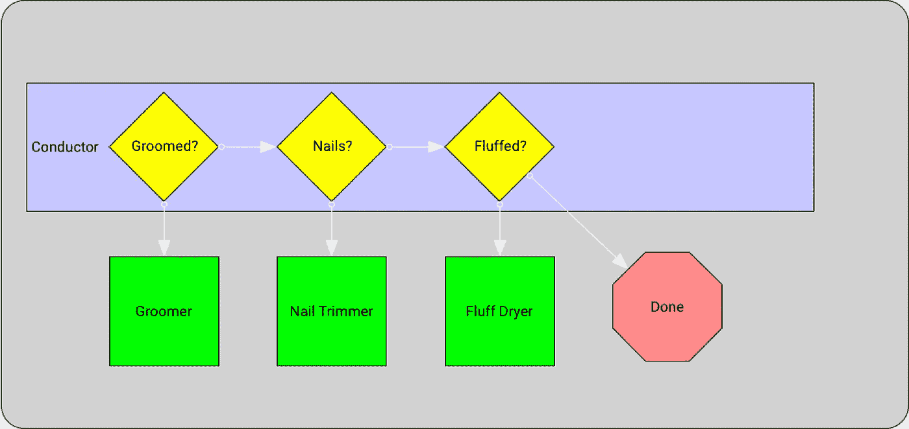
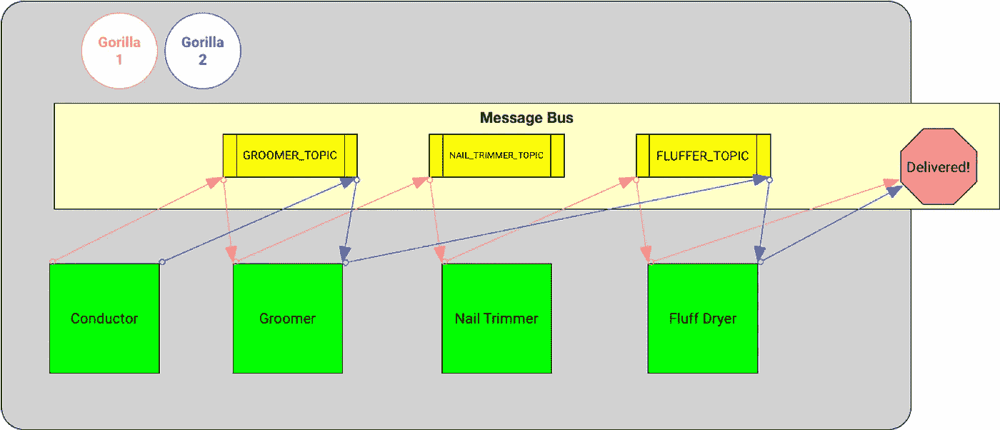
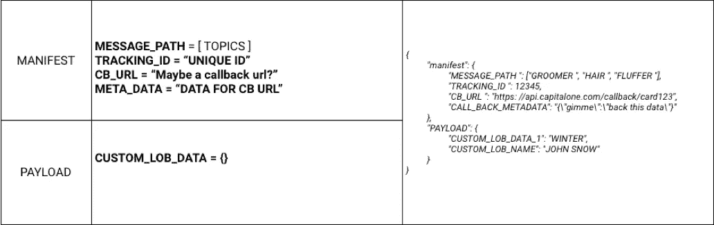

# 消息总线上的无状态和无智能微服务

> 原文：<https://medium.com/capital-one-tech/stateless-and-dumb-microservices-on-a-message-bus-be78bca93ccb?source=collection_archive---------2----------------------->

大数据世界正在向通过消息总线传递消息的大型分布式系统转移。当然，我们一直在进行 API 调用和使用企业服务总线，感觉好像永远都是这样；但是通过引入卡夫卡，我们改变了游戏。Kafka 将企业服务总线模型翻了个底朝天。历史上，我们将逻辑放在总线上，部署在总线上的代码和路由逻辑知道如何传递消息。

由于我们的消息总线不再智能，这些天我们有了新的挑战。我们必须将路由逻辑放入代码或配置中，然后我们会遇到问题，*“我们如何定义消息路由？”*有几个选项，我们将在下面详细介绍，但我们需要有意识地决定选择哪种方法。如果我们不这样做，我们将通过我们的微服务以路由规则的[【鼠王】](https://en.wikipedia.org/wiki/Rat_king)告终。鼠王是讨厌的蜡球，想想你曾经解开过的最糟糕的结，然后把它和另外四个结混在一起。这是我们最不希望微服务出现的情况。

当我们第一次考虑通过总线传递消息时，最初我们的微服务将从一个输入主题读取，然后输出到另一个主题。每个微服务有两个数据。似乎很简单。但是，当你想改变路径，或有一个动态的路径，事情变得更加混乱。

*我在这里提议的是一个真正的无状态组件，除了在出错的情况下，它不知道“下一步是什么”。让我们用一个小例子来形象化这一点。*

# **所以你决定为你的动物园买一只大猩猩…**

想起一份货运清单。箱子里面(有效载荷)是你要运送的物品。如果你从另一个动物园订购一只大猩猩运到你的动物园，他们会把大猩猩放在那个盒子里的笼子里。在它来找你的路上，你可能想给大猩猩洗澡，修剪指甲，擦干绒毛。哦，让我们为动物园买两只大猩猩吧！第二个女人不想要修剪过的指甲——她就是很挑剔。第二只大猩猩会被洗澡并擦干绒毛，没有指甲。我再说一遍，没有钉子！

既然我们已经讨论了在动物园之间洗澡和运送大猩猩的用例，那么让我们来谈谈如何进入下面提出的方法。如果你把大猩猩的处理能力想象成美容师提供的一系列服务，那么你如何告诉美容师该做什么？

你会走向美容师，给他们你的大猩猩，并告诉他们你想要的服务。在技术世界里，这是同样的事情。我们可以公开一个“任何人”都可以调用的 API。我们可以提供用于确定我们需要的功能的参数，或者我们可以提供具有预定义路径的不同端点。

# **老派模式**

如果你建造了一辆老式的学校信息巴士，你的“洗澡者”需要决定信息向下游传递到哪里。你添加的选项越多，就越令人困惑。在这个简单的例子中，我们可以构建一条简单的路线，但是想象一下在梳理方面有 15 个以上的选项。大猩猩需要面部按摩还是足部按摩？指甲油和 buff？然后也许你想加一个优化算法，把大猩猩送到下一个最短的队列。这就是它开始变得令人困惑的地方。

# **指挥(或编舞)**

让我们引入一个新的概念，指挥。当你运一个大猩猩之类的东西(我是说，谁不是每个周末都运一个大猩猩？)，你告诉物流公司，或者火车公司，送到哪里，怎么处理。*我说，“第一只大猩猩洗澡，修剪和绒毛，第二只大猩猩只是洗澡和绒毛*”

在这个概念中，我们可以送大猩猩去洗澡，然后回到指挥那里决定大猩猩下一步去哪里。看起来大概是这样的:

哇，列车员要忙了！谈单点缩放，甚至失败！像 GitHub 这样的分布式版本控制更容易让不同的开发团队保持最新，但是它可能很快成为路由选择的丑陋鼠王。更不用说在基于 Kafka 的实现中，指挥最终会听到许多许多主题，甚至是每个微服务发布回的单个元主题。

# **货单**

接下来，我们可以探索清单。舱单是一个站点列表。在我们的例子中，让我们构建一个栈(是的，还记得那个数据结构吗？)的主题，消息需要被传递下去。我们的大猩猩最初会有一套**美容师、指甲修剪器、绒毛干燥器】或“美容师、绒毛干燥器**，这取决于它正在处理的是哪只大猩猩。

现在，您的指挥做了一些前期工作(是的，新的场景将导致新的代码更改)来设置初始堆栈。一旦堆栈建立，指挥将大猩猩(消息)传递给堆栈中的第一个主题。微服务(啊哈！看到了吗？我做到了！)正在收听第一个主题( **GROOMER** )，将从堆栈中弹出它的名字，整理大猩猩(对消息、增强、错误、丢弃等等执行任何工作。)并查看堆栈顶部的下一项。如果下一项是 **NAIL_TRIMMER** ，它会将增强项发布到 **NAIL_TRIMMER** 主题。 **NAIL_TRIMMER** 微服务也会做同样的事情——从堆栈中弹出它的主题，更新项目(或者修剪大猩猩的指甲)，然后查看下一个主题。

所以，一直持续到最后一个话题……类似**DELIVER _ GORILLA _ TO _ CUSTOMER**的东西。看起来大概是这样的:

信不信由你，我觉得这是一个更干净的模型。每个组件都是哑的——它们可以是一个共享的库或模块来执行路由、公共日志、错误处理等。在每个微服务的代码中加入一个回调函数，这非常简单。

下面是消息结构的一个示例:

预定义消息路径的挑战就在于这是一个预定义的路径。如果在路线中间的任何地方有一个分支或选项，那么您必须几乎打破单导线模型，因为特殊的微服务将不得不将新的主题推到堆栈上。这意味着他们需要更多地了解他们自己工作的主题。

只要这种推送很少发生，并且在这些消息的整个过程中是非常明显的例外，我就不认为它会失控。挑战将是处理太多例外的可能性。然后你又回到了路由鼠王，反复地问自己，*“为什么这个服务要处理消息？”*

# **警告**

这里讨论的一个关键点是围绕“设计时”和“运行时”选项。*我的大猩猩洗澡师总是清洗大猩猩的耳朵，不管我是否希望它们这样做。即使我告诉他们不要掏耳朵，他们还是会掏的。*这是设计时的决定*。我的大猩猩洗澡师总是让我选择是否修剪我的大猩猩的指甲，当我给他们我的大猩猩*时，我会指定我的偏好。这是一个运行时决策。如果你的路线是相当固定的，不经常改变，我完全赞成清单模式。如果您在路由上有相当多的运行时间决策，那么导体模式可能是您的最佳选择。这取决于你。然而，如果你遵循指挥模式，我的建议是确保有一个清晰简洁的评估规则的方法。配置某种规则引擎来保存状态并做出决定。

# **总结**

我介绍了在编写以串行方式处理数据的微服务时出现的三种路由模式。还有很多其他的选择。让我感兴趣的是使用规则引擎来决定消息下一步的去向。想象一下一个配置文件，其中包含用 Gherkin(用于测试驱动开发)这样的元语言定义的不同步骤，以定义消息的去向。如果你的大猩猩已经很干净了，并且想要修剪它的指甲，那就把它送到指甲修剪器那里。

总之，在构建一个框架或集成模式时，在选择一个长期结构时，在围绕一个愚蠢的消息总线构建智能代码时，要非常有意识。

***很想听到一些关于思想的反馈！发微博给我***[***@ chrisfauerbach***](https://twitter.com/chrisfauerbach)***或者发短信给我***[***【https://fauie.com/】***](https://fauie.com/)***。***

***一定要看看我关于这个话题的另一篇博文——***[***反转消息总线***](http://bit.ly/2jGEe7K) ***。***

*披露声明:这些观点是作者的观点。除非本帖中另有说明，否则 Capital One 不属于所提及的任何公司，也不被其认可。使用或展示的所有商标和其他知识产权都是其各自所有者的所有权。本文为 2018 首都一。*