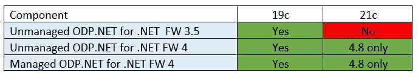

# 方向声明:Oracle 数据库对。净运行时间

> 原文：<https://medium.com/oracledevs/statement-of-direction-oracle-database-support-for-net-runtimes-c3988836b851?source=collection_archive---------0----------------------->

.NET development for Oracle Database

微软此前宣布[。NET Framework 4.8 是最后一个专业。NET Framework 版本和。NET(核心)是运行时创新的未来。](https://devblogs.microsoft.com/dotnet/net-core-is-the-future-of-net/)

先知。NET 团队正集中越来越多的精力来增强 Oracle 数据库开发人员的特性。NET 5 与未来。NET 运行时版本。因此，Oracle 将巩固其对。从下一个 ODP.NET 版本 21c 开始。以下是计划中的变化。

# 。仅支持. NET Framework 4.8

ODP.NET and .NET Framework Support Matrix

ODP。NET 21c 将只支持 4.8 版本的。NET 框架。

这意味着它不支持。NET 框架(FW) 3.5。对于继续使用这一较旧运行时的开发人员，Oracle 建议继续使用 ODP.NET 19c，其支持时间表与 3.5 版保持一致。

。使用 ODP.NET 21c 开发时，NET FW 4.x 用户应升级到最新的 4.8 版本。当然，他们也可以使用早期的 4.x 版本继续使用 ODP.NET 19c。

ODP。NET 19c 支持对 Oracle Database 21c 和未来数据库版本的数据访问，此外还支持将旧的 Oracle 数据库版本返回到 11.2.0.4。

Oracle ASP.NET Providers, Oracle .NET Stored Procedures, and .NET Framework Support Matrix

ODP.NET 相关组件、用于 ASP.NET 21c 的 Oracle 提供商和用于的 Oracle 数据库扩展。NET 21c(。NET 存储过程)，只能用。净 FW 也是 4.8。这些相关组件版本专门使用托管 component 进行数据访问。

# 仅实体框架 6.4 和托管 ODP.NET

Oracle Entity Framework 6 Support Matrix

。NET FW 实体框架(EF)应用程序升级到 ODP.NET 21c 将需要 EF 6.4 和托管 ODP.NET。如果应用程序希望继续使用旧的 EF 版本或不受管理的 ODP.NET，他们应该继续使用 ODP.NET 19c。从 EF6 功能的角度来看，非托管和托管 ODP.NET 之间没有区别，只是后者更容易安装和部署。使用非托管或托管 ODP.NET 开发 EF6 应用程序本质上是一样的。因此，Oracle 围绕开发人员更喜欢的提供商类型托管 ODP.NET 整合了其未来的 EF6 支持。

# 托管和非托管 ODP。网

而。NET FW 支持和认证将几乎完全集中在终端版本上，托管和非托管 ODP.NET 的新功能开发将在不久的将来继续。开发人员将看到这些提供商对新的 Oracle Database 21c 特性的支持。

此外，神谕。NET 团队将完成所有三个 ODP.NET 驱动程序之间的主要功能对等，然后将新功能开发重点主要转移到 ODP.NET 核心。在接下来的几年里，托管的 ODP.NET 和 ODP.NET 核心将拥有与非托管的 ODP.NET 相近的特性和 API。在主要功能对等的情况下，所有应用将更容易从非托管的 ODP.NET 迁移到托管的 ODP.NET，或者从托管的 ODP.NET 迁移到 ODP.NET 核心。然后，开发人员可以通过最少的 ODP.NET 代码更改过渡到他们首选的提供程序类型或运行时。

在完成主要功能对等之后，在后续版本中，托管和非托管驱动程序中将添加较少的新 ODP.NET 功能。大多数新功能开发将集中在 ODP.NET 核心。ODP.NET 核心将成为 ODP.NET 管理和非管理驱动程序功能的超集。开发人员将能够在未来的任何时候轻松地迁移到 ODP.NET 核心。

在可预见的未来，Oracle 将继续在每个数据库版本中推出新的托管和非托管 ODP.NET 版本。这为希望继续下去的开发人员提供了支持途径。无限期净 FW。

# 。NET(核心)和 EF 核心

通过减少甲骨文在。NET 框架，Oracle 将加强对。NET 5 和未来的运行时版本，包括新的运行时和 EF 核心版本和功能的及时认证。

微软的发布节奏是每年都有新的。NET 版预定每年 11 月。Oracle 计划配合这一发布节奏。[ODP.NET Core 19.10](https://www.nuget.org/packages/Oracle.ManagedDataAccess.Core/2.19.100)在 NuGet Gallery 上发布。去年 11 月，也就是微软发布。净 5。Oracle 计划在本月增加对实体框架核心 5 的支持。

ODP.NET Support Matrix for .NET (Core) and EF Core

未来的 ODP.NET 核心版和 Oracle EF 核心版将支持至少两个。NET 版本:最新。NET 版本和之前的长期支持(LTS)版本。例如，ODP.NET Core 21c 和 Oracle EF Core 21c 将支持。NET 5 和。网芯 3.1。计划于 2021 年底发布的 ODP.NET 核心版和 Oracle EF 核心版将支持。NET 6 和。网芯 3.1。ODP.NET 版本号将基于发布时可用的最新数据库版本。

。NET 5 是一个“当前”版本。其支持计划于 2022 年初结束。。在撰写本文时，对 NET Core 3.1 的支持计划持续到 2022 年底。

计划于 2022 年底发布的 ODP.NET 核心版和 Oracle EF 核心版将支持。NET 7(当前)和。净 6 (LTS)。

我们越往前走，就越难以确定地预测未来的版本支持。这些计划是 Oracle 目前的既定方向，以便开发人员和管理员可以相应地准备产品升级和使用。

# 2021 年推出的功能

先知 ODP.NET 21c。NET 团队将推出许多新功能。以下是 2021 年上半年的主要预期:

*   实体框架核心 5(仅核心)
*   用户定义的类型(核心和托管)
*   本机 JSON 数据类型(核心、托管和非托管)
*   分片(核心和托管)

用户定义的类型和分片功能将使 ODP.NET 托管和核心功能更接近与非托管 ODP.NET 同等的功能。当这些特性发布时，我会在博客上发表更多的内容。

# 摘要

升级或迁移到哪个 ODP.NET 版本取决于您的应用程序最终目标。对于不断创新的应用程序，请升级到 ODP.NET 21c(和 Oracle 数据库 21c)和最新版本。净 FW 和。短期的. NET 运行时版本。您将发现 21c 版 ODP.NET 核心、托管和非托管的最新创新。从长远来看，规划一条路线。NET 运行时和 ODP.NET 核心。

对于维护模式应用程序，尤其是当它们必须保持在旧版本上时。NET FW 版本，升级到 ODP.NET 19c。19c 是一个稳定的长期支持版本，将在未来许多年得到支持。

我希望这篇博文已经让你了解了 Oracle 的。NET (FW)运行时计划方向。如果您有任何问题或反馈，欢迎对本文发表评论或直接联系我(alex.keh[at]oracle.com)。