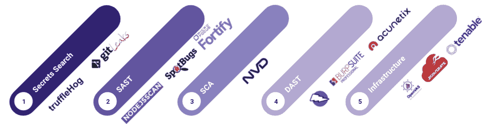
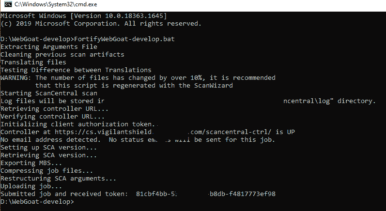

# 使用 Fortify 进行静态应用程序安全测试(SAST)

> 原文：<https://medium.com/globant/static-application-security-testing-sast-with-fortify-93ef52a03f21?source=collection_archive---------0----------------------->

# **简介**

IT 系统由可能隐藏漏洞的软件支持，网络攻击者可以利用这些漏洞来访问系统。一个全面和完整的安全漏洞评估计划可以确保在应用程序开发进入最后阶段之前消除所有威胁。

除了窃取公司的敏感数据，网络攻击者还可以修改源代码，并让系统替他们完成这项工作。身份盗窃案件始于一个安全漏洞，该漏洞为攻击者提供了一个访问个人手机或组织系统的接入点。

在软件开发生命周期中，可以进行不同类别的安全性分析。下图描述了一些可以集成的典型检查和工具。

**静态应用安全测试(SAST)** 确保在生产环境之外安全、系统地分析应用二进制文件、源代码和字节码，轻松消除漏洞。

**Micro Focus Fortify** 就是这样一个工具，它有助于消除这些漏洞并构建一个安全的软件。Fortify 根据您项目的具体要求提供了许多小型应用程序。

在本文中，我们将介绍 **Micro Focus Fortify 扫描向导**，这是一款快速准备脚本的工具，您可以使用 Fortify 静态代码分析器扫描您的代码，也可以选择将结果直接上传到 Fortify 软件安全中心。

# **本文涵盖了以下几点:**

1.  先决条件
2.  生成 SAST 扫描的步骤
3.  发现的样本问题
4.  假阳性
5.  替代工具
6.  结论

# **先决条件**

1.  Java 运行时环境
2.  微焦点 Fortify 静态代码分析器许可证。您可以在这里查看产品和许可证详情- [产品](https://www.microfocus.com/en-us/support/documentation)。在搜索选项中键入 fortify，它将列出所有与 fortify 相关的产品以及如何[获得许可](https://www.microfocus.com/en-us/support/Fortify%20Static%20Code%20Analyzer)的详细信息。

3.Fortify SCA(静态代码分析器)安装程序——Fortify 静态代码分析器和应用程序以可下载应用程序或软件包的形式提供。

*   有关硬件和软件要求的详细信息，请点击此处- [系统要求](https://tech.esvali.com/mf_manuals/html/common/micro_focus_fortify_software_19.1.0_system_requirements.htm#page_7)
*   有关安装的详细信息，请查看此处的安装部分- [指南](https://www.microfocus.com/documentation/fortify-static-code-analyzer-and-tools/1810/SCA_Install_18.10.pdf)
*   注意:可以安装在 Linux，Windows，MacOS 上。在本文中，我们使用的是 Windows。

# **生成 SAST 扫描的步骤:**

1.  在本例中，我们使用的是一个 WebGoat 应用程序，这是一个经过精心设计的不安全应用程序，它允许感兴趣的开发人员测试在使用常见和流行的开源组件的基于 Java 的应用程序中常见的漏洞。来源:https://github.com/WebGoat/WebGoat。

下载项目代码，将其解压缩到一个文件夹中。

2.启动 Fortify 扫描向导:在 Windows 上，选择开始>所有程序> Fortify SCA 和应用程序>扫描向导。有关在任何其他操作系统上启动的信息，请查看此处:[启动 Fortify 扫描向导](https://tech.esvali.com/mf_manuals/html/sca_ssc/micro_focus_fortify_static_code_analyzer_19.1.0_user_guide.htm#page_165)

3.在扫描向导窗口中添加项目文件夹:

4.检查源文件:它会自己识别应用程序中的所有依赖项。您也可以手动包含和排除依赖项和版本。检查扫描向导窗口的左侧，当您在窗口中移动时，它将提供有关每个步骤的信息。

5.如果您的项目安装了软件安全中心( [SSC](https://www.microfocus.com/documentation/fortify-software-security-center/2020/SSC_Help_20.2.0/index.htm#SSC_UG/Introduction.htm%3FTocPath%3DIntroduction%7C_____0) )，该软件安全中心是可选的，如果您有多个应用程序，并且您需要您的安全团队和开发团队一起工作，则在项目中使用该软件安全中心，**否则您可以跳到步骤 6** 。一旦您提供 SSC URL 并登录到 SSC，它将提供一个上传令牌，您的代码将根据该令牌进行扫描，结果将被上传并可供安全团队进行合规性检查。

6.单击“下一步”并在窗口中向前移动后，它将在提供的特定位置生成一个. bat 文件

7.运行 bat 文件。

8.该 bat 文件将在本地生成一个 scan.fpr，可以使用[审计工作台](https://tech.esvali.com/mf_manuals/html/sca_ssc/micro_focus_fortify_audit_workbench_19.1.0_user_guide.htm)将其转换为 pdf，一旦您安装了 SCA 安装程序，该工作台就会安装在您的系统中。

如果您已经安装了 [SSC](https://www.microfocus.com/documentation/fortify-software-security-center/2020/SSC_Help_20.2.0/index.htm#SSC_UG/Introduction.htm%3FTocPath%3DIntroduction%7C_____0) ，它将扫描并上传结果，该结果将显示在其仪表板上。扫描完成后，您可以下载 scan.fpr 文件，将其转换为 PDF 格式，并与各自的团队分享。

# **样本问题确定**

**关键:**

1.  [CWE ID 079](https://cwe.mitre.org/data/definitions/79.html)
2.  [CWE ID 200](https://cwe.mitre.org/data/definitions/200.html)

**高:**

1.  [CWE ID 287](https://cwe.mitre.org/data/definitions/287.html#:~:text=CWE-287%3A%20Improper%20Authentication,Weakness%20ID%3A%20287)
2.  [CWE ID 022](https://cwe.mitre.org/data/definitions/22.html)

# **误报:**

SAST 的一个弱点是假阳性的普遍存在。团队需要对单个安全缺陷候选进行分类和验证，以确保它不是误报。在 **Fortify、**的情况下，使用[审计工作台工具(AWB)](https://tech.esvali.com/mf_manuals/html/sca_ssc/micro_focus_fortify_audit_workbench_19.1.0_user_guide.htm) 来消除这些误报。在审计工作台中打开 scan.fpr。查找特定问题的详细信息。在其“摘要”选项卡中，将“分析”字段设置为“不是问题”(即“这是误报”)。还有其他选项，包括可靠性问题、不良实践、可疑和可利用。这个标记问题的过程被称为“审计结果”，它允许您的团队对自动化工具发现的问题进行优先排序和验证。本质上，你的“信任，但核实”的机会。当这些相同的问题从后续扫描中出现时，此分析设置应该保持不变。

# **设防替代工具:**

1.  隐蔽性
2.  检查马克思
3.  韦拉码

# **结论:**

因为 SAST 在开发周期的早期就发现了问题，所以它已经成为整个软件开发生命周期中不可或缺的一部分。SAST 的另一个优点是它易于实现和采用。如上所列，市场上还有许多其他工具。我们可以有把握地说，SAST 将在可预见的将来投入使用。

# **参考:**

[Micro Focus Fortify 静态代码分析器](https://www.microfocus.com/documentation/fortify-static-code-analyzer-and-tools/2020/SCA_Help_20.2.0/index.htm#ScanWizard/PrepUseScanWizard.htm?TocPath=Fortify%2520Scan%2520Wizard%257C_____1)

[SCA 用户文档](https://tech.esvali.com/mf_manuals/html/sca_ssc/micro_focus_fortify_static_code_analyzer_19.1.0_user_guide.htm#page_165)