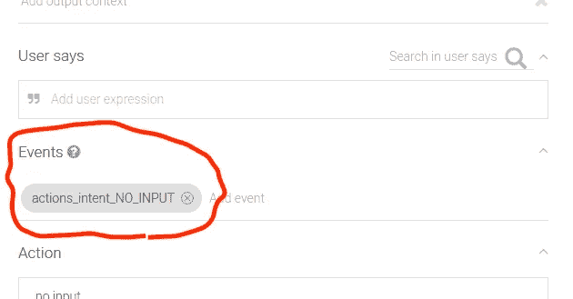
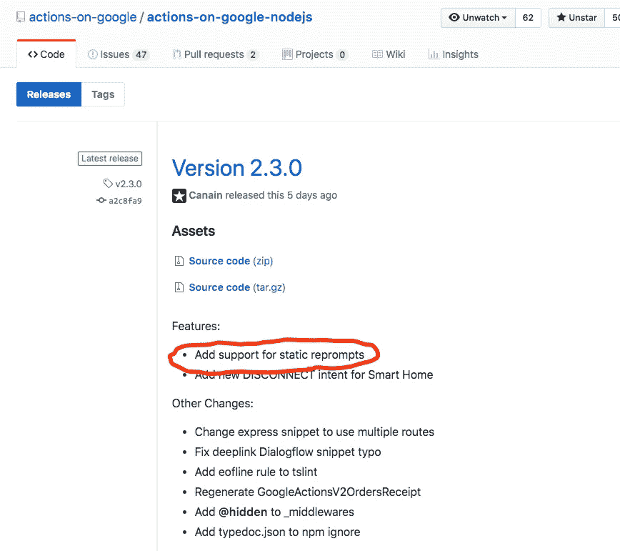

# 静态重新提示回到 SDK v2

> 原文：<https://medium.com/google-developer-experts/static-reprompts-came-back-to-sdk-v2-86539d8dbdb2?source=collection_archive---------7----------------------->

用户可以通过谷歌助手进行许多动作的对话。尤其是，用声音说话是一种新的模式。许多开发人员期望大多数用户持续稳定地与动作进行交互。然而，它的期望是错误的。用户可以在对话中随时离开助手。也就是说，操作需要确认用户是否还在那里。

谷歌的行动为开发者提供了一个名为“重新提示”的功能。当处理用户没有为您的操作提供输入的情况时，开发人员可以使用这个重新提示特性。例如，如果用户在 5 秒钟内没有提供任何输入，该动作可以向用户发送一些短语，例如“你好？你还在吗？”。此重新提示功能在以下官方文档中有所描述:

[](https://developers.google.com/actions/assistant/reprompts) [## 重新提示|对 Google 的操作| Google 开发者

### 默认情况下，当您向助手返回响应时，系统会使用默认重新提示来要求用户重复或…

developers.google.com](https://developers.google.com/actions/assistant/reprompts) 

开发人员可以选择一些方法来处理用户没有输入的情况。实际上，有三种方法:

*   [系统默认重新提示](https://developers.google.com/actions/assistant/reprompts#system_default_reprompts)
*   [动态提示](https://developers.google.com/actions/assistant/reprompts#dynamic_reprompts)
*   静态重新提示

请阅读官方文件，了解系统默认重新提示和动态重新提示的更多信息。目前，建议使用动态重新提示。使用动态重新提示，当用户不说话时，动作可以从 Google 上的动作接收到`NO_INPUT`事件。开发人员可以在收到事件后以任何方式处理。它非常灵活。



# 静态再现失败

曾几何时，有静态重新提示功能。我猜大多数开发者都使用了这个特性。特别是，当 actions-on-google-nodejs SDK 的版本是 1 时，静态重新提示特性是非常简单和方便的方式。

使用 SDK v1，actions 能够同时发送一个正常的回复短语和一些用于无输入情况的短语。下面的代码是示例:

```
app.ask(
  'Which is your favorite color?',
  [
    'Hello?',
    'Are you still there?',
    'Talk to you later. Bye.'
  ]
);
```

开发人员能够将静态重新提示指定为`ask()`函数的第二个参数。这很简单。当用户什么也不说时，Google 上的 Actions 会自动要求用户给出第二个参数的提示。特别是，当说出第三个短语时，对话也就结束了。

有一天，actions-on-google-nodejs SDK 的第二版发布了。与 v1 相比，新版本有许多变化。其中一个变化是…删除静态重新提示功能！

在 v2 发布的同时，从官方文档中删除了静态重新提示功能部分。也就是说，如果开发人员希望将 SDK 从 v1 更新到 v2，并且如果操作需要处理无输入的情况，他们只能选择使用动态重新提示…

那时，静态重新提示功能已经不存在了。

# 静态报告又回来了

正如我们在上面看到的，静态重新提示非常简单。但是，动态再现并不简单。开发者需要接收`NO_INPUT`事件，也需要实现事件处理程序。就是迁移成本有点大。

很可能，我想很多开发人员都觉得迁移很复杂。

实际上，一些开发人员对 SDK 的 GitHub 存储库中删除的静态重新提示功能发表了意见。发布的问题如下:

[](https://github.com/actions-on-google/actions-on-google-nodejs/issues/155) [## v2 库中的静态重新提示？问题#155 谷歌上的操作/谷歌节点上的操作

### 我没看到 https://developers . Google . com/actions/reference/nodejs/lib-v1-migration 中讨论过这个。在 v1 中…

github.com](https://github.com/actions-on-google/actions-on-google-nodejs/issues/155) 

至少，开发人员必须能够以低成本将操作迁移到 SDK v2。为了实现这一点，如果架构的变化是零或尽可能少，那会更好。而且，从静态重新提示迁移到动态重新提示的成本会有点大。也就是说，静态重新提示应该由 SDK v2 提供。

幸运的是，SDK v2 的静态重新提示的实现已经提出。并且，这个提议被接受了。

[](https://github.com/actions-on-google/actions-on-google-nodejs/issues/185) [## 提议:支持静态重新提示问题# 185 actions-on-Google/actions-on-Google-nodejs

### 我的建议是:引入一个新的 NoInputPrompt 类，并可以使用该类指定在没有输入时的提示，直到…

github.com](https://github.com/actions-on-google/actions-on-google-nodejs/issues/185) 

在 SDK v2 的最新版本(从 v2.3.0 开始)中，开发人员可以通过 SDK v2 使用静态重新提示功能。

[https://github . com/actions-on-Google/actions-on-Google-nodejs/releases/tag/v 2 . 3 . 0](https://github.com/actions-on-google/actions-on-google-nodejs/releases/tag/v2.3.0)



要使用 SDK v2 中的静态重新提示特性，可以使用`[Conversation<TUserStorage>](https://actions-on-google.github.io/actions-on-google-nodejs/classes/conversation.conversation-1.html)`类的新属性`[noInputs](https://actions-on-google.github.io/actions-on-google-nodejs/classes/conversation.conversation-1.html#noinputs)`。与在 SDK v1 中将短语指定为`app.ask()`的第二个参数不同，开发者不能将短语指定给`conv.ask()`函数。相反，开发人员可以将短语指定给`conv.noInputs`属性。以下代码是示例:

```
app.intent('actions.intent.MAIN', conv => {
  conv.noInputs = [
    'Are you still there?',
    'Hello?',
    new SimpleResponse({
      text: 'Talk to you later. Bye!',
      speech: '<speak>Talk to you later. Bye!</speak>'
    })
  ]
  conv.ask('What's your favorite color?')
})
```

`conv.noInputs`属性可以有一个字符串数组和/或 SimpleResponse 对象。规范几乎和 SDK v1 一样，就是开发者可以给`noInputs`属性指定三个短语，当第三个短语说了，对话就关闭了。

通过使用这个`conv.noInputs`属性，开发者可以迁移使用静态重新提示的动作，而不需要任何架构改变。

# 结论

开发人员可以将 SDK v2 的静态重新提示功能用于迁移目的。但是，开发人员应该认识到动态重新提示是被提倡的。如果没有特殊原因，请使用动态重新提示来处理无法输入的情况。