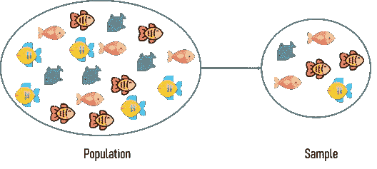
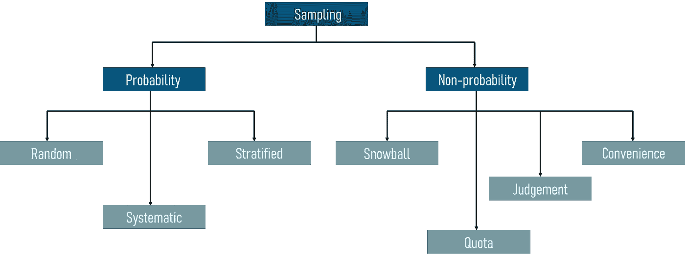
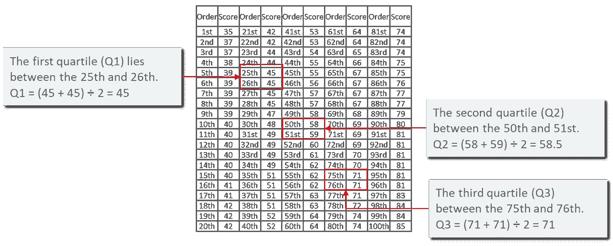
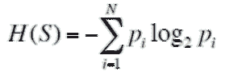
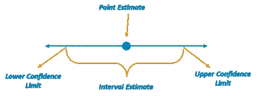

# 关于统计和概率你需要知道的

> 原文：<https://medium.com/edureka/statistics-and-probability-cf736d703703?source=collection_archive---------0----------------------->


Statistics and Probability — Edureka

统计和概率是当今世界最具革命性技术的基石。从人工智能到机器学习和计算机视觉，统计和概率构成了所有这些技术的基础。在这篇关于统计和概率的文章中，我打算帮助你理解最复杂的算法和技术背后的数学。

本统计和概率博客涵盖了以下主题:

1.  什么是数据？
2.  数据类别
3.  什么是统计学？
4.  统计学中的基本术语
5.  取样技术
6.  统计类型
7.  描述统计学

a.中心度量

b.传播的量度

c.信息增益和熵

d.混淆矩阵

8.可能性

a.概率是什么？

b.概率术语

c.概率分布

d.概率的类型

e.贝叶斯定理

9.推断统计学

a.点估计

b.区间概算

c.估计置信度

d.假设检验

# 什么是数据？

看看你的周围，到处都是数据。你手机上的每次点击都会产生比你知道的更多的数据。这些生成的数据为分析提供了见解，并帮助我们做出更好的业务决策。这就是数据如此重要的原因。


*What Is Data — Statistics and Probability — Edureka*

*数据是指收集在一起用于参考或分析的事实和统计数据。*

可以收集、测量和分析数据。它也可以通过使用统计模型和图表来可视化。

# 数据类别

数据可以分为两个子类别:

1.  质量数据
2.  数据

请参考下图，了解不同类别的数据:


*Categories Of Data — Statistics and Probability — Edureka*

**定性数据:** *定性数据处理的是不易测量，但可以主观观察到的特征和描述符。定性数据进一步分为两种类型的数据:*

*   ***名义数据:*** 性别、种族等没有固有顺序或排名的数据。


*Nominal Data — Statistics and Probability — Edureka*

*   ***序数数据:*** 具有一系列有序信息的数据称为序数数据。


*Ordinal Data — Statistics and Probability — Edureka*

**量化数据:** *量化数据处理的是你可以客观衡量的数字和事物。这又进一步分为两种:*

*   ***离散数据:*** 也称为分类数据，它可以容纳有限数量的可能值。

例如:一个班的学生人数。

*   ***连续数据:*** 可以容纳无限个可能值的数据。

例如:一个人的体重。

这些是不同类别的数据。接下来的部分将集中在基本的统计学概念上，所以系好安全带，准备做一些数学运算。

# 什么是统计学？

统计学是应用数学的一个领域，涉及数据的收集、分析、解释和展示。


*What Is Statistics — Statistics and Probability — Edureka*

这一数学领域研究如何利用数据解决复杂的问题。下面是几个可以通过使用统计学解决的示例问题:

*   你的公司发明了一种可能治愈癌症的新药。你如何进行测试来确认药物的有效性？
*   你和一个朋友正在看棒球比赛，突然，他跟你打赌这场比赛中任何一队都不会打出本垒打。你应该接受这个赌注吗？
*   最新的销售数据刚刚进来，你的老板希望你为管理层准备一份报告，说明公司可以改进业务的地方。你应该寻找什么？你不应该寻找什么？

使用统计技术可以很容易地解决上述问题。在接下来的几节中，我们将看到如何做到这一点。

# 统计学中的基本术语

在深入研究统计学之前，理解统计学中使用的基本术语是很重要的。统计学中两个最重要的术语是总体和样本。



*Population and Sample — Statistics and Probability — Edureka*

*   **群体:**一个个体或物体或事件的集合或集合，其属性将被分析
*   **样本:**总体的一个子集叫做‘样本’。一个精心挑选的样本将包含特定总体参数的大部分信息。

现在你一定想知道如何选择一个样本，最好地代表整个人口。

# 取样技术

*抽样是一种统计方法，处理总体中个体观察值的选择。它用于推断关于人口的统计知识。*

考虑这样一个场景，你被要求进行一项关于美国青少年饮食习惯的调查。目前美国有超过 4200 万青少年，当你阅读这篇博客时，这个数字还在增长。有可能对这 4200 万人的健康状况进行调查吗？显然不是！这就是为什么使用采样。这是一种研究人口样本以推断整个人口的方法。

有两种主要的采样技术:

1.  概率抽样
2.  非概率抽样



*Sampling Techniques — Statistics and Probability — Edureka*

在这篇博客中，我们将只关注概率抽样技术，因为非概率抽样不在这篇博客的范围之内。

## **概率抽样:**

这是一种抽样技术，利用概率论从大量人口中选择样本。概率抽样有三种类型:

*   **随机抽样:**在这种方法中，群体中的每个成员在样本中被选中的机会是均等的。


*Random Sampling — Statistics and Probability — Edureka*

*   **系统抽样:**在系统抽样中，从总体中选择每第 n 条记录作为样本的一部分。请参考下图，以便更好地理解系统采样的工作原理。


*Systematic Sampling — Statistics and Probability — Edureka*

*   **分层抽样:**在分层抽样中，用一个阶层从一大群人中形成样本。阶层是人口中至少有一个共同特征的子集。此后，采用随机抽样的方法从每个阶层中选择足够数量的受试者。


*Stratified Sampling — Statistics and Probability — Edureka*

现在你已经知道了统计学的基础知识，让我们继续讨论不同类型的统计学。

# 统计类型

有两种定义明确的统计类型:

1.  描述统计学
2.  推断统计学

## 描述统计学

*描述性统计是一种通过给出关于样本和数据测量的简短摘要来描述和理解特定数据集特征的方法。*

描述统计学主要关注数据的主要特征。它提供了数据的图形摘要。


*Descriptive Statistics — Statistics and Probability — Edureka*

假设你要赠送你所有同学的 t 恤。要研究教室中学生的平均衬衫尺码，在描述性统计中，您需要记录班级中所有学生的衬衫尺码，然后找出班级中最大、最小和平均衬衫尺码。

## 推断统计学

推断统计学根据从相关总体中提取的数据样本，对总体进行推断和预测。

推理统计概括了一个大的数据集，并应用概率得出结论。它允许我们根据使用样本数据的统计模型来推断数据参数。


*Inferential Statistics — Statistics and Probability — Edureka*

因此，如果我们考虑同样的例子，寻找一个班级中学生的平均衬衫尺寸，在推断统计中，你将得到一个班级的样本集，基本上是整个班级的几个人。你已经把班级分成了大、中、小三组。在这种方法中，您基本上构建了一个统计模型，并将其扩展到整个班级。

这就是对描述性统计和推断性统计的简单理解。在接下来的章节中，您将深入了解描述性统计和推断性统计是如何工作的。

# 理解描述性统计

描述性统计分为两类:

1.  集中趋势测量
2.  可变性测量(范围)

## **中心测量**

中心的度量是表示数据集汇总的统计度量。有三种主要的居中度量:


*Measures Of Centre — Statistics and Probability — Edureka*

1.  **均值:**一个样本中所有值的平均值的度量称为均值。
2.  **中位数:**样本集中心值的度量称为中位数。
3.  **众数:**样本集中最常出现的值称为众数。

为了更好地理解集中趋势的度量，让我们看一个例子。以下汽车数据集包含以下变量:


*DataSet — Statistics and Probability — Edureka*

*   汽车
*   每加仑英里数
*   气缸类型(气缸)
*   排水量
*   马力
*   实际轴比

使用描述性分析，您可以分析样本数据集中的每个变量的平均值、标准差、最小值和最大值。

如果我们想找出汽车总量中汽车的平均马力，我们将检查并计算所有值的平均值。这样的话，我们就取每辆车的马力之和，除以总车数:
***均值=(110+110+93+96+90+110+110+110)/8 = 103.625***

如果我们想找出 mpg 在汽车人口中的中心值，我们将 mpg 值按升序或降序排列，并选择中间值。在这种情况下，我们有 8 个值，这是一个偶数条目。因此，我们必须取两个中间值的平均值。
***8 辆车的 mpg:21，21，21.3，22.8，23，23，23，23*
*中位数= (22.8+23 )/2 = 22.9***

如果我们想找出汽车中最常见的气缸类型，我们将检查重复次数最多的值。这里我们可以看到圆柱体有两个值，4 和 6。看一下数据集，可以看到最常出现的值是 6。因此 6 是我们的模式。

## **价差的度量**

分布的度量，有时也称为离差的度量，用于描述样本或总体的可变性。


*Measures Of Spread — Statistics and Probability — Edureka*

就像中心的测量一样，我们也有扩散的测量，包括以下测量:

*   **Range:** 这是给定的数据集中的值的分布程度。该范围可以计算为:

*范围= Max(𝑥_𝑖) — Min(𝑥_𝑖)*

这里，

x 的 Max(𝑥_𝑖):最大值

x 的 Min(𝑥_𝑖):最小值

*   **四分位数:**四分位数通过将数据集分成四份来告诉我们数据集的分布情况，就像中位数将它分成两半一样。

为了更好地理解四分位数和 IQR 是如何计算的，让我们看一个例子。



*Measures Of Spread example — Statistics and Probability — Edureka*

上图显示了 100 名学生的分数，从最低分到最高分排列。四分位数位于以下范围内:

1.  第一个四分位数(Q1)位于第 25 次和第 26 次观察之间。
2.  第二个四分位数(Q2)位于第 50 次和第 51 次观察之间。
3.  第三个四分位数(Q3)位于第 75 次和第 76 次观察之间。

*   **四分位数间距(IQR):** 它是可变性的度量，基于将数据集分成四分位数。四分位间距等于 Q3 减去 Q1，即 IQR = Q3-Q1
*   **方差:**它描述了一个随机变量与其期望值相差多少。它需要计算偏差的平方。可以使用下面的公式计算方差:


*Measures Of Spread Variance — Statistics and Probability — Edureka*

这里，

x:单个数据点
n:数据点总数
数据点的 x̅:平均值

***离差是每个元素与平均值之差。可以用下面的公式计算:***

*偏差= (𝑥_𝑖 — )*

***总体方差是离差平方的平均值。可以用下面的公式计算:***


*Measures Of Spread Population Variance — Statistics and Probability — Edureka*

***样本方差是平均值的平方差的平均值。可以用下面的公式计算:***


*Measures Of Spread Sample Variance — Statistics and Probability — Edureka*

***标准差:是一组数据与其均值的离差的度量。可以用下面的公式计算:***


*Measures Of Spread Standard Deviation — Statistics and Probability — Edureka*

为了更好地理解传播的度量是如何计算的，让我们看一个用例。

**问题陈述:** *丹妮莉丝有 20 条龙。他们有数字 9，2，5，4，12，7，8，11，9，3，7，4，12，5，4，10，9，6，9，4。算出标准差。*

让我们一步步来看解决方案:

第一步:找出样本集的平均值。

*平均值为= 9+2+5+4+12+7+8+11+9+3*

然后算出这些平方差的平均值。

*+7+4+12+5+4+10+9+6+9+4/20*
*= 7*

**第二步:**然后对每个数字，减去平均值，对结果求平方。

*(x_i — μ)*

*(9–7)= = 4*
*(2–7)=(-5)= 25*
*(5–7)=(-2)= 4*
*以此类推……*

我们得到以下结果:
*4，25，4，9，25，0，1，16，4，16，0，9，25，4，9，9，4，1，4，9*

第三步:然后算出这些平方差的平均值。


*4+25+4+9+25+0+1+16+4+16+0+9+25+4+9+4+4+9/20*
*⸫σ= 8.9*

**第四步:**取σ的平方根。

*σ = 2.983*

为了更好地理解 spread 和 center 的度量，让我们使用 R 语言来执行一个简短的演示。

# R 中的描述统计

*R 是一种统计编程语言*，主要用于数据科学、机器学习等等。

现在让我们继续前进，在 r 中实现描述性统计。

在这个演示中，我们将了解如何计算平均值、中值、众数、方差、标准差，以及如何通过绘制直方图来研究变量。这是一个非常简单的演示，但它也是每个机器学习算法的基础。

**第一步:**导入数据进行计算

```
set.seed(1)

#Generate random numbers and store it in a variable called data
>data = runif(20,1,10)
```

**第二步:**计算数据的平均值

```
#Calculate Mean
>mean = mean(data)
>print(mean)

[1] 5.996504
```

**第三步:**计算数据的中值

```
#Calculate Median
>median = median(data)
>print(median)

[1] 6.408853
```

**第四步:**为数据计算模式

```
#Create a function for calculating Mode
>mode <- function(x) { >ux <- unique(x) >ux[which.max(tabulate(match(x, ux)))]}
>result <- mode(data) >print(data)

[1] 3.389578 4.349115 6.155680 9.173870 2.815137 9.085507 9.502077 6.947180 6.662026
[10] 1.556076 2.853771 2.589011 7.183206 4.456933 7.928573 5.479293 7.458567 9.927155
[19] 4.420317 7.997007

>cat("mode= {}", result)

mode= {} 3.389578
```

**第五步:**计算数据的方差&标准差

```
#Calculate Variance and std Deviation
>variance = var(data)
>standardDeviation = sqrt(var(data))
>print(standardDeviation)

[1] 2.575061
```

第六步:绘制柱状图

```
#Plot Histogram
>hist(data, bins=10, range= c(0,10), edgecolor='black')
```

直方图用于显示数据点的频率:


现在，您已经知道如何计算分布和中心的度量，让我们看看其他几种可用于推断统计模型重要性的统计方法。

## 熵

熵测量数据中存在的杂质或不确定性。*可以使用下面的公式进行测量:*



*Entropy — Statistics and Probability — Edureka*

其中:
S -数据集中所有实例的集合
N -不同类值的数量
pi -事件概率

# 信息增益

*信息增益(IG)表示特定特征/变量为我们提供了多少关于最终结果的“信息”。可以使用下面的公式进行测量:*


*Information Gain — Statistics and Probability — Edureka*

*这里:*

*   *H(S)——整个数据集 S 的熵*
*   *|Sj| —属性 A 具有 j 值的实例数*
*   *|S| —数据集 S 中的实例总数*
*   *v——属性 A 的不同值的集合*
*   *H(Sj) —属性 A 实例子集的熵*
*   *H(A，S)——属性 A 的熵*

信息增益和熵是重要的统计度量，让我们了解预测模型的重要性。为了更清楚地理解熵和 IG，我们来看一个用例。

**问题陈述:**通过研究天气情况来预测比赛能否进行。

**数据集描述:**以下数据集包含一段时间内的天气情况观察。


*Use Case Dataset — Statistics and Probability — Edureka*

预测变量包括:

1.  一天
2.  观点
3.  快活的
4.  风

目标变量是“游戏”变量，它可以通过使用预测变量集来预测。这个变量的值将决定某一天是否可以玩游戏。

为了解决这样的问题，我们可以利用决策树。决策树基本上是倒置的树，通过在每个分支节点做出决策来帮助我们得到结果。

下图显示，在 14 次观察中，9 次观察的结果为“是”，这意味着在 14 天中，比赛可以在 9 天进行。如果你注意到了，这个决定是通过选择“Outlook”变量作为根节点(决策树中最顶端的节点)做出的。


*Use Case — Statistics and Probability — Edureka*

outlook 变量有 3 个值，

1.  快活的
2.  遮蔽
3.  雨

这 3 个值被分配给直接分支节点，并且对于这些值中的每一个，计算“播放=是”的可能性。“阳光”和“雨水”分支给出了不纯的输出，这意味着混合了“是”和“否”。但是如果你注意到“阴”变量，它会产生 100%纯的子集。这表明“阴”变量将导致确定的和*确定的*输出。

这正是熵用来衡量的东西。它计算杂质或不确定性，变量的不确定性或熵越小，变量越重要。

在决策树中，根节点被赋予最佳属性，以便决策树可以预测最精确的结果。“最佳属性”基本上是一个可以最好地分割数据集的预测变量。

现在你脑海中的下一个问题一定是，“我如何决定哪个变量或属性最好地分割数据？”

这可以通过信息增益和熵来实现。

当“outlook”变量被分配给根节点时，我们从计算熵开始。在总共 14 个实例中，我们有:

*   9 次回答“是”
*   5 例“否”

熵是:


*Calculating Entropy — Statistics and Probability — Edureka*

因此，我们得到 0.940 的熵，这表示杂质或不确定性。

现在，为了确保我们为根节点选择最佳变量，让我们看看所有可能的组合。

下图显示了每个决策变量以及通过在根节点使用该变量可以获得的输出。


*Possible Decision Trees- Statistics and Probability — Edureka*

我们的下一步是计算每个决策变量(前景、风力、湿度、温度)的信息增益。*要记住的一点是，必须选择导致最高 IG 的变量，因为它将给我们最精确的输出和信息。*

**属性“风大”的信息增益**


*Decision Tree Windy — Statistics and Probability — Edureka*

在总共 14 个实例中，我们有:

*   6 个实例为“真”
*   8 例“假”


*Information Gain windy — Statistics and Probability — Edureka*

**属性“展望”的信息增益**


*Decision Tree Outlook — Statistics and Probability — Edureka*

在总共 14 个实例中，我们有:

*   5 例“晴天”
*   4 例“阴天”
*   5 次“下雨”


*Information Gain outlook — Statistics and Probability — Edureka*

**属性“湿度”的信息增益**


*Decision Tree Humidity — Statistics and Probability — Edureka*

在总共 14 个实例中，我们有:

*   7 个实例“高”
*   7 个实例“正常”


*Information Gain humidity — Statistics and Probability — Edureka*

**属性“温度”的信息增益**


*Decision Tree Temperature — Statistics and Probability — Edureka*

在总共 14 个实例中，我们有:

*   4 个实例“热”
*   6 例“轻度”
*   4 个“酷”的实例


*Information Gain temperature — Statistics and Probability — Edureka*

下图显示了每个属性的 IG。具有最高 IG 的变量用于在根节点拆分数据。“Outlook”变量具有最高的 IG，因此它被分配给根节点。


*Information Gain Summary — Statistics and Probability — Edureka*

这就是熵和信息增益。现在我们来看看另一个重要的统计方法，叫做混淆矩阵。

## 混淆矩阵

混淆矩阵是一个表格，通常用于描述一个分类模型(或“分类器”)对一组真实值已知的测试数据的性能。

基本上，混淆矩阵将帮助您评估预测模型的性能。主要用于分类问题。

混淆矩阵表示实际值与预测值的表格表示。您可以使用以下公式计算模型的精确度:


*Confusion Matrix Formula — Statistics and Probability — Edureka*

为了理解什么是真正的消极，真正的积极等等，让我们考虑一个例子。

让我们考虑给你 165 名患者的数据，其中 105 名患者患病，其余 50 名患者未患病。所以你建立了一个分类器，利用这 165 个观察值进行预测。在这 165 个案例中，分类器预测了 110 次“是”, 55 次“否”。

因此，为了评估分类器的效率，使用混淆矩阵:


*Confusion Matrix — Statistics and Probability — Edureka*

在上图中，

*   “n”表示观察的总数
*   实际值表示数据集中的实际值
*   预测值表示由分类器预测的值

混淆矩阵通过比较实际值和预测值来研究分类器的性能。以下是与混淆矩阵相关的一些术语:

1.  **真阳性(TP):** 这些是我们预测是的病例(他们有疾病)，他们确实有疾病。
2.  **真阴性(TN):** 我们预测没有，他们没有这种病。
3.  **假阳性(FP):** 我们预测没错，但他们实际上并没有患病。(也称为“第一类错误”)
4.  **假阴性(FN):** 我们预测没有，但他们确实有疾病。(也称为“第二类错误”)

这些是描述统计学中使用的重要概念。现在让我们学习所有关于概率的知识。

# 可能性

在我们理解什么是概率之前，让我澄清一个非常普遍的误解。人们往往会问这个问题:

***统计和概率有什么关系？***

概率统计及相关领域。概率是一种用于统计分析的数学方法。因此，我们可以说概率和统计是处理分析事件相对频率的数学的相互联系的分支。

现在我们来理解什么是概率。

# 概率是什么？

概率是衡量一个事件发生的可能性。更准确地说，概率是期望结果与总结果的比率:
*(期望结果)/(总结果)*

所有结果的概率总和总是 1。考虑著名的掷骰子的例子:

*   掷骰子，你会得到 6 种可能的结果
*   每种可能性只有一种结局，所以每种都有 1/6 的概率
*   例如，骰子上出现数字“2”的概率是 1/6

现在让我们试着理解概率中常用的术语。

## 概率术语

在深入研究概率概念之前，理解概率中使用的基本术语是很重要的:

*   随机实验:结果无法确切预测的实验或过程。
*   样本空间:一个随机实验的全部可能结果就是这个实验的样本空间。
*   事件:实验的一个或多个结果称为事件。它是样本空间的子集。概率事件有两种类型:

1.  **不相交事件:** *不相交事件没有任何共同的结局。*例如，从一副牌中抽出的一张牌不能是国王和王后
2.  **非分离事件:** *非分离事件可以有共同的结果。*比如一个学生统计学可以得 100 分，概率可以得 100 分

# 概率分布

在这篇博客中，我们将关注三个主要的概率分布函数:

1.  概率密度函数
2.  正态分布
3.  中心极限定理

## 概率密度函数

概率密度函数(PDF)与*连续随机变量*呈现给定值的相对可能性有关。PDF 给出了介于范围“a”和“b”之间的变量的概率。

下图表示一个范围内连续变量的 PDF。这个图表就是著名的钟形曲线:


*Probability Density Function — Statistics and Probability — Edureka*

以下是 PDF 的属性:

*   PDF 的图形在一个范围内是连续的
*   由密度函数曲线和 x 轴限定的面积等于 1
*   随机变量取值于 a 和 b 之间的概率等于由 a 和 b 限定的 PDF 下的面积

## 正态分布

正态分布，也称为高斯分布，是一种概率分布，表示平均值的对称性质。这个函数背后的思想是，接近平均值的数据比远离平均值的数据出现得更频繁。它推断平均值周围的数据代表整个数据集。

与 PDF 类似，正态分布显示为钟形曲线:


*Normal Distribution — Statistics and Probability — Edureka*

正态分布图取决于两个因素:平均值和标准偏差

*   **表示:**决定了图形中心的位置
*   **标准差:**决定图形的高度

如果标准差很大，则曲线又短又宽:


*Standard Deviation Curve — Statistics and Probability — Edureka*

如果标准差很小，则曲线又高又窄:


*Standard Deviation Curve — Statistics and Probability — Edureka*

## 中心极限定理

中心极限定理指出，如果样本量足够大，任何独立的随机变量的均值的抽样分布将是正态或接近正态的。

简单地说，如果我们将一个大的群体分成几个样本，那么群体中所有样本的平均值将几乎等于整个群体的平均值。下图描述了对中心极限定理更清晰的理解:


*Central Limit Theorem — Statistics and Probability — Edureka*

正态分布的准确性或相似性取决于两个主要因素:

1.  取样点的数量
2.  潜在人口的形状

现在让我们来关注概率的三种主要类型。

# 概率的类型

## 边缘概率

一个事件发生的概率(p(A))，不受任何其他事件的影响。比如抽到了一张牌是 3 的概率(p(三)=1/13)。

它可以表示为:


*Marginal Probability — Statistics and Probability — Edureka*

## 联合概率

联合概率是两个事件同时发生的度量，即 p(A 和 B)，事件 A 和事件 B 发生的概率。它是两个或多个事件相交的概率。A 和 B 相交的概率可以写成 p(A ∩ B)。

比如一张牌是四和红的概率=p(四和红)= 2/52=1/26。

## 条件概率

基于先前事件或结果发生的事件或结果的概率。
事件 B 的条件概率是在事件 A 已经发生的情况下，事件发生的概率。

*   假设事件 A 发生，p(B|A)是事件 B 发生的概率。
*   如果 A 和 B 是相关事件，则条件概率的表达式如下:
    P (B|A) = P (A 和 B) / P (A)
*   如果 A 和 B 是独立的事件，那么条件概率的表达式如下:
    P(B|A) = P (B)

**举例:**假设你抽到了一张红牌，那么它是四的概率是多少(p(four|red))=2/26=1/13。所以在 26 张红牌中(给定一张红牌)，有两张 4，所以 2/26=1/13。

现在我们来看概率下的最后一个题目。

## 贝叶斯定理

*贝叶斯定理用于计算条件概率，条件概率是基于可能与事件相关的条件的先验知识的事件发生的概率。*

数学上，贝叶斯定理表示为:


*Bayes Theorem — Statistics and Probability — Edureka*

在上面的等式中:

P(A|B):事件 A 发生的条件概率，给定事件 B
P(A):事件 A 发生的概率
P(B):事件 B 发生的概率
P(B|A):事件 B 发生的条件概率，给定事件 A
形式上，贝叶斯定理的术语如下:

A 称为命题，B 称为证据
P(A)表示命题的先验概率
P(B)表示证据的先验概率
P(A|B)称为后验概率
P(B|A)是似然

***后验=(可能性)。(命题先验概率)/证据先验概率***

为了更好地理解这一点，让我们看一个例子:

**问题陈述:** *考虑 3 个包。袋 A 包含 2 个白球和 4 个红球；袋子 B 包含 8 个白球和 4 个红球，袋子 C 包含 1 个白球和 3 个红球。我们从每个袋子里抽出一个球。如果我们知道我们总共抽取了 2 个白球，那么从袋子 A 中抽取一个白球的概率是多少？*

**解决方案:**

*   设 A 是从袋子 A 中挑选一个白球的事件，设 X 是恰好挑选两个白球的事件
*   我们想要 Probability(A∣X)，即事件 a 发生的概率给定 x
*   根据条件概率的定义，


*   我们需要找到等号右边的两个概率。

我们可以分两步解决这个问题:

**第一步:**先找到 Pr(X)。这可能以三种方式发生:

1.  白色来自 A，白色来自 B，红色来自 C
2.  白色来自 A，红色来自 B，白色来自 C
3.  红色来自 A，白色来自 B，白色来自 C

**第二步:**求 Pr(A∩X)。

*   这是上述第(一)项和第(二)项的总和

我只是画出了解决这个问题的蓝图。把这当作家庭作业，在评论区让我们知道你的答案。

下一节将介绍推断统计学中的概念，也称为统计推断。到目前为止，我们已经讨论了描述性统计和概率，现在让我们看看几个更高级的主题。

## 统计推断

*如前所述，统计推断是统计学的一个分支，它处理基于从所讨论的人群中获取的数据样本来形成关于人群的推断和预测。*

## 什么是点估计？

*点估计与使用样本数据测量单个值有关，该值用作未知总体参数的近似值或最佳估计值。*

点估计的两个重要术语是:

*   **估计量:**样本的一个函数 f(x)，用于找出估计值。
*   **估计值:**估计值的实现值。

例如，为了计算大量人口的平均值，我们首先抽取一个人口样本，然后求出样本平均值。然后使用样本平均值来估计总体平均值。这基本上是点估计。

## 寻找估计值

有 4 种常用的统计技术可用于寻找与总体相关的估计值:

1.  矩方法:这是一种用于估计总体参数的方法，如总体均值或总体方差。简单来说，这包括记下关于人口的已知事实，并将这些想法扩展到样本中。
2.  最大似然:这种方法使用模型和模型中的值来最大化似然函数。这产生了所选输入的最可能的参数。
3.  贝叶斯估计:这种方法通过最小化平均风险(随机变量的期望值)来工作
4.  最佳无偏估计量:在这种方法中，可以用几个无偏估计量来逼近一个参数(哪一个是“最佳”取决于你要寻找的参数)

除了这四种估计方法之外，还有另一种估计方法称为区间估计(置信区间)。

## 什么是区间估计？

用于估计总体参数的区间或值域称为区间估计。下图清楚地显示了什么是区间估计，而不是点估计。估计值必须在置信下限和置信上限之间。



*Interval Estimate — Statistics and Probability — Edureka*

例如，如果我说我将花 30 分钟到达剧院，这是点估计。然而，如果我说我将花 45 分钟到一个小时到达剧院，这是一个区间估计的例子。

区间估计产生了两个重要的统计学术语:置信区间和误差幅度。

## 什么是置信区间？

*   置信区间是对你的置信度的度量，即区间估计包含总体均值，𝜇.
*   统计学家使用置信区间来描述与总体参数的样本估计相关的不确定性。
*   从技术上讲，一种数值范围，其结构使得在该范围内有一个特定的概率包含一个参数的真值。

例如，你调查一群养猫的人，看看他们一年购买多少罐猫粮。您在 99%的置信水平下测试您的统计数据，得到的置信区间为(100，200)。这意味着你认为他们每年购买 100 到 200 罐。另外，由于置信度为 99%，这表明您非常确信结果是正确的。

# 什么是误差范围？

*   点估计值和实际总体参数值之间的差异称为抽样误差。
*   当估计𝜇时，抽样误差是𝜇 - ̅x.的差。因为𝜇通常是未知的，误差的最大值可以通过使用置信水平来计算。
*   *对于给定的置信水平，误差范围 E 是点估计值和它所估计的参数值之间的最大可能距离。*

误差容限 E 可以通过使用以下公式来计算:


*Margin Of Error — Statistics and Probability — Edureka*

这里，

*   Z_c 表示临界值或置信区间
*   𝜎表示标准偏差
*   n 表示样本量

现在让我们了解如何估计置信区间。

## 估计置信度

置信水平 c 是区间估计包含总体参数的概率。考虑下图:


*Estimating Level Of Confidence — Statistics and Probability — Edureka*

*   c 是临界值之间正常曲线下的面积
*   相应的 Z 分数可以使用标准的标准表格来计算

例如，如果置信度为 90%，这意味着您对区间包含总体均值𝜇.有 90%的把握剩余的 10%平均分布(0.05)在“c”(包含估计人口参数的区域)的两侧


*Estimating Level Of Confidence Example — Statistics and Probability — Edureka*

根据 Z 表，相应的 Z 分数是 1.645。

**置信区间的构建**

置信区间可以通过以下步骤构建:

1.  **确定样本统计:**选择您将用于估计总体参数的统计(例如:样本的平均值)
2.  **选择置信水平:**置信水平描述了抽样方法的不确定性。
3.  **找出误差范围:**根据前面解释的等式找出误差范围
4.  **指定置信区间:**置信区间可以通过
    *置信区间=样本统计误差幅度*求出

现在让我们来看一个问题陈述，以便更好地理解这些概念。

**问题陈述:**从当地大学书店随机抽取 32 本教科书价格样本。样本均值𝑥 ̅ = 74.22，样本标准差 S = 23.44。使用 95%的置信水平，找出书店所有教科书平均价格的误差范围。

你通过公式知道，e =𝑍_𝑐*(𝜎/√𝑛)
*e = 1.96 *(23.44/√32)≈8.12*

因此，我们有 95%的把握，总体均值(书店中的所有教科书)的误差幅度约为 8.12。

现在你知道了置信区间背后的思想，让我们继续下一个话题，假设检验。

## 假设检验

统计学家使用假设检验来正式检查假设是被接受还是被拒绝。假设检验是一种推断统计技术，用于确定数据样本中是否有足够的证据来推断某个条件对整个人群都成立。

为了在一般总体的特征下，我们采取随机样本并分析样本的性质。我们测试确定的结论是否准确地代表了总体，最后我们解释他们的结果。是否接受假设取决于我们从假设中得到的百分比值。

为了更好地理解这一点，我们来看一个例子。

想想四个男孩，尼克、约翰、鲍勃和哈里，他们逃课被抓了。作为惩罚，他们被要求留在学校打扫教室。


*Hypothesis Testing Example — Statistics and Probability — Edureka*

所以，约翰决定他们四个人轮流打扫教室。他想出了一个计划，把他们每个人的名字写在纸条上，然后放在一个碗里。每天他们必须从碗里拿起一个名字，这个人必须打扫教室。

现在已经三天了，每个人的名字都提到了，除了约翰！假设这个事件是完全随机的，没有偏见，约翰不作弊的概率是多少？

让我们从计算约翰一天没有被选中的概率开始:

*P(约翰一天没摘)= 3/4 = 75%*

这里的概率是 75%，相当高。现在，如果约翰连续三天没有被选中，概率下降到 42%

*P(约翰三天没摘)= 3/4 ×3/4× 3/4 = 0.42(近似值)*

现在，让我们考虑约翰连续 12 天没有被选中的情况！概率下降到 3.2%。因此，约翰作弊的可能性变得相当高。

p(约翰 12 天没有被选中)= (3/4) ^12 = 0.032 <？。？？

为了让统计学家得出结论，他们定义了所谓的阈值。考虑到上述情况，如果阈值设置为 5%，则表明，如果概率低于 5%，则 John 正在通过欺骗摆脱拘留。但是如果概率高于阈值，那么约翰就是幸运的，他的名字不会被选中。

概率和假设检验产生了两个重要的概念，即:

*   **零假设:**结果与假设没有区别。
*   **替代假设:**结果否定了假设。

因此，在我们的例子中，如果一个事件发生的概率小于 5%，那么它就是一个有偏差的事件，因此它认可了另一个假设。

为了更好地理解假设检验，我们将在下面的部分运行一个快速演示。

## **R 中的假设检验**

这里我们将使用 gapminder 数据集来进行假设检验。gapminder 数据集包含 142 个国家的列表，从 1952 年到 2007 年，每五年一次，分别列出它们的预期寿命、人均 GDP 和人口。

第一步是将 gapminder 包安装并加载到 R 环境中:

```
#Install and Load gapminder package
install.packages("gapminder")
library(gapminder)
data("gapminder")
```

接下来，我们将通过使用 R:

```
#Display gapminder dataset
View(gapminder)
```

下面快速浏览一下我们的数据集:


*Data Set — Statistics And Probability — Edureka*

下一步是加载 r 提供的著名的 dplyr 包。

```
#Install and Load dplyr package
install.packages("dplyr")
library(dplyr)
```

我们的下一步是比较两个地方(爱尔兰和南非)的预期寿命，并进行 t 检验，以检查比较是否遵循零假设或替代假设。

```
#Comparing the variance in life expectancy in South Africa & Ireland
df1 <-gapminder %>%
select(country, lifeExp) %>%
filter(country == "South Africa" | country =="Ireland")
```

因此，在对数据帧(df1)应用 t-test 并比较预期寿命后，您可以看到以下结果:

```
#Perform t-test
t.test(data = df1, lifeExp ~ country)
Welch Two Sample t-test
data: lifeExp by country
t = 10.067, df = 19.109, p-value = 4.466e-09
alternative hypothesis: true difference in means is not equal to 0

95 percent confidence interval:
15.07022 22.97794
sample estimates:
mean in group Ireland mean in group South Africa
73.01725 53.99317
```

注意爱尔兰组和南非组的平均值，你可以看到预期寿命相差 20。现在我们需要检查南非和爱尔兰预期寿命值的差异是否真的有效，而不仅仅是偶然的。为此，进行了 t 检验。

请特别注意 p 值，也称为概率值。在确保模型的显著性时，p 值是一个非常重要的测量值。只有当 p 值小于预定的统计显著性水平(理想情况下为 0.05)时，才认为模型具有统计显著性。从输出中可以看出，p 值是 4.466e-09，这是一个非常小的值。

在模型总结中，请注意另一个重要参数，称为 t 值。较大的 t 值表明另一个假设是正确的，预期寿命的差异不等于零完全是运气使然。因此，在我们的例子中，零假设是不成立的。

这就是使用 R 语言的假设检验的实际实现。

说到这里，我们就到此为止了。如果你想查看更多关于 Python、DevOps、Ethical Hacking 等市场最热门技术的文章，你可以参考 Edureka 的官方网站。

请留意本系列中的其他文章，它们将解释数据科学的各个方面。

> *1。* [*数据科学教程*](/edureka/data-science-tutorial-484da1ff952b)
> 
> *2。* [*数据科学的数学与统计*](/edureka/math-and-statistics-for-data-science-1152e30cee73)
> 
> *3。*[*R 中的线性回归*](/edureka/linear-regression-in-r-da3e42f16dd3)
> 
> *4。* [*数据科学教程*](/edureka/data-science-tutorial-484da1ff952b)
> 
> *5。*[*R 中的逻辑回归*](/edureka/logistic-regression-in-r-2d08ac51cd4f)
> 
> *6。* [*分类算法*](/edureka/classification-algorithms-ba27044f28f1)
> 
> *7。* [*随机森林中的 R*](/edureka/random-forest-classifier-92123fd2b5f9)
> 
> *8。* [*决策树中的 R*](/edureka/a-complete-guide-on-decision-tree-algorithm-3245e269ece)
> 
> *9。* [*机器学习入门*](/edureka/introduction-to-machine-learning-97973c43e776)
> 
> *10。* [*朴素贝叶斯在 R*](/edureka/naive-bayes-in-r-37ca73f3e85c)
> 
> *11。* [*排名前 5 的机器学习算法*](/edureka/machine-learning-algorithms-29eea8b69a54)
> 
> 12。 [*如何创建一个完美的决策树？*](/edureka/decision-trees-b00348e0ac89)
> 
> *13。* [*关于数据科学家角色的十大误区*](/edureka/data-scientists-myths-14acade1f6f7)
> 
> *14。* [*顶级数据科学项目*](/edureka/data-science-projects-b32f1328eed8)
> 
> 15。 [*数据分析师 vs 数据工程师 vs 数据科学家*](/edureka/data-analyst-vs-data-engineer-vs-data-scientist-27aacdcaffa5)
> 
> 16。 [*人工智能的种类*](/edureka/types-of-artificial-intelligence-4c40a35f784)
> 
> 17。[*R vs Python*](/edureka/r-vs-python-48eb86b7b40f)
> 
> *18。* [*人工智能 vs 机器学习 vs 深度学习*](/edureka/ai-vs-machine-learning-vs-deep-learning-1725e8b30b2e)
> 
> *19。* [*机器学习项目*](/edureka/machine-learning-projects-cb0130d0606f)
> 
> 20。 [*数据分析师面试问答*](/edureka/data-analyst-interview-questions-867756f37e3d)
> 
> *21。* [*面向非程序员的数据科学和机器学习工具*](/edureka/data-science-and-machine-learning-for-non-programmers-c9366f4ac3fb)
> 
> *22。* [*十大机器学习框架*](/edureka/top-10-machine-learning-frameworks-72459e902ebb)
> 
> *23。* [*用于机器学习的统计*](/edureka/statistics-for-machine-learning-c8bc158bb3c8)
> 
> *24。* [*随机森林中的 R*](/edureka/random-forest-classifier-92123fd2b5f9)
> 
> *25。* [*广度优先搜索算法*](/edureka/breadth-first-search-algorithm-17d2c72f0eaa)
> 
> *26。*[*R 中的线性判别分析*](/edureka/linear-discriminant-analysis-88fa8ad59d0f)
> 
> *27。* [*机器学习的先决条件*](/edureka/prerequisites-for-machine-learning-68430f467427)
> 
> *28。* [*互动 WebApps 使用 R 闪亮*](/edureka/r-shiny-tutorial-47b050927bd2)
> 
> 29。 [*机器学习十大书籍*](/edureka/top-10-machine-learning-books-541f011d824e)
> 
> *三十。* [*无监督学习*](/edureka/unsupervised-learning-40a82b0bac64)
> 
> *31.1* [*0 最佳数据科学书籍*](/edureka/10-best-books-data-science-9161f8e82aca)
> 
> 32。 [*监督学习*](/edureka/supervised-learning-5a72987484d0)

*原载于 2019 年 5 月 27 日 https://www.edureka.co*[](https://www.edureka.co/blog/statistics-and-probability/)**。**