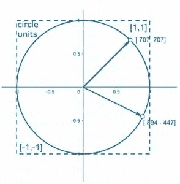

# 机器学习统计学:初学者指南

> 原文：<https://medium.com/edureka/statistics-for-machine-learning-c8bc158bb3c8?source=collection_archive---------1----------------------->

Statistics for Machine Learning — Edureka

理解数据并能够从中创造价值是这十年的技能。机器学习就是帮助公司实现这一目标的核心技能之一。然而，要开始，你需要建立正确的基础。因此，在本文中，我将涵盖一些基本概念，并为您提供开始机器学习之旅的指南。因此，在这篇关于机器学习的统计学的文章中，将讨论以下主题:

1.  可能性

*   概率是什么？
*   独立性ˌ自立性
*   贝叶斯规则和条件概率

2.统计数字

*   中心性度量和价差度量
*   正态分布

3.线性代数

*   [数]矩阵
*   矩阵运算

# **机器学习的概率统计:**

## 概率是什么？

概率量化了事件发生的可能性。例如，如果你掷一个公平、公正的骰子，那么 **1** **出现的概率是 1/6** 。如果你想知道为什么？那么答案就相当简单了！

这是因为有六种可能性，并且所有可能性都相等(公平死亡)。因此我们可以加上 **1+1+1+1+1+1 = 6。**但是，由于我们对 1 出现在的**事件感兴趣。事件发生只有一种方式。**因此，

**1 出现的概率= 1/6**

所有其他数字也是如此，因为所有事件的可能性都是一样的。简单吧？

在这个例子中，一个频率主义者对概率的定义听起来是这样的——如果骰子被掷出无限次，那么 1 出现的概率就是 1 出现的次数与骰子被掷出的总次数之比。这怎么说得通？

让我们使它变得更有趣。考虑这两种情况——你掷了 5 次骰子。在一种情况下，出现的数字序列是— [1，4，2，6，4，3]。在另一种情况下，我们得到— [2，2，2，2，2]。你觉得哪个可能性更大？

两种可能性都一样。很奇怪，对吧？

现在，考虑另一种情况，其中每种情况下的所有 5 个辊都是独立的**。也就是说，一卷不会影响另一卷。在第一种情况下，当 6 出现时，它不知道 2 在它之前出现。因此，所有 5 次掷骰的可能性相等。**

同样，第二种情况下的直 2 可以理解为一系列独立事件。所有这些事件都有同等的可能性。总的来说，由于我们有相同的骰子，在第一种情况下，某个特定数字出现的概率与第二种情况相同。接下来，在这篇关于机器学习统计的文章中，让我们来理解一下术语**独立性。**

## 独立性ˌ自立性

如果 A 的发生不影响事件 B ，则称两个事件 **A 和 B 是独立的。例如，如果你掷一枚硬币并掷骰子，骰子的结果对硬币是正面还是反面没有影响。同样，对于**两个独立事件 A 和 B** ，A 和 B 能够一起发生的**概率**。举个例子，如果你想知道硬币显示正面，骰子显示 3 的概率。**

**P(A 和 B) = P(A)*P(B)**

因此，P =(正面朝上的概率)* ⅙(正面朝上的概率)= 1/12

在前面的例子中，对于这两种情况，P = ⅙ *⅙ *⅙ *⅙ *⅙ *⅙。

现在我们来谈谈不独立的事件。请考虑下表:

对 100 人进行了调查。60 人有心脏问题，40 人没有。有心脏病的 60 人中，45 人肥胖。在 40 名没有心脏问题的人中，有 10 名肥胖。如果有人问你-

1.  心脏有问题的概率有多大？
2.  有心脏问题不肥胖的概率有多大？

第一个问题的答案很简单——60/100。对于第二个，它将是 15/100。现在考虑第三个问题——随机挑选一个人。他被发现患有心脏病。他肥胖的概率有多大？

现在想想给你的信息——已知他有心脏病。因此他不可能是没有心脏病的 40 岁的人。只有 60 个可能的选项(表中的第一行)。现在，在这些减少的可能性中，他肥胖的概率是 45/60。现在，你已经知道了什么是独立事件，接下来在这篇关于机器学习统计的文章中，让我们来理解条件概率。

# 条件概率

为了理解条件概率，让我们用上面的例子继续讨论。肥胖的状况和患有心脏病的状况是不独立的。如果肥胖不影响心脏问题，那么患有心脏问题的人的肥胖和非肥胖病例的数量将是相同的。

此外，我们被告知这个人有心脏问题，我们必须找出他肥胖的可能性。所以，这种情况下的概率，据说是以他有心脏问题为条件的。如果事件 A 发生的概率取决于事件 B，我们将其表示为

**P(A|B)**

现在，有一个定理可以帮助我们计算这个条件概率。它被称为**贝叶斯法则**。

**P(A|B) =P(A 和 B)/P(B)**

你可以通过插入我们刚刚讨论的例子来检验这个定理。如果到目前为止你已经明白了，可以从下面开始。它使用条件概率来分类电子邮件是否是垃圾邮件。它可以执行许多其他分类任务。但本质上，条件概率是机器学习算法的核心——**朴素贝叶斯**朴素贝叶斯。

# 统计数据:

统计学**用于对大量数据点进行总结和推断。**在数据科学和机器学习中，您会经常遇到以下术语

*   中心性度量
*   分布(尤其是正态分布)

# 中心性度量和价差度量

## 平均:

平均值只是数字的平均值**。要找出平均值，你必须将这些数字相加，然后除以数字的个数。比如[1，2，3，4，5]的均值是 15/5 = 3。**

## 中位数:

Median 是一组数字按升序排列时的中间元素**。例如，数字[1，2，4，3，5]按升序排列[1，2，3，4，5]。中间的那个是 3。因此，中位数是 3。但是如果数的个数是偶数，因此没有中间数呢？在这种情况下，取两个最中间数字的平均值。对于按升序排列的 2n 个数字的序列，对第 n 个和第(n+1)个数字求平均值以获得中位数。示例— [1，2，3，4，5，6]的中位数为(3+4)/2 = 3.5**

## 模式:

Mode 就是一组数字中**出现频率最高的数字。例如，[1，2，3，3，4，5，5，5]的众数是 5。**

## 差异:

方差不是一个中心性度量。它测量你的数据如何围绕平均值分布。它被量化为

x 是 N 个数的平均值。你取一个点，减去平均值，取这个差值的平方。对所有 N 个数都这样做，求平均值。方差的平方根叫做标准差。接下来，在这篇关于机器学习的统计学的文章中，让我们来理解一下正态分布。

# 正态分布

分布帮助我们**了解我们的数据是如何传播的**。例如，在年龄样本中，年轻人可能比老年人多，因此较小的年龄值可能比较大的年龄值多。但是我们如何定义一个分布呢？考虑下面的例子

y 轴代表密度。这种分布的模式是 30，因为它是峰值，因此是最频繁的。我们也可以定位中间值。中间值位于 x 轴上覆盖曲线下一半区域的点。任何正态分布下的面积都是 1，因为所有事件的概率之和是 1。举个例子，

上述案例中的中位数约为 4。这意味着 4 之前的曲线下面积与 4 之后的曲线下面积相同。考虑另一个例子

我们看到三种正态分布。蓝色和红色的意思相同。红色的方差更大。因此，它比蓝色的更分散。但是由于面积必须为 1，为了保持面积不变，红色曲线的峰值比蓝色曲线短。

希望你理解了基本的统计和正态分布。现在，在这篇关于机器学习的统计学的文章中，让我们学习线性代数。

# 线性代数

没有线性代数，现代人工智能是不可能的。它构成了深度学习的核心，甚至被用于线性回归等简单算法中。不要再耽搁了，让我们开始吧。

你必须熟悉向量。它们是空间中的一种几何表示。例如，向量[3，4]在 x 轴上有 3 个单位，在 y 轴上有 4 个单位。考虑下面的图像-

向量 d1 沿 x 轴有 0.707 个单位，沿 y 轴有 0.707 个单位。向量是一维的。它必然有大小和方向。举个例子，

上面的图像有一个矢量(4，3)。它的大小是 5，与 x 轴成 36.9 度。

什么是矩阵？矩阵是数字的多维数组。它是用来做什么的？我们会看到前方。但首先，让我们看看它是如何使用的。

# [数]矩阵

矩阵可以有多个维度。让我们考虑一个二维矩阵。它有行(m)和列(n)。因此它有 m*n 个元素。

举个例子，

这个矩阵有 5 行 5 列。我们称之为 A。因此，A(2，3)是第二行第三列的条目，即 8。

现在，你知道什么是矩阵，让我们看看矩阵的不同运算。

# 矩阵运算

## 矩阵加法

两个相同维度的矩阵可以相加。加法是按元素进行的。

## 纯量乘法

矩阵可以乘以一个标量。这种乘法导致矩阵中的每个元素都乘以标量。标量只是一个数字

## 矩阵转置

矩阵转置很简单。对于矩阵 A(m，n)，设 A '是它的转置矩阵。然后

**A'(i，j) = A(j，i)**

举个例子，

## 矩阵乘法

这可能比其他操作要复杂一些。在我们深入研究之前，让我们定义两个向量之间的点积。

考虑向量 X = [1，4，6，0]，向量 Y = [2，3，4，5]。那么 X 和 Y 之间的点积定义为

**X.Y = 1*2 + 4*3 + 6*4 + 0*5 = 38**

所以，这是元素间的乘法和加法。现在，让我们考虑两个矩阵 A(m，n)和 B(n，k)，其中 m，n，k 是维数，因此是整数。我们将矩阵乘法定义为

在上面的例子中，乘积(44)的第一个元素是通过左矩阵的第一行与右矩阵的第一列的点积获得的。类似地，左矩阵的第一行与右矩阵的第二列的点积得到 72。

请注意，对于左侧矩阵，列数应该等于右侧列中的行数。在我们的例子中，乘积 AB 存在，但 BA 不存在，因为 m 不等于 k。对于两个矩阵 A(m，n)和 B(n，k)，乘积 AB 被定义，乘积的维数是(m，k)(m，n，(n，k)的最外维数)。但是 BA 没有定义，除非 m = k。

到此，我们结束这篇关于机器学习的统计学的文章。我希望你已经理解了一些机器学习术语。如果你想查看更多关于 Python、DevOps、Ethical Hacking 等市场最热门技术的文章，你可以参考 Edureka 的官方网站。

请留意本系列中的其他文章，它们将解释数据科学的各个方面。

> *1。* [*数据科学教程*](/edureka/data-science-tutorial-484da1ff952b)
> 
> *2。* [*数据科学的数学与统计*](/edureka/math-and-statistics-for-data-science-1152e30cee73)
> 
> *3。*[*R 中的线性回归*](/edureka/linear-regression-in-r-da3e42f16dd3)
> 
> *4。* [*数据科学教程*](/edureka/data-science-tutorial-484da1ff952b)
> 
> *5。*[*R 中的逻辑回归*](/edureka/logistic-regression-in-r-2d08ac51cd4f)
> 
> *6。* [*分类算法*](/edureka/classification-algorithms-ba27044f28f1)
> 
> *7。* [*随机森林中的 R*](/edureka/random-forest-classifier-92123fd2b5f9)
> 
> *8。* [*决策树中的 R*](/edureka/a-complete-guide-on-decision-tree-algorithm-3245e269ece)
> 
> *9。* [*机器学习入门*](/edureka/introduction-to-machine-learning-97973c43e776)
> 
> *10。* [*朴素贝叶斯在 R*](/edureka/naive-bayes-in-r-37ca73f3e85c)
> 
> *11。* [*统计与概率*](/edureka/statistics-and-probability-cf736d703703)
> 
> *12。* [*如何创建一个完美的决策树？*](/edureka/decision-trees-b00348e0ac89)
> 
> 13。 [*关于数据科学家角色的十大神话*](/edureka/data-scientists-myths-14acade1f6f7)
> 
> 14。 [*顶级数据科学项目*](/edureka/data-science-projects-b32f1328eed8)
> 
> *15。* [*数据分析师 vs 数据工程师 vs 数据科学家*](/edureka/data-analyst-vs-data-engineer-vs-data-scientist-27aacdcaffa5)
> 
> *16。* [*人工智能类型*](/edureka/types-of-artificial-intelligence-4c40a35f784)
> 
> 17。[*R vs Python*](/edureka/r-vs-python-48eb86b7b40f)
> 
> 18。 [*人工智能 vs 机器学习 vs 深度学习*](/edureka/ai-vs-machine-learning-vs-deep-learning-1725e8b30b2e)
> 
> 19。 [*机器学习项目*](/edureka/machine-learning-projects-cb0130d0606f)
> 
> *20。* [*数据分析师面试问答*](/edureka/data-analyst-interview-questions-867756f37e3d)
> 
> *21。* [*面向非程序员的数据科学和机器学习工具*](/edureka/data-science-and-machine-learning-for-non-programmers-c9366f4ac3fb)
> 
> *22。* [*十大机器学习框架*](/edureka/top-10-machine-learning-frameworks-72459e902ebb)
> 
> *23。*[*5 大机器学习算法*](/edureka/machine-learning-algorithms-29eea8b69a54)
> 
> *24。* [*随机森林中的 R*](/edureka/random-forest-classifier-92123fd2b5f9)
> 
> *25。* [*广度优先搜索算法*](/edureka/breadth-first-search-algorithm-17d2c72f0eaa)
> 
> *26。* [*线性判别分析中的 R*](/edureka/linear-discriminant-analysis-88fa8ad59d0f)
> 
> *27。* [*机器学习的先决条件*](/edureka/prerequisites-for-machine-learning-68430f467427)
> 
> *28。* [*互动 WebApps 使用 R 闪亮*](/edureka/r-shiny-tutorial-47b050927bd2)
> 
> *29。* [*机器学习十大书籍*](/edureka/top-10-machine-learning-books-541f011d824e)
> 
> 三十岁。 [*无监督学习*](/edureka/unsupervised-learning-40a82b0bac64)
> 
> *31.1* [*0 本数据科学最佳书籍*](/edureka/10-best-books-data-science-9161f8e82aca)
> 
> *32。* [*监督学习*](/edureka/supervised-learning-5a72987484d0)

*原载于 2019 年 8 月 6 日 https://www.edureka.co**T21*[。](https://www.edureka.co/blog/statistics-for-machine-learning)