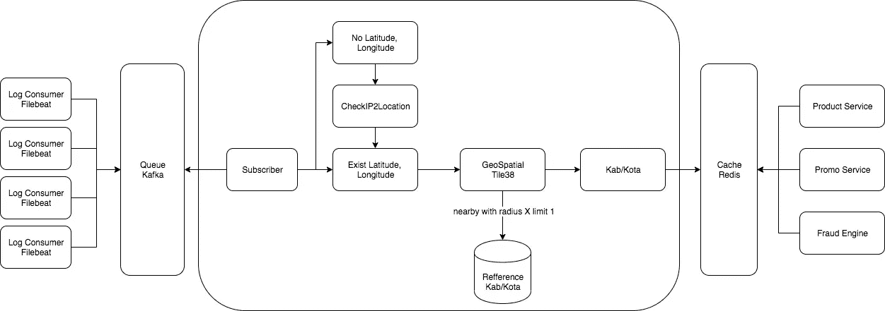

# 保持安全，呆在家里，保持生活

> 原文：<https://medium.easyread.co/stay-safe-stay-home-stay-lives-11350c64d6b8?source=collection_archive---------0----------------------->

Photo by [Tedward Quinn](https://unsplash.com/@antaresqsq?utm_source=unsplash&utm_medium=referral&utm_content=creditCopyText) on [Unsplash](https://unsplash.com/s/photos/coronavirus?utm_source=unsplash&utm_medium=referral&utm_content=creditCopyText)

> 拜托，大家，注意安全，待在家里，保住性命！

你好*易读* 贝里库特顶级文章[易读](https://medium.com/easyread)杨塞阳今年 1 月 3 日发表文章。

# 生产力

## [你应该关心你的技术债务](https://medium.com/easyread/you-should-take-care-of-your-technical-debt-1d491fe53080)

安德烈·西亚尼帕尔

Image taken from Google Images

许多技术和金融工具都不可或缺。世界上最大的软件开发公司是世界上最大的软件开发公司。达里诺尔。但我们需要一个更好的环境，一个更好的环境，一个更好的生活。

[***阅读更多……***](https://medium.com/easyread/you-should-take-care-of-your-technical-debt-1d491fe53080)

# 机器学习

## [面向初学者的卷积神经网络(CNN)介绍](https://medium.com/easyread/an-introduction-to-convolution-neural-network-cnn-for-a-beginner-88548e4b2a84)

由 [Indriani Tiosari Sitorus](https://medium.com/u/9c630ca53173?source=post_page-----11350c64d6b8--------------------------------)

***卷积神经网络*** 又名 CNN，是深度学习中的一种算法，是多层感知器(MLP)的发展，设计用于处理网格形式的数据，其中一种是二维图像，如图像或声音。

[***阅读更多***](https://medium.com/easyread/an-introduction-to-convolution-neural-network-cnn-for-a-beginner-88548e4b2a84)

# 戈朗

## [使用来自 AWS 的 Golang(弹性 Kubernetes 服务)消费 SQS 消息](https://medium.com/easyread/consuming-sqs-message-using-golang-in-eks-elastic-kubernetes-service-from-aws-cf0b30ca0e01)

由[伊曼肿瘤](https://medium.com/u/ef42567fbbae?source=post_page-----11350c64d6b8--------------------------------)

几天前，我在戈朗研究 SQS。相当棘手，但对我来说足够的压力。因为我坚持了五天，只是为了让我的消费者在 EKS 好好工作。

[***阅读更多……***](https://medium.com/easyread/consuming-sqs-message-using-golang-in-eks-elastic-kubernetes-service-from-aws-cf0b30ca0e01)

# 编程；编排

## [字符串操作 dalam c++ menggunakan STD:String](https://medium.com/easyread/string-manipulation-dalam-c-menggunakan-std-string-85651c3e5ac0)

由 [Yosepri Disyandro Berutu](https://medium.com/u/bddf38ae1969?source=post_page-----11350c64d6b8--------------------------------)

操纵弦乐器是竞争编程*的一个重要组成部分。尽管我们无法用 C 型琴弦操纵琴弦，但我们可以用一种标准的琴弦来操纵。*

[***阅读更多……***](https://medium.com/easyread/string-manipulation-dalam-c-menggunakan-std-string-85651c3e5ac0)

## [基础编程:初学者编程入门包](https://medium.com/easyread/basic-programming-programming-starter-pack-for-beginner-6b6746fba5b3)

由 Nadya Aditama

如果你是编程新手，那你来对地方了。你对编程感到兴奋吗？如果是的话，那么我会给你一些食谱让你学习编程。你只需要知道编程一点都不可怕。如果你爱玩逻辑游戏，我觉得这个适合你。现在，很多公司需要一个高薪的程序员职位。

[***阅读更多……***](https://medium.com/easyread/basic-programming-programming-starter-pack-for-beginner-6b6746fba5b3)

## [构建我的 Github 动作，向 PRs 发送 doggoes](https://medium.com/easyread/building-my-github-action-to-deliver-doggoes-to-prs-d9cd5d4a42d0)

由[斯坦利阮](https://medium.com/u/9508cde08448?source=post_page-----11350c64d6b8--------------------------------)

期待已久的 GitHub Action 功能终于推出测试版，并准备在每个存储库中提供。在浏览提交的内容时，我发现[是一个很酷的 GitHub 动作](https://github.com/ruairidhwm/action-cats),可以在 pull 请求上发布 cat gifs。只有当有一个行动把他们，好孩子，交给我们的公关，才是对狗的公平。那一刻我清楚地知道我的下一个 Github 行动计划会是什么。该去工作了。

[***阅读更多……***](https://medium.com/easyread/building-my-github-action-to-deliver-doggoes-to-prs-d9cd5d4a42d0)

# 软件工程

## [Software Development with Design Pattern in iOS](https://medium.com/easyread/software-development-with-design-pattern-in-ios-826a4506c63a)

by [William Gho](https://medium.com/u/3fd5583273a2?source=post_page-----11350c64d6b8--------------------------------)

In short, ***Design Patterns*** are guidelines used by developers as solution of building software that can be used in ***reusability*** , ***recurring system*** and ***general*** problem.

[***Read more…***](https://medium.com/easyread/software-development-with-design-pattern-in-ios-826a4506c63a)

## [Membuat Referensi Lokasi Customer](https://medium.com/easyread/membuat-referensi-lokasi-customer-df75810e5a14)

by [qomarullah](https://medium.com/u/4f605a10146b?source=post_page-----11350c64d6b8--------------------------------)

Arsitektur Pembuatan referensi database berdasarkan lokasi/daerah

Latar belakang dari tulisan ini adalah *project* untuk membuat *pricing product* berdasarkan lokasi. Dengan kata lain kita menawarkan produk kepada *customer* dengan harga yang berbeda sesuai lokasi. *Geographical segmentation* merupakan strategi ketika kita melayani target customer dengan *preferensi* yang berbeda-beda sesuai lokasi mereka berada.

Salah satunya adalah harga yang sesuai daya beli customer di area lokasi tersebut. Dengan harga produk yang sesuai diharapkan bisa meningkatkan jumlah transaksi produk tersebut yang pada akhirnya meningkatkan revenue.

[***Read more…***](https://medium.com/easyread/membuat-referensi-lokasi-customer-df75810e5a14)

# Today I Learned

## [Menggunakan Alias di Git](https://medium.com/easyread/menggunakan-alias-di-git-d9eb9438f59c)

by [Tulus Tobing](https://medium.com/u/68fffc8e43d6?source=post_page-----11350c64d6b8--------------------------------)

Menyambung tulisan saya sebelumnya mengenai [***Menggunakan Git dengan Command Line***](/@tulus.tobing90/menggunakan-git-dengan-command-line-3e53e4cfb752) , *nah* kali ini kita akan membahas yang namanya ***git alias*** . Dengan git alias ini, kita dapat menggunakan *command* git melalui *console* dengan cara yang lebih mudah, *simple* dan tidak perlu mengetik keseluruhan *command* dari git itu sendiri.

[***Read more…***](https://medium.com/easyread/menggunakan-alias-di-git-d9eb9438f59c)

## [Learn Google Cloud Platform (GCP) -Spring Boot Hello World](https://medium.com/easyread/learn-google-cloud-platform-gcp-spring-boot-hello-world-e02f5aec3e52)

by [Sintong Panjaitan](https://medium.com/u/6af71c814fee?source=post_page-----11350c64d6b8--------------------------------)

Photo by [Tim Mossholder](https://unsplash.com/@timmossholder?utm_source=unsplash&utm_medium=referral&utm_content=creditCopyText) on [Unsplash](https://unsplash.com/s/photos/learn?utm_source=unsplash&utm_medium=referral&utm_content=creditCopyText)

*Nah* , untuk artikel kali ini saya akan mencoba menjalankan program java sederhana menggunakan spring boot di GCP. Langkah-langkahnya dapat kamu ikuti seperti dibawah ini.

[***Read more…***](https://medium.com/easyread/learn-google-cloud-platform-gcp-spring-boot-hello-world-e02f5aec3e52)

# Quarantine Good-to-read

Untuk menemani masa-masa karantina kamu agar tetap produktif dan menyenangkan, berikut beberapa artikel menarik yang sayang kamu lewatkan *loh* !

*   [**Programmers Problems: Eyes Strain**](https://medium.com/easyread/programmers-problems-eyes-strain-7f7eb1958ae2?source=collection_home---4------0-----------------------) by [Nadya Aditama](https://medium.com/u/d96aa0286391?source=post_page-----11350c64d6b8--------------------------------)
*   [**HTTP — PATCH Method! I’ve Thought the Wrong Way!!!**](https://medium.com/easyread/http-patch-method-ive-thought-the-wrong-way-c62ad281cb8) by [Iman Tumorang](https://medium.com/u/ef42567fbbae?source=post_page-----11350c64d6b8--------------------------------)
*   [**今天学了:行锁事务 pada PostgreSQL**](https://medium.com/easyread/today-i-learned-row-locking-transaction-pada-postgresql-f8dee8084f90)**by[Iman Tumorang](https://medium.com/u/ef42567fbbae?source=post_page-----11350c64d6b8--------------------------------)**
*   **i [**sDate 和 isNumber 在流行的 Javascript 实用程序库中**](https://medium.com/easyread/isdate-and-isnumber-in-the-popular-javascript-utility-library-35ad2f6b8937) 由 [Kharis Khasburrahman](https://medium.com/u/a7abec617711?source=post_page-----11350c64d6b8--------------------------------)**
*   **[**C ke c++？**](https://medium.com/easyread/perlukah-migrasi-dari-c-ke-c-5b3deb02c64) 作者 [Yosepri Disyandro Berutu](https://medium.com/u/bddf38ae1969?source=post_page-----11350c64d6b8--------------------------------)**
*   **[**Mudahnya Mengolah Data mengunakan Model Dan 雄辩的 pada Laravel**](https://medium.com/easyread/mudahnya-mengolah-data-menggunakan-model-dan-eloquent-pada-laravel-80af915c80b5)**by[Eko Simanjuntak](https://medium.com/u/efc3b4ea41af?source=post_page-----11350c64d6b8--------------------------------)****
*   ****[**Golang 编程语言设置和初级应用**](https://medium.com/easyread/golang-programming-language-setup-and-basic-apps-for-beginners-bfec3960fb7d)Irfan IRA wan Sukirman****

*   ****[**Membuat Tampilan Web dengan Blade pada aplikasi Laravel — Part II**](https://medium.com/easyread/membuat-tampilan-web-dengan-blade-pada-aplikasi-laravel-part-ii-9e233233972a) by [Eko Simanjuntak](https://medium.com/u/efc3b4ea41af?source=post_page-----11350c64d6b8--------------------------------)****
*   ****[**Pentingnya Feature Toggles (Feature Flags) Untuk Mobile Apps**](https://medium.com/easyread/pentingnya-feature-toggles-feature-flags-untuk-mobile-apps-a31302c247f9) by [Mufti](https://medium.com/u/fabd581dd3a9?source=post_page-----11350c64d6b8--------------------------------)****

*****Apa yang kamu lakukan selama masa karantina akhir-akhir ini?* Seperti yang kita tahu, kini dunia sedang dilanda pandemi yang cukup mengkhawatirkan, yaitu **Covid-19** . Pandemi sendiri adalah suatu wabah penyakit global. Menurut *World Health Organization* ( [WHO](https://www.wartaekonomi.co.id/tag6563/world-health-organization-who) ), pandemi dinyatakan ketika penyakit baru menyebar di seluruh dunia melampaui batas.****

****Akibat adanya pandemi ini, beberapa negara melakukan berbagai kebijakan seperi menerapkan *lockdown* , karantina wilayah, dan lain sebagainya. Salah satu kebijakan yang diterapkan di Indonesia sendiri ialah *social distancing* yaitu menyarankan warga-warganya untuk “ *stay at home* ”. Tentu saja banyak pekerja yang kini bekerja dari rumah dan mengurangi intensitas untuk keluar jika hal yang dilakukan tidak terlalu penting.****

*****Nah* , tentu saja kebijakan ini sendiri memiliki dampak buruk, salah satunya dapat mengurangi produktivitas dan meningkatkan rasa bosan. Sebenarnya hal ini dapat diantisipasi dengan melakukan beragam kegiatan bahkan yang tidak pernah kamu lakukan sebelumnya. Misalnya belajar mengenai hal baru, mengatur ulang jadwalmu, membaca, olahraga, menonton dan *me-time, loh.*****

****Kali ini Easyread mengajak kamu untuk tetap produktif selama masa karantina ini dengan menulis dan berbagi cerita kamu. *Yuk* ikutan challenge dari Easyread untuk menulis cerita hingga masa karantina ini berakhir. Kamu bisa mulai dengan menulis apa aja, mempelajari apa aja dan berkontribusi banyak hal *loh* . Kalau kamu bingung menemukan tempat menulis, mungkin kamu boleh mencoba bergabung di Easyread untuk menjadi salah satu penulis di bidang kamu.****

****Jadi, mari berbagi cerita kamu di [Easyread](https://medium.com/easyread) . Semua dimulai dari langkah kecil loh! Biarkan cerita kamu menjadi salah satu langkah awal yang tepat untuk kamu mengisi masa-masa jenuh kamu saat karantina. Easyread is calling for [submission](/easyread/about-easyread-74b20960e180) . 😄****

*******So, stay safe, stay home, stay lives!*******