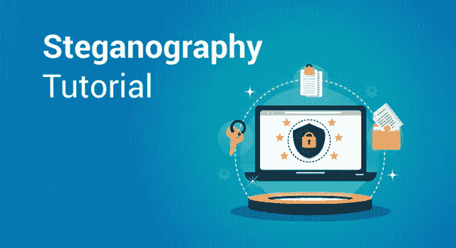
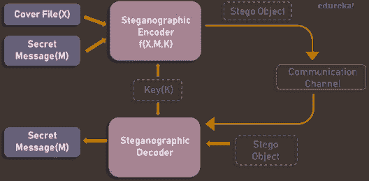
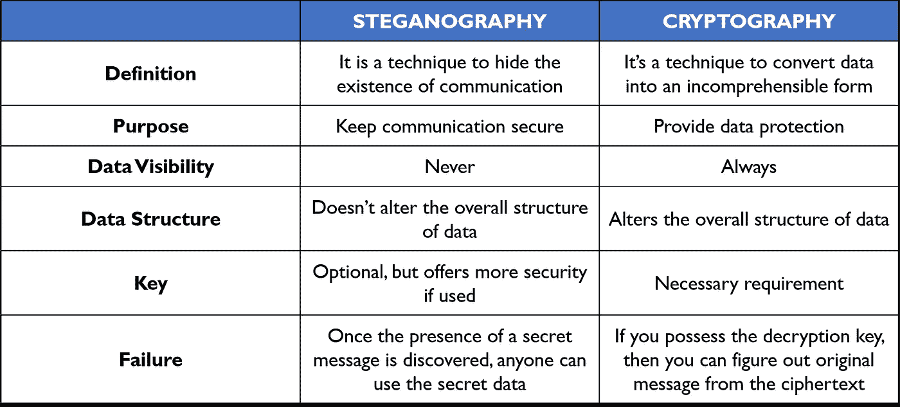

# 隐写术教程——初学者完全指南

> 原文：<https://medium.com/edureka/steganography-tutorial-1a3c5214a00f?source=collection_archive---------0----------------------->

Steganography Tutorial — Edureka

考虑到当今世界上以电子方式生成和传输的数据量，保护这些数据的方法层出不穷也就不足为奇了。快速增长的方法之一是*隐写术。*在本隐写术教程中，我们将详细介绍隐写术。

在开始之前，让我先列出我将在本文中涉及的主题。

*   什么是隐写术？
*   隐写术和密码学有什么不同？
*   隐写技术
*   执行隐写术的最佳工具

我们开始吧！

# 什么是隐写术？

> 隐写术是一种将秘密消息嵌入到隐藏消息中的艺术和科学，除了发送者和预定接收者之外，没有人会怀疑消息的存在

下图描述了一个基本的隐写术模型。

如图所示，封面文件(X)和秘密消息(M)作为输入被送入隐写编码器。隐写编码函数 f(X，M，K)将秘密消息嵌入到一个封面文件中。生成的隐写对象看起来与您的封面文件非常相似，没有明显的变化。这就完成了编码。为了恢复秘密信息，隐写对象被送入隐写解码器。

# 历史背景

隐写术是将秘密消息隐藏在正常消息后面的做法。它源于两个希腊词，分别是 ***隐写术*** *，*意为覆盖， ***graphia*** *，*意为书写。隐写术是一种古老的做法，几千年来一直以各种形式实施，以保持通信的私密性。例如:

> 隐写术的首次使用可以追溯到公元前 440 年，当时古希腊人在木头上书写信息，并用蜡覆盖，作为一种覆盖介质
> 
> 罗马人使用各种形式的隐形墨水，用光或热来破译那些隐藏的信息
> 
> 在第二次世界大战期间，德国人引入了微点，这是一种完整的文件、图片和平面图，尺寸缩小到一个点的大小，并附在正常的文件上
> 
> 零密码也被用来隐藏未加密的秘密信息在一个无辜的看起来正常的信息

现在，我们有许多现代隐写技术和工具来确保知道我们的数据仍然是秘密的。现在你可能想知道隐写术是否和密码学一样。不，它们是两个不同的概念，这篇隐写术教程向你展示了它们之间的主要区别。

# 隐写术和密码学有什么不同？

在他们的核心，他们有几乎相同的目标，这是保护第三方的消息或信息。然而，他们使用完全不同的机制来保护信息。

密码术将信息转换成没有解密密钥就无法理解的密文。因此，如果有人要拦截这个加密的消息，他们可以很容易地看到某种形式的加密已被应用。另一方面，隐写术不改变信息的格式，但它隐藏了消息的存在。

因此，换句话说，当我们想要发送机密信息时，隐写术比密码学更谨慎。缺点是，如果秘密的存在被发现，隐藏的信息更容易提取。在本隐写术教程的剩余部分，我们将了解不同的隐写术技术和工具。

# 隐写技术

根据隐藏对象(嵌入秘密数据的实际对象)的性质，隐写术可以分为五种类型:

1.  文本隐写术
2.  图像隐写术
3.  视频隐写术
4.  音频隐写术
5.  网络隐写术

让我们来详细探讨其中的每一个。

## **文本隐写术**

文本隐写术是在文本文件中隐藏信息。它包括改变现有文本的格式，改变文本中的单词，生成随机字符序列或使用上下文无关的语法来生成可读的文本。用于隐藏文本中数据的各种技术有:

*   基于格式的方法
*   随机和统计生成
*   语言学方法

## **图像隐写术**

通过将载体作为图像来隐藏数据称为图像隐写术。在数字隐写术中，图像被广泛用于覆盖源，因为在图像的数字表示中存在大量的比特。有很多方法可以在图像中隐藏信息。常见的方法包括:

*   最低有效位插入
*   屏蔽和过滤
*   冗余模式编码
*   加密和散布
*   编码和余弦变换

## **音频隐写术**

在音频隐写术中，秘密消息被嵌入到改变相应音频文件的二进制序列的音频信号中。与图像隐写术等其他方法相比，在数字声音中隐藏秘密信息要困难得多。音频隐写术的不同方法包括:

*   最低有效位编码
*   奇偶编码
*   相位编码
*   扩展频谱

此方法隐藏 WAV、AU 甚至 MP3 声音文件中的数据。

## **视频隐写术**

在视频隐写术中，你可以将各种数据隐藏到数字视频格式中。这种类型的优点是大量的数据可以隐藏在里面，事实上它是一个移动的图像和声音流。你可以把这看作是图像隐写术和音频隐写术的结合。两种主要的视频隐写术包括:

*   在未压缩的原始视频中嵌入数据并在以后压缩
*   将数据直接嵌入到压缩数据流中

## **网络隐写(协议隐写)**

它是一种将信息嵌入数据传输中使用的网络控制协议(如 TCP、UDP、ICMP 等)的技术。您可以在 OSI 模型中的一些隐蔽通道中使用隐写术。例如，您可以在 TCP/IP 数据包报头的某些可选字段中隐藏信息。

在当今的数字化世界中，各种软件工具可用于隐写术。在本隐写术教程的剩余部分，我们将探索一些流行的隐写术工具及其功能。

# 执行隐写术的最佳工具

有许多软件提供隐写术。一些提供普通的隐写术，但是一些在隐藏数据之前提供加密。这些是免费提供的隐写术工具:

*   ***Stegosuite*** 是一款用 Java 编写的免费隐写工具。使用 Stegosuite，您可以轻松地在图像文件中隐藏机密信息。
*   ***Steghide*** 是一款开源隐写软件，可以让你在图像或音频文件中隐藏秘密文件。
*   ***Xiao 隐写术*** 是一款免费软件，可用于在 BMP 图像或 WAV 文件中隐藏数据。
*   是另一个免费的便携式应用程序，用于隐藏图像文件中的文本，但与其他工具相比，它采用了不同的方法。
*   ***OpenPuff*** 是一款专业的隐写工具，可以将文件存储在图像、音频、视频或 flash 文件中

嗯，这些是执行隐写术的几个工具。还有许多其他具有不同功能的不同工具。但是，您将从这些工具中获得想要的结果。

所以，我们已经到了隐写教程的结尾。隐写术是为安全通信而开发的。然而，犯罪分子和恐怖组织正在利用这一点达到他们自己的目的。因此，了解如何隐藏数据隐写术，并防止数据被滥用，可以非常有助于攻击和防御。

如果你想查看更多关于人工智能、DevOps、道德黑客等市场最热门技术的文章，你可以参考 Edureka 的官方网站。

请留意本系列中的其他文章，它们将解释网络安全的各个方面。

> 1.[什么是网络安全？](/edureka/what-is-cybersecurity-778feb0da72)
> 
> 2.[网络安全框架](/edureka/cybersecurity-framework-89bbab5aaf17)
> 
> 3.[什么是密码学？](/edureka/what-is-cryptography-c94dae2d5974)
> 
> 4.[什么是网络安全？](/edureka/what-is-network-security-1f659407dcc)
> 
> 5.[什么是计算机安全？](/edureka/what-is-computer-security-c8eb1b38de5)
> 
> 6.[什么是应用安全？](/edureka/application-security-tutorial-e6a0dda25f5c)
> 
> 7.[渗透测试](/edureka/what-is-penetration-testing-f91668e2291a)
> 
> 8.[道德黑客教程](/edureka/ethical-hacking-tutorial-1081f4aacc53)
> 
> 9.[关于 Kali Linux 你需要知道的一切](/edureka/ethical-hacking-using-kali-linux-fc140eff3300)
> 
> 10.[使用 Python 的道德黑客](/edureka/ethical-hacking-using-python-c489dfe77340)
> 
> 11. [DDOS 攻击](/edureka/what-is-ddos-attack-9b73bd7b9ba1)
> 
> 12.[使用 Python 的 MAC changer](/edureka/macchanger-with-python-ethical-hacking-7551f12da315)
> 
> 13 [ARP 欺骗](/edureka/python-arp-spoofer-for-ethical-hacking-58b0bbd81272)
> 
> 14. [Proxychains，Anonsurf & MacChange](/edureka/proxychains-anonsurf-macchanger-ethical-hacking-53fe663b734)
> 
> 15.[足迹](/edureka/footprinting-in-ethical-hacking-6bea07de4362)
> 
> 16.[50 大网络安全面试问答](/edureka/cybersecurity-interview-questions-233fbdb928d3)

*原载于 2019 年 1 月 21 日*[*www.edureka.co*](https://www.edureka.co/blog/steganography-tutorial)*。*