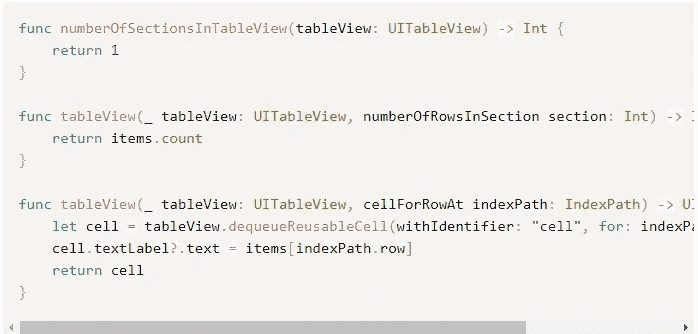

# 在 iOS 应用程序中使用 Firebase Firestore 的分步指南

> 原文：<https://medium.com/quick-code/step-by-step-guide-to-use-firebase-firestore-in-an-ios-app-749c5254a27b?source=collection_archive---------0----------------------->

Firebase 是 app 开发者的必备工具。他们更喜欢将该工具作为他们工具包中的主要工具。Firebase 工具有助于开发人员专注于应用程序开发，而不必管理大量基础设施。

此外，firebase 专注于构建强大的后端，以便开发人员可以专注于提供出色的用户体验。让我们来详细了解一下如何在 iOS 应用程序中使用 Firebase:

以下要点可以指导您了解 Firebase 的有效性:

**❖建造新的消防基地项目**

**❖将 iOS 应用添加到你的 Firebase 项目中**

**❖将 Firebase 配置文件添加到您的 Xcode 项目中**

**❖设置协同机器人**

**❖安装燃烧基地吊舱**

**❖在 App 代码中配置 firebase**

**❖连接 Firebase 数据库**

**❖设置 Firebase 认证**

**什么是 Firebase？**

Firebase 是一个软件开发工具包，可以帮助开发人员在不编写服务器代码的情况下构建出色的 iOS 应用程序。它管理数据库认证 API 和推送通知等基础设施。此外，它可以毫不费力地在云中存储和同步数据。

Firebase 的核心功能如下:

●网络资产托管

●实时崩溃报告

●在全球范围内存储和同步应用数据

●认证过程简单

●云存储

●在没有服务器的情况下运行代码

●信息和通知

●绩效跟踪

●由谷歌创建和维护

以上是 Firebase for iOS 应用程序开发的几个特性，您可以在应用程序开发中利用和使用它。它简化了后端操作，让那些可以受雇的专门的 web 开发人员更容易为他们的用户制作高度直观的应用程序。

**❖建设新的火力基地项目**

构建一个应用程序需要一个进入 Firebase 的账户，并且你可以用****创建。在 Firebase 上创建帐户后，您可以转到 Firebase 控制台，然后选择添加项目。****

**一旦选择了 Add Project，就会弹出一个对话框，要求输入项目的名称。选中这两个框并使用默认选项。此外，您可以添加您的项目名称，然后 Firebase 将旋转您的项目。**

****❖将 iOS 应用添加到你的 Firebase 项目中****

****“创建项目”**概述如下所示:**

****

**创建完项目后，您需要选择 iOS 选项卡来添加 iOS 应用程序。结果会是这样的:**

****

**上图需要一个 iOS 包 ID、昵称和商店 ID。昵称和商店 ID 是可选的，不强制要求填写细节。**

**捆绑包 ID 与您在制作 Xcode 项目时创建的 ID 相同。此外，您可以在 Xcode 中的**常规**选项卡中找到您的**包标识符**。**

****

**您应该仔细检查您的捆绑包 ID，并确保它以**com 开头**强制步骤完成后，点击**注册 APP** 按钮继续。**

****❖将 Firebase 配置文件添加到你的 Xcode 项目中****

**下一步是下载您的配置文件。**

****

**上图显示了 GoogleService-info.plist 文件，您需要下载该文件并将其插入 Xcode 项目。一旦你完成了这个，点击**下一步。****

****❖使用 CocoaPods 安装 firebase SDK****

**在将 Firebase SDK 安装到 Xcode 项目中时，CocoaPods 会变得非常有用。如果你还没有安装 CocoaPods，并且想要学习如何将 CocoaPods 安装到你的 Xcode 项目中，那么你可以浏览上面的文章，它会给你更深入的细节。**

**此外，在安装 CocoaPods 之后，您需要将 pod 的 Firebase/Core 添加到您的 Podfile 中，然后运行 pod installs。**

****

**下面是我的 Podfile 的图片:**

****

****XCWorkspace** 包括您的 pod 以及您的项目代码。已被替换为 **Xcodeproj。**你应该在你的项目中使用前者。**

****❖在 App 代码中配置 firebase****

**现在，您需要向您的项目添加一个初始化代码。添加代码将在应用启动时设置 Firebase。你必须从 Firebase 网站复制和粘贴代码。**

****

**之后，运行您的应用程序来验证安装是否成功。另一方面，Firebase 将检查正确的初始化。**

****

****❖连接 Firebase 数据库****

**我将执行一个简单的列表应用程序作为例子来说明这是如何工作的。它将展示如何与 Firebase 数据库连接，并与之实时同步。**

**你将能够见证来自网络的变化，这些变化将在应用程序中复制，反之亦然。让我们看看它是如何工作的。**

**打开 Firebase，点击左侧面板**“Develop”**部分下的数据库选项，如下图所示。**

****

**在那之后，你会得到一个选择，使用云火石或实时数据库。我用过云数据库。您还可以浏览基于 [**的文章，了解哪种数据库解决方案最适合您**](/datadriveninvestor/realtime-database-vs-cloud-firestore-which-database-is-suitable-for-your-mobile-app-87e11b56f50f) 。**

**云火石将为您呈现如下图像:**

****

**我们将从**测试模式开始测试模式不需要额外的设置许可，也有助于我们快速开发应用程序。****

**点击**启用**，在你的云火石中设置 Firebase。设置上述流程后，您可以看到以下屏幕:**

****

**单击添加集合并将其命名为 items。**

****

**现在，我们将添加集合中的第一个项目。因为这是一个演示，它将只是一个名称字段，即字符串**

****

**下面是数据库的图像，应该如下所示:**

****

**现在，让我们在应用程序中检索和显示数据。**

**将 pod“fire base/Firestone”添加到您的 pod 文件中，然后运行 pod install。**

**Xcode 有一个视图控制器，您需要在应用程序启动时打开它。这不是使用故事板制作的，如果你想了解更多关于 [**一个没有故事板的应用**](/ios-os-x-development/ios-start-an-app-without-storyboard-5f57e3251a25) 那么你可以浏览上面的文章。**

****

**您还必须在文件的顶部导入 Firebase。此外，当您运行应用程序时，您应该能够在控制台中读取:**

****

**恭喜你！现在，让我们在用户界面中看到它。**

****

**转到 XIB 文件并创建一个表格视图。展开它，使其填充视图并设置前导、尾随、顶部和底部的约束。**

****

**接下来，我们必须在控制器视图中子类化 uitableview delegate & uitableview data source，并在表视图中添加一个 IBOutlet。存储从数据库中检索的所有项目的数组。下面是视图控制器图像:**

****

**现在，在我们的 viewDidLoad 函数中添加三行代码进行设置:**

****

**我们必须完成表视图数据源和委托函数:**

****

**完整的代码如下:**

****

**在 Firestore 中添加另一个文档将如下所示:**

****

**现在，您是从 Firestore 数据库中读取数据的专家&在您的 UI 中显示它。**

**接下来，本文将向您解释如何向这个数据库中写入数据，以及如何向我们的列表中添加条目。此外，一个简单的按钮将添加一个项目到这个列表。**

****

**我删除了界面构建器中表格视图的底部约束。之后我缩小了高度，把按钮加到了屏幕下方。下面是一张图片:**

****

**现在，将 IBOutlet 中的按钮拖到我们的 swift 文件中，如下所示:**

****

**添加以下代码:**

****

**添加新行以清除 items 数组，并重构我的 read 代码，使文件看起来像这样:**

****

**现在，运行你的应用程序，点击屏幕底部的按钮，向其中添加新项目。**

****

**firebase 中的 Firestore 控制台也将反映新的项目。**

****

**随机生成的一个被分配，因为我没有文档 ID。**

****❖设置 Firebase 认证****

**设置 Firebase 身份验证是每个开发人员都面临的一个常见问题。你需要详细了解 [**如何设置 Firebase 认证**](https://firebase.google.com/docs/auth) 。你会对它的工作原理和使用方法有所了解。**

**经过上述步骤后，你将成为使用 Firebase Firestore 构建 iOS 应用程序的专家。**

**此外，你还可以浏览 iOS 的 12 个最优秀的特性 ，这些特性将帮助你为你的 iOS 目标用户打造一款超级惊艳的应用。**

****结论****

**在这里，我们为您提供了在 iOS 应用程序中使用 Firebase Firestore 的分步指南。我们希望你能愉快地阅读这篇文章，它将对你有长远的帮助。**

**如果你对这篇文章有任何问题或建议，请在评论框中提出。谢谢你。！**

***********************************************************************

****作者简介:-****

**Harikrishna Kundariya，营销人员、开发人员、物联网、聊天机器人和区块链专家、设计师、联合创始人、[**eSparkBiz Technologies**](https://www.esparkinfo.com/)移动应用程序开发公司董事。他的 8+经验使他能够为基于物联网和聊天机器人的新创企业提供数字化解决方案。**