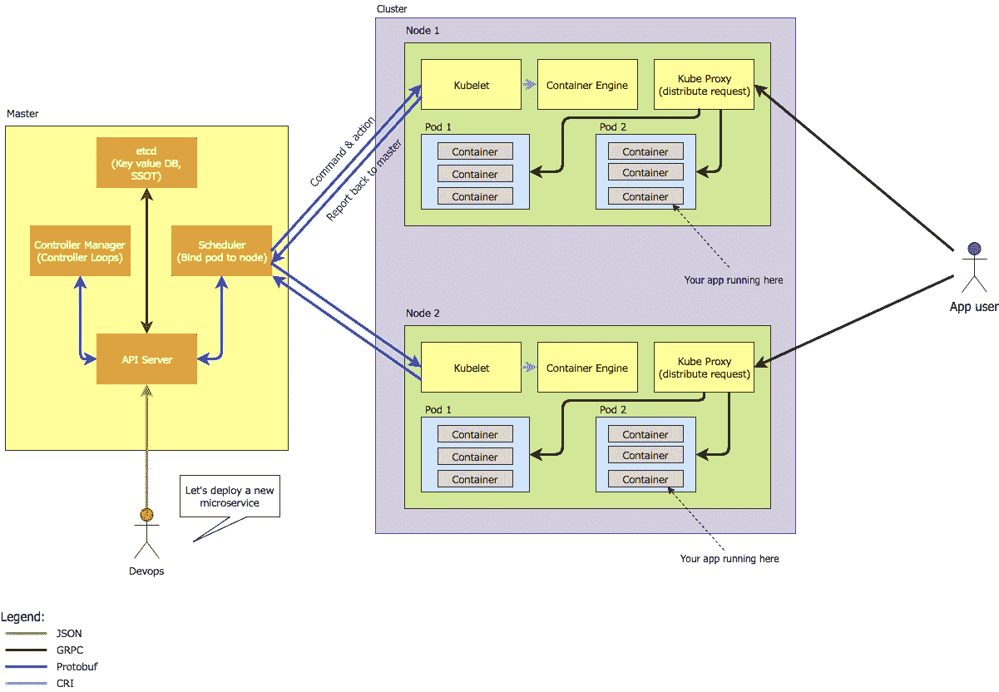
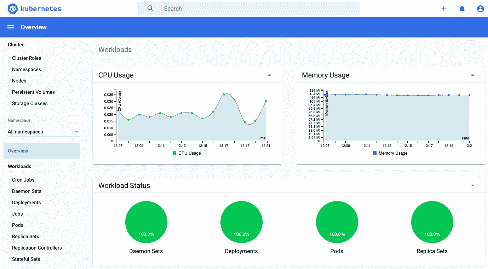
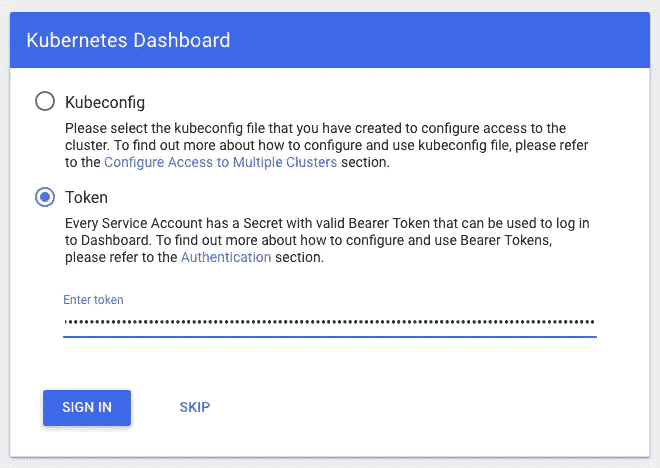

# 逐步介绍 Kubernetes 的基本概念

> 原文：<https://medium.easyread.co/step-by-step-introduction-to-basic-concept-of-kubernetes-e20383bdd118?source=collection_archive---------1----------------------->

## 通过在您的本地环境中创建 Kubernetes 集群来理解 Kubernetes 的概念


Photo by [Stanley Dai](https://unsplash.com/@stanleydai?utm_source=unsplash&utm_medium=referral&utm_content=creditCopyText) on [Unsplash](https://unsplash.com/@stanleydai?utm_source=unsplash&utm_medium=referral&utm_content=creditCopyText)

你听过 Kubernetes 吗？你一定对那个话题感兴趣。这就是你打开这篇文章的原因。这篇文章是关于 Kubernetes 的基本概念和如何使用它。最后，我们将使用在 Minikube 上运行的 Kubernetes 来运行 docker 容器。它不需要任何云付费账户。

# 什么是 Kubernetes？

Kubernetes 是 Google 创建的一个开源平台/工具。这是用 GO-Lang 写的。所以目前 Kubernetes 是 Apache 2.0 许可下的一个开源项目。有时在业内， [Kubernete](http://www.java67.com/2019/03/5-free-devops-courses-to-learn-jenkins.html) s 也被称为“K8s”。使用 Kubernetes，您可以跨私有、公共和混合云环境运行任何 Linux 容器。Kubernetes 提供了一些边缘功能，如负载平衡器、服务发现和基于角色的访问控制(RBAC)。

# 我们为什么需要 Kubernetes？

答案是帮助我们管理容器。当我们使用具有许多容器的微服务模式运行生产环境时，我们需要确保许多事情。例如健康检查、版本控制、缩放和回滚机制。这将是非常令人沮丧的，以确保所有这些事情仍然是好的。Kubernetes 为您提供了大规模部署容器所需的编排和管理功能。Kubernetes orchestration 允许您构建跨多个容器的应用程序服务，在集群中调度这些容器，扩展这些容器，并管理这些容器的运行状况。简而言之，我可以说 Kubernetes 更像是一个拥有许多下属(容器)的经理。管理者做的是维护下属需要做的事情。

在使用 Kubernetes 之前，您需要准备好基础设施来部署新的微服务。我相信这花了你几天或几周的时间。如果没有 Kubernetes，大型团队将不得不手动编写部署工作流的脚本。使用 Kubernetes，您不需要手动创建部署脚本，这将减少在开发运维上花费的时间和资源。

Kubernetes 的主要特点:

*   [水平缩放](https://kubernetes.io/docs/tasks/run-application/horizontal-pod-autoscale/)
*   [自动缩放](https://kubernetes.io/blog/2016/07/autoscaling-in-kubernetes/)
*   [健康检查](https://kubernetes.io/docs/tasks/configure-pod-container/configure-liveness-readiness-startup-probes/) & [自愈](https://multinode-kubernetes-cluster.readthedocs.io/en/latest/14-k8s-selfhealing.html)
*   [负载平衡器](https://kubernetes.io/docs/tasks/access-application-cluster/create-external-load-balancer/)
*   [服务发现](https://kubernetes.io/docs/concepts/services-networking/service/)
*   自动[回滚](https://kubernetes.io/docs/concepts/workloads/controllers/deployment/#rolling-back-a-deployment) & [回滚](https://kubernetes.io/docs/concepts/workloads/controllers/deployment/#creating-a-deployment)
*   金丝雀部署

# Kubernetes 是如何工作的？

当您通过阅读官方文档开始学习 Kubernetes 时，您可能会被大量术语弄得不知所措。有时我们需要概述来更好地理解概念。这里我向你展示了 Kubernetes 建筑的完整概观图。我希望这有所帮助。

**部署顺序:**

DevOps -> API 服务器->调度器->集群->节点-> Kubelet ->容器引擎->在 Pod 中生成容器

**App 用户请求顺序:**

应用程序用户-> Kube 代理-> Pod ->容器(您的应用程序在此运行)



Kubernetes Architecture Diagram

正如你在图表中看到的，有很多术语你不理解。我一个一个解释。

## 掌握

主设备是集群的控制元素。母版有 3 个部分:

*   **API 服务器:**通过 RESTful 接口提供 Kubernetes 功能并存储集群状态的应用程序。
*   **调度程序:**调度程序监视 API 服务器是否有新的 Pod 请求。它与节点通信以创建新的 pod，并在分配资源或施加约束时向节点分配工作。
*   **控制器管理器:**运行[控制器](https://kubernetes.io/docs/concepts/architecture/controller/)的主机上的组件。包括节点控制器、端点控制器、名字空间控制器等。

## 从属(节点)

这些机器执行要求的、分配的任务。Kubernetes 大师控制他们。节点内有 4 个组件:

*   Pod: 所有的容器都将在一个 Pod 中运行。pod 将网络和存储从底层容器中抽象出来。你的应用将在此运行。
*   Kubectl 向集群注册节点，监视来自调度器的工作分配，实例化新的 pod，向主节点报告。
*   **容器引擎:**负责管理容器，镜像拉取，停止容器，启动容器，销毁容器等。
*   **Kube 代理:**负责将 app 用户请求转发到右侧 pod。

我不打算在这里描述详细的概念，因为这会导致一个无聊的局面。这篇文章应该更污更好玩。你可以阅读官方文档以获得更多详细信息。[点击这里](https://kubernetes.io/docs/concepts/)。

# 与 Docker 和 Kubernetes 一起动手

是时候把手弄脏了。在这一节中，我将使用 Github 上现有的 docker 项目，并将更多地关注 Kubernetes。我们将使用 Minikube。Minikube 是一个让本地运行 Kubernetes 变得容易的工具。

1.  **安装 Minikube** 试试这个 [Minikube 官方安装文档。](https://kubernetes.io/docs/tasks/tools/install-minikube/)
2.  **遵循下面的说明**

启动 Minikube 并创建一个集群

```
minikube start
```

在您的本地工作区中克隆此存储库

```
git clone [https://github.com/buildkite/nodejs-docker-example.git](https://github.com/contentful/the-example-app.nodejs.git)
```

将您的 Docker 客户端指向您的 MinikubeDocker 守护进程

```
eval $(minikube docker-env)
```

将您的目录移动到上面的克隆回购中。使用此命令创建一个 Docker 映像，并确保可以在本地运行。

```
cd the-example-app.nodejs
docker build -t example-node-app .
```

确保您已经成功创建了 Docker 映像。

```
docker images
```

让我们使用名为`example-node-app`的现有映像创建一个 Kubernetes 部署，这是一个简单的节点 HTTP 服务器，并在端口 3000 上公开它。
创建一个文件，命名为**deployment-script . YAML .**

```
kind: DeploymentapiVersion: extensions/v1beta1metadata: name: kubernetes-deployment namespace: default labels: app: node-app spec: replicas: 1 selector: matchLabels: app: node-app template: metadata: labels: app: node-app spec: containers: - name: node-app-container image: example-node-app resources: {} imagePullPolicy: IfNotPresent restartPolicy: Always terminationGracePeriodSeconds: 30terminationGracePeriodSeconds: 30
```

然后

```
kubectl apply -f deployment-script.yaml
```

**node-app** pod 现已启动，您的 **node-app** 容器将在 Pod 内运行，但您必须等到 Pod 启动后才能通过公开的服务访问它。

检查 Pod 是否启动并运行:

```
kubectl get pod
```

pod 已启动并运行:

```
NAME                              READY     STATUS    RESTARTS   AGE
node-app-3383150820-vctvh         1/1       Running   0          13s
```

请不要高兴得太快。我们不会就此结束。你需要一个**服务代理**来访问你的 pod。我们将创建一个负载平衡器服务，使用 **targetPort: 3000** 和**向用户公开端口 8000** 。

用下面的文本创建一个名为`node-app-service.yaml`的文件。

```
kind: ServiceapiVersion: v1metadata: name: node-app-service namespace: default labels: app: node-servicespec: ports: - protocol: TCP port: 8000 targetPort: 3000 selector: app: node-app type: LoadBalancer sessionAffinity: None externalTrafficPolicy: Clusterstatus: loadBalancer: {}
```

执行:

```
kubectl apply -f node-app-service.yaml
```

要获取有关您的服务的信息:

```
kubectl get service
```

将显示以下内容:

```
NAME             Type         EXTERNAL-IP  PORT(S)         AGE
node-app-service LoadBalancer **<pending>**    8000:31386/TCP  36m
```

创建服务后，云基础设施需要时间来创建负载平衡器，并将其 IP 地址写入服务对象。那么，时间一直在流逝，为什么**外部 IP** 仍然悬而未决？

如果 Kubernetes 在不支持**负载平衡器服务的环境中运行，**负载平衡器**将不会被供应。**

在这种情况下，您需要一个可以附加到您的服务的 IP。可以用 **Minikube IP** 。

```
minikube ip
```

复制显示的 Minikube IP 并将其附加到您的外部 IP 服务。

```
kubectl patch svc node-app-service  -p '{"spec": {"type": "LoadBalancer", "externalIPs":["YOUR_MINIKUBE_IP"]}}'
```

显示有关服务的信息:

```
kubectl get service
```

结果:

```
NAME             Type         EXTERNAL-IP      PORT(S)         AGE
node-app-service LoadBalancer 192.168.99.100   8000:31386/TCP  36m
```

因此，您现在可以通过该 IP 地址或网络浏览器访问服务:

```
curl 192.168.99.100:8000
```

# 奖金

您需要一个交互式 UI 来显示您的 Kubernetes 集群？



默认情况下，不会部署仪表板 UI。要部署它:

```
kubectl apply -f https://raw.githubusercontent.com/kubernetes/dashboard/v2.0.0-beta4/aio/deploy/recommended.yaml
```

默认情况下，Kubernetes 仪表板用户拥有有限的权限。在本节中，您将创建一个`eks-admin`服务帐户和集群角色绑定，您可以使用它以管理员级别的权限安全地连接到仪表板。

用下面的文本创建一个名为`eks-admin-service-account.yaml`的文件。这个清单定义了一个名为`eks-admin`的服务帐户和集群角色绑定。

```
apiVersion: v1
kind: ServiceAccount
metadata:
  name: eks-admin
  namespace: kube-system
---
apiVersion: rbac.authorization.k8s.io/v1beta1
kind: ClusterRoleBinding
metadata:
  name: eks-admin
roleRef:
  apiGroup: rbac.authorization.k8s.io
  kind: ClusterRole
  name: cluster-admin
subjects:
- kind: ServiceAccount
  name: eks-admin
  namespace: kube-system
```

将服务帐户和群集角色绑定应用到您的群集。

```
**kubectl apply -f eks-admin-service-account.yaml**
```

您需要一个用于`eks-admin`服务帐户的认证令牌。从输出中复制`*<authentication_token>*`值。使用此令牌连接到仪表板。

```
**kubectl -n kube-system describe secret $(kubectl -n kube-system get secret | grep eks-admin | awk '{print $1}')**
```

**输出**:

```
Name:         eks-admin-token-b5zv4
Namespace:    kube-system
Labels:       <none>
Annotations:  kubernetes.io/service-account.name=eks-admin               kubernetes.io/service-account.uid=bcfe66ac-39be-11e8-97e8-026dce96b6e8
Type:  kubernetes.io/service-account-token
Data
====
ca.crt:     1025 bytes
namespace:  11 bytes
token:      *<authentication_token>*
```

您可以通过运行以下命令，使用 kubectl 命令行工具来访问仪表板:

```
kubectl proxy
```

可以访问[http://localhost:8001/API/v1/namespaces/kubernetes-dashboard/services/https:kubernetes-dashboard:/proxy/#！/登录](http://localhost:8001/api/v1/namespaces/kubernetes-dashboard/services/https:kubernetes-dashboard:/proxy/#!/login)

选择**令牌**，将上一条命令输出的`*<authentication_token>*`粘贴到**令牌**字段，选择**签到**。



# 参考

[](https://kubernetes.io/docs) [## Kubernetes 文档

### Kubernetes 是一个开源容器编排引擎，用于自动部署、扩展和管理…

kubernetes.io](https://kubernetes.io/docs)  [## 亚马逊 EKS

### 编辑描述

docs.aws.amazon.com](https://docs.aws.amazon.com/eks/latest/userguide) 

万岁，到此为止🤗

我希望你喜欢它。请在下面留下评论。如果你面临任何问题，留下你的评论，我会帮助你😉。

我要感谢创建这个回购[https://github.com/contentful/the-example-app.nodejs](https://github.com/contentful/the-example-app.nodejs)的家伙，因为我可以在本文的示例应用程序中使用它。

# 下一篇文章再见！