# 学习颤振的一步一步教程:第 12 课-添加图像(冰口袋妖怪)

> 原文：<https://medium.com/quick-code/step-by-step-tutorial-in-learning-flutter-lesson-12-adding-image-ice-pokemon-8bfe4dedd308?source=collection_archive---------0----------------------->

这是一个循序渐进的教程，教你如何将图像添加到可以在 iOS 和 Android 设备上运行的 Flutter 应用程序中。这是上一课的延续，我们将继续为我们的冰口袋妖怪添加图像。

在这里下载以前的课程代码[跟随。](https://u.pcloud.link/publink/show?code=kZgYaxkZFbhN991pNYFIeVHcCw5BayJGiSVk)

在教程的最后，我们将实现如下所示的屏幕

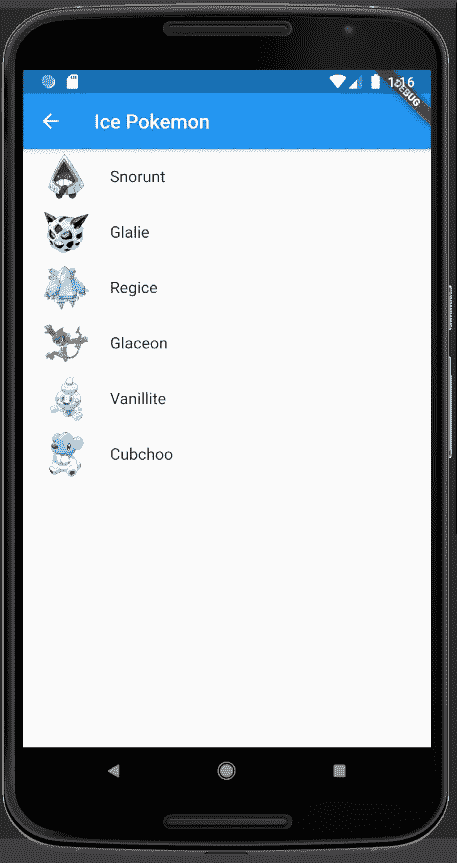

向下滚动到第 296 行，这是我们的冰口袋妖怪屏幕

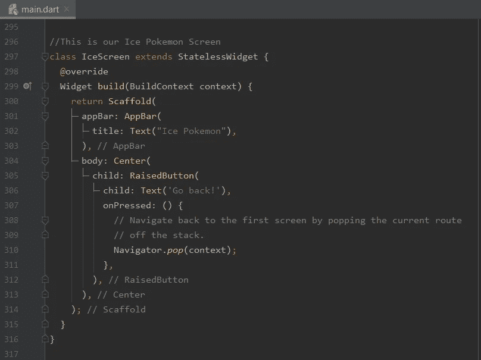

我们将复制从草到我们的冰口袋妖怪的代码行，但是我们将开始从身体向下复制

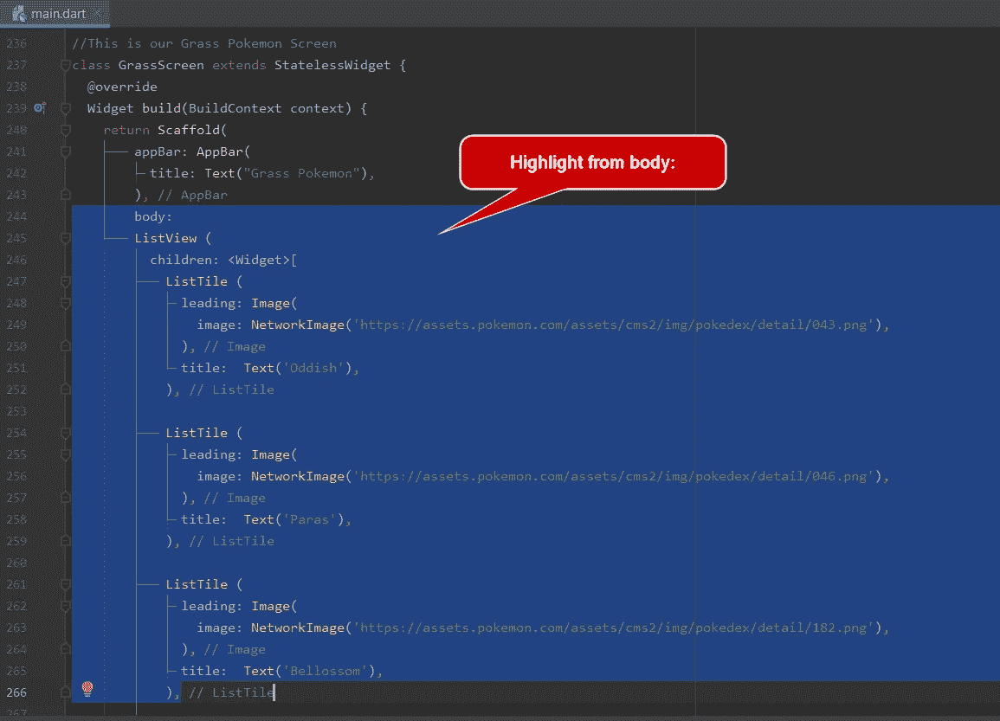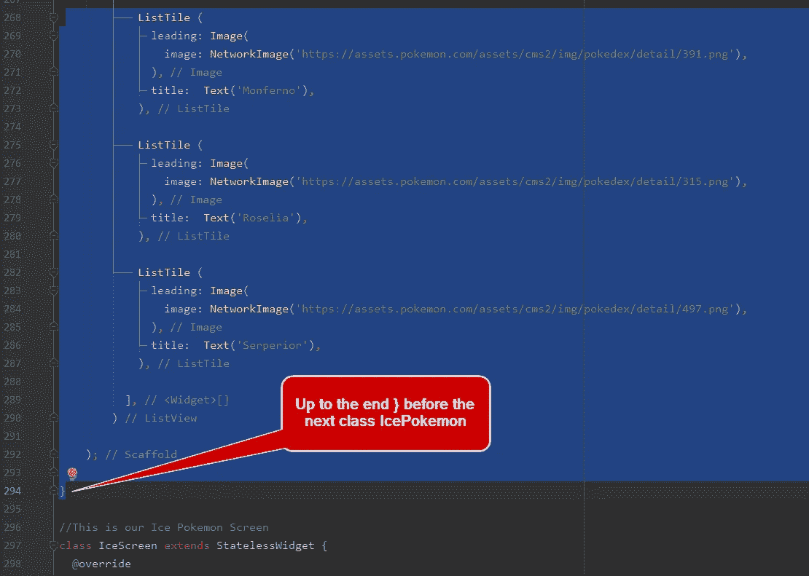

所以那将是

```
body:
        ListView (
          children: <Widget>[
            ListTile (
              leading: Image(
                image: NetworkImage('https://assets.pokemon.com/assets/cms2/img/pokedex/detail/043.png'),
              ),
              title:  Text('Oddish'),
            ),

            ListTile (
              leading: Image(
                image: NetworkImage('https://assets.pokemon.com/assets/cms2/img/pokedex/detail/046.png'),
              ),
              title:  Text('Paras'),
            ),

            ListTile (
              leading: Image(
                image: NetworkImage('https://assets.pokemon.com/assets/cms2/img/pokedex/detail/182.png'),
              ),
              title:  Text('Bellossom'),
            ),

            ListTile (
              leading: Image(
                image: NetworkImage('https://assets.pokemon.com/assets/cms2/img/pokedex/detail/391.png'),
              ),
              title:  Text('Monferno'),
            ),

            ListTile (
              leading: Image(
                image: NetworkImage('https://assets.pokemon.com/assets/cms2/img/pokedex/detail/315.png'),
              ),
              title:  Text('Roselia'),
            ),

            ListTile (
              leading: Image(
                image: NetworkImage('https://assets.pokemon.com/assets/cms2/img/pokedex/detail/497.png'),
              ),
              title:  Text('Serperior'),
            ),

          ],
        )

    );
  }
}
```

然后，我们会将它粘贴到我们的 IceScreen 上，替换身体到最后}

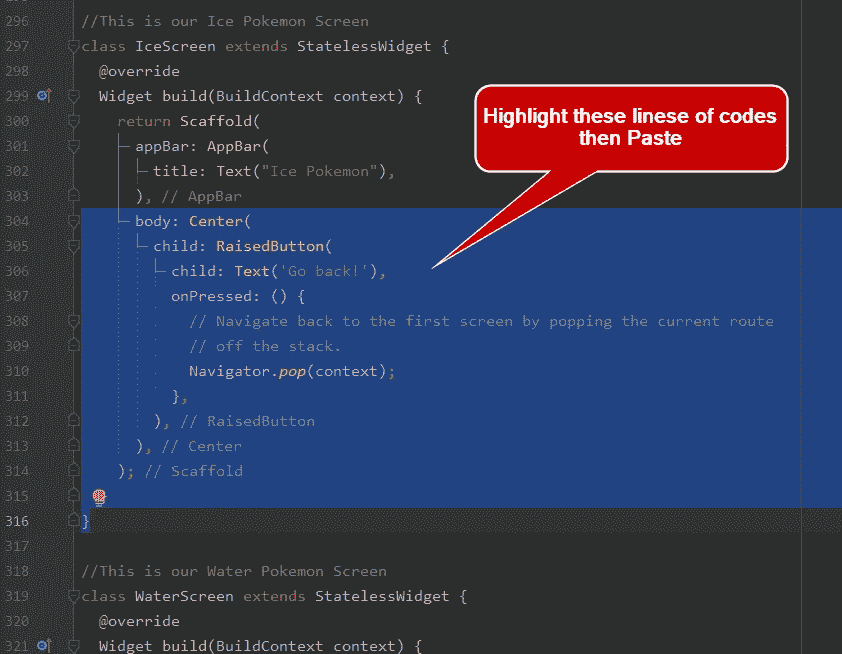

会变成

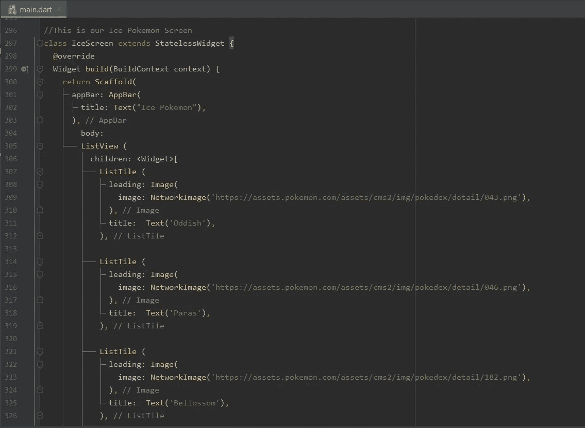

我们现在将替换我们的 Ice 口袋妖怪的每个网络图像和文本

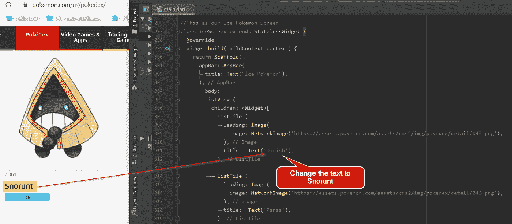

对于网络图像来说

右键单击图像，复制图像，然后替换现有的图像

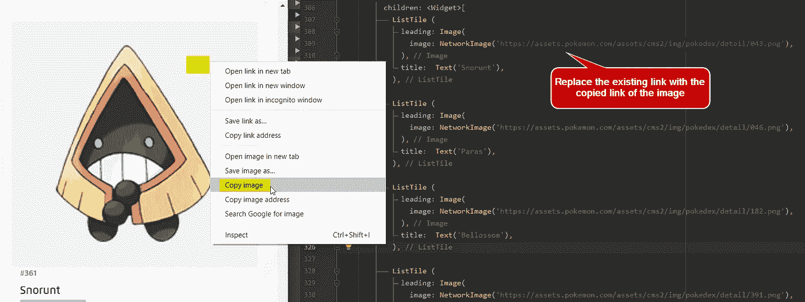

为下一个口袋妖怪做同样的事情，它们是葛莱、雷吉艾斯、格拉森、迷你冰和库布乔。

下面将是我们的冰屏口袋妖怪的全部代码

```
//This is our Ice Pokemon Screen
class IceScreen extends StatelessWidget {
  @override
  Widget build(BuildContext context) {
    return Scaffold(
        appBar: AppBar(
          title: Text("Ice Pokemon"),
        ),
        body:
        ListView (
          children: <Widget>[
            ListTile (
              leading: Image(
                image: NetworkImage('https://assets.pokemon.com/assets/cms2/img/pokedex/detail/361.png'),
              ),
              title:  Text('Snorunt'),
            ),

            ListTile (
              leading: Image(
                image: NetworkImage('https://assets.pokemon.com/assets/cms2/img/pokedex/detail/362.png'),
              ),
              title:  Text('Glalie'),
            ),

            ListTile (
              leading: Image(
                image: NetworkImage('https://assets.pokemon.com/assets/cms2/img/pokedex/detail/378.png'),
              ),
              title:  Text('Regice'),
            ),

            ListTile (
              leading: Image(
                image: NetworkImage('https://assets.pokemon.com/assets/cms2/img/pokedex/detail/391.png'),
              ),
              title:  Text('Glaceon'),
            ),

            ListTile (
              leading: Image(
                image: NetworkImage('https://assets.pokemon.com/assets/cms2/img/pokedex/detail/582.png'),
              ),
              title:  Text('Vanillite'),
            ),

            ListTile (
              leading: Image(
                image: NetworkImage('https://assets.pokemon.com/assets/cms2/img/pokedex/detail/613.png'),
              ),
              title:  Text('Cubchoo'),
            ),

          ],
        )

    );
  }
}
```

保存它并运行

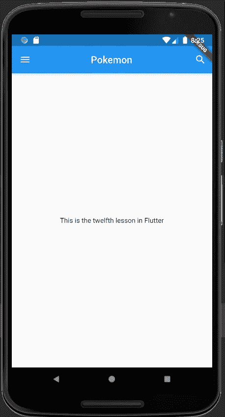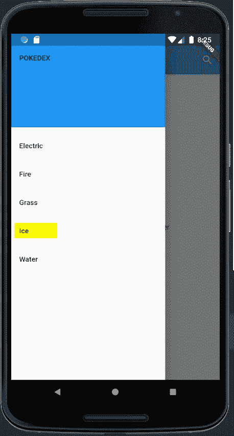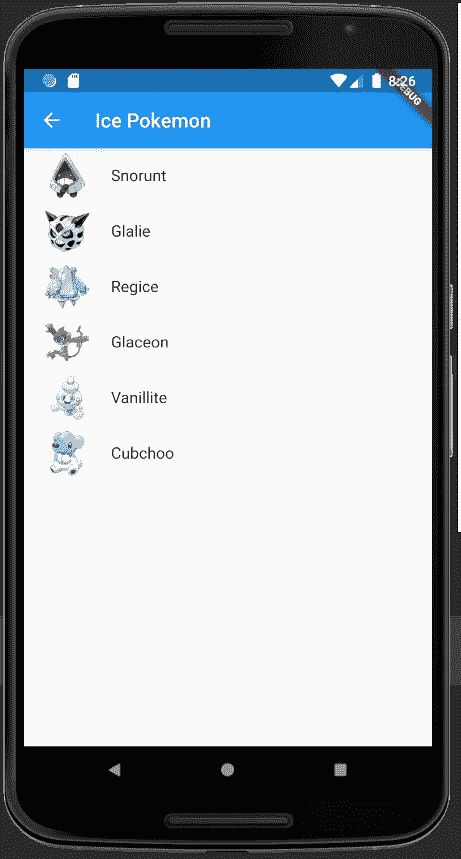

就是这样！我们已经完成了我们的冰口袋妖怪

希望你和我一样喜欢，谢谢下次再见:)