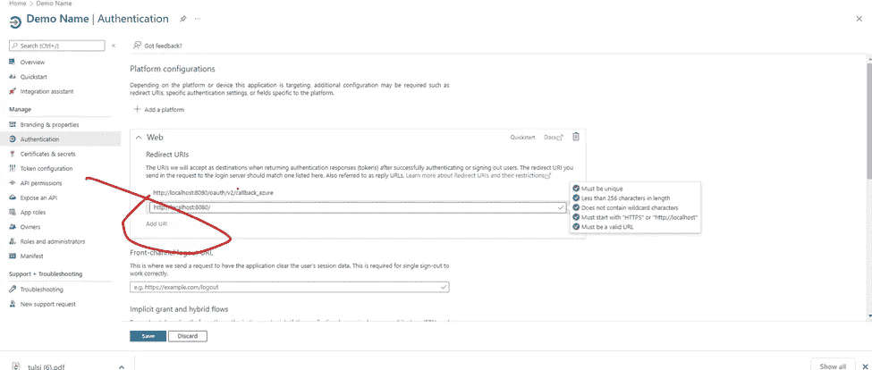

# 在 Mendix 中使用微软图形连接器的指南

> 原文：<https://medium.com/mendix/step-to-step-guide-for-using-microsoft-graph-connector-in-mendix-teams-chat-email-files-4fbf84ebd8e7?source=collection_archive---------0----------------------->

## Mendix 提供了在 Microsoft Graph Connector 的帮助下将 Microsoft Graph APIs(团队、聊天、电子邮件、文件)集成到 Mendix 中的能力。

Step-by-Step Guide for using Microsoft Graph Connector in Mendix (Teams, chat, email, files )

在这篇博客中，我将涵盖如何使用 Mendix Studio Pro 集成微软连接器的所有主题:

# 在这个博客中

1)如何**安装 MS Graph Connector** 和基本设置
2)如何**注册一个免费的 Azure 账户**用于试用

Image Reference — https://devblogs.microsoft.com/microsoft365dev/announcing-the-beta-release-of-the-microsoft-graph-apis-for-educational-resources/

# MS 图形连接器

**第一步:**

首先，我们将使用 Mendix 8.12 或更高版本创建一个演示应用程序。

**第二步:**

我们需要从 Mendix 市场安装一些需要的模块，主要是:
1。**加密**(请按照下图设置 32 位加密密钥)
2。**社区公地**
3。**纳流共用**

**第三步:**

我们需要**从市场下载并配置微软图形连接器** **模块**并更改安全级别。

[**https://marketplace.mendix.com/link/component/117007**](https://marketplace.mendix.com/link/component/117007)

**第四步:**

将名为'**Snip _ authentic ation _ Overview**的代码片段添加到您可以访问的页面中。这将是你的应用程序的管理员，以便管理员将使用 SNIP_Login 为典型用户做所有的配置。

**第五步:**

运行应用程序并检查一次。

## **接下来，Azure 注册**

现在我们的设置已经准备好了，我们需要做一些基本的配置。
1。我们应该可以访问 Azure 门户网站，现在我们将在 Azure 上注册我们的应用程序。
2。如果您的公司政策不允许您创建新应用程序，您可以通过以下步骤申请注册
3。出于试用目的，您可以注册微软 365 开发计划，这样您将获得一个完整的设置以及一个演示用户 ID。

> 请在此注册您的 [Microsoft Azure 帐户](https://developer.microsoft.com/en-us/microsoft-365/dev-program)

接下来，我将通过 app 的注册和如何正确配置来告诉你。

注册后，**请使用以下链接登录 Azure 门户网站**:

 [## Microsoft Azure 门户| Microsoft Azure

### 在 Microsoft Azure 门户中构建、管理和监控您的所有应用。为您、您的团队和…打造的单一统一中心

azure.microsoft.com](https://azure.microsoft.com/en-in/get-started/azure-portal/) 

你现在应该会看到 Azure 门户的仪表板，如下所示

登录后，搜索' **Azure Active Dictionary** '并点击打开。

请点击' **App 注册**，重定向后点击'**新注册**。

## 注册您的应用程序:

**1。名称:**提供任何合适的名称 **2。支持的账户类型:**您可以根据自己的需求选择 **3。重定向 URI:**http://localhost:8080/oauth/v2/callback _ azure

注册后，您将看到以下屏幕，其中包含完成应用程序配置所需的所有详细信息
:
**1。应用程序 ID
2。租户 ID
3。客户秘密
4。重定向 URI**

**应用程序 ID 和租户 ID 已经存在**，所以我们需要**创建客户端秘密**以及需要添加一些更多的重定向 URL。

## 获取客户的秘密

点击“**添加证书**，然后点击“**新客户端密码**创建新的客户端密码。

> NB！请复制客户的秘密值，并将其保存在安全的地方。它将被**加密，在此之后**，您将无法再次查看或复制它。

在我们的应用程序中，我们需要使用 ***值*，而不是 *ID*** 。

一旦你在 Azure 上注册了应用，你需要添加其他 URL，**一个用于本地测试**—[http://localhost:8080](http://localhost:8080)—**，一个用于验收和生产** —例如[https://Prod _ Or _ Accp _ URL/oauth/v2/callback _ Azure。](https://Prod_Or_Accp_URL/oauth/v2/callback_azure.)

为此，点击返回并转到**重定向 URI** 并添加**本地**、**验收**和**生产**的 URL。

# 配置您的 Mendix 应用程序

现在我们已经准备好了所有的细节，可以继续配置我们的 Mendix 应用程序。

**运行应用**，点击**添加认证**。

填写下面列出的详细信息:

1.  **显示名称** —可以提供任何名称
2.  **应用 ID**—Azure 门户中的应用 ID
3.  **租户 ID**—Azure 门户中的租户 ID
4.  **客户端机密**—Azure 门户中的客户端机密
5.  **选择的范围** —四个范围(默认提供一个权限，另一个权限你可以在最后一个弹出的‘元数据’上添加。
6.  **选择的响应类型** —代码
7.  **选择响应模式** —查询
8.  **提示** —同意

> 注意— **您需要提供使用服务的正确范围，一些常用的范围是:**
> 
> **邮件** —收发邮件
> **团队** —读写团队频道
> **聊天** —支持一对一聊天
> **日历** —可以访问日历和日程会议邀请
> **文件** —可以访问所有微软文件

对于范围周围的**参考，您可以查看以下链接:**

 [## Microsoft Graph 权限参考— Microsoft Graph

### 要让您的应用程序访问 Microsoft Graph 中的数据，用户或管理员必须通过授予它正确的权限…

learn.microsoft.com](https://learn.microsoft.com/en-us/graph/permissions-reference) 

现在点击'**以用户身份获得授权'**。

接下来，您将被重定向到同意页面，您需要接受它。

现在请点击'**查看资源**。

现在，您可以使用该连接器提供的所有服务。干得好，你已经坚持到最后了！

> 感谢您阅读本文，如果您有任何建议或反馈，请在下面评论。

## 阅读更多

微软图形连接器 Mendix [**市场模块**](https://marketplace.mendix.com/link/component/117007)

 [## Microsoft Graph 连接器概述- Microsoft Graph

### 微软 365 是一个完整的智能解决方案，为用户和组织提供创新的生产力…

learn.microsoft.com](https://learn.microsoft.com/en-us/graph/connecting-external-content-connectors-overview)  [## Microsoft Graph 连接器|连接外部数据源

### 将外部数据服务中的内容连接到 Microsoft Graph，以增强搜索等体验。试试图表…

developer.microsoft.com](https://developer.microsoft.com/en-us/graph/connectors) 

*来自发布者-*

如果你喜欢这篇文章，你可以在我们的 [*媒体页面*](https://medium.com/mendix) *找到更多喜欢的。对于精彩的视频和直播会话，可以去*[*MxLive*](https://www.mendix.com/live/)*或者我们的社区*[*Youtube PAG*](https://www.youtube.com/c/MendixCommunity/community)*e .*

*对于希望入门的创客，您可以注册一个* [*免费账户*](https://signup.mendix.com/link/signup/?source=direct) *，并通过我们的* [*学院*](https://academy.mendix.com/link/home) *获得即时学习。*

*有兴趣加入我们的社区吗？加入我们的* [*松弛社区频道*](https://join.slack.com/t/mendixcommunity/shared_invite/zt-hwhwkcxu-~59ywyjqHlUHXmrw5heqpQ) *。*